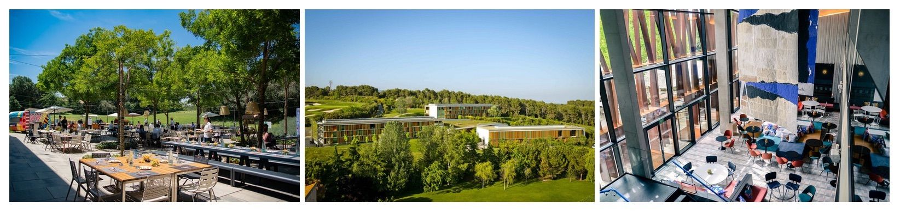

 

### The IPFS Project is thrilled to invite you to a new event we’ve been baking for the IPFS Community, the **🌌 IPFS Camp 🏕**. A three day hacker retreat for the builders of the Distributed Web that will happen between June 27th to 30th.

 

 

The Camp will bring together the Core Developers and Contributors to the IPFS project, Community Leaders, Builders on of the Distributed Web and you! The event will build on top of the successful IPFS Developer Meetings in Berlin last year and add a full immersive experience for its attendees and contributors.

Join us on 27-30th June at the beautiful Campus La Mola in Barcelona for an action-packed program of workshops, talks and deep dives on everything IPFS.

Registration is a 2-step process. The 1st step is an application were you can tell us why you are excited to attend the camp and what you would like to share with the other attendees. The next step is a review and selection of the best applications by the IPFS team. If you’re application is selected we’ll send you a link to register by April 30th. IPFS Camp is limited to 150 hackers.

Learn more about the camp and apply to attend **https://camp.ipfs.io/register**.

Put your space boots on and get ready for a very unique InterPlanetary Adventure! Follow [camp.ipfs.io](https://camp.ipfs.io) and [@ipfsbot](https://twitter.com/ipfsbot) for future updates.
