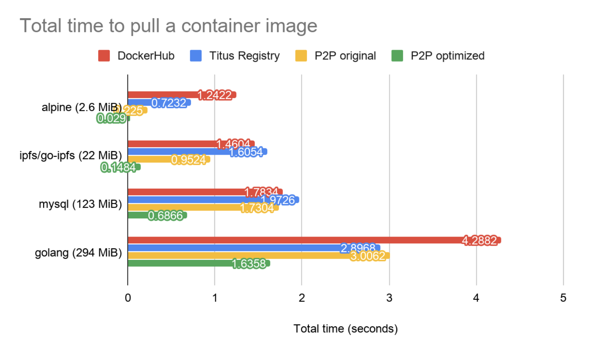
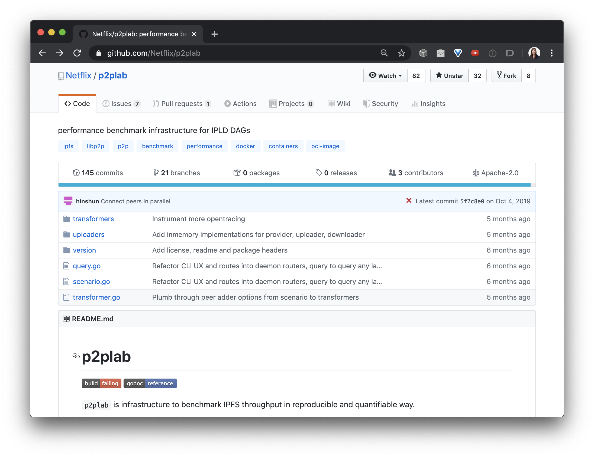

Web 2.0 services increasingly depend on large scale computing infrastructure to support fast iteration and deployment cycles. In order to build, test, and release software faster, these services are often seeking ways to upgrade their systems to take advantage of new learnings and tools from distributed peer-to-peer networks.

After [IPFS Camp 2019](https://camp.ipfs.io/), Netflix and IPFS began collaborating on ways to incorporate peer-to-peer services into Netflix's developer tooling. Together, we figured out a way to leverage IPFS to speed up cloud builds, designing and testing solutions for faster Continuous Integration (CI) pipelines powered by efficient p2p container image distribution.

As part of this collaboration, we made big improvements over the last two quarters to [Bitswap](https://github.com/ipfs/go-bitswap), the mechanism IPFS uses to transfer pieces of a file between two or more peers. A key factor enabling this improvement was [p2plab](https://github.com/Netflix/p2plab) - a performance benchmarking tool created by Netflix to run reproducible tests - allowing us to target and measure improvements. Our specific focus was a container distribution challenge Netflix wanted to address: how to efficiently pull container images in a large scale, multi-region environment. Image layers often reside in different regions. Leveraging IPFS as a peer-to-peer CDN lets nodes inside Netflix’s infrastructure collaborate and seed common pieces to neighboring nodes, helping make container distribution faster.

To speed this up even more, we added some useful new capabilities to the Bitswap protocol which cut transfer time **in half** for benchmarked use cases around container distribution. In the previous version of Bitswap, it took on average 9.08 seconds to pull a 300 MiB image to 32 leeching peers. The optimized branch brought this down to 3.16 seconds -- 20% faster than DockerHub (3.93 seconds)! When the number of leeching peers exceed the seeders, we observed that pieces downloaded by leechers are reseeded, reducing the contention on the seeding peers.

## How Bitswap works

IPFS breaks up files into chunks called Blocks, identified by a Content IDentifier ([CID](https://github.com/multiformats/cid)). When nodes running the [Bitswap](https://github.com/ipfs/go-bitswap) protocol want to fetch a file, they send out "want lists" to other peers. A "want list" is a list of CIDs for blocks a peer wants to receive. Each node remembers which blocks its peers want, and each time the node receives a block it checks if any of its peers want the block and sends it to them.

To find out which peers have the blocks that make up a file, a Bitswap node first sends a want for the root block CID to all the peers it is connected to. If the peers don’t have the block, the node queries the Distributed Hash Table ([DHT](https://docs.ipfs.io/guides/concepts/dht/)) to ask who has the root block. Any peers that respond with the root block are added to a session. From now on Bitswap only sends wants to peers in the session, so as not to flood the network with requests.

The node sends out a want for each CID to several peers in the session in parallel, because not all peers will have all blocks. If the node starts receiving a lot of duplicate blocks, it sends a want for each CID to fewer peers. If the node gets timeouts waiting for blocks, it sends a want for each CID to more peers. In this way the node tries to maintain a high download speed without too many duplicate blocks.

## Bitswap improvements for p2p image distribution

In order to improve Bitswap performance and efficiency, the IPFS team made some changes to the way Bitswap fetches blocks.

Initially a node wants to know which of its peers have the root block, but doesn’t actually want to receive the block itself (because it sends this “discovery” want to many peers). So one new change is that when Bitswap sends a want it can ask for a HAVE message in response (instead of getting back the whole block).

Once a node has added peers to the session, it can also use these HAVE messages to figure out which of the session peers have the rest of the blocks it needs relatively cheaply, because it doesn’t have to worry about duplicate blocks. At this stage the node also wants the peer to say if it doesn’t have the block. So we added a DONT_HAVE response.

With these changes a node can cheaply work out how blocks are distributed amongst its peers, and can direct the requests for blocks more accurately, increasing overall download speed and reducing the number of duplicate blocks.

The node can also quickly recognize when all the peers in a session don’t have a block it needs, and go out to the DHT to find out who has the block.

For more details on how Bitswap worked before ("master"), and the changes we’ve made ("poc"), check out [these slides](https://docs.google.com/presentation/d/1mbFFGIIKNvboHyLn-k26egOSWkt9nXjlNbxpmCEQfqQ), this [presentation at the IPFS Weekly Call](https://www.youtube.com/watch?v=G_Q7iTpwYQU), and [this recent performance comparison](https://github.com/ipfs/go-ipfs/issues/6782#issuecomment-579973116).

## Container distribution at Netflix

Netflix developers regularly deploy millions of containers on Titus, the [Netflix container management platform](https://medium.com/netflix-techblog/titus-the-netflix-container-management-platform-is-now-open-source-f868c9fb5436). As many of these containers handle critical workloads that power Netflix, they often need to be deployed in many regions around the world, scaling accordingly to the traffic in that geographical location. When developers push a release image to production, the image needs to be replicated to Docker Registries in other regions or deployments will suffer from cross-region data costs and slow transfer speeds.

The docker registry is designed to decouple the notion of what an image reference like “alpine” presents, and what data is contained inside the image through content-addressability. This is parallel with IPFS’s data model, where data is always represented by its [CID](https://github.com/multiformats/cid). In fact, this is exactly how IPFS can be leveraged as a CDN for container image layers because the container runtime can be modified to retrieve layers identified by their CIDs. To learn more about the Netflix use case for IPFS, check out [this interview of Edgar from IPFS Camp](https://www.youtube.com/watch?v=wNfk05D887M)!

## p2plab

Netflix infrastructure is deployed on Amazon Web Services (AWS) across multiple availability zones and regions around the world. In order to emulate that kind of environment, [p2plab](https://github.com/Netflix/p2plab) was created to measure the throughput of data transfer on the IPFS network in multi-region clusters. Using p2plab, we can reliably determine whether a change in IPFS will improve performance. An operator is able to provision live clusters with cluster definitions and benchmark a data transfer scenario with scenario definitions. Nodes in a p2plab cluster can also hot swap the IPFS binary under test, allowing Protocol Labs and Netflix engineers to quickly test a branch of an IPFS component like bitswap.

Once a benchmark has completed, we can extract metrics from libp2p and bitswap to understand application-level bottlenecks, flamegraphs to understand where CPU time is spent, and distributed tracing spans in a [jaeger dashboard](https://www.jaegertracing.io/) to follow the request flow across the cluster.

An in-memory driver for p2plab is also available. Head over to [the repository](https://github.com/Netflix/p2plab) and try it out today on your local system!

## Next steps

Itching to get your hands on the new speedups? The new and improved Bitswap is **[merged](https://github.com/ipfs/go-bitswap/pull/189)** and slated for the [next go-ipfs release](https://github.com/ipfs/go-ipfs/issues/6776) - bringing the performance benefits described above to all IPFS users. 😍🎉🚀
