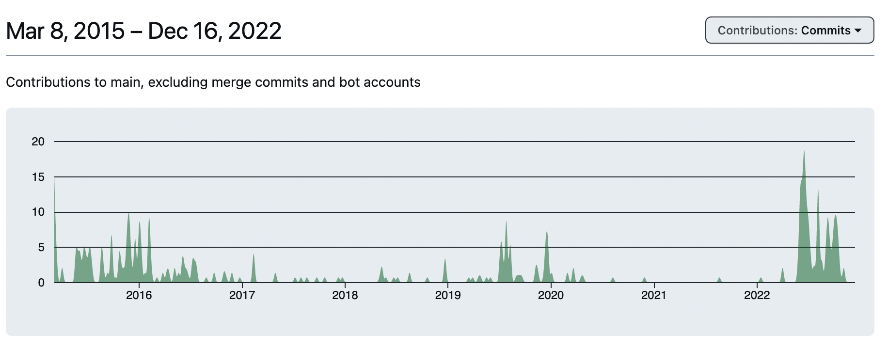

## The IPFS community is growing

Over the last several years, the number of contributors, companies, and working groups advancing IPFS through specs, developer tooling, and implementations has grown significantly.

This reflects an important shift for the IPFS project — **IPFS is now driven by a thriving community** from all corners of the world.

This shift is evident on several fronts: the sheer number of working groups regularly meeting, the scope and breadth of new projects (expanding IPFS into compute with [Bacalhau](https://www.bacalhau.org/), and activity in the [IPFS specifications repo](https://github.com/ipfs/specs/) which has spiked in the last year.

<!--  -->

## The New IPFS Community Calendar

Today, we're excited to share the new [IPFS Community Calendar](https://ipfs.fyi/calendar) as a hub for all IPFS community events — both offline and online.

We created this for you and are keen to have you join us.

🗓 Subscribe to the calendar to be informed about any new events added to the calendar
🗳 Register for specific events (and event series for recurring events) in the calendar
🎫 If you're organising a meetup or event related to IPFS, submit it for inclusion using the "Submit Event" button on [the calendar](https://ipfs.fyi/calendar). Once submitted we'll review it and publish it (assuming it's relevant.)

## Events for everyone

The versatility of IPFS attracts a variety of community members such as application developers, low-level protocol developers, service providers, and artists and creatives.

The community calendar should serve as the event hub for all these different groups. We already have events covering a wide spectrum of levels and areas of interest to cater to both newcomers and long standing members of the community:

- [InterPlantary Office Hours](https://lu.ma/IP-Office-Hours) - a weekly session open to all levels, where you can bring your IPFS questions.
- [ProbeLab IPFS Network Measurements Office Hours](https://lu.ma/ipfs-network-measurements) - for anyone interested in IPFS network measurements in the IPFS
- [IPFS Implementers Sync](https://lu.ma/ipfs-implementers) - a meeting for those creating and maintaining IPFS implementations to discuss the protocol, specs, and [IPIPs](https://github.com/ipfs/specs/blob/main/IPIP_PROCESS.md).
- [Move the Bytes Working Group](https://lu.ma/8kk9i628) - work group focused on shipping a data transfer protocol that can replace Bitswap.
- [IPFS Content Routing Working Group](https://lu.ma/ipfs-routing-wg) - a work group focused on content routing in IPFS the subsystem responsible for how content is discovered on the IPFS network.
- [IPVM Community Call](https://lu.ma/ipvm) - focused on the effort to add content-addressed computation with a virtual machine to IPFS.
- [IPFS Thing 2023](https://lu.ma/ipfsthing-preregistration) - an in-person event bringing together maintainers or core contributors of an IPFS implementation, ranging from production usage to working demo.
- [Compute over Data (COD) Working Group](TODO) -

We couldn't be more excited to welcome you to join IPFS events that interest you!

If you're interested in hosting an event, feel free to submit it for inclusion or [reach out to us](mailto:devrel@ipfs.tech) if you have any questions.
