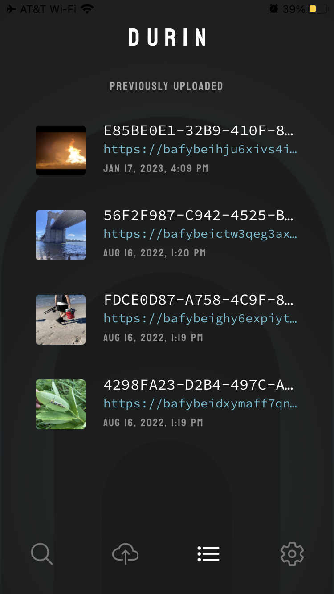

---
tags:
- Durin
title: "Announcing Durin"
description: "Durin is a native mobile application for iOS and Android that lets you read and share content on the IPFS network"
date: 2023-01-26
permalink: "/announcing-durin/"
translationKey: ''
header_image: /announcing-durin-ipfs/header.png
author: David Justice
---

Today we are excited to announce a new way to read and share with IPFS on your mobile device - Durin, a native mobile application for iOS and Android.

## Background

To date, it's been difficult to access, upload and share IPFS content using a mobile device. This is for a number of reasons, one of which is that [Kubo](https://github.com/ipfs/kubo), the initial implementation of the protocol was simply not built with mobile in mind. We wanted to provide a quick and easy way for users to access basic IPFS features on mobile and set up a testing ground for future explorations.

## Accessing IPFS Content

The transport-agnostic nature of IPFS content addresses means there are many ways to find and retrieve content on the IPFS public network. On a mobile device, the best balance of decentralization and device performance is to align with the network model of the device OS - transient connectivity.

We do this in Durin by connecting to multiple HTTP gateways to the IPFS network. On app launch, Durin pings a list of public gateways, and determines which route is the most reliable and fastest way to access the network. This approach is functional but not optimal. We're working on specifications for multi-gateway connectivity patterns which balance a number of factors - such as verifiability guarantees, reader privacy, and not overloading gateways.

IPFS addresses are not natively supported in most web browsers or any mobile operating systems today. Durin registers as an `ipfs` scheme handler so that addresses are handled when encountered in applications and on the web.

For example, when browsing on iOS Safari ([sorry Chrome users](https://bugs.chromium.org/p/chromium/issues/detail?id=178097&q=protocol%20handler%20mobile&can=2)) `ipfs://` protocol links will be redirected to Durin, where the app will translate and redirect the user to the fastest public gateway, making the content available on mobile.

## Sharing to IPFS from Mobile

Mobile devices are transiently connected and low-powered, so they do not make good servers. For sharing files and data to IPFS, Durin uses a [pinning service](https://docs.ipfs.tech/concepts/persistence/#persistence-permanence-and-pinning) to do this on behalf of the user.

We currently rely on [web3.storage](https://web3.storage/) for file uploads. `web3.storage` is a service that makes decentralized file storage accessible by hosting data on IPFS for the user, the way a web host does for HTTP today. 

Durin also saves a local history of uploads already shared.

:warning: (screenshot) TODO :warning:

Using a single remote service is a usable first step, but doesn't provide long term user control of the data published. We're looking at tighter integration with local OS data storage, local sharing between devices when possible, and pluggable remote service support.

## Install Durin

Durin is available now for mobile phones in the iOS app store and Google Play store.

  
<a href="https://apps.apple.com/us/app/durin/id161339199" class="cta-button"> 
  Get Durin in App Store 
</a> 
<a href="https://play.google.com/store/apps/details?id=ai.protocol.durin" class="cta-button"> 
  Get Durin in Google Play Store
</a>

## The Future

Durin is an experiment in learning how to expose and integrate IPFS features into mobile operating systems in ways which align optimally with those environments. We'd love to hear your ideas and feedback, and have you participate!

* [ipfs-shipyard/durin on Github](https://github.com/ipfs-shipyard/durin)
* [HackMd project document](https://hackmd.io/XtxGZoxqQ46X1GO7srrhMQ)
* [Feedback link](https://github.com/ipfs-shipyard/durin/issues)

Join the #browsers-and-platforms channel which is bridged across the [Filecoin Slack](https://filecoin.io/slack/), [IPFS Discord](https://discord.gg/vZTcrFePpt) and [Element/Matrix](https://matrix.to/#/#browsers-and-standards:ipfs.io).