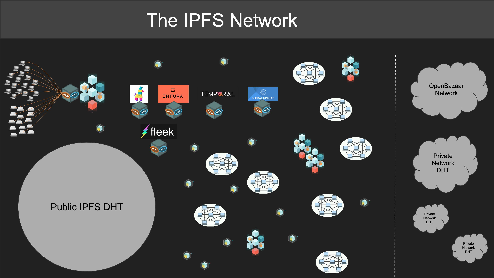

# IPFS Implementations: It’s Definitely A Thing

If all you had ever seen were roses, daffodils, and violets, you would probably have a
simplistic intuition of what a flower is. But as you discovered more examples of the
bountiful world of flowering plants, including some more unusual varieties like the
[Hydnora Africana](https://en.wikipedia.org/wiki/Hydnora_africana)
sci-fi monsters, the absolutely massive
[Corpse Flower](https://en.wikipedia.org/wiki/Amorphophallus_titanum), or perhaps more cutely the
[Swaddled Babies](https://gardenofeaden.blogspot.com/2020/03/the-swaddled-babies-orchid-anguloa.html)
or the laughing
[Bee Orchids](https://www.thehallofeinar.com/2017/06/bee-orchids-with-no-bees-to-love-them/)
then your idea of flower would have to grow, until at some point you might start
wondering if you really know what counts as a flower.

In July 2022, a core group of architects, implementers, and committed builders
in the IPFS community met in Reykjavik, Iceland for
[IPFS þing](https://blog.ipfs.tech/ipfs-ping-2022-recap/), the first-ever gathering focused on
growing and diversifying implementations of the IPFS protocol.

The event kicked off with
[a call for more and different implementations](https://www.youtube.com/watch?v=xCGjxdMuKF0&list=PLuhRWgmPaHtQhyXIhu2P6e-8WlYOf8wyH&index=6) so as to make IPFS as usable and
accessible as possible in today's multifaceted software environment, able to operate
in a wide variety of verticals such as gaming, of languages such as Python, or of
architectural constraints such as lite nodes and satellite connectivity.
And in the nine months since, that's exactly what has happened: it's springtime in the distributed hemisphere and
[we are frolicking across fields of tantalizing IPFS flowers](https://docs.ipfs.tech/concepts/ipfs-implementations/).
With so much efflorescence, it's worth taking a step back from this
[thriving broader ecosystem](https://ecosystem.ipfs.tech/) and looking at the principles
that make IPFS what it is.

## What is IPFS?

Quiz time! Which one of these is IPFS?

- ❓ Users linking to NFT assets over IPFS gateway URLs
- ❓ Sharing an image from your phone to Web3.storage
- ❓ Web publishing flow of static website from Github to Fleek
- ❓ Two people chatting over over a Bluetooth connection using IPFS CID addressed data
- ❓ Satellite beacon emitting IPFS CIDs of imagery it'll serve to an IPFS-connected ground station in that six minute window of (relatively) high bandwidth it gets a couple of times per day
- ❓ XR headset loading scenes of static content by IPFS CID, content shipped on the hardware by the OEM
- ❓ People reading Wikipedia from offline or censorship-resistant sources either due to poor connectivity or to [Internet restrictions](https://twitter.com/dietrich/status/1364978192075866115)

Answer: *All of the above!*

These ways of using IPFS are very different from one another — and that's a feature —
but they all share two key characteristics:

1. Data is addressed by unique fingerprints generated from its contents
2. Which allows data use to be transport-agnostic.

This might not feel like a very thorough definition, but it already tells us a lot
about what is or isn't an IPFS implementation. Let's look at the lay of the land
today, and explore what being an implementation actually means.

## IPFS Implementations Today

IPFS implementations vary widely, from OS-level daemons living long and fulfilling
lives in data centers, to JavaScript executing in the transient twinkle of a browser tab's
eye. They have to exist in the multitude of environments where users access IPFS today,
and where developers need to deploy the programs that provide that access. Many of these
environments are unforgiving and may explicitly constrain available capabilities to align
with the host's requirements or business model, such as mobile operating systems or IoT devices.

When developers have maximal control of an environment, they can implement IPFS to match
the ideal of the vision articulated in the [original white paper](https://ipfs.io/ipfs/QmR7GSQM93Cx5eAg6a6yRzNde1FQv7uL6X1o4k7zrJa3LX/ipfs.draft3.pdf).
When the deployment environment is very far from being able to achieve that ideal, or when
the use case at hand is too different, implementing IPFS often means reliably getting
content-addressed data in or out of that system by whatever means necessary.

The diversity this demands can be seen in our implementation ecosystem. For instance,
we have implementations in [Go](https://github.com/ipfs/kubo), in
[Java](https://github.com/Peergos/nabu), and in
[JavaScript](https://github.com/ipfs/helia), as well as
[one in Rust](https://github.com/n0-computer/iroh) that optimizes for extreme efficiency.
We have some targeting [clusters](https://github.com/ipfs/ipfs-cluster) or
[Filecoin](https://github.com/filecoin-project/lotus), meant to work in
[mobile](https://github.com/ipfs-shipyard/gomobile-ipfs) or in other
[embedded environments](https://github.com/ipfs-rust/ipfs-embed) as well as
[for the cloud](https://github.com/ipfs-elastic-provider/ipfs-elastic-provider).
And [the list keeps growing](https://docs.ipfs.tech/concepts/ipfs-implementations/).

## A Broader View

Today's IPFS ecosystem is larger than most people realize, and most of us only work with
a subset of it. This makes it easy to develop a restrictive intuition of what IPFS is.

For instance, it can be tempting to reach the conclusion that supporting IPFS means being
interoperable with [Kubo](https://github.com/ipfs/kubo) or supporting everything that Kubo does. Kubo is, of course, an
outstanding implementation but there are excellent reasons to make different decisions
if you're targeting different contexts or optimizing for different goals. This is
notably true when considering Filecoin: making the data stored by Filecoin storage
providers accessible to other IPFS nodes ~~shouldn't~~ can't just mean connecting Lotus to Kubo.

Many successful protocols support implementations that only do one thing well, without
exercising the entire protocol's capabilities and perhaps even without being fully
compliant. For instance, you could write an HTTP server that listens on port 80, throws
away any method, path, or header information you send it, and always responds with a code
[`418`](https://developer.mozilla.org/en-US/docs/Web/HTTP/Status/418),
`Content-Type` set to `image/jpeg`, and
[a classic work of art](https://ipfs.io/ipfs/bafybeigdyrzt5sfp7udm7hu76uh7y26nf3efuylqabf3oclgtqy55fbzdi) in the body. It might not be a fully compliant implementation of HTTP, it's arguably not a
very useful implementation of HTTP, but it's still an implementation of HTTP. And there are
millions of HTTP servers that don't support everything in the HTTP suite of standards but that
nevertheless provide services that are far more valuable than our little thought experiment.
The important part is that they can be used to resolve `http` URLs with authority.

This is a very useful pattern that IPFS supports as well. To give a
quick and very dirty example (since that's the point), this
[crude 24 line script](https://gist.github.com/darobin/9c9984586dcb133f384d3fd05f3a0bb9)
can expose a Git repository as an IPFS gateway simply by making all of its objects
accessible via CIDs that prefix the SHA1 hashes with `f017c1114`. Such a script could
be used, for instance, to integrate a git repository into an IPFS-based archival system.
This is a far cry from being an elegant implementation, and bridging Git to IPFS warrants
a cleaner approach, but the point remains that glueing systems into IPFS with a minimalistic
approach is no less legitimate a deployment of IPFS than a Swiss Army Knife IPFS
library.

We should also keep in mind that many systems across the IPFS network do peer
discovery and content routing outside the public DHT. This includes gateways of
course, but also mDNS discovery, Gossipsub peer exchange, pinning service clusters,
or wholly separate DHTs. An inclusive — but principled — view of what IPFS includes
makes the ecosystem richer and more valuable for all of us.

## IPFS Principles

There are many ways to implement and to use IPFS, and the perspective above barely scratches
the surface. But we have to be careful not to be over-inclusive: if almost anything
counts as being part of IPFS, what we have isn't an ecosystem but just a bag of
unrelated stuff. We need concrete principles that define the ways in which a piece of
software meaningfully participates in IPFS.

These principles provide detail to the key characteristics which we listed at the
beginning:

1. Data is addressed by its contents
2. Which allows data use to be transport-agnostic.

### Content Addressing

Addressing is such an elementary part of any communication protocol that it is easy to
overlook how its properties define the properties of a protocol. IP addresses are assigned
based on a hierarchical authority delegated by IANA and RIRs to network administrators for
local assignment. HTTP builds atop `http` URLs, which are predicated on the domain name
system delegating authority to a server, and then that server's operator having full ownership
of the names in that space and of the resources they map to. This idea of hierarchy and
ownership is deeply ingrained in the web's fundamental architecture documents and it has
consequences for how the web works: not only is everyone dependent on DNS, but when
visiting a URL you are interacting with a name and a resource that are explicitly defined
as someone else's property. In turn, this gives that entity power in the relationship it
has with its users.

IPFS's first defining characteristic is content addressing, and this is reflected in the
foundational role that it gives to [CIDs](https://github.com/multiformats/cid). IPFS is,
at heart, the space of resources that can be interacted with using a CID.

This already has multiple consequences. To begin with, CIDs are defined using
[multiformats](https://multiformats.io/), which makes them future-proof, self-describing,
and extensible. If, for instance, a powerful new hash algorithm surfaces then we aren't
either stuck in the past or forced to find a way to upgrade everything. We can progressively
roll it out on the IPFS network. Endpoints that need to produce or consume it will need to
be upgraded, but the rest of the network won't care.

This approach also means that IPFS can interoperate with existing content-addressed
systems, usually with little more work that what is required to convey whatever hash
they use to a CID.

CIDs form a powerful and load-bearing foundation, while nevertheless being quite simple:
Juan's original [CIDv1](https://github.com/multiformats/cid#how-does-it-work) spec is
detailed enough for implementation but barely runs to half a page of Markdown, including
an enthusiastic parting comment about its simplicity: "*That's it!*"

By founding IPFS on CIDs we are paving the way to a
[self-certifying web](https://jaygraber.medium.com/web3-is-self-certifying-9dad77fd8d81)
that shifts power to people. No need to delegate authority or to give ownership over a
location: the CID is a direct relationship between endpoints, between a person and the
content that the CID points to. (And [IPLD](https://ipld.io/), which is also distinguished
for its systematic reliance on CIDs as links, brings similar benefits to data.)

And content-addressing is key to enabling the other foundational characteristic, which we
turn to next.

### Robustly Transport-Agnostic

Addressing content is nice, but it's often more useful if you can also use it to retrieve,
move, compute over, or otherwise manipulate some data. Because IPFS is built on CIDs
(self-certifying, remember?), we're free to use any transport layer without introducing
concerns about the integrity of the content.

This transport-agnosticity makes the entire network more adaptable to local or specific
needs, and it enables experimentation with a wide range of properties about how bytes are
located and moved around. It future-proofs the system and makes it nimble when it has to
be supported in new places, under new constraints. Developers don't even need to worry
about building local- or offline-first: IPFS is both, *always*.

In taking this aproach, IPFS is revisiting and refreshing two older principles of protocol
design. The first is the robustness principle, which has been expressed in different ways
over the years but can be summarized as "*Be strict when sending and tolerant when receiving.*"
While that formulation of the robustness principle has generally been accepted as
unchallenged wisdom, it has recently
[come under criticism in the protocol design community](https://datatracker.ietf.org/doc/html/draft-iab-protocol-maintenance). When a protocol is deployed at a large scale over many years and its
implementations err on the side of being tolerant, what actually tends to happen is that
interoperability defects accumulate over time until new implementations become too
difficult to produce and the protocol starts to decay.

While we want to avoid protocol decay, some degree of tolerance is nevertheless desirable
as it contributes to making the system adaptable to new situations. To address this,
instead of being strict in one direction and tolerant in the other, IPFS is strict at the
endpoints — where CIDs are produced or verified — and tolerant in between, open to any way
that will get the bytes across.

This new take on robustness, which we might formulate as "*Be strict about the outcomes,
be tolerant about the methods*," is an implementation of the
[end-to-end principle](https://en.wikipedia.org/wiki/End-to-end_principle). The end-to-end
principle states that the reliability properties of a protocol have to be
supported at its endpoints and not in intermediary nodes. And that's exactly what CIDs
enable.

## Clearer Foundations

Put together, content-addressing using CIDs and robust transport-agnosticity are what
make IPFS what it is. An IPFS implementation that doesn't build atop the
excellent [libp2p](https://libp2p.io/), that doesn't do everything that Kubo does, or
that only retrieves content via HTTP gateways is still an IPFS implementation.

In order to help clarify both this foundation and everything that sits on top of it we've
progressively been [developing better specs](https://github.com/ipfs/specs/), including
a [fresh evolution of the IPIP process](https://github.com/ipfs/specs/commits/main/IPIP_PROCESS.md)
and a [brand new specs site](https://specs.ipfs.tech/) (and
[a IPFS Thing 2023 track to go with](https://2023.ipfs-thing.io/#Standards-Governance-and-DWeb-Policy)!)

Part of that specification work is this proposal for
[a standardized description of the principles that define IPFS](https://github.com/ipfs/specs/pull/390).
If you are curious to read a more detailed description of the principles described in
this post, I encourage you to read it.

## See You Soon!

These are exciting times: solidifying our foundations empowers us to build higher and
better. The [next IPFS Thing](https://2023.ipfs-thing.io/) is just a few weeks away,
April 15th-19th, in Brussels. As a community, we'll be using that opportunity to share, discuss, and blaze forward with many new IPFS capabilities and implementations. We have no doubt that, from these CIDs, many flowers will grow.

## Appendix: Implementations

The [table of implementations at docs.ipfs.tech](https://docs.ipfs.tech/concepts/ipfs-implementations/)
is the one being actively maintained and you should refer to that one if you are looking
for a definitive source as the ecosystem changes fast. However, for illustrative purposes,
here is the list of implementations (not counting all manners of tooling and other systems)
as this blog post goes to press.

| Name | Language | What it's trying to do |
| -------- | -------- | -------- |
| [Elastic provider](https://github.com/ipfs-elastic-provider/ipfs-elastic-provider) | javascript, typescript | Scalable cloud-native implementation. |
| [Estuary](https://github.com/application-research/estuary/) | go | Daemon oriented service to pin and onboard IPFS data into Filecoin. |
| [Kubo](https://github.com/ipfs/kubo) | go | Generalist daemon oriented IPFS implementation with an [extensive HTTP RPC API](https://docs.ipfs.tech/reference/kubo/rpc/) and [HTTP Gateway API](https://docs.ipfs.tech/reference/http/gateway/). |
| [ipfs cluster](https://github.com/ipfs/ipfs-cluster) | go | Orchestration for multiple Kubo nodes via CRDT / Raft consensus |
| [iroh](https://github.com/n0-computer/iroh) | rust | Extreme-efficiency oriented IPFS implementation. |
| [Lotus](https://github.com/filecoin-project/lotus) | go | Filecoin node handling consensus, storage providing, making storage deals, importing data, ... |
| [Nabu](https://github.com/Peergos/nabu) | java | A minimal Java implementation of IPFS |
| [auspinner](https://github.com/2color/auspinner) | go | CLI tool to deal with the pinning service API and upload files through bitswap. |
| [barge](https://github.com/application-research/barge) | go | CLI tool with a git like workflow to upload deltas to estuary. |
| [Boost](https://github.com/filecoin-project/boost) | go | Daemon to get IPFS data in and out of a Filecoin storage provider. |
| [gomobile-ipfs](https://github.com/ipfs-shipyard/gomobile-ipfs) | go | Library oriented ipfs daemon to help embeding Kubo into a mobile app. |
| [helia](https://github.com/ipfs/helia) | javascript | A lean, modular, and modern implementation of IPFS for the prolific JS and browser environments, currently pre-alpha but [intended to replace js-ipfs](https://github.com/ipfs/js-ipfs/issues/4336). |
| [ipfs-embed](https://github.com/ipfs-rust/ipfs-embed) | rust | Small embeddable ipfs implementation. |
| [ipfs-lite](https://github.com/hsanjuan/ipfs-lite) | go | Minimal library oriented ipfs daemon building on the same blocks as Kubo but with a minimal glue layer. |
| [ipfs-nucleus](https://github.com/peergos/ipfs-nucleus/) | go | Minimal IPFS replacement for P2P IPLD apps. |
| [js-ipfs](https://github.com/ipfs/js-ipfs) | javascript, typescript | Javascript implementation targeting nodejs and browsers.  [Development of js-ipfs is being discontinued](https://github.com/ipfs/js-ipfs/issues/4336). |
