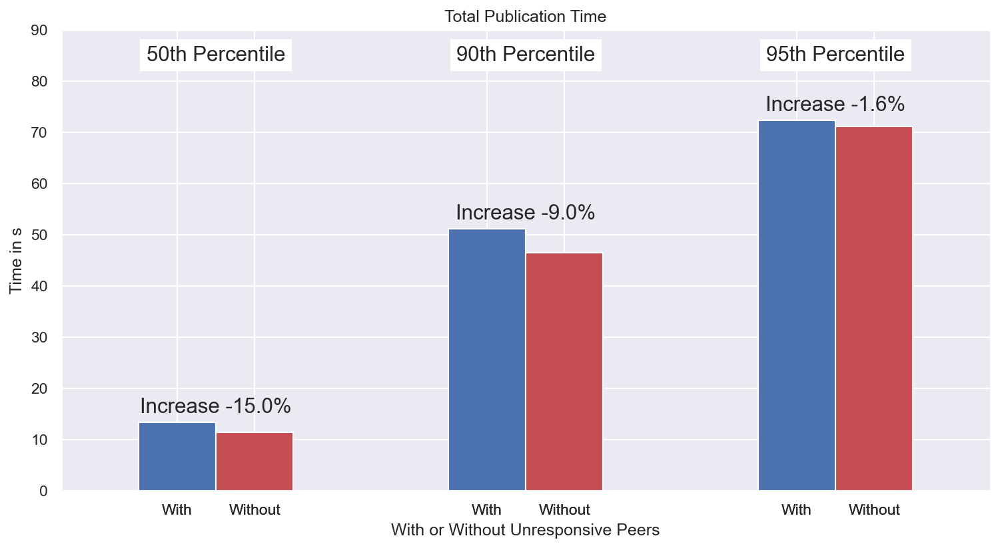

It depends on what type of system/network you’re running. In 90% of networks, or networked systems, this is a grand-scale disaster. Alerts are popping up everywhere, engineers go far beyond “day-time work” to get things back to normal, customers are panicking and potentially leaving the platform and the customer care lines are on fire. Half of the network is a large fraction, but I would bet that the same would happen even when 10% or 20% of the network experiences outage, or malfunction.

It’s not like that when you run your services on a decentralized, distributed P2P network, such as IPFS! At the beginning of 2023 a critical component of the IPFS network, namely the public IPFS DHT, experienced a large-scale incident. *During this incident, [60% of the IPFS DHT Server nodes became unresponsive](https://github.com/protocol/network-measurements/blob/master/reports/2023/calendar-week-04/ipfs/plots/crawl-unresponsive.png).* Interestingly, no content became unreachable and almost nothing in the network looked like the majority of the network was basically down. We did observe a significant increase in the content routing/resolution latency, in the order of 25% initially, but this definitely didn’t reflect the scale of the event.

In this blogpost we’ll go through the timeline of the event from “Incident Detection” to “Root Cause Analysis” and give details of the engineering team’s response, as well as of the items that the team has been monitoring throughout the incident.

## Incident Detection: we’ve got a problem❗️

> At the beginning of 2023 a central component of the IPFS network, namely the public IPFS DHT, experienced a large-scale incident. *During this incident, [60% of the IPFS DHT Server nodes became unresponsive](https://github.com/protocol/network-measurements/blob/master/reports/2023/calendar-week-04/ipfs/plots/crawl-unresponsive.png).*
> 

Unresponsive here means that nodes would seem to be online, they would accept connections from other nodes, but they wouldn’t reply to requests. Basically, when a node would try to write to one of the unresponsive nodes, the unresponsive node would terminate the connection immediately.

Given that these nodes seemed to be functional, they occupied several places in other nodes’ routing tables, when in fact they shouldn’t have.

The problem was all down to a misconfiguration of the go-libp2p resource manager - a new feature that shipped with `kubo-v0.17`. The problematic configuration, which was applied manually, i.e., was not based on the default values of `kubo-v0.17`, was set to such values that basically any attempt to interact with the nodes would be flagged as a resource exhaustion event and would trigger the corresponding “defense” mechanism. In practice, this materialized as a connection tear-down. It is worth noting that `kubo` is the most prevalent IPFS implementation using the public IPFS DHT with ~80% of nodes in the DHT being `kubo` nodes (see most recent [stats](https://github.com/protocol/network-measurements/tree/master/reports/2023/calendar-week-17/ipfs#agent-version-analysis)).

Content was still findable through kubo, so no alarms were raised. However, some of our research teams have been observing unusual error messages:

```go
**> Application error 0x0 (remote): conn-22188077: system: cannot reserve inbound
connection: resource limit exceeded**
```

The error didn’t seem like one that would trigger widespread panic, since PUT and GET operations were completing successfully. We were seeing slower performance than normal and had been investigating whether [recent changes with Hydra boosters](https://discuss.ipfs.tech/t/dht-hydra-peers-dialling-down-non-bridging-functionality-on-2022-12-01/15567) had bigger impact than we were expecting. That was until a physical meeting of our engineering teams, where we allocated some “hack time” to play around with the codebase and one of the items on the agenda was to figure out where this error comes from.

## Incident Diagnosis: what is happening ⁉️

We quickly realized that this was a resource manager issue where the remote node is hitting a limit and closing the connection. After some more digging and looking into the details of the resource manager and the error itself (i.e., `cannot reserve **in**bound connection`), we understood the root cause of the issue within the resource manager and that it was related to the remote node. It turns out that the resource manager was manually misconfigured by a very large percentage of nodes to values that were not in the default configuration by the “vanilla” version of the resource manager that shipped with `kubo-v0.17`.

As mentioned earlier, the GET and PUT operations were completing successfully, so the next step was to identify the scale of the problem. Our main goals were to figure out:

- what percentage of nodes in the network were affected,
- if there is a performance penalty in either the PUT or the GET operation, or both.

Through a combination of crawling the network and attempting connections to all ~50k DHT Server nodes (i.e., those that store and serve provider records and content), we found that close to 60% of the network has been affected by this misconfiguration. Clearly this is a very large percentage of the network, which made it urgent to look into the performance impact. We followed the below methodology:

1. As a first step, we wanted to figure out which buckets in the nodes’ routing tables do the affected nodes occupy. We found that they occupied the higher buckets of the nodes’ routing tables, which further meant that most likely PUTs would get slower, but GETs should not be affected too much. This is because the DHT lookup from the GET operation terminates when it hits *one* of the 20 closest peers to the target key, while the PUT operation terminates when it has found *all* the 20 closest peers. Since a significant portion of the network is unresponsive, the PUT operation certainly hits at least one unresponsive node, but the GET operation has good chances of finding at least one responsive node within the 20 closest.
    
    
    
2. After further investigation and given the very large percentage of nodes that were affected by the resource manager misconfiguration, we started looking into the impact of the incident to the GET performance.
    
    A GET request that hits one of the affected, unresponsive nodes would get the connection shut down by the remote, but would get stuck there until it timed out, at which point it would re-issue the request to another peer. The relatively high concurrency factor of the IPFS DHT (`alpha = 10`) helps in this case, as it means that for any given request up to 10 concurrent requests can be in flight. This helps a lot even with a high percentage of unresponsive nodes as it means that at least one of the 10 peers contacted will respond.
    
    > This is because the DHT lookup from the GET operation terminates when it hits one of the 20 closest peers to the target key, when the PUT operation terminates when it has found all the 20 closest peers.
    > 
    
    In the meantime, we estimated that a non negligible number of GET requests were hitting at least one unresponsive node during the lookup process. This event results in a timeout and significantly increases the request latency. There is a high probability that an unresponsive node is encountered during the last hops of the DHT walk because unresponsive peers are mostly present in higher buckets as the above figure shows.
    
3. To quantify the impact, we crawled the network and gathered the PeerIDs of unresponsive nodes. We set up six kubo nodes in several locations around the globe and attempted to: i) publish content (PUT), and, ii) retrieve content (GET) for two cases: i) when interacting with all nodes in the network, and, ii) when ignoring all responses from the unresponsive peers, whose PeerIDs we knew and were cross-checking with in real time.
    - The results we found were as follows:
        
        The PUT operation was slowed down by approximately 10%
        
        
        
    
    The GET operation was also disrupted (in contrast to our initial assumption) and was slowed down by approximately 15%, at times reaching closer to 20%.
    
    
    
4. We also experimented with even higher concurrency factors, in particular with `alpha = 20`, as a potential mitigation strategy. We repeated the same experiment with one extra set of runs: the case where we interact with all nodes in the network (i.e., we do not ignore unresponsive peers), but have higher concurrency factor.
    
    We found that the performance indeed increases and goes back to pre-incident levels. However, it was decided that we do *not* go down this path, as the increased concurrency factor would: i) increase significantly the overhead/traffic in the DHT network, and, ii) stick with nodes that do not upgrade later on (when the incident is resolved) giving a clear advantage advantage to those nodes.
    

## Event Mitigation: stop the bleeding 🚑

The team’s immediate focus became:

1. [Adding/updating documentation on Kubo’s resource manager integration](https://github.com/ipfs/kubo/blob/master/docs/libp2p-resource-management.md)
2. Triaging and responding to user questions/issues ([example](https://github.com/ipfs/kubo/issues/9432))
3. Preparing a new kubo release (`v0.18.1`), where the default settings for the resource manager were set to more appropriate values. This reduced the likelihood that someone would need to adjust the resource manager configuration manually, thus avoiding the configuration “footguns”.    
4. Encouraging as many nodes as possible to upgrade through public forums and direct relationships with known larger scale operators.

In parallel, we kept monitoring the situation by instrumenting a PUT and GET measurement experiment that was running since before the `kubo-v0.18.1` update, when the affected nodes started updating gradually.

`kubo-v0.18.1` was [released on the 2023-01-30](https://github.com/ipfs/kubo/releases/tag/v0.18.1) and within the first 10 days, more than 8.5k nodes updated to this release. Our monitoring software allowed us to have an accurate view of the state of the network and observed that the update to the new kubo release brought significant performance increase for the GET operation - more than 40% at the 95th percentile on a sample of ~2k requests, compared to the situation before the `kubo-v0.18.1` release.


We also monitored the situation compared to the pre-incident performance by running the experiment where we ignored the set of PeerIDs that were identified as affected by the misconfiguration. As a sample from more than 20k GET operations, in the figure below we show that the impact has reduced to ~5% (mid-February 2023).


## Addressing the Root Cause 🔧

Our immediate actions managed to stop the bleeding and bring the network back to normal pretty quickly. However, it was clear that we had to implement longer term fixes to protect the nodes’ routing tables from unresponsive peers and to avoid inadvertently making nodes unresponsive.  Specifically this translated to:

1. Revamped the Kubo resource manager UX to further reduce the likelihood of catastrophic misconfiguration.  This was completed in [Kubo 0.19](https://github.com/ipfs/kubo/releases/tag/v0.19.0#improving-the-libp2p-resource-management-integration).
2. Only add peers to the routing table that are responsive requests [during the routing table refresh](https://github.com/libp2p/go-libp2p-kad-dht/pull/810) (done) and [upon adding a node to the routing table](https://github.com/libp2p/go-libp2p-kad-dht/issues/811) (in progress - targeting [Kubo 0.21 in May](https://github.com/ipfs/kubo/issues/9814)).

## Lessons Learned 📖

There are several lessons to be learned from this incident.

🗒️ Significant fundamental changes to the codebase like retroactively adding resource accounting is fraught for disruption. This increases the necessity for documentation, announcements and clear recommendations to node operators.  

⏱️ Monitoring software should always be in place to help identify such events from the get go.

📣 It is challenging to monitor and apply changes directly to the software that runs on nodes of a decentralized network. Well-established communication channels go a long way and help the engineering teams make announcements and communicate directly with the community. In IPFS we use a variety of channels, including the IPFS Discord Server [[invite link](https://discord.gg/ipfs)], Filecoin Slack [[invite link](https://filecoin.io/slack)] (mostly in `#engres-ip-stewards` channel), the [discourse discussion forum](https://discuss.ipfs.tech/), and the [IPFS blog](https://blog.ipfs.tech/).

🚀 Last, but certainly not least, the decentralized, P2P nature of IPFS kept the network running, with all important operations completing successfully, albeit slower than normal. It is exactly because of the structure of the network that there are no single points of failure and performance is not catastrophically disrupted even when more than half of the network nodes are essentially unresponsive.
