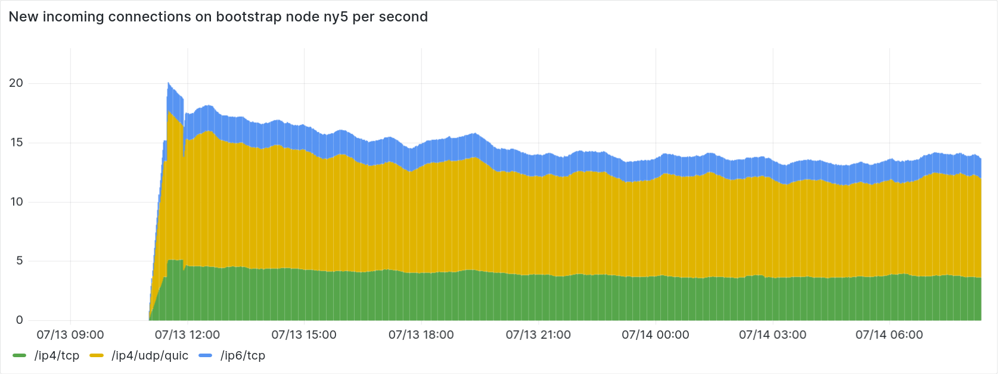
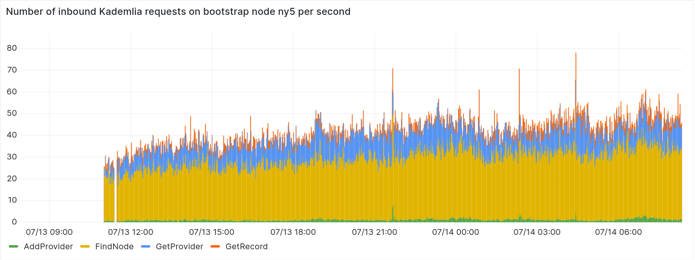
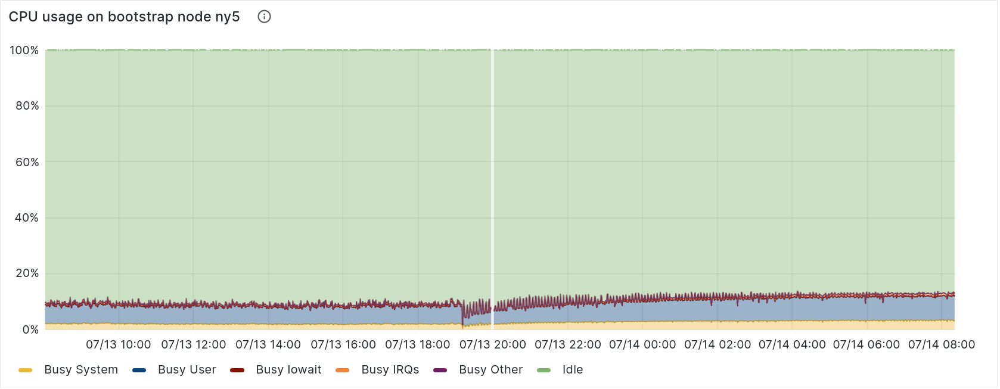
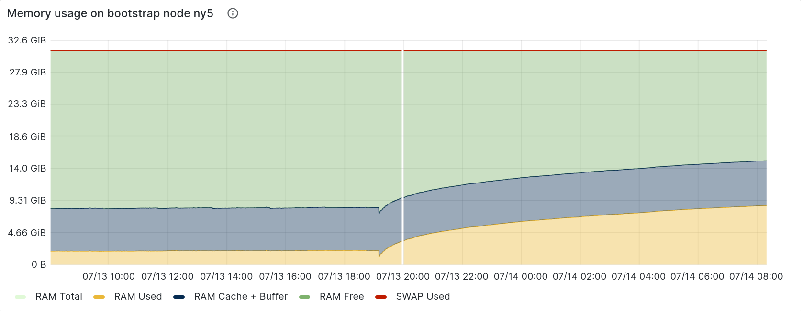

# Summary

As of July 13, 2023, one of the four "public good" IPFS bootstrap nodes operated by Protocol Labs has been running [rust-libp2p-server](https://github.com/mxinden/rust-libp2p-server) instead of [Kubo](https://github.com/ipfs/kubo), which uses [go-libp2p](https://github.com/libp2p/go-libp2p/). rust-libp2p-server is a thin wrapper around [rust-libp2p](https://github.com/libp2p/rust-libp2p). We run both Kubo and rust-libp2p-server on IPFS bootstrap nodes to increase resilience. A bug or vulnerability is less likely to be in both Kubo and rust-libp2p-server than Kubo alone. In addition to increasing resilience we gain experience running large rust-libp2p based deployments on the IPFS network.


# IPFS Bootstrap nodes

_What is an IPFS bootstrap node?_

> A Bootstrap Node is a trusted peer on the IPFS network through which an IPFS node learns about other peers on the network. [...]

See [IPFS Glossary](https://docs.ipfs.tech/concepts/glossary/#bootstrap-node).

A new node trying to join the IPFS network, i.e. trying to bootstrap, will:

1. Connect to its (pre-) configured bootstrap nodes.
2. Run some variation of the [Kademlia bootstrap process](https://github.com/libp2p/specs/tree/master/kad-dht#bootstrap-process) which boils down to iteratively:
    1. Generating random IDs.
    2. Asking already discovered nodes whether they know anyone closer to those IDs.

Thus the only thing that an IPFS bootstrap node needs to do is:

- Allow incoming connections.
- Maintain a healthy Kademlia routing table.
- Reply to Kademlia `FIND_NODE` requests based on nodes in its routing table.

Let's dive a bit deeper. In the case of Kubo the [DNSAddr](https://github.com/multiformats/multiaddr/blob/master/protocols/DNSADDR.md) addresses of the IPFS bootstrap nodes are shipped within the release binary.

``` go
// DefaultBootstrapAddresses are the hardcoded bootstrap addresses
// for IPFS. they are nodes run by the IPFS team. docs on these later.
// As with all p2p networks, bootstrap is an important security concern.
var DefaultBootstrapAddresses = []string{
	"/dnsaddr/bootstrap.libp2p.io/p2p/QmNnooDu7bfjPFoTZYxMNLWUQJyrVwtbZg5gBMjTezGAJN",
	"/dnsaddr/bootstrap.libp2p.io/p2p/QmQCU2EcMqAqQPR2i9bChDtGNJchTbq5TbXJJ16u19uLTa",
	"/dnsaddr/bootstrap.libp2p.io/p2p/QmbLHAnMoJPWSCR5Zhtx6BHJX9KiKNN6tpvbUcqanj75Nb",
	"/dnsaddr/bootstrap.libp2p.io/p2p/QmcZf59bWwK5XFi76CZX8cbJ4BhTzzA3gU1ZjYZcYW3dwt",
    // ...
}
```

See [`bootstrap_peers.go` on github.com/ipfs/kubo](https://github.com/ipfs/kubo/blob/v0.21.0/config/bootstrap_peers.go#L11C1-L24C2).

One can translate those `/dnsaddr/...` through iterative DNS queries. For example below for the node with the peer ID `QmbLHAnMoJPWSCR5Zhtx6BHJX9KiKNN6tpvbUcqanj75Nb`. This IPFS bootstrap node is running Kubo.

```
dig +short -t txt _dnsaddr.bootstrap.libp2p.io
"dnsaddr=/dnsaddr/am6.bootstrap.libp2p.io/p2p/QmbLHAnMoJPWSCR5Zhtx6BHJX9KiKNN6tpvbUcqanj75Nb"
[...]
```

```
dig +short -t txt _dnsaddr.am6.bootstrap.libp2p.io
"dnsaddr=/ip6/2604:1380:4602:5c00::3/udp/4001/quic-v1/p2p/QmbLHAnMoJPWSCR5Zhtx6BHJX9KiKNN6tpvbUcqanj75Nb"
[...]
```

Finally connecting to the bootrap node shows us the protocols it supports.
Below example uses [`libp2p-lookup`](https://github.com/mxinden/libp2p-lookup/) but `ipfs swarm connect` followed by `ipfs id` can be used instead.


```
libp2p-lookup direct --address /ip6/2604:1380:4602:5c00::3/udp/4001/quic-v1/p2p/QmbLHAnMoJPWSCR5Zhtx6BHJX9KiKNN6tpvbUcqanj75Nb

Lookup for peer with id PeerId("QmbLHAnMoJPWSCR5Zhtx6BHJX9KiKNN6tpvbUcqanj75Nb") succeeded.

Protocol version: "ipfs/0.1.0"
Agent version: "kubo/0.20.0/b8c4725"
Listen addresses:
        - "/ip6/2604:1380:4602:5c00::3/udp/4001/quic-v1"
        - [...]
Protocols:
        - /ipfs/kad/1.0.0
        - [...]
```

Note the `Agent version: "kubo/0.20.0/b8c4725"` and the supported protocols `Protocols: - /ipfs/kad/1.0.0`.

# Motivation

_Why run both Kubo and rust-libp2p2-server bootstrap nodes?_

This choice is influenced by three main areas: the benefit of diverse implementation, the opportunity to test rust-libp2p at large scale, and the presence of Rust in the IPFS network.

Implementation Diversity: Operating both Kubo and rust-libp2p-server bootstrap nodes contributes to the network's overall resilience and security. It's like having a second line of defense; if one system encounters an issue, the other is there to continue functioning. For instance, a recent bug impacted Kubo IPFS bootstrap nodes ([GitHub issue #2601](https://github.com/protocol/bifrost-infra/issues/2601)). By using both Kubo and rust-libp2p-server, we ensure that nodes can still join the network, even if one set of bootstrap nodes is unavailable.

Testing Rust-Libp2p at Large Scale: Our use of rust-libp2p-server also provides a valuable opportunity to examine how it behaves at a larger scale. Software performance can vary depending on scale, and these differences are hard to predict without actual real-world deployments. Now we can gain insights similar to those we acquired from other large deployments such as [Polkadot](github.com/paritytech/polkadot/) and [Ethereum](https://blog.libp2p.io/libp2p-and-ethereum/).

Encouraging Rust in the IPFS Network: Lastly, by operating a rust-libp2p bootstrap node, we hope to motivate other developers to build IPFS-based applications using rust-libp2p. This could lead to an increase in the use of Rust, fostering a more diverse and vibrant ecosystem.

# rust-libp2p(-server) in action

_What is rust-libp2p(-server) and how does it operate as an IPFS bootstrap node?_

[rust-libp2p](https://github.com/libp2p/rust-libp2p) is an implementation of the libp2p specification in Rust. Rust is a popular systems programming language. The rust-libp2p project was initiated around 2018 and since then, it has powered network like Ethereum through its Rust implementation [Lighthouse](https://github.com/sigp/lighthouse) and [Polkadot](github.com/paritytech/polkadot/) along with the [Substrate](https://github.com/paritytech/substrate/) ecosystem. You can find more rust-libp2p users [here](https://github.com/libp2p/rust-libp2p#notable-users).

[rust-libp2p-server](https://github.com/mxinden/rust-libp2p-server/) is just thin wrapper around rust-libp2p. It combines rust-libp2p's TCP, QUIC and Kademlia-DHT implementation into a single binary. Looking up the new rust-libp2p-server IPFS bootstrap node `ny5` via [`libp2p-lookup`](https://github.com/mxinden/libp2p-lookup/) confirms just that. Note the `Agent version: "rust-libp2p-server/0.12.0"`. and `Protocols: - /ipfs/kad/1.0.0`.


```
libp2p-lookup direct --address /dnsaddr/ny5.bootstrap.libp2p.io

Lookup for peer with id PeerId("QmQCU2EcMqAqQPR2i9bChDtGNJchTbq5TbXJJ16u19uLTa") succeeded.

Protocol version: "ipfs/0.1.0"
Agent version: "rust-libp2p-server/0.12.0"
Listen addresses:
        - [...]
Protocols:
        - /ipfs/kad/1.0.0
        - [...]
```

## Some numbers

On the new bootstrap node we see around 15 new inbound connections per second. The majority of these connections are established via QUIC (see `ip4/udp/quic`).



The node is handling > 30k connections concurrently, thus being connected to most of the network at any given point in time.


Across these connections the node handles around 40 Kademlia requests per second, most of which are Kademlia `FIND_NODE` requests.



The number of connections does not have a significant impact on CPU usage of the underlying machine.



The node uses `< 300 kbyte` of memory per connection.



A small tangent: in case you are interested in more IPFS network related metrics, take a look at the [weekly IPFS measurement reports](https://github.com/plprobelab/network-measurements/blob/master/reports/README.md).

# Closing

In case you want to learn more:

- Read up on the [libp2p project](https://libp2p.io/)
- Explore the [rust-libp2p implementation](https://github.com/libp2p/rust-libp2p)
- See the thin rust-libp2p wrapper at [mxinden/rust-libp2p-server](https://github.com/mxinden/rust-libp2p-server/)
- Dive deeper into the [details of this undertaking](https://github.com/protocol/bifrost-infra/issues/2622)
- And lastly, the [weekly IPFS measurement reports](https://github.com/plprobelab/network-measurements/blob/master/reports/) are always a good read

A lot of this work was done by [@mcamou](https://github.com/mcamou) from the Protocol Labs Bifrost team. Mario has handled the deployment and the team is operating the bootstrap nodes as a whole. Thanks, [@mcamou](https://github.com/mcamou) and team!

FAQ:

- Do I have to use the default bootstrap nodes?

  No, you don't have to use `/dnsaddr/bootstrap.libp2p.io`. You can remove Protocol Labs' default nodes and add your own or use both for better reliability.

- Do we plan to run rust-libp2p-server on all IPFS bootstrap nodes?

  No.
