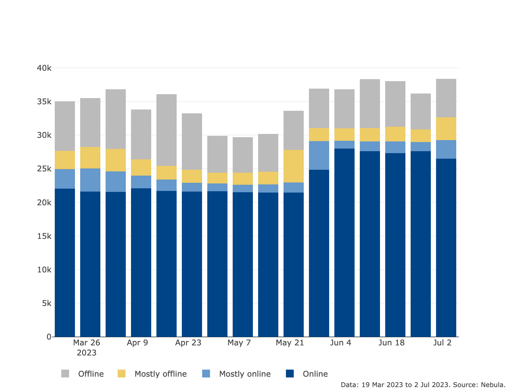
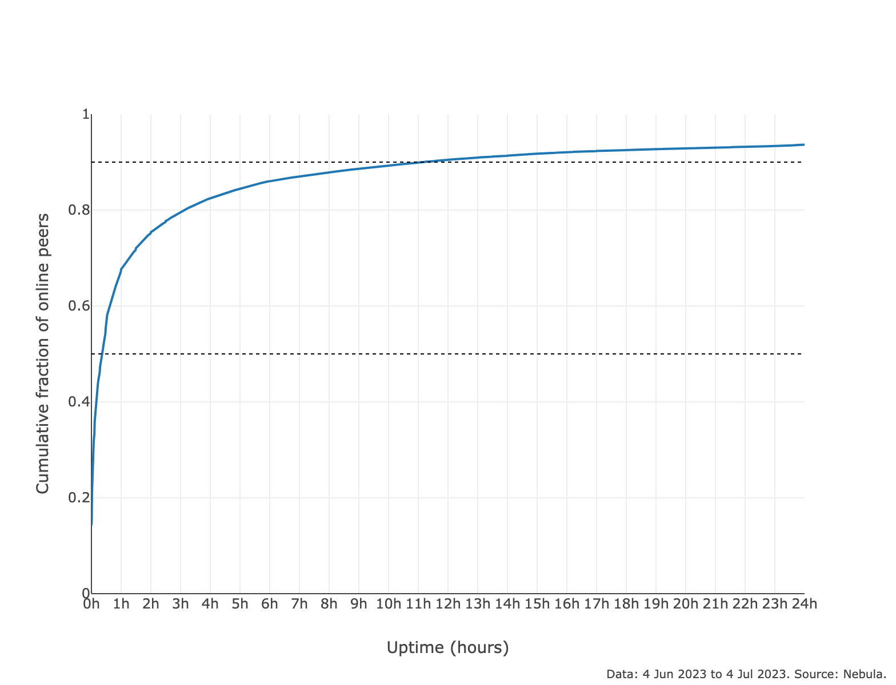
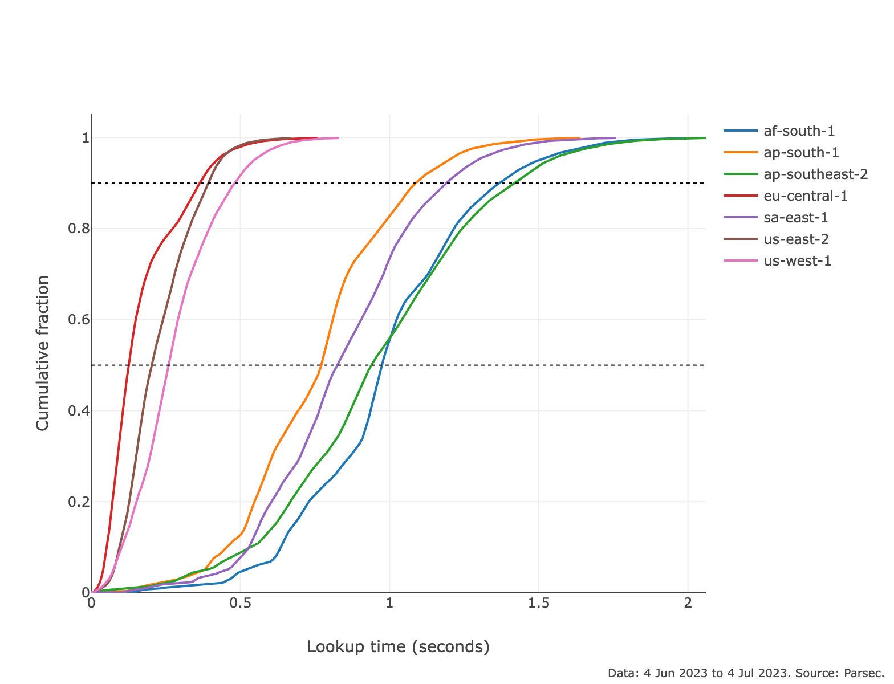
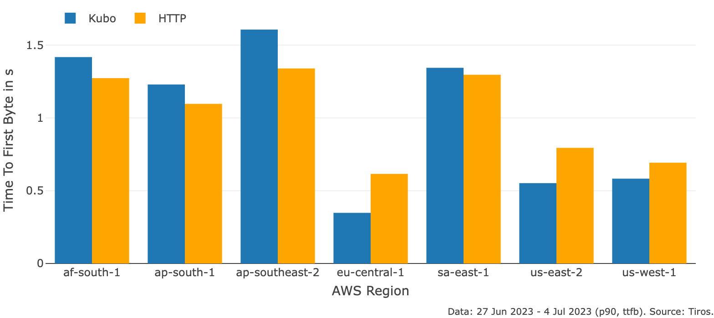
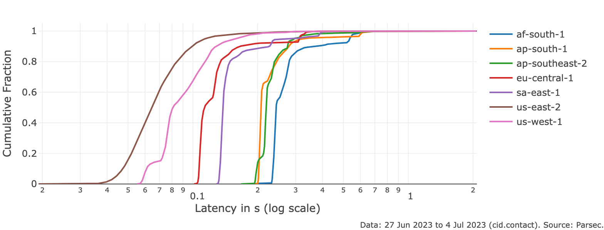

# tl;dr

The ProbeLab team has worked hard over the past year to build a resilient and fully-automated infrastructure to monitor the performance of core IPFS stack protocols. All of what we have so far lives at [https://probelab.io](https://probelab.io) with results being auto-updated on a daily basis.

## Why measurement work is important

Measuring operational networked systems is the cornerstone of system reliability, stability, and great user experience. Unless someone measures the performance of their system, it is very difficult to spot problems and inconsistencies between protocol design and actual operation. Most importantly, it is very difficult to be able to direct engineering effort to the right direction in order to solve actual problems, deal with bottlenecks, and eventually improve performance.

System and network measurements are normally straightforward when there is a single (or a few) points of control. The task becomes significantly more challenging in the case of open-source, decentralized, and permissionless systems such as IPFS where there is no single point of control (or any gatekeeping entity).

## ProbeLab

This is where our team’s efforts come into the picture. ProbeLab is focusing on protocol measurement, benchmarking, and optimization for Web3.0 protocols in general and IPFS in particular. During the past year we strived to build all the necessary tooling and backend infrastructure in order to be able to reliably measure the most critical aspects of the decentralized network. To avoid this being our own knowledge and instead share our findings with the community, we’ve also built a public-facing front-end where our key results are being reported on a daily basis: [https://probelab.io](https://probelab.io) 

One key thing that makes [https://probelab.io](https://probelab.io) different to a dashboard is that there is detailed explanation of the measurement methodology and the measurement setup, so that viewers can understand whether the results they’re observing fit their own setup and use-case. Ultimately, [https://probelab.io](https://probelab.io) should become the point of reference for engineers, as well as executives that are running (or are considering running) their applications on top of the IPFS network.

## Our focus (so far)

Apart from [several](https://www.notion.so/pl-strflt/Optimistic-Provide-07ce632c6de54aec953ec0e9ca2bbcf5?pvs=4) [protocol](https://github.com/plprobelab/network-measurements/blob/master/results/rfm16-bitswap-discovery-effectiveness.md) [optimization](https://github.com/plprobelab/network-measurements/blob/master/results/rfm15-nat-hole-punching.md) projects that ProbeLab has taken up so far, our primary focus on the measurements front has been the main component that supports decentralized content routing in the IPFS protocol stack, that is, the IPFS Public DHT network. Our focus has not been a random pick, but instead a thoughtful consideration given that this is where performance has been mostly unknown and mostly unpredictable - until now!

That said, we have extended our efforts to other critical parts of the architecture, such as the [InterPlanetary Network Indexers](https://docs.ipfs.tech/concepts/ipni/), and we plan to add more components to our monitoring infra in the near future.

Sample projects where our measurement infrastructure has helped the ecosystem tremendously are:

- **The Hydra Dial Down:** [Hydra Boosters](https://github.com/libp2p/hydra-booster) are a special type of DHT server node designed to accelerate content routing performance in the IPFS network. They were introduced in 2019 and were intended as an interim solution while exploring other DHT scalability techniques. The IPFS DHT network and its supporting protocols have advanced significantly since then, and the (not insignificant) cost of operating Hydras was put in question by our team. We have found that Hydras improve content routing performance by not more than 10-15% on average, which was considered minor, compared to its operational cost. The team carried out a progressive dial down of Hydras after communicating our intentions with the community (see [details](https://discuss.ipfs.tech/t/dht-hydra-peers-dialling-down-non-bridging-functionality-on-2022-12-01/15567)) and confirmed our performance estimates of a Hydra-less network. You can find an explanatory talk of our measurement estimates at IPFS Camp 2022 [here](https://www.youtube.com/watch?v=zhzxJGoLTg0) and the full project report [here](https://github.com/protocol/network-measurements/blob/master/results/rfm21-hydras-performance-contribution.md).

- **Unresponsive Nodes Incident:** ProbeLab’s measurement work and tooling has proven critical for incidents that nearly brought the IPFS network to its knees. Around January 2023, a software misconfiguration resulted in more than 50% of IPFS DHT network nodes becoming unresponsive. Through rigorous measurement and analysis of the measurement results, the engineering teams have chosen the right next steps to resolve the situation in record time, something that would have been significantly more difficult without the numbers that the ProbeLab team has provided. You can read all of the details regarding the incident, the response, and the measurements that our team carried out in [this previous blog post](https://blog.ipfs.tech/2023-ipfs-unresponsive-nodes/).

## ProbeLab Tooling

Our primary tooling is open-source and linked from the same website under: [https://probelab.io/tools/](https://probelab.io/tools/). There are detailed “how to” guides for each tool so that community members can get familiar and start using them for their own studies. The tools we have used so far include:

- [`Nebula`](https://probelab.io/tools/nebula/): a libp2p DHT crawler and monitor that is designed to track the liveliness and availability of peers.
- [`Parsec`](https://github.com/plprobelab/parsec): a DHT and IPNI performance measurement tool that is used to gather accurate data on the performance of DHT and IPNI lookups and publications.
- [`Tiros`](https://github.com/plprobelab/tiros): a retrieval and rendering metrics measurement tool of websites loaded over IPFS. It is designed to help developers monitor and optimize the performance of their IPFS-hosted websites. It also measures and compares the IPFS metrics with their HTTPS counterparts.

## What we know now that we didn’t know before

The plots and experiments at [https://probelab.io](https://probelab.io) offer visibility into lots of aspects that were not visible at all beforehand, or at least were not widely available. Our monitoring and observation of IPFS’s primary content routing components’ performance over the last couple of quarters reveals that at the time of writing:

- More than 25k DHT Server peers stay online for more than 80% of the time of a given week [[link to plot](https://probelab.io/ipfskpi/#dht-availability-classified-overall-plot)]

- Despite the above fact, the churn rate in the network is rather high with 80% of DHT Server peers leaving the network in 3hrs or less after they appeared online [[link to plot](https://probelab.io/ipfsdht/#dht-peers-churn-cdf-overall-plot)]

- The Median DHT Lookup Performance (i.e., the time to first provider record) is at 600ms as measured from 7 different geographical regions. It is worth highlighting that the lookup performance from the EU and North America, where most DHT nodes reside, is significantly better than other regions and stands at 200-250ms [[link to plot](https://probelab.io/ipfsdht/#dht-lookup-performance-cdf-region-plot)].

- Websites hosted on IPFS are served faster over kubo than HTTP for those well-performing regions (EU and North America) [[link to plot](https://probelab.io/websites/#websites-http-comparison-ttfb-p90)].

- The [cid.contact](http://cid.contact) IPNI maintains a stable lookup performance below the 300ms mark at the P90 for uncached content and across all 7 regions [[link to plot](https://probelab.io/ipni/cid.contact/#ipni-snapshot-uncached-latencies-cdf-cidcontact-plot)].

## Where to find more

Head over to [https://probelab.io](https://probelab.io) to dive into all the results and explanation of the experiments.

It is worth noting that we do not provide commentary on the results presented on the website itself. Instead, discussion around results reported at [https://probelab.io](https://probelab.io) is taking place at the [IPFS Discussion Forum](https://discuss.ipfs.tech/c/testing-and-experiments/measurements/39).

You can reach out to the ProbeLab team (e.g., if you’re interested contributing to the measurement effort, or have a request) through:

- the `#probe-lab` channel in IPFS Discord [[invite link](https://discord.gg/ipfs)], or Filecoin Slack [[invite link](https://filecoin.io/slack)] (bridged channel).
- The team’s email: [probelab@protocol.ai](mailto:probelab@protocol.ai)

We also hold bi-weekly Office Hours, where we invite the community and our collaborators to join and bring up questions, challenges they face and topics for discussion. You can sign up through [this lu.ma page](https://lu.ma/ipfs-network-measurements).

<!-- ## A guide for website owners hosting with IPFS

Last, but not least, we have developed an in-depth methodology to monitor performance of websites hosted on IPFS. We are currently monitoring most of PL’s websites and provide a breakdown of web access performance metrics (primarily using [Web Vitals](https://web.dev/vitals/)). This is very helpful for monitoring overall performance, but especially for debugging in case of poor performance, or errors while fetching website content.

++ linking to the howto guide as well as how to use it, if we finalise and decide to include. -->
