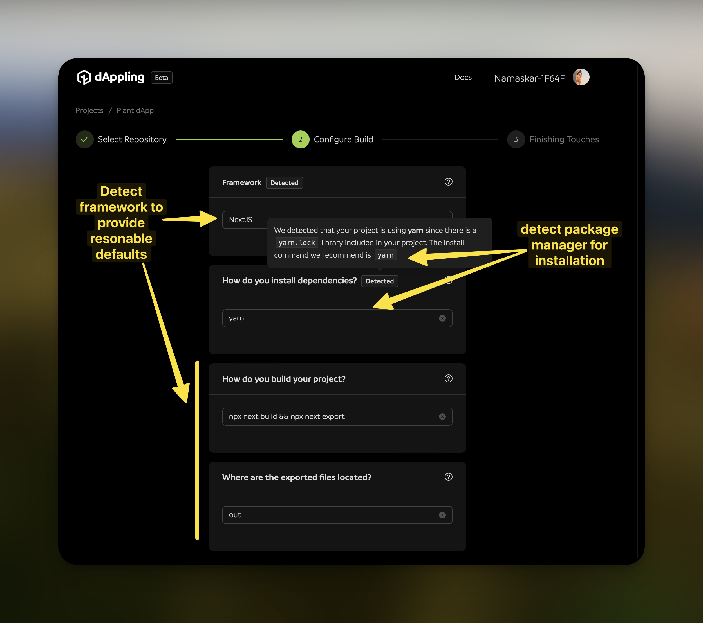
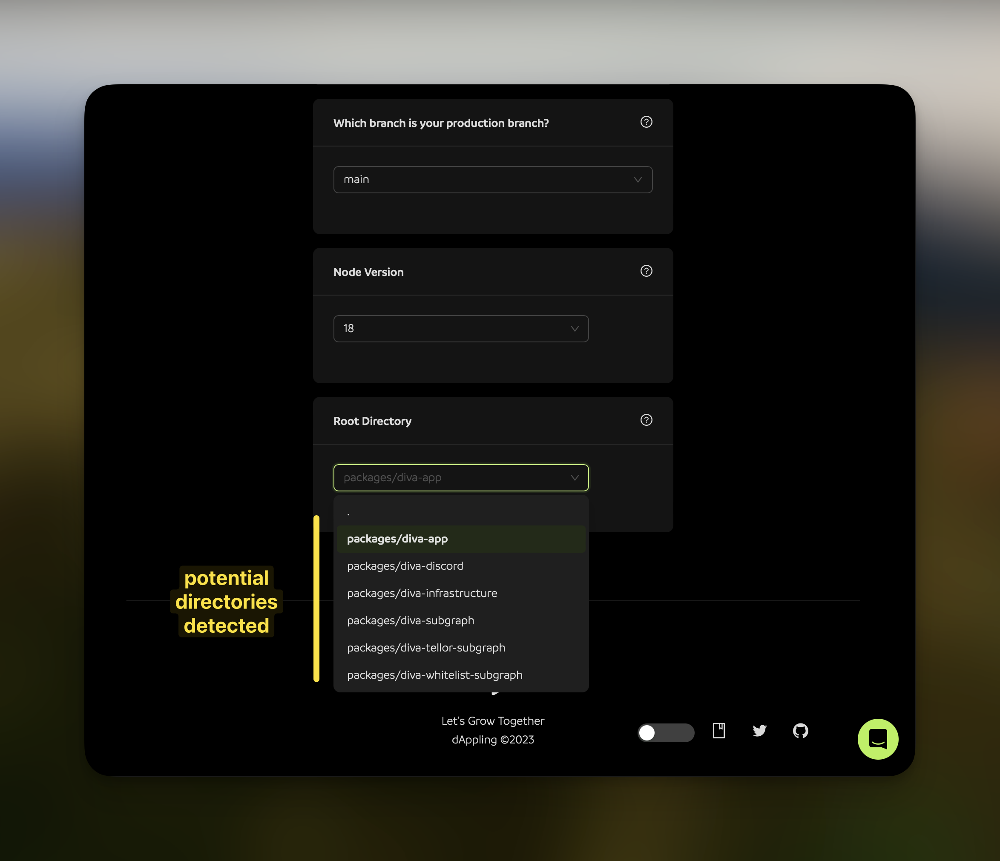
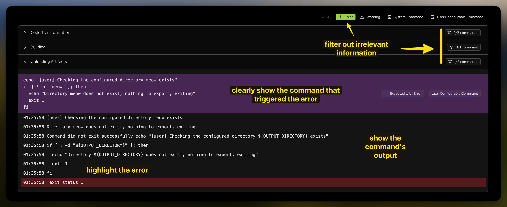

Welcome! I would love to share what I'm building at dAppling, a platform that aims to simplify the build and deployment process for sites hosted on IPFS. I'll start with a bit about us, a bit about the platform, and a bit about what you will get. By the end, it should be clear if it's a tool you'll want to add to your developer toolbox.

## A Bit about Us

I'm Kyle. My co-founder Russell and I have been professional developers (whatever that means) for the last 7 years. We've worked at startups, big tech, and things in between. The last 2 of those years, has been in the web3 space, starting with the creation of a DeFi protocol. We're excited to be building tools for developers working on the next generation of the web.

## A Bit about dAppling

The first of those tools is dAppling. The word is a portmanteau of "dApp", a term short for decentralized application, and "sapling," because nature is wonderful 🌱. However, we support all kinds of web projects, not just [dApps](https://app.gogopool.com.dappling.eth.limo/): [landing pages](https://arbor-landing.dappling.eth.limo/), [blogs](https://blog.dappling.network), or even a simple page of content arguing against the [usage of acronyms](https://nomoreacronyms-xczmz4.dappling.org).

Basically, we take your code, build it, and host the resulting files on IPFS. What makes us special are the features we provide to make your experience easier. Even if you have an existing site, you can use dAppling to create a resilient "alternative frontend" that is hosted on IPFS.

## A Bit about What You Get

When you add a project dAppling, you will tell us where the code is and what commands to use. After it's built you will get:

- automatic updates on **GitHub** code changes
- hosting on the **InterPlanetary File System** (IPFS)
- a working **dappling.network** subdomain
- a working **dappling.eth** subdomain
- an automatically updating **IPNS** key

## Our Focuses

We have two major focuses at dAppling: **simplicity** and **access**.

We want to make it as easy as possible to get your code on IPFS. After on IPFS, we want it to be accessible and fast. What we want to avoid is a first-time experience where you only see an error screen or have your users waiting forever.

### Simplicity in Setup

We simplify the setup process by autodetecting configuration as much as possible.

Since we have access to your code, we look at a few things like what package manager you use, what sort of framework the project is built with, and certain configuration files. We use this information to prefill the configuration form, so you don't have to.

Additionally, we have easy to use dropdowns for your GitHub branch and where the code is located in cases like a monorepo.

### Simplicity in Errors

Try as we might, projects fail to build. Quite a bit! From a linting error to a missing dependency, seeing the error screen seems inevitable. We want to make it as easy as possible to understand what went wrong and how to fix it. We parse the logs and show you the error in, what I think, is a pretty readable format. 

If reading isn't your thing, we have a button that sends your logs to be parsed by AI and returns a summary of the error. And while it's not perfect, the output has been helpful more often than not.

If you run into **any** problems, want to connect, or just say hi, my DMs are open on [𝕏](https://x.com/0xBookland). I would love to hear your feedback and help you get your project deployed.
🙏
