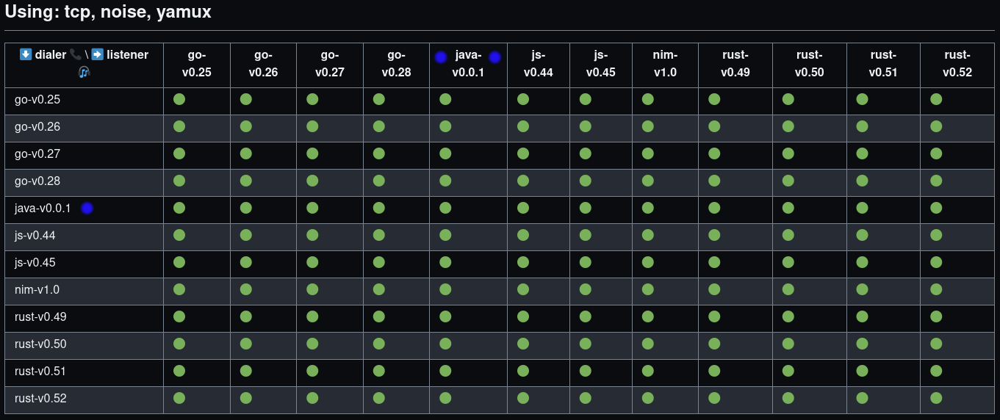

Greetings from the [Peergos](https://peergos.org) team! We are thrilled to unveil what we've been working on this year: [Nabu](https://github.com/peergos/nabu) – our sleek and versatile Java implementation of IPFS. Named after the ancient Mesopotamian god of literacy, rational arts, and wisdom, Nabu makes decentralised data storage and retrieval available to the large JVM ecosystem. It's now *production ready*, as we are using it in Peeergos - a decentralised, secure file storage, sharing and social network.

## Introducing Nabu: Empowering Java with IPFS Magic
At its core, Nabu is a minimal IPFS implementation for storing and retrieving data blocks over the libp2p protocol. But we didn't stop there – we've also added a touch of innovation with features like authed bitswap. This addition enables the creation of private data blocks, accessible only to those with authorized permissions. Intrigued? Dive into the finer details of this innovation in our dedicated post on [authed bitswap](https://peergos.org/posts/bats).

Our journey in crafting Nabu involved the implementation of additional libp2p protocols, including:

* Kademlia (including IPNS): The very backbone of IPFS, aiding in the discovery of blocks and their owners.
* Bitswap + Auth Extension: A protocol that facilitates the exchange of data blocks.

We built upon the solid foundation of [jvm-libp2p](https://github.com/libp2p/jvm-libp2p). As we delved deeper, we realized the need to implement several crucial components. These include the [yamux muxer](https://github.com/libp2p/jvm-libp2p/tree/develop/libp2p/src/main/kotlin/io/libp2p/mux/yamux), the [TLS security provider](https://github.com/libp2p/jvm-libp2p/blob/develop/libp2p/src/main/kotlin/io/libp2p/security/tls/TLSSecureChannel.kt) (complete with ALPN early muxer negotiation), and a substantial portion of a quic transport (still a work in progress). While much of this effort started in a fork, we collaborated with [Consensys](https://consensys.io) to upstream our contributions into the main project which has now released [v1.0.0](https://github.com/libp2p/jvm-libp2p/releases/tag/1.0.0) as a result. This is used in [Teku](https://github.com/ConsenSys/teku), a Java Ethereum 2 implementation. 

[](../assets/nabu/modules.png)

Nabu's API empowers developers with the following methods:
* [id](https://docs.ipfs.tech/reference/kubo/rpc/#api-v0-id)
* [version](https://docs.ipfs.tech/reference/kubo/rpc/#api-v0-version)
* [block/get](https://github.com/Peergos/nabu/blob/master/src/main/java/org/peergos/BlockService.java#L12)
* [block/put](https://docs.ipfs.tech/reference/kubo/rpc/#api-v0-block-put)
* [block/rm](https://docs.ipfs.tech/reference/kubo/rpc/#api-v0-block-rm)
* [block/stat](https://docs.ipfs.tech/reference/kubo/rpc/#api-v0-block-stat)
* [block/has](https://github.com/Peergos/nabu/blob/master/src/main/java/org/peergos/blockstore/Blockstore.java#L25)
* [refs/local](https://docs.ipfs.tech/reference/kubo/rpc/#api-v0-refs-local)
* [bloom/add](https://github.com/Peergos/nabu/blob/master/src/main/java/org/peergos/blockstore/Blockstore.java#L37)
* [dht/findprovs](https://docs.ipfs.tech/reference/kubo/rpc/#api-v0-dht-findprovs)

Most of these functions align with [Kubo](https://github.com/ipfs/kubo), but we've added block/has, which is a much more efficient way to ask if we have a block or not, as well as bloom/add which is useful if you are adding blocks to the blockstore externally (typically with multiple servers and S3 blockstore, and using a bloom filter). In addition we've added a few extra optional parameters to block/get, which you'll hear more about in the Performance section below.

## Unique Features

Nabu boasts some distinctive features that simplify building on IPFS:

* P2P HTTP Proxy: This feature facilitates HTTP requests to listening peers, encrypting communication over libp2p streams. Bid farewell to the complexities of TLS certificate authorities and DNS.
* Built-in S3 Blockstore: Seamlessly integrate external blockstores like S3.
* [Infini-Filter](https://dl.acm.org/doi/10.1145/3589285): A bloom filter replacement that offers infinite expandability.
* Peer-Specific Block Retrieval: Nabu empowers developers to fetch blocks from specific peers, streamlining data retrieval and improving privacy (See Performance section below).

Let's shed some light on the first of these gems – the P2P HTTP proxy. A component we initially implemented in [Kubo in 2018](https://peergos.org/posts/dev-update#Decentralization) (behind an experimental flag), this feature introduces a new gateway endpoint with paths in the format:

**/p2p/$peerid/http/**

Its function is simple yet transformative: it proxies incoming HTTP requests to the specified $peerid while trimming the preceding "/p2p/$peerid/http" path. On the other end, the setup forwards incoming requests to a designated endpoint. This paradigm grants the convenience of traditional HTTP-based architecture, sans the complexities of DNS and TLS certificate authorities. By addressing the node using its public key, secure connections become effortlessly achievable. The diagram below illustrates how we use this proxy in Peergos.

[](../assets/nabu/p2p-http-proxy.png)

For a simpler example of using this, see our single file demo [chat app](https://github.com/Peergos/nabu-chat/blob/main/src/main/java/chat/Chat.java).

## Performance
### Faster, more private block retrieval
Drawing from experience, we recognized the inefficiency of requesting every single block from the DHT or connected peers. This practice leads to excessive bandwidth consumption and sluggish content retrieval. Enter our solution: a new optional parameter,"peers" in block/get allowing retrieval from pre-specified peer IDs. In cases of unreachability, a DHT lookup through dht/findprovs api serves as a fallback option. This design of taking a set of peerids that you want to ask for blocks, encourages users to design their programs to route at a higher level than blocks, improving speed, bandwidth usage and privacy. Many apps will know which peers they want to retrieve data from in advance, and with this parameter they can massively reduce bandwidth and speed up retrieval. The motto here is "Route your peers, not your data". In Peergos, for example, given a capability to a file we can lookup the file owner's home server (specifically its peer id) and directly send bitswap requests there, so we only need to fallback to DHT lookups if their home server is unreachable. 

### Reduced bandwidth and CPU usage
We believe that *providing* (announcing to the DHT that you have a given cid) every single block of data you have does not scale, This is because the number of DHT lookups and provide calls increases with the amount of data you are storing. The issues trying to scale this have been [documented](https://blog.ipfs.tech/2023-09-amino-refactoring/#making-reprovides-to-amino-lightning-fast). Compare this to bittorrent, which has been around much longer and has a much larger DHT, but where providing doesn't scale with the amount of data in a torrent and idle bandwidth usage is much lower. For this reason, we've made providing blocks in Nabu optional, and disabled it in Peergos (unless you are running a mirror). 

This leads us to the next optimisation, enabled by only sending block requests to peers we think have the data. In Kubo, bitswap will broadcast block wants to all connected peers (typically in the 100s). This is both a privacy issue and a bandwidth hog as it means joining the main IPFS DHT is very resource intensive. Nabu has an option to block such aggressive peers that flood us with requests for blocks we don't have. With this option enabled, the incoming idle bandwidth usage is reduced by 10X.  

### Benchmark
We benchmarked Nabu against a real-world dataset – the Peergos PKI – consisting of a [CHAMP](https://blog.acolyer.org/2015/11/27/hamt/) structure with six layers, 6000 blocks, and a total size of ~2 MiB. The results speak volumes: while standard Kubo took 120 seconds to retrieve this dataset using the pin command, Nabu accomplished the task in a mere 5 seconds. And, this was achieved without any significant optimization or parallelisation, leaving much room for further enhancement.

[](../assets/nabu/nabu-speed.png)

## Compatibility

Ensuring seamless integration, we subjected Nabu to a suite of interoperability tests against all libp2p implementations, including go-libp2p, rust-libp2p, js-libp2p, and nim-libp2p across historical versions. The results of these tests are documented [here](https://github.com/libp2p/test-plans/actions/runs/5671451848/attempts/1#summary-15368587233). Some of the results are below.

[](../assets/nabu/nabu-interop.png)

## Bringing Nabu to Life: Integration and Usage
Getting started with Nabu is simple. Choose between utilizing it through the HTTP API or embedding it directly into your process. Here's a compilable example of the embedding process in Java:
```java
        List<MultiAddress> swarmAddresses = List.of(new MultiAddress("/ip6/::/tcp/4001"));
        List<MultiAddress> bootstrapAddresses = List.of(new MultiAddress("/dnsaddr/bootstrap.libp2p.io/p2p/QmQCU2EcMqAqQPR2i9bChDtGNJchTbq5TbXJJ16u19uLTa"));
        BlockRequestAuthoriser authoriser = (cid, block, peerid, auth) -> CompletableFuture.completedFuture(true);
        HostBuilder builder = new HostBuilder().generateIdentity();
        PrivKey privKey = builder.getPrivateKey();
        PeerId peerId = builder.getPeerId();
        IdentitySection identity = new IdentitySection(privKey.bytes(), peerId);
        boolean provideBlocks = true;

        SocketAddress httpTarget = new InetSocketAddress("localhost", 10000);
        Optional<HttpProtocol.HttpRequestProcessor> httpProxyTarget =
                Optional.of((s, req, h) -> HttpProtocol.proxyRequest(req, httpTarget, h));
        
        EmbeddedIpfs ipfs = EmbeddedIpfs.build(new RamRecordStore(),
                new FileBlockstore(Path.of("/home/alice/ipfs")),
                provideBlocks,
                swarmAddresses,
                bootstrapAddresses,
                identity,
                authoriser,
                httpProxyTarget
        );
        ipfs.start();

        List<Want> wants = List.of(new Want(Cid.decode("zdpuAwfJrGYtiGFDcSV3rDpaUrqCtQZRxMjdC6Eq9PNqLqTGg")));
        Set<PeerId> retrieveFrom = Set.of(PeerId.fromBase58("QmVdFZgHnEgcedCS2G2ZNiEN59LuVrnRm7z3yXtEBv2XiF"));
        boolean addToLocal = true;
        List<HashedBlock> blocks = ipfs.getBlocks(wants, retrieveFrom, addToLocal);
        byte[] data = blocks.get(0).block;
```

If you want a working example app you can fork, have a look at our [chat example](https://github.com/Peergos/nabu-chat). This is a simple CLI app where two users exchange peerid (out of band) and then connect and send messages via p2p http requests, which are printed to the console.

## Future plans
We still have lots planned for Nabu including the following:
* NAT traversal with circuit-relay-v2, dcutr and AutoRelay
* mDNS peer discovery
* Android compatibility and demo app
* Quic integration

## Gratitude and Acknowledgments
None of this would have been possible without the support of the [IPFS Implementations Fund](https://arcological.xyz/#ipfs-pool). We extend our heartfelt thanks for making this endeavor a reality.

## Experience Nabu Today!
We invite you to embark on an exploration of Nabu's capabilities. Feel free to give it a whirl, and we eagerly await your feedback and suggestions for improving Nabu. The easiest route is to open an issue on the github repo.

[Discover Nabu on GitHub](https://github.com/peergos/nabu) and unlock a world of decentralized possibilities.
