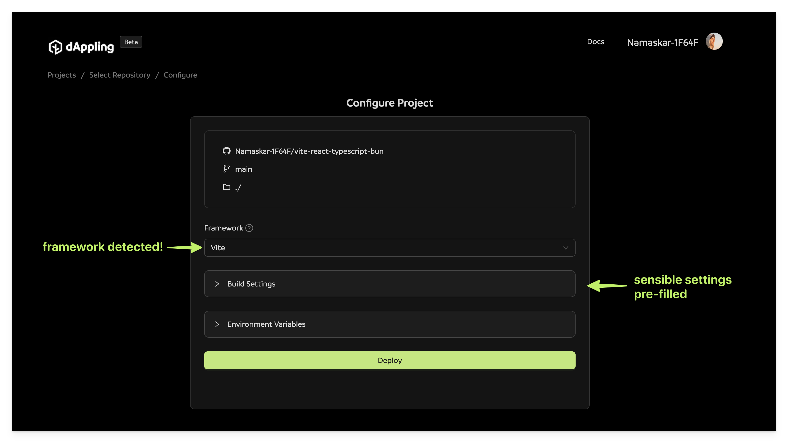
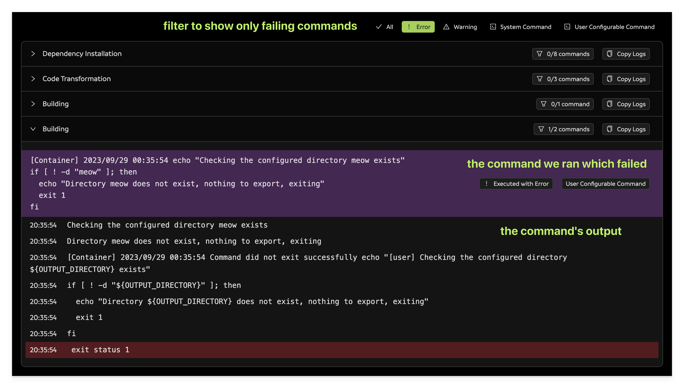

Welcome! I would love to share what I'm building at dAppling, a platform that aims to simplify the build and deployment process for sites hosted on IPFS. I'll share a bit about us, a bit about the platform, and a bit about what you will get. By the end, it should be clear if dAppling is a tool you'll want to add to your developer toolbox.

## A Bit about Us

I'm Kyle. My co-founder Russell and I have been professional developers (whatever that means) for the last 7 years. We've worked at startups, big tech, and things in between. The last 2 of those years has been in the web3 space; started with the creation of a DeFi protocol. We're excited to now be building tools for developers working on the next generation of the web.

## A Bit about dAppling

The first of those tools is dAppling. The word is a portmanteau of "dApp", a term short for decentralized application, and "sapling," because nature is wonderful 🌱. However, we support all kinds of web projects, not just [dApps](https://app.gogopool.com.dappling.eth.limo/): [landing pages](https://arbor-landing.dappling.eth.limo/), [blogs](https://blog.dappling.network), or even a simple page of content arguing against the [usage of acronyms](https://nomoreacronyms-xczmz4.dappling.org).

Basically, we fetch your code, build it into html/css/js files, and host those files on IPFS. What makes us special are the features we provide to make your experience easier. Even if you have an existing site, you can use dAppling to create a resilient "alternative frontend" that is hosted on IPFS.

## A Bit about What You Get

When you add a project dAppling, you will tell us where the code is and what commands to use. After it's built you will get:

- automatic updates when your code on **GitHub** changes
- hosting on the **InterPlanetary File System** (IPFS)
- a working **dappling.network** subdomain
- a working **dappling.eth** ENS subdomain
- an automatically updating **IPNS** key

## Our Focuses

We have two major focuses at dAppling: **simplicity** and **access**.

We want to make it as easy as possible to get your code hosted. After that, we want it to be accessible and fast. What we want to avoid is a first-time experience where you only see an error screen or have your users waiting forever to load your site.

### Simplicity

We simplify the setup process by automatically detecting your app's configuration. If something does go wrong, we have easy to use debugging tools.

#### Simple Setup

Since we have access to your code, we look at a few things like what package manager you use, what sort of framework the project is built with, and certain configuration files. We use this information to prefill the configuration form, so you don't have to.

We have support for environment variables to use during the build process that can be used to configure things like your database URL. Additionally, we support monorepos.

#### Simple Debugging

Try as we might, projects fail to build. Quite a bit! From a linting error to a missing dependency, seeing the error screen seems inevitable. We want to make it as easy as possible to understand what went wrong and how to fix it. We parse the logs and show you the error in, what I think, is a pretty readable format.

If reading logs isn't your thing, we have a button that sends your logs to be parsed by AI and returns a summary of the error. And while it's not perfect, the output has been helpful more often than not.

### Accessibility

Websites need to be accessed, even if the reader is only you! We think the more points of access the better, and each should be available and fast.

#### Speed of Access

The foundation of our storage starts with [Filebase](https://filebase.com/) whose geo-redundant storage locations keep your files available. On top of that, the CDN quickly fetches and caches those files.

#### Points of Access

There are a couple of ways to access your site. When the code is built and uploaded to IPFS, you will receive what is called a [Content Identifier (CID)](https://docs.ipfs.tech/concepts/content-addressing/). It's basically the hash of all your files.

You will receive a new CID every time your site is re-built because the resulting files have changed. Luckily, we use the [InterPlanetary Name System (IPNS)](https://docs.ipfs.tech/concepts/ipns/) to create a key that will always point to the most recent CID.

So the most straightforward way to fetch your content would be directly from an [IPFS node](https://docs.ipfs.tech/concepts/nodes/). Since not everyone is running an IPFS node (yet), you can instead use an [IPFS gateway](https://docs.ipfs.tech/concepts/ipfs-gateway/) in which a third party fetches the content from their node and serves it over HTTPS.

Since we store the on our `dappling.eth` ENS name, you can also fetch the content through a service like [eth.limo](https://eth.limo). This service first reads the IPNS key that we set, resolves it to a CID, and then serves the content like a gateway.

Even simpler would be using the existing DNS system either using our custom `*.dappling.network` subdomain that we created for you. We also allow adding your custom domain like `ipfs.crypto-protocol.app`.

## Future

We plan to be constantly upgrading the platform as new decentralization techniques appear. As a user, you will notice more points of access, quicker speeds, and features to make usage easier. We hope to increase decentralization

- SSR: Serverless applications are popular on platforms like Next.js and we will be using decentralized compute to increase the types of applications we support.
- Collaboration: The more participants in a project the better the decentralizaton becomes. We are working on tools to allow multiple people configure the project.

## Get Involved

As we continue to improve, we're always looking for user feedback to guide us. Our focus remains on providing a platform that is not just decentralized but also highly performant and user-friendly.

If you run into **any** problems, want to connect, or just say hi, my DMs are open on [𝕏](https://x.com/0xBookland). I would love to hear your feedback and help you get all of your projects deployed as we transition to the infrastructure of the future.

🙏
