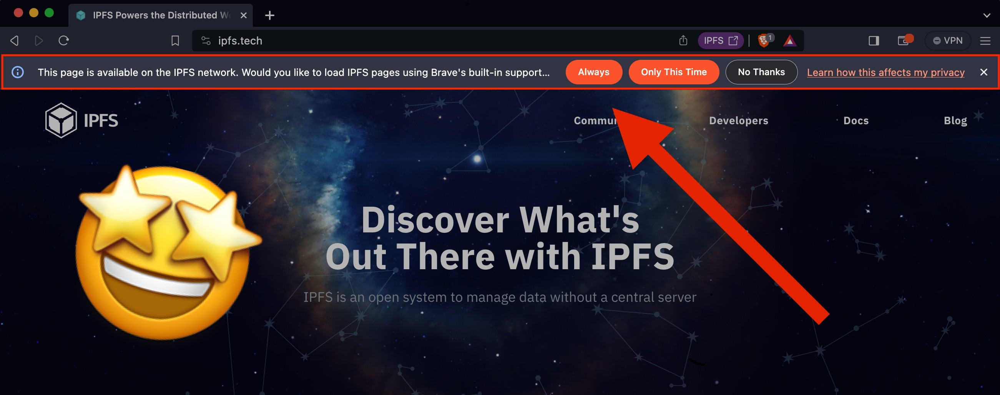
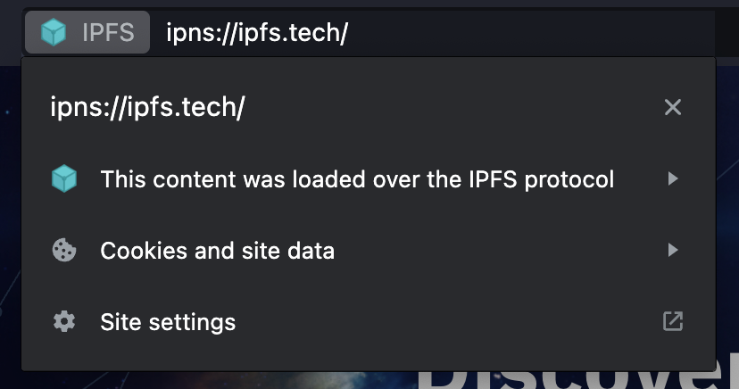

We’re excited to share a new IPFS-related feature that appears in the most recent version of [Brave’s web browser](https://brave.com/). A new IPFS Infobar will appear at the top of the browser when you visit an IPFS compatible resource such as a [CID on a public gateway](https://docs.ipfs.tech/how-to/address-ipfs-on-web/#http-gateways)  or a website with a [DNSLink](https://docs.ipfs.tech/concepts/dnslink/). 

By using the IPFS Infobar, you can choose whether you would like to switch to loading the IPFS version of the content. Selections can be made to always load via IPFS or only load it in a specific instance.

This new feature will increase visibility of IPFS content when it exists and contribute to greater awareness for the benefits that can be had from utilizing content addressing.

Brave’s IPFS Infobar is a small but mighty new feature that we are excited to see in the wild!

In addition to the Infobar, there are more tools currently being developed for [Brave](https://brave.com/) by others such as David Justice that are worth noting. We are prototyping a suite of tools for publishing to IPFS in Brave. Some of the prototypes include: Markdown/Wysiwyg webpage creator, Link In Bio/Link List site creator, and the ability to password protect webpages with many more ideas in the works.

[https://github.com/JusticeEngineering/markdown-publish](https://github.com/JusticeEngineering/markdown-publish)
 
[https://github.com/JusticeEngineering/link-list](https://github.com/JusticeEngineering/link-list)
