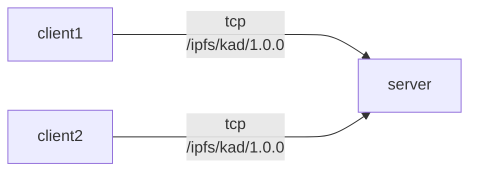
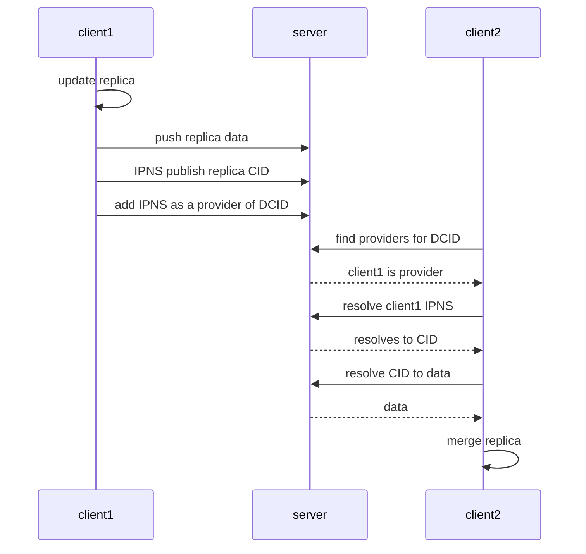

The InterPlanetary File System (IPFS) is a distributed, peer-to-peer file system designed to make the web faster, safer, and more resilient. Although IPFS excels at hosting static content, hosting dynamic content remains a challenge. This article presents a design for hosting dynamic content on IPFS using InterPlanetary Linked Data (IPLD), InterPlanetary Name Service (IPNS), and DHT Provider Records.

## Table of Contents
<!-- TOC start -->

- [Understanding Key Components](#understanding-key-components)
  * [IPLD](#ipld)
  * [IPNS](#ipns)
  * [PeerID](#peerid)
  * [Provider Records](#provider-records)
- [Defining the Problem](#defining-the-problem)
- [Achieving Dynamicity](#achieving-dynamicity)
  * [Read and Write Steps](#read-and-write-steps)
    + [Writing](#writing)
    + [Reading](#reading)
  * [Dynamic-Content IDs](#dynamic-content-ids)
  * [Manifest Document](#manifest-document)
- [Use-case: Edge-computed Applications](#use-case-edge-computed-applications)
  * [Edge Devices](#edge-devices)
  * [Pinning Servers](#pinning-servers)
  * [Replication](#replication)
- [Roadblocks and Workarounds](#roadblocks-and-workarounds)
  * [No 3rd Party Publishing to DHT](#no-3rd-party-publishing-to-dht)
  * [No Delegated Refreshing of IPNS OR Provider Records](#no-delegated-refreshing-of-ipns-or-provider-records)
- [Example](#example)
  * [Usage](#usage)
    + [Clone the Repo](#clone-the-repo)
    + [Install Packages](#install-packages)
    + [Run Examples](#run-examples)
  * [What's Happening?](#whats-happening)
  * [Sample Outputs](#sample-outputs)
- [Credits](#credits)
- [Get Involved](#get-involved)
- [FAQ](#faq)

<!-- TOC end -->


<br/>

## Understanding Key Components

### IPLD

[IPLD](https://ipld.io/) is a data model for linking and addressing data across distributed systems. In IPFS, IPLD stores immutable data, providing [content-addressed storage](https://en.wikipedia.org/wiki/Content-addressable_storage). Data stored in IPLD has a unique [Content Identifier](https://docs.ipfs.tech/concepts/content-addressing/) (CID) derived from its content, ensuring data integrity.

### IPNS

[IPNS](https://docs.ipfs.tech/concepts/ipns/) is a decentralized naming system that allows you to create a mutable reference to an immutable CID. With IPNS, you can create a persistent address that always points to the latest version of your content, even as it changes over time.

### PeerID

A [Libp2p PeerID](https://docs.libp2p.io/concepts/fundamentals/peers/#peer-id) is a unique identifier for each node in the network, derived from a [public key](https://en.wikipedia.org/wiki/Public-key_cryptography). PeerIDs help find, identify, and communicate with other nodes.

### Provider Records

[Provider Records](https://docs.ipfs.tech/concepts/dht/) are a fundamental part of IPFS's Distributed Hash Table (DHT). When requesting IPFS content, a node queries the DHT for Provider Records associated with the requested CID. These records contain the PeerID of peers with the content, enabling the user to establish a connection and retrieve the data.

---
> **It's important to note that IPNS names and PeerIDs use the same [key structures](https://specs.ipfs.tech/ipns/ipns-record/#ipns-keys).**
---

<br/>

## Defining the Problem

Databases on IPFS have been gaining more attention recently. In essence, these database protocols use IPLD to store replica data.
And they commonly use a real-time protocol like [Gossipsub](https://docs.libp2p.io/concepts/pubsub/overview/) with IPLD to sync database changes peer-to-peer.
Using this design to create [local-first](https://www.inkandswitch.com/local-first/) databases looks quite promising.
However, local-first databases are often highly [sharded](https://en.wikipedia.org/wiki/Partition_(database)) and run on end-user devices.

This presents the problem of peers being few and unreliable to sync with.
One solution is to add reliable database peers to the mix, either self-hosted or hosted by a service.
There are two disadvantages to this approach:

- Each project must build infra tooling
- Users need a live instance of each database protocol used

It would benefit all related protocols to have a general solution for asynchronous replication of dynamic content.<br/>
*Think pinning layer for dynamic content.*

This standardized layer would complement the app-specific protocols used for real-time replication.

<br/>

## Achieving Dynamicity

Let's look at a replication algorithm for one of the first databases on IPFS, [OrbitDB](https://github.com/orbitdb). The algorithm is roughly as follows:

  1. Join a shared pubsub channel for the database.
  2. On seeing a new pubsub peer in the shared channel, attempt to join a direct pubsub channel ([ipfs-pubsub-1on1](https://github.com/ipfs-shipyard/ipfs-pubsub-1on1)).
  3. On committing an update to the local replica, advertise replica root CIDs on each direct pubsub channel.
  4. On receiving a replica root CIDs advertisement on a direct pubsub, traverse the remote replica for changes to merge.

The design presented in this article works similarly but replaces pubsub with Provider Records and IPNS. Essentially, all parts of replication get encoded into ~persistent IPFS components.

- Provider Records to find collaborators
- IPNS to point to the latest version of a device's replica

---
> **Swapping pubsub for ~persistent components makes building on history without any collaborators online possible.**
---

The main contribution is the novel use of Provider Records.
Instead of tying a CID to PeerIDs of nodes hosting that content, the records tie a "Dynamic-Content ID" to IPNS names.
Each IPNS name resolves to the latest CID of a device's local replica.

*Collaborating on dynamic content is possible without knowing any previous collaborators or needing them to be online as long as their replica data is kept available via a pinner.*

If you are familiar with publishing Provider Records to the DHT, *you may have spotted a problem here*.
The source of the problem is a check DHT servers do when receiving an `ADD_PROVIDER` query, addressed in [Roadblocks and Workarounds](#roadblocks-and-workarounds).


---
> **The Merkle-DAGs built with IPLD provide a persistent and efficient layer for collaborators to sync.**
---

<br/>

### Read and Write Steps

Describes the process of reading/writing dynamic content to IPFS:

#### Writing

1. Make changes to the local replica
2. Push replica data to the IPLD pinner
3. Republish IPNS to point to new CID root
4. Add IPNS key as a provider of the Dynamic Content's ID

#### Reading

1. Query the DHT for Providers of the Dynamic Content's ID
2. Resolve providers' IPNS keys to CIDs
3. Resolve CIDs to IPLD data
4. Merge changes with the local replica

---
> **Titling this article 'Replication on IPFS' might have been more accurate, but 'Hosting Dynamic Content on IPFS' sounded waaay better.**
---

<br/>

### Dynamic-Content IDs

A Dynamic-Content ID (DCID) looks like a CID. Also, both DCIDs and CIDs reference and identify content on the DHT.

*Where the two IDs differ is in their creation.*

While CIDs come from the hash of some static content, DCIDs are a permutation of the CID of a manifest document.
This immutable manifest document "describes" the dynamic content.

As stated in the previous section, DCIDs identify unique dynamic content.
They point to IPNS names by using Provider Records on the DHT.

---
> **Disclaimer: Dynamic-Content IDs, or DCIDs, only exist for the purpose of this article. It is not an official spec or part of IPFS. (expect a name change because I also hate "DCIDs" 🤢🤮)**
---

<br/>

### Manifest Document

Manifest documents, a term from OrbitDB, describe some unique dynamic content.
Manifests are immutable and contain information like the protocol and parameter used.

This document format is not formally specified, but included below is a specification for this article:

**dag-cbor**
```js
// cbor type reference: https://www.rfc-editor.org/rfc/rfc8949.html#section-3.1
{
  protocol: type 3
  param: type 5
}
```

`protocol`: a text string field containing a protocol id

`param`: a key value map for exclusive use by the `protocol`

https://github.com/tabcat/dynamic-content/blob/e4df337d4f806ba530efa94b01e7bda2432ffa8d/src/dynamic-content.ts#L7-L30

Above is a code block from the example attached to this article.
It shows a manifest document "describing" the dynamic content using the `protocol` and `param` properties.
It also shows the DCID derived from the manifest's CID.

<br/>

## Use-case: Edge-computed Applications

This design is particularly useful when paired with local-first databases.
These databases are partitioned (a.k.a. sharded) to only the interested parties.
It's common for only a few collaborators to be a part of a database, and there may be long periods without any of them online.
This context makes it challenging to build upon the history of collaborators, a challenge this design can potentially solve.

### Edge Devices

- Handle application logic and merging of replicas from other collaborators.
- Consist of a network of potentially unreliable peers that may come online and go offline at various times.
- Ensure the application history is available by commanding pinning servers.

### Pinning Servers

- Reliable storage servers that keep dynamic content available on IPFS.
- Pin IPLD replicas, and refresh IPNS and Provider Records for clients.
- Execute no app-specific code

### Replication

The design presented in this article is a replication protocol.
However, it is not a real-time replication protocol.
Applications with real-time features should include an app-specific replication protocol for use with other online collaborators.
Combining two replication protocols with these properties results in preserved and real-time P2P applications.

---
> **Pinning servers, in this context, provide a general and reliable replication layer to fall back on when no other collaborators are online.**
---

<br/>

## Roadblocks and Workarounds

It should be clear now that using Provider Records this way was not intended.
This brings us to the roadblock...

### No 3rd Party Publishing to DHT

[DHT servers validate that the PeerIDs inside received Provider Records match the PeerID of the node adding them.](https://github.com/libp2p/specs/tree/master/kad-dht#rpc-messages)

This check makes adding Provider Records for multiple PeerIDs to the DHT difficult.
Not great if you want to participate in multiple pieces of dynamic content as each will require its own IPNS name.
A Libp2p node may only add its own PeerId as a provider. This PeerId is also known as the "self" key.

There are two workarounds for now:

1. Use the "self" key for IPNS, and have it point to a CID for a map(DCID -> root replica CID) for all relevant dynamic content.
2. Spin up *ephemeral* libp2p nodes to refresh each IPNS name as a provider every [22hours](https://github.com/libp2p/specs/tree/master/kad-dht#content-provider-advertisement-and-discovery).

### No Delegated Refreshing of IPNS OR Provider Records

Delegated publishing of IPNS and Provider Records is necessary to realize the edge-computed applications use case.
Unfortunately, there are no official plans to add this feature.

<br/>

## Example

---
> **USES HELIA 😲🤩 !!!! DHT IN 😵‍💫 JAVASCRIPT 😵‍💫 😵 !! DYNAMIC CONTENT ON IPFS!?🧐!?**
---

This example shows dynamic-content replication using IPLD, IPNS, and Provider Records.
There are 3 [helia](https://github.com/ipfs/helia) (IPFS) nodes running in a single script, named `client1`, `client2`, and `server`.
`client1` and `client2` dial `server` and use the `/ipfs/kad/1.0.0` protocol.
After dialing, clients can add IPNS and Provider records to the DHT server.
Clients also add IPLD data to `server` programmatically.



---
> **`client1`, `client2`, and `server ` are all in memory Helia nodes created by a single script.**

> **IPLD data is added to the server by clients by accessing `server.blockstore.put` from within the script (programmatically). As opposed to using an HTTP API like in any real use-case.**
---

### Usage

- Requires [npm and Node v18](https://docs.npmjs.com/downloading-and-installing-node-js-and-npm)

#### Clone the Repo

`git clone https://github.com/tabcat/dynamic-content.git`

#### Install Packages

`npm install`

#### Run Examples

There are two example scripts. One is interactive, meaning after the example runs, a REPL starts with global variables available to operate the replication manually.

The scripts are `npm run example` and `npm run interactive`.

**If something is broken please open an [issue](https://github.com/tabcat/dynamic-content/issues)!**

<br/>

### What's Happening?

The example consists of 3 [Helia](https://github.com/ipfs/helia) nodes, named `client1`, `client2`, and `server`.
The `server` represents a reliable machine used as a

1. IPLD pinning server
2. DHT server

---
> **IPNS and Provider records are both stored in the DHT.**
---

The clients are unreliable machines used to read and write dynamic content.
In the example, `client1` does all the writing, and `client2` does all the reading.



<br/>

This is a very high overview of what's going on.
Remember, this design uses only IPLD/IPNS/Provider Records.
It may be helpful to read [index.ts](./src/index.ts) (~200 LOC) for clarity.

### Sample Outputs

In case you are unable to run the example, below shows all the output that would occur:

<details>
  <summary>`npm run example`</summary>
  
  ```sh
$ npm run example

> dynamic-content@1.0.0 example
> npm run build && node dist/index.js


> dynamic-content@1.0.0 build
> tsc

server is pinning ipld and serving dht ipns and provider records
client1: online
client1: added new values to set { nerf this }
client1: set state: { nerf this }
client1: encoded to raw data
client1: pushed data to pinner
client1: published ipns:12D3KooWRzE1FNCRXuz1C8Z3G8Q5oBg3C5nhKANSsFq377P1mWVn with value cid:bafyreihypffwyzhujryetatiy5imqq3p4mokuz36xmgp7wfegnhnjhwrsq
client1: advertised ipns:12D3KooWRzE1FNCRXuz1C8Z3G8Q5oBg3C5nhKANSsFq377P1mWVn as set provider
client1: offline

--- no peers online, Zzzzz ---

client2: online
dht query returned empty response
client2: found ipns:12D3KooWRzE1FNCRXuz1C8Z3G8Q5oBg3C5nhKANSsFq377P1mWVn as set provider
client2: resolved ipns:12D3KooWRzE1FNCRXuz1C8Z3G8Q5oBg3C5nhKANSsFq377P1mWVn to bafyreihypffwyzhujryetatiy5imqq3p4mokuz36xmgp7wfegnhnjhwrsq
client2: resolved ipfs:bafyreihypffwyzhujryetatiy5imqq3p4mokuz36xmgp7wfegnhnjhwrsq to raw data
client2: decoded raw data
client2: added new values to set { nerf this }
client2: set state: { nerf this }
client2: offline
  ```
</details>

<details>
  <summary>`npm run interactive`</summary>
   <br/>

  The interactive example starts a REPL after the example has run. 

  ```sh
$ npm run interactive

> dynamic-content@1.0.0 interactive
> npm run build && node dist/interactive.js


> dynamic-content@1.0.0 build
> tsc

server is pinning ipld and serving dht ipns and provider records
client1: online
client1: added new values to set { nerf this }
client1: set state: { nerf this }
client1: encoded to raw data
client1: pushed data to pinner
client1: published ipns:12D3KooWQXCo6Wzw7NmJRLC2peAX7fU6gHSydEKNAJfyfXCEwHFL with value cid:bafyreihypffwyzhujryetatiy5imqq3p4mokuz36xmgp7wfegnhnjhwrsq
client1: advertised ipns:12D3KooWQXCo6Wzw7NmJRLC2peAX7fU6gHSydEKNAJfyfXCEwHFL as set provider
client1: offline

--- no peers online, Zzzzz ---

client2: online
dht query returned empty response
client2: found ipns:12D3KooWQXCo6Wzw7NmJRLC2peAX7fU6gHSydEKNAJfyfXCEwHFL as set provider
client2: resolved ipns:12D3KooWQXCo6Wzw7NmJRLC2peAX7fU6gHSydEKNAJfyfXCEwHFL to bafyreihypffwyzhujryetatiy5imqq3p4mokuz36xmgp7wfegnhnjhwrsq
client2: resolved ipfs:bafyreihypffwyzhujryetatiy5imqq3p4mokuz36xmgp7wfegnhnjhwrsq to raw data
client2: decoded raw data
client2: added new values to set { nerf this }
client2: set state: { nerf this }
client2: offline

--- interactive example ---

client1: online
client2: online

  Usage:

  globals

  help: this message

  client1: helia client node (sender)
  client2: helia client node (receiver)
  server: helia ipld/ipns pinner and dht server

  // compare the 2 clients sets
  set1: client1's set variable
  set2: client2's set variable

  await connect(<client>)       // connects client to server
  await disconnect(<client>)    // disconnects client from server

  await update(...<string[]>)   // create and publish changes from client1 - requires client1 to be connected
  await sync()                  // syncs changes to client2 - requires client2 to be connected

>
  ```
</details>

---
> **Note: in practice, the DHT queries related to the Dynamic Content's ID only need to be run initially. Afterward, a protocol meant for real-time replication with online collaborators can be used.**
---

<br/>

## Credits

Big thanks to [@autonome](https://github.com/autonome), [@SgtPooki](https://github.com/sgtpooki), and [@lidel](https://github.com/lidel) for help writing this article!

Also thanks to [@willscott](https://github.com/willscott) for answering all my DHT questions in [#libp2p-implementers](https://app.element.io/#/room/#libp2p-implementers:ipfs.io)!

<br/>

## Get Involved

Sound interesting? Get involved! Come [chat](https://matrix.to/#/#hldb:matrix.org)

Have a question? Create an [issue](https://github.com/tabcat/dynamic-content/issues)

[I](https://github.com/tabcat)'m implementing this in [tabcat/zzzync](https://github.com/tabcat/zzzync)

<br/>

## FAQ

**Q**: Why not just share an IPNS name between devices to update?

**A**: IPNS names are not built to handle concurrent writes and should not be extended to do so. They are signed, versioned documents that one device should be able to update. As shown here, they are essential for creating a system that can handle concurrent writes.

<br/>

**Q**: Isn't this going to be slow?

**A**: This design complements real-time replication by providing a general and reliable layer to fall back to. It adds two steps on top of resolving a CID: 1) the DHT provider query and 2) the IPNS name resolutions.
Developers must reason how to design replicas for efficient storage and replication over IPLD.

<br/>

**Q**: Provider Records do not support this use case. Could this affect DHT measurements?

**A**: If this use case became prevalent, it could affect DHT measurements. Using Provider Records this way would make it look like the content providers are offline because the PeerIDs are used only for IPNS.

<br/>

**Q**: Could IPNS and Provider Records be swapped out for alternatives and achieve the same goal?

**A**: Absolutely. The goal is to provide a general and reliable replication layer. Additionally, the more widespread the building blocks used, the more existing infrastructure can be leveraged.
