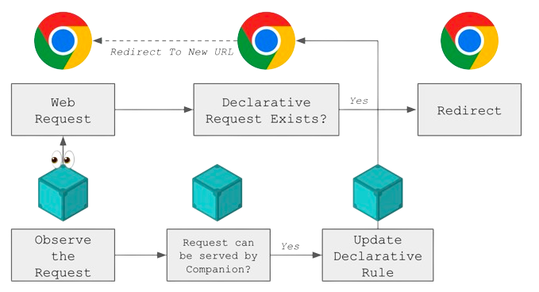

[IPFS companion](https://docs.ipfs.tech/install/ipfs-companion/#install) is a browser extension, one of the key tools that enhances the IPFS experience in the browser. It is available for [Firefox](https://addons.mozilla.org/en-US/firefox/addon/ipfs-companion/) and [Chrome/Brave/Opera/Edge](https://chrome.google.com/webstore/detail/ipfs-companion/nibjojkomfdiaoajekhjakgkdhaomnch) (and all other Chromium-based browsers) and is used by thousands of people every day.

In September, IPFS-Companion built on MV3 (Manifest V3) was shipped on the main channel, which brings exciting improvements and changes the way you interact with this powerful tool. This blog post will give you a quick overview of the journey, changes, and what to expect.

## What is MV3?

MV3, or Manifest V3, is the latest iteration of the manifest file format used by browser extensions. MV3 introduces several key changes compared to the previous MV2, such as the adoption of a service worker model for background scripts, increased permissions granularity, a few new APIs like declarativeNetRequest, and deprecation in the behavior of a few APIs like webRequest and their blocking nature on intercepted requests.

Both [Chrome](https://developer.chrome.com/docs/extensions/mv3/intro/mv3-overview/) and [Firefox](https://extensionworkshop.com/documentation/develop/manifest-v3-migration-guide/) have published documentation on the changes and how to migrate your extension to MV3, but both of them are pretty recent and are still evolving. They also don't seem to agree on how the background scripts should behave or the `host_permissions` should be handled, which makes it even more challenging to build a cross-browser extension.

Chrome's changes have been much more invasive, as they remove support for blocking `webRequest` API, push for the use of background service workers, and the adoption of the `declarativeNetRequest` API. Firefox, on the other hand, has been more conservative and has been trying to keep the extension ecosystem as close to MV2 as possible, with the exception of the `host_permissions` change.

While we are making sure that the extension continues to work on Firefox without regressions, Chromium-based browsers make up ~90% of the IPFS-Companion user base, which makes Chrome's implementation of MV3 the lowest common denominator that informs our design decisions and feature set.

## What's the fuss around `declarativeNetRequest` API?

When MV3 changes got announced, there was [uproar in the community](https://arstechnica.com/gadgets/2022/09/chromes-new-ad-blocker-limiting-extension-platform-will-launch-in-2023/) that the `webRequest` API was going to be deprecated and replaced by `declarativeNetRequest`. The main reason for this was that the `declarativeNetRequest` API is not as powerful as the `webRequest` API, and it doesn't allow extensions to block requests. Instead, it allows the extension to add and update a limited number of rules per-extension. This was promoted as a way to improve performance and privacy, as the browser would be able to block requests without having to load the extension's code. However, this also meant that the extension would not be able to intercept the requests, and extensions would have to rely on the browser to do that, and for a limited number of domains.

In practice, there are no privacy or security benefits of `declarativeNetRequest`, and the old behaviour (required by IPFS Companion) can be reimplemented with extra steps. Even though the MV3 extension cannot intercept and block a request in-flight, it can still observe all HTTP requests without blocking them and work around rule count limit by adding or updating dynamic rules on the fly. When a matching request is found by read-only observer, extension can programmatically reload document to force fresh page load against updated dynamic rules. In other words, the MV3 version of Companion extension can emulate the behaviour from MV2:

This type of additional complexity is necessary in MV3 world if a genuine extension like IPFS-Companion wants to intercept requests to a given IPFS resource and redirect those to be loaded via the local gateway. This is a key feature of the extension, as it allows users to access the content via the local gateway instead of delegating trust to the public HTTP gateway, which is a centralized service.

## The Plan

The discussions around this topic started soon after the announcement of MV3. There are many scenarios and information in [Issue #666](https://github.com/ipfs/ipfs-companion/issues/666). The first step was to prototype a rudimentary version of the extension using the MV3 APIs and see if the MV3 version could achieve comparable functionality. That work was done in [PR #1078](https://github.com/ipfs/ipfs-companion/pull/1078) by [@MeanDaveJustice](https://github.com/meandavejustice), which helped a lot in understanding the challenges.

Based on both of these a detailed migration plan was laid out in [Issue #1152](https://github.com/ipfs/ipfs-companion/issues/1152), a few important points from the plan were:

- Implementing request manipulation logic in the browser to support both Chromium and Firefox. The extension will need to identify capabilities of the browser runtime and use the appropriate logic.
- Patching packages that now need to account to the new `ServiceWorker` scope. Packages like [`debug`](https://www.npmjs.com/package/debug) and [`countly-sdk-web`](https://www.npmjs.com/package/countly-sdk-web) rely on `window`, `localStorage`, `XMLHttpRequest`, etc which are not available in the service worker scope.
- Implementing a collector branch to collect all changes, because the transition in this case could not be done incrementally and instead had to be done in one go. This meant that the collector branch would have to be maintained for a while until the migration was complete. In the meanwhile the `main` branch was still being used to ship security and bug fixes.
- Migrating all of the existing battery of tests that used to test various scenarios collected over the years in the MV2 world, over to the MV3 world. This was a huge task and took a lot of time and effort. The tests had to be refactored as such that it would work for browsers that supported request blocking (Firefox) and those that didn't (Chromium).
- Implement improved metrics collection to understand IPFS users, by understanding the number of IPFS resources resolved by Companion running in the browser.

## The migration

The migration was done in multiple steps:

- The first step was to implement the [standard checklist](https://github.com/ipfs/ipfs-companion/pull/1170) which outlined the known breaking changes in MV3 and how to fix those.
- A parallel step was to implement a [collector branch](https://github.com/ipfs/ipfs-companion/pull/1182) and [build-pipeline](https://github.com/ipfs/ipfs-companion/pull/1183) to go with it.
- The next step was to implement the replacement APIs in the `ServiceWorker` context, e.g. [`XMLHttpRequest` migration](https://github.com/ipfs/ipfs-companion/pull/1179)
- This was soon followed by the [first iteration](https://github.com/ipfs/ipfs-companion/pull/1181) of blocking by observing logic.
- Which allowed for the publication of the [first RC](https://github.com/ipfs/ipfs-companion/pull/1192) and a corresponding announcement on the [discuss forum](https://discuss.ipfs.tech/t/announcing-ipfs-companion-mv3-rc-beta/16442).
- This was followed by a series of bug fixes which is a list item in the original [migration plan](https://github.com/ipfs/ipfs-companion/issues/1152).
- It was also decided that it would be the right time to remove the experimental embedded `js-ipfs` backend, as it was not useful due to the lack of gateway functionality in extension context, and `js-ipfs` itself being superseded by [`helia`](https://helia.io). This was done in [PR #1225](https://github.com/ipfs/ipfs-companion/pull/1225).
- Apart from the plethora of UX regression fixes around context menus (because MV3 changed how context menus were handled), timing issues between observing a request, and actually adding a rule to block those, the most important PR was the test migration which affirmed that the solution handled all the scenarios covered in the MV2 world. This was done in [PR #1236](https://github.com/ipfs/ipfs-companion/pull/1236)
- One of the last fixes was to add an additional permission check for requesting [`host_permissions`](https://github.com/ipfs/ipfs-companion/pull/1250) on Firefox which allowed the actual blocking of requests on Firefox.

## The learnings

It took more than 6 months to plan, implement, and test the migration. Over 40 PRs were merged and more than 18k lines of code were touched. The migration was a huge effort, and it was only possible because of the amazing community that helped in testing and reporting issues. The migration also highlighted a few key learnings:

- The world of web browsers is constantly evolving, and it is important to keep up with the changes. This is especially true for extensions, as they are the first to be impacted by these changes. It is important to keep an eye on the changes and plan ahead. The browser vendors also don't seem to agree on how to handle the changes, which makes it even more challenging to build a cross-browser extension.
- The MV3 changes will be a huge effort for any extension that relies on observing, intercepting, or blocking a user request... was this needed? Probably not, as the `declarativeNetRequest` API is not as different from the `webRequest` API as it was made out to be. A motivated entity can still implement comparable functionality but that now involves more steps. However, it is important to note that the `ServiceWorker` based background scripts are potentially a huge improvement especially on low-end devices as it allows extension to `sleep` when not in use. This may not be true in every case (e.g. IPFS-companion is always observing requests, so the service-worker may never go to sleep) but it is a step in the right direction as it allows the browser to manage the resources better and would probably someday allow extensions to be used on mobile devices.
- A better rollout strategy and feature-flagging capabilities would have helped testing changes in the wild, but this is not possible with the current extension ecosystem. The only way to test changes is to publish them on the main channel and hope that the users report issues. This is not ideal, as it can lead to a bad user experience and a lot of frustration. Transition from MV2 to MV3 was even more challenging as Chrome Webstore would not allow downgrade from MV3 to MV2 in case a faulty release went out. It had to be perfect the first time, otherwise the users would be stuck with a broken extension until the next release.

## Current status

MV3 changes went live towards the end of September 2023 when the collector-branch was merged to main and released on both the [Chrome Web Store](https://chrome.google.com/webstore/detail/ipfs-companion/nibjojkomfdiaoajekhjakgkdhaomnch) and [Firefox Add-ons](https://addons.mozilla.org/en-US/firefox/addon/ipfs-companion/). We've not seen any major issues so far. The extension is working as expected and the user base is consistent. There were some minor regressions and bugs reported, but nothing that's a show-stopper. Those are being fixed as they are reported.

## What's next?

The next step will be to implement the [new Brave APIs](https://github.com/ipfs/ipfs-companion/issues/1281) to allow for finer control of the IPFS node provided in the Brave Browser. This will provide a much more polished experience for the users of Brave Browser that also want to enable the IPFS Companion extension for additional UI and more file-grained control over redirects. There also are plans to experiment with a [Helia based built-in gateway](https://github.com/ipfs/ipfs-companion/issues/1284) on which some progress has already been made as proof-of-concepts in [helia-service-worker-gateway](https://github.com/ipfs-shipyard/helia-service-worker-gateway) and [helia-http-gateway](https://github.com/ipfs/helia-http-gateway). The learnings from these projects will be used to work with browser vendors to close API gaps and eventually implement a gateway that can be used by IPFS Companion to host an IPFS node in the browser extension itself, which will allow users to access IPFS resources when not running a local node.

## Conclusion

It's an exciting new world! Try out [IPFS-companion](https://github.com/ipfs/ipfs-companion) and share your thoughts on [discuss](https://discuss.ipfs.tech/tag/ipfs-companion) or [github](https://github.com/ipfs/ipfs-companion/issues).
