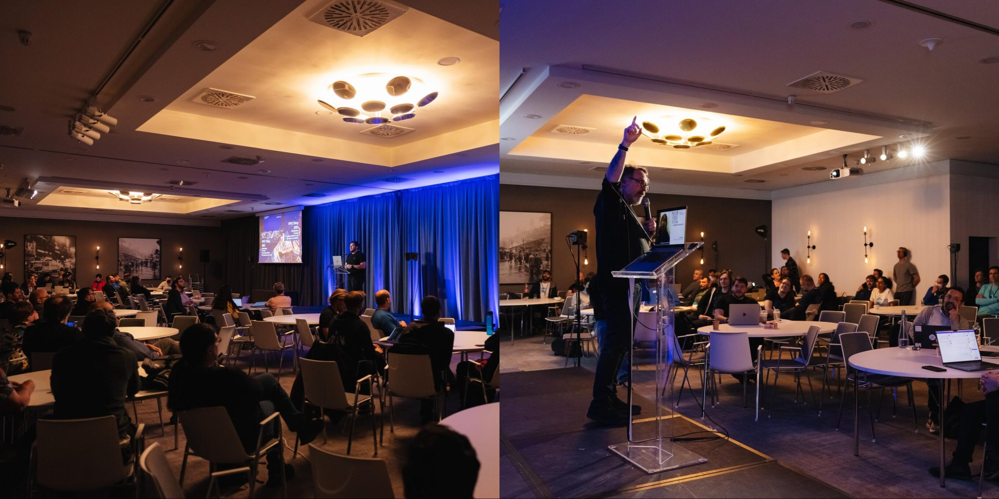

The IPFS implementers community recently came together in Brussels, Belgium for the second year of IPFS þing, an annual gathering dedicated to advancing IPFS implementation. With 12 tracks and over 75 talks, demos, and sessions, the 5-day summit that occurred in April 2023 was a showcase of recent advances across IPFS, a forum for sharing needs from the protocol, and an opportunity to chart new directions for the future of IPFS. 

 

Over 130 participants joined for a collection of talks, workshops, discussion circles, hacking time, and many many many hallway conversations. Here are a few memorable highlights:

* **Operators and Deployments:** In this track, the people putting IPFS into production gathered to share their architectures, best practices, and war stories. We laughed. We cried. We looked at a LOT of graphs. Also, this track had some crazy performance numbers – we learned that IPFS can be _really_ fast. ([YouTube playlist](https://www.youtube.com/playlist?list=PLuhRWgmPaHtTYOY5l8nehP_Vt6Ek-svrp))
* **Data Transfer:** Since the last IPFS þing, a few different teams that needed faster transfer speeds came together to form the [Move The Bytes Working Group](https://mtngs.io/ipfs/move-the-bytes-wg/). This track included an update on how things are going with the initiative and showed how IPFS can be 10x faster at getting your stuff than Web2! ([YouTube playlist](https://www.youtube.com/playlist?list=PLuhRWgmPaHtS6WBDGK8oxcBHA6ILKatVk))
* **Community and Governance:** IPFS is a public good. It's important that it stays that way, that it resists capture, and that it has great governance by (and for) its community. This track charted a course to broad community participation in everything from core protocol standards to planning the next IPFS Camp (no spoilers – you’ll have to watch the talks to know when and where it’s going to be!). ([YouTube playlist](https://www.youtube.com/playlist?list=PLuhRWgmPaHtTIFbOVO5YfXkoFg6wIGbBN))
* **IPFS Gateways:** Gateways (servers that translate between HTTP and IPFS) are the biggest onramp to the IPFS network,but they’re also the biggest single point of centralization. Huge changes are happening in this area, so if you’re a gateway user or if your service links to it, then be sure to watch these videos. ([YouTube playlist](https://www.youtube.com/playlist?list=PLuhRWgmPaHtTapMgLW7rRh92Tk8u7wip5))
* **Integrating IPFS:** IPFS is used in environments ranging from tiny IoT sensor platforms to mobile devices to satellites in space. In this track, participants learned how IPFS is being implemented in space, on mobile devices running  iOS or Android, and in higher level application constructs like “accounts”! We even learned what an “ipfs run” command would look like for distributed functions. ([YouTube playlist](https://www.youtube.com/playlist?list=PLuhRWgmPaHtTI0MS6ZjSJjBxZp7rcjSS_))
* **Content Routing:** The first step to exchange “content” over the IPFS network is to either 1) find the given content by using a Content ID (CID), or 2) publish the given content by making its CID known. The Content Routing track covered a holistic view of the content routing evolution since the inception of IPFS and showcased the latest advancements in this simple yet paramount operation in the IPFS ecosystem. This track provided an overview of the InterPlanetary Network Indexer (IPNI), and expanded on how it enables mass publication and lookup of content across hundreds of billions of CIDs. The latest developments in reader privacy preservation, a mechanism that enables private lookups of content both on the IPFS DHT and IPNI, was also presented. ([YouTube playlist](https://www.youtube.com/playlist?list=PLuhRWgmPaHtRBWV3SvInC5ATS8aKV3lsW))

IPFS þing isn’t just about getting things done though… it’s also about doing things together. Because we were in the beating bureaucratic heart of the European Union, we had to ~~flaunt the rules~~ pay respect to the culture and history of the region by visiting the [Atomium](https://atomium.be/home/Index) for dinner on one night and the [Comics Art Museum](https://www.comicscenter.net/en/home) on another. We also held a game night featuring IPFS trivia that you will never be able to guess the answers to, but you may get a chance soon by following IPFS on [Twitter (@ipfs)](https://twitter.com/ipfs) or [Bluesky (@ipfs.tech)](https://staging.bsky.app/profile/ipfs.tech)

The closing session of IPFS þing was kicked off by a rousing call to action from [Danny O’Brien](https://twitter.com/mala) highlighting the importance of daily use of IPFS software within the community. This was followed by a group retrospective on the event itself run by IPFS inventor Juan Benet, collecting feedback in real time from all attendees as input into the next one.

The event would not have been possible without the dedication of our awesome track leaders, the 75+ speakers and sessions, the 5 IPFS þing Scholars who brought their unique perspectives and experiences to the event, and of course, everyone who traveled from over 30 countries to participate. Thank you to our incredible community for making IPFS þing 2023 an amazing experience, and see you next time!

Check out the full list of talks on the [IPFS YouTube channel](https://www.youtube.com/@IPFSbot/playlists). You can also head directly to each track’s video playlist:

* [Opening Keynotes](https://www.youtube.com/watch?v=G2hlQqvjE-Y&list=PLuhRWgmPaHtRnO5G2EF0RxYebcQzLDf5F)
* [Measuring IPFS](https://www.youtube.com/watch?v=O8Nk1FN04Q8&list=PLuhRWgmPaHtQkkbiq-PbIkt9_S2NjJz6x)
* [IPFS Deployments & Operators](https://www.youtube.com/watch?v=bILa9sPpBMs&list=PLuhRWgmPaHtTYOY5l8nehP_Vt6Ek-svrp)
* [Data Transfer](https://www.youtube.com/watch?v=13_zr--akhs&list=PLuhRWgmPaHtS6WBDGK8oxcBHA6ILKatVk)
* [IPFS on the Web](https://www.youtube.com/watch?v=dn8PssXkRbY&list=PLuhRWgmPaHtQ-TO65P62tqfUM85HCIqSj)
* [Interplanetary Databases](https://www.youtube.com/watch?v=tjSuNmCTnyU&list=PLuhRWgmPaHtTO8hr2CYiJPTSe7wybW_op)
* [Content Routing](https://www.youtube.com/watch?v=oe7fjOl-q0s&list=PLuhRWgmPaHtRBWV3SvInC5ATS8aKV3lsW)
* [HTTP Gateways](https://www.youtube.com/watch?v=p89i9_AskIw&list=PLuhRWgmPaHtTapMgLW7rRh92Tk8u7wip5)
* [Decentralized Compute & AI](https://www.youtube.com/watch?v=LK9QjOJIPkQ&list=PLuhRWgmPaHtQ_lKtbTR-vIW1LYuTjcaPw)
* [Integrating IPFS](https://www.youtube.com/watch?v=drvFcbykHYY&list=PLuhRWgmPaHtTI0MS6ZjSJjBxZp7rcjSS_)
* [Community & Governance](https://www.youtube.com/watch?v=U2qvvQxIdws&list=PLuhRWgmPaHtTIFbOVO5YfXkoFg6wIGbBN)

Subscribe to the [IPFS Community Calendar](https://lu.ma/ipfs) to be the first to know about both online and in-person events, including pre-registration for our community-wide [IPFS Camp](https://lu.ma/ipfscamp23-prereg) in autumn 2023!

See you there! 🚀
