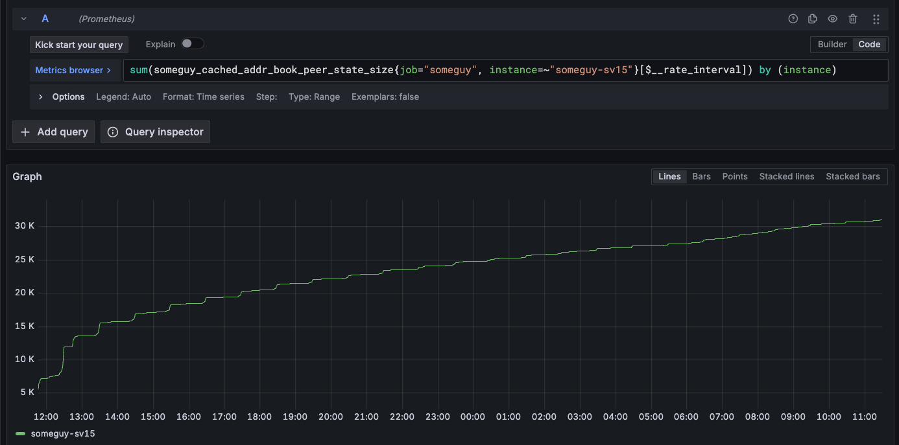

## TL;DR

Last year we shipped a major improvement to [Someguy](https://github.com/ipfs/someguy/pull/90), the HTTP Delegated Routing API for the Amino DHT and IPNI. The update introduced a cached address book and active peer probing for DHT peers. This change considerably increases the ratio of providers with addresses returned, which in turn accelerates peer-to-peer content retrieval in browsers and mobile applications. It's included in the [v0.7.0 release](https://github.com/ipfs/someguy/releases/tag/v0.7.0) of Someguy. Follow along for the full story.

## What is Someguy and why it matters?

[Someguy](https://github.com/ipfs/someguy) is a [Delegated Routing HTTP API](https://specs.ipfs.tech/routing/http-routing-v1/) for proxying IPFS routing requests to the Amino DHT, IPNI or any other routing system that implements the same API.

Its main purpose is to help IPFS clients find provider peers for CIDs and their network addresses, and expose that as an HTTP API. This is crucial for browsers and mobile applications that need to fetch IPFS content without running a full DHT client, which is often impractical on resource-constrained devices, like mobile phones and web browsers.

A typical Amino DHT client is stateful. It typically opens hundreds of connections, maintains a constantly updated routing table, and opens multiple network operations to find provider and peer records. The problem is that browsers and mobiles are limited in their networking capabilities — both in terms of the transports they can use and the number of connections they can maintain. They also have limited battery and bandwidth, which makes it impractical to run a full DHT client.

Delegated routing allows these devices to query the DHT for content providers in a single HTTP request, rather than requiring them to maintain complex DHT connections themselves.

To make decentralised retrieval possible for content provided to the DHT, Someguy serves as a helper, allowing these devices to query the DHT in a single request and get back a list of peers that have the content they want. This is done over HTTP, which is universally supported by browsers and mobile apps.

The IPFS Foundation provides a public delegated routing endpoint backed by Someguy with the URL `https://delegated-ipfs.dev/routing/v1` that is used by [Helia](https://github.com/ipfs/helia/blob/a0cac72e5b440bf7ea7356571b0f244e05c896e0/packages/http/src/utils/libp2p-defaults.ts#L31) by default to accelerate peer-to-peer content retrieval in browsers and mobile applications.

## The role of Someguy in IPFS content retrieval

When Helia or [`@helia/verified-fetch`](https://www.npmjs.com/package/@helia/verified-fetch) fetches content from the IPFS network, it goes through the following process:

1. Helia requests providers for a CID from Someguy using `Accept: application/x-ndjson` header for streaming responses: `GET https://delegated-ipfs.dev/routing/v1/providers/bafybeigdyrzt5sfp7udm7hu76uh7y26nf3efuylqabf3oclgtqy55fbzdi`
2. Someguy traverses the Amino DHT and responds with the providers that have the content, _typically_ along with their network addresses.
   - Example response:

```json
{
  "Providers": [
    {
      "Addrs": [
        "/ip4/12.144.75.172/tcp/4001",
        "/ip4/12.144.75.172/udp/4001/quic-v1",
        "/dns4/12-144-75-172.k51qzi5uqu5digdd4g1rmh3ircn34nxsehlp9ep60q96fqubc1t2604u88gin4.libp2p.direct/tcp/4001/tls/ws",
        "/ip4/12.144.75.172/udp/4001/webrtc-direct/certhash/uEiCcNkDjuquRDqyq3hvbp80GeS3joyomKoMjddVSLKdYUw",
        "/ip4/12.144.75.172/udp/4001/quic-v1/webtransport/certhash/uEiAUslaNVe83tW3hkVALwQUiKieQjzs77YXb4mLpo2yfJA/certhash/uEiAr6d8yeHt21X9jvRoHGwdtuLm_hDFHra0atSSCK-79HQ"
      ],
      "ID": "12D3KooWFxAMbz588VcN4Ae69nMiGvVscWEyEoA6A3fcJxhSzBFM",
      "Schema": "peer"
    }
  ]
}
```

3. Browser/mobile app connects directly to those peers as soon as each provider record arrives in the stream, enabling parallel connection attempts and faster content retrieval

**The performance equation is straightforward**: the faster Someguy can respond with working peer addresses, the quicker browsers and mobile apps can start fetching content peer-to-peer. Every millisecond saved in routing queries directly translates to faster content delivery.

## The problem: provider records without peer addresses

Before [v0.7](https://github.com/ipfs/someguy/releases/tag/v0.7.0), Someguy would often respond with provider records that included peer IDs but **not** their network addresses. This meant that clients had to make an additional requests to `/routing/v1/peers/{peerid}` to get the actual addresses of each peer.

For example, unlike the response above, Someguy would return a response like this:

```json
{
  "Providers": [
    {
      "Addrs": [],
      "ID": "12D3KooWFxAMbz588VcN4Ae69nMiGvVscWEyEoA6A3fcJxhSzBFM",
      "Schema": "peer"
    }
  ]
}
```

### But why are providers returned without peer addresses?

The widely-used [go-libp2p](https://github.com/libp2p/go-libp2p) and [go-libp2p-kad-dht](https://github.com/libp2p/go-libp2p-kad-dht/) libraries have a couple of important constants that control how long provider and peer addresses are cached in memory:

- `DefaultProvideValidity = 48 * time.Hour`: TTL for provider records mapping between a multihash (from the CID) and peer IDs.
- `DefaultProviderAddrTTL = 24 * time.Hour`: TTL for the **addresses** of those providers. These addresses are returned in DHT RPC requests alongside the provider record. After the addresses expires, clients require an extra lookup, to find the multiaddress associated with the returned peer ID.
- `RecentlyConnectedAddrTTL = time.Minute * 15`: Time during which a peer's address is kept in memory after a peer disconnects. Applies to any libp2p peer that has been recently connected to.

In other words, DHT servers can return provider records without peer addresses. This happens in the time window 24 hours after the provider record is published until it expires. This was designed to ensure that provider records are not returned with stale addresses. Since reproviding typically happens every 24 hours, DHT servers should always have fresh addresses for providers, but reality is messier.

## The solution: caching peer addresses

[PR #90](https://github.com/ipfs/someguy/pull/90) introduces several mechanisms that ensures Someguy always returns provider records with fresh peer addresses or doesn't return the provider record at all, thereby saving clients additional peer routing requests for unroutable peers.

This is achieved through a combination of: a cached address book, active peer probing, and a cached router which augments results with addresses and filters out undialable peers.

As it turns out, caching peer addresses is pretty cheap, especially if you consider that the work to discover them will be done anyway in subsequent requests. So we end up reducing the total request rates at the cost of increasing memory consumption slightly.

### Cached address book

The [new cached address book](https://github.com/ipfs/someguy/blob/6cb37a4da3ea3379a89a184335c51370b8abb48b/cached_addr_book.go) wraps the go-libp2p [memoryAddrBook](https://github.com/libp2p/go-libp2p/blob/master/p2p/host/peerstore/pstoremem/addr_book.go) and has the following properties:

- **48-hour cache**: Stores peer addresses for 48 hours, matching the DHT provider record expiration.
- **1M peer capacity**: This sets an upper limit on memory usage, allowing Someguy to handle a large number of peers without excessive memory consumption.
- **Memory-efficient**: Uses LRU eviction to keep the most relevant peers readily available
- **Event driven cache maintenance**: Caches peers by subscribing to the libp2p event bus and caches after successful libp2p identify events, rather than actively polling the DHT for peer addresses, thereby only caching peers based on actual delegated routing requests.

### Active peer probing in the background

Rather than serving stale addresses, Someguy now tests peer connectivity in the background:

- **Background verification**: Every 15 minutes, tests whether cached peer addresses still work
- **Exponential backoff**: Stops wasting time on persistently offline peers (1h → 2h → 4h → 48h delays)
- **Concurrent testing**: Tests up to 20 peer connections simultaneously
- **Selective probing**: Only tests peers that haven't been verified recently

### Cached router: better responses for HTTP clients

The `cachedRouter` (`server_cached_router.go`) uses the cached address book to augment the routing results for both peer and provider requests with a non-blocking iterator:

1. **Cache-first responses**: Returns verified peer addresses immediately when available
2. **Background resolution**: If no cached addresses exist, looks up fresh ones without blocking the response
3. **Streaming results**: Sends working peer addresses as soon as they're found
4. **Fallback handling**: Omits peers that can't be reached rather than sending bad addresses

All these improvements are enabled by default in Someguy v0.7.0 and later (see the [`SOMEGUY_CACHED_ADDR_BOOK`](https://github.com/ipfs/someguy/blob/main/docs/environment-variables.md#someguy_cached_addr_book) env variable for how to disable it).

## Measuring impact

To measure the impact of these changes, we deployed two instances of someguy, one with the cached address book and active probing enabled, and the other with it disabled.

For the instance with the cached address book enabled, we realised that it took some time for the cached address book to warm up, as peers are only cached [following mututal authentication and running the identify protocol](https://github.com/ipfs/someguy/blob/316dbc27f3cfc4df1276a7afcff33f5b4f05688d/cached_addr_book.go#L176-L195) that would be initiated as a downstream effect of incoming content and peer routing requests, unless running with the accelerated DHT client, which performs a DHT crawl on startup.

To determine when the cache was sufficiently warm, we observed the cached address book size [metric](https://github.com/ipfs/someguy/blob/316dbc27f3cfc4df1276a7afcff33f5b4f05688d/cached_addr_book.go#L80-L85) and waited until it stabilised, which takes around 12 hours, at which point the cache had about 30k peers. This metric continues growing gradually —at a much slower rate— eventually stagnating at ~60k peers, which correlates with the number of DHT servers [measured by ProbeLab](https://probelab.io/ipfs/kpi/#client-vs-server-node-estimate) (measured in Q3 2025).



We then piped the last 500k CID that were requested from the public ipfs.io gateway through each instance's `/routing/v1/providers/[CID]` endpoint at a rate of 100 req/second concurrently, and examined the _cache hit rate_, which is the most important metric to measure the impact of this work.

We also looked at HTTP request latency, and HTTP success rates to get a fuller picture of the impact of this change, and to see if there were any unexpected side effects.

Note that the list of 500k CIDs was not deduplicated, this was to reflect real-world usage patterns, where popular CIDs are requested more frequently.

### Peer Address Cache effectiveness

|                       | Lookups   | Percentage |
| --------------------- | --------- | ---------- |
| **Address Cache Used**   | 1,287,619 | 34.4%      |
| **Address Cache Unused** | 2,455,120 | 65.6%      |
| **Total**             | 3,742,739 | 100.0%     |

We measured two key metrics to assess the cache impact:

**(1) How often is the cache needed?**
In ~66% of requests, the DHT returned provider records with addresses already included. The remaining ~34% returned providers without addresses, requiring either cache lookup or additional peer routing.

**(2) When needed, how effective is the cache?**
For the 34.4% of requests that needed address resolution:
- Cache hit: **~83%** (addresses found in cache)
- Cache miss: ~17% (required fresh peer lookup)

**Bottom line:** The cache eliminates ~83% of scenarios where clients would otherwise need to make additional peer routing requests 🎉

### HTTP request latency and success rate

Here we examine the P95 (95th percentile) latency for HTTP requests to `/routing/v1/providers/[CID]` grouped by response code (200 vs 404) and the success rates measured by the ratio of 200 to 404 responses.

It's worth noting that we didn't expect significant reduction in latency or error rates as a result of the cache, because the cached address book is only used to augment results from the DHT, and doesn't change the underlying DHT query process.

| Scenario                     | 200s P95 | 404s P95 | Success Rate | Latency Improvement |
  | ---------------------------- | -------- | -------- | ------------ | ------------------- |
  | **Cache Disabled**           | 1.91s    | 7.35s    | 52.0%        | baseline            |
  | **Cache Enabled and Warmed** | 1.35s    | 7.46s    | 57.2%        | -560ms (29% faster) |

### Key insights

When the cache is enabled, the P95 latency for 200 responses drops to 1.346s! Moreover, success rates improve to 57.2% from 52.0%. It's not entirely clear why this is the case — the Amino DHT is permissionless and undergoes natural churn, and it could be that during the time we ran the experiments, some providers went offline.

Moreover, every provider lookup results in an HTTP request to the IPNI independent of the DHT, and can cause additional latency, skewing the aggregate results.

Another hypothesis is that the active probing in the background accelerates DHT lookups, especially for duplicate requests, thereby reducing the latency of DHT lookup. This is an area for further investigation

Either way, these results indicate that the cached address book and active probing have no negative impact on latency or success rates, and may even improve them.

## Configuration

The cached address book and active probing can be configured through the following environment variables:

- [SOMEGUY_CACHED_ADDR_BOOK](https://github.com/ipfs/someguy/blob/main/docs/environment-variables.md#someguy_cached_addr_book)
- [SOMEGUY_CACHED_ADDR_BOOK_ACTIVE_PROBING](https://github.com/ipfs/someguy/blob/main/docs/environment-variables.md#someguy_cached_addr_book_active_probing)
- [SOMEGUY_CACHED_ADDR_BOOK_RECENT_TTL](https://github.com/ipfs/someguy/blob/main/docs/environment-variables.md#someguy_cached_addr_book_recent_ttl)

See the [docs](https://github.com/ipfs/someguy/blob/main/docs/environment-variables.md) for more details.

## Metrics

When the cached address book and active are enabled, Prometheus metrics to monitor the cache and active probing, which can be found in the [metrics docs](https://github.com/ipfs/someguy/blob/main/docs/metrics.md#someguy-caches)

## Additional optimization: HTTP-level caching

Beyond the peer address caching discussed above, Someguy also implements HTTP-level caching through `Cache-Control` headers. This provides a complementary layer of caching that benefits all clients, even those that don't make repeated requests themselves:

**Cache durations:**
- Provider responses with results: **5 minutes** - fresh enough to catch new providers while reducing duplicate DHT lookups
- Empty responses (no providers found): **15 seconds** - short duration allows quick discovery if content becomes available
- `stale-while-revalidate`: **48 hours** - clients can use stale data while fetching updates in the background

This HTTP caching layer works together with the peer address cache:
- The address cache ensures provider records include dialable addresses
- HTTP caching prevents redundant requests for the same CID across different clients
- CDNs and proxies can serve popular content routing responses without hitting Someguy

Together, these caching layers significantly reduce latency and server load while maintaining data freshness.

The `Cache-Control` header is configured as follows:

- **max-age**:
  - Responses with providers: 5 minutes
  - Responses with no providers: 15 seconds
- **stale-while-revalidate**
  - **48 hours**
    Allows caches to serve a stale response while they asynchronously fetch a fresh one from the origin.

This configuration strikes a balance between freshness and performance, ensuring that clients can quickly retrieve provider information while still having access to up-to-date data. This approach also helps reduce the load on the Someguy servers by allowing caches to serve repeated requests for the same CID without hitting the origin server every time.

## Conclusion

The addition of peer address caching and active probing to Someguy represents a significant step forward for decentralized content retrieval in constrained environments. By **eliminating ~83% of additional peer lookups** and **reducing P95 latency by ~30%** (~560ms), these improvements make direct peer-to-peer content retrieval noticeably faster for millions of users accessing IPFS through browsers and mobile apps.

This work is available now in [Someguy releases](https://github.com/ipfs/someguy/releases) starting from v0.7.0 and is already serving production traffic at [public good](https://docs.ipfs.tech/concepts/public-utilities/#delegated-routing-endpoint)  `https://delegated-ipfs.dev/routing/v1/providers`.  Anyone can [run their own Someguy instance](https://github.com/ipfs/someguy?tab=readme-ov-file#install) to provide delegated routing for their users or applications. For  operators, the caching feature is enabled by default and can be configured via [environment variables](https://github.com/ipfs/someguy/blob/main/docs/environment-variables.md).

Looking ahead, we continue to explore ways to make IPFS more accessible and performant for all users, regardless of their device capabilities.
