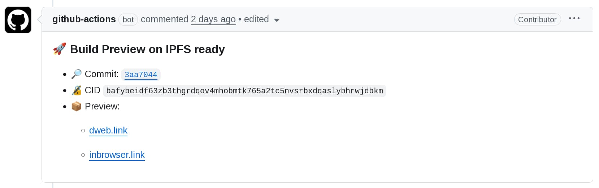

_Cross-posted from the [Shipyard blog](https://ipshipyard.com/blog/2026-ipfs-self-hosting-migration/)._

This is a practical guide to hosting websites on both HTTP and IPFS using modular, swappable components. When Fleek announced it was discontinuing hosting, we migrated 15+ IPFS Project websites to a setup designed to survive any single provider shutting down. Whether you're moving off Fleek or just want more resilient hosting, this guide covers the approach and the tools we used.

## What Changed

Sites including [ipfs.tech](https://ipfs.tech), [docs.ipfs.tech](https://docs.ipfs.tech), [blog.ipfs.tech](https://blog.ipfs.tech), and [specs.ipfs.tech](https://specs.ipfs.tech) now use:

- **[GitHub Pages](https://docs.github.com/en/pages)** for Web2 HTTPS hosting (we already use GitHub for code, so no new third-party dependencies)
- **[Kubo](https://github.com/ipfs/kubo)** for CID and CAR creation (we control [content-addressing](https://docs.ipfs.tech/concepts/content-addressing/), making content portable across any provider)
- **[IPFS Cluster](https://ipfscluster.io/)** for long-term pinning and serving content to IPFS network (self-hosted by Shipyard; [pinning services](https://docs.ipfs.tech/how-to/work-with-pinning-services/) work equally well)
- **[DNSLink](https://docs.ipfs.tech/concepts/dnslink/)** for mapping CIDs to human-readable URLs (decouples naming from content location; automated via [dnslink-action](https://github.com/ipshipyard/dnslink-action))

All sites now have redundant hosting: traditional HTTP via GitHub Pages and content-addressed access via [IPFS Desktop](https://docs.ipfs.tech/install/ipfs-desktop/) with [IPFS Companion](https://docs.ipfs.tech/install/ipfs-companion/) and third-party [public IPFS gateways](https://ipfs.github.io/public-gateway-checker/).

## Third-Party Services Come and Go

Fleek Hosting was a turn-key solution that combined HTTP CDN with TLS, IPFS pinning, IPFS gateway, DNSLink, IPNS, ENS, and GitHub Actions CI integration in one platform. [Fleek is pivoting to AI](https://web.archive.org/web/20260108212232/https://www.fleek.sh/blog/2026-outlook) and [discontinuing its hosting services on January 31, 2026](https://github.com/ipshipyard/waterworks-community/issues/23).

The IPFS service landscape is always evolving. Some providers have shut down or changed focus: [nft.storage transitioned operations](https://web.archive.org/web/20250915005638/https://nft.storage/blog/nft-storage-operation-transitions-in-2025), [Infura deprecated its IPFS public API and gateway](https://web.archive.org/web/20230206190257/blog.infura.io/post/ipfs-public-api-and-gateway-deprecation), and [Scaleway shut down IPFS pinning](https://web.archive.org/web/20251130221548/https://labs.scaleway.com/en/ipfs-pinning/). At the same time, new options have emerged: [Storacha](https://storacha.network/) launched as a successor to web3.storage, Shipyard [took over Cloudflare's public IPFS gateways](https://web.archive.org/web/20251112005234/https://blog.cloudflare.com/cloudflares-public-ipfs-gateways-and-supporting-interplanetary-shipyard/), and pinning services like [Pinata](https://pinata.cloud/) and [Filebase](https://filebase.com/) continue to grow. This isn't a criticism of any particular service — commercial offerings evolve based on business realities. The lesson: design your setup so that no single provider change requires starting over.

## Modularity as the Future-Proof Approach

IPFS is [built for robustness](https://specs.ipfs.tech/architecture/principles/#robustness): strict about verification outcomes, tolerant about methods. A hosting strategy should follow the same principle.

Decouple Web2 hosting from IPFS content-addressing. Keep each component independent:

- **HTTP**: GitHub Pages, Cloudflare Pages, or a self-hosted server
- **IPFS**: pinning/storage service, self-hosted Kubo/IPFS Cluster, or both
- **DNS**: Cloudflare, Gandi, DNSimple, Route53, or any provider with a management API

DNS serves both layers: HTTP needs A/AAAA records and TLS certificates, IPFS needs TXT records for DNSLink to map domains to CIDs.

The key: control CID and CAR creation. Creating the CAR locally means no lock-in to any provider. Pick content providers that accept the CAR. If one shuts down, upload the same CAR elsewhere. HTTP hosting and DNS stay untouched.

Compare this to an all-in-one platform. When it shuts down, everything needs rebuilding.

Two standards make this work: [CAR files](https://docs.ipfs.tech/concepts/glossary/#car) for portable content and [DNSLink](https://docs.ipfs.tech/concepts/dnslink/) for human-readable addressing. Switching providers requires no pipeline changes.

## Our Setup

We use our own [IPFS Cluster](https://ipfscluster.io/) instance since Shipyard already runs IPFS infrastructure. For most projects, a [third-party pinning service](https://docs.ipfs.tech/how-to/work-with-pinning-services/#use-a-third-party-pinning-service) works just as well with less operational overhead.

Our CI/CD uses two GitHub Actions:

- [ipshipyard/ipfs-deploy-action](https://github.com/ipshipyard/ipfs-deploy-action) creates a CID, exports the website DAG as a CAR file, uploads to IPFS Cluster or other pinning services, and provides PR preview links
- [ipshipyard/dnslink-action](https://github.com/ipshipyard/dnslink-action) automatically updates DNSLink TXT records when the CID changes

For security, we use a sandboxed DNS zone pattern: CI credentials can only modify DNSLink TXT records, not other DNS entries. If credentials leak, the blast radius is limited to the `_dnslink` subdomain. See the [dnslink-action security documentation](https://github.com/ipshipyard/dnslink-action?tab=readme-ov-file#security-sandboxed-dnslink-domain) for details.

## Getting Started

Already have HTTP hosting? Just add IPFS and DNSLink. Migrating from Fleek? Pick all three.

1. **HTTP**: [GitHub Pages](https://docs.github.com/en/pages) and [Cloudflare Pages](https://pages.cloudflare.com/) are simple and maintenance free. For all-in-one self-hosted HTTP+IPFS, see [Setup a DNSLink Gateway with Kubo and Caddy](https://docs.ipfs.tech/how-to/websites-on-ipfs/dnslink-gateway/)
2. **IPFS**: Choose a [pinning service](https://docs.ipfs.tech/how-to/work-with-pinning-services/#use-a-third-party-pinning-service) or run your own node. Follow [Deploy static apps to IPFS with GitHub Actions](https://docs.ipfs.tech/how-to/websites-on-ipfs/deploy-github-action/)
3. **DNS**: See [Automate DNSLink updates with GitHub Actions](https://docs.ipfs.tech/how-to/websites-on-ipfs/dnslink-action/) for TXT record automation, or use [OctoDNS](https://github.com/octodns/octodns) for more providers

The [ipfs-deploy-action](https://github.com/marketplace/actions/deploy-to-ipfs) creates the CID and exports the site as a CAR file. This makes content portable across any provider that accepts CARs. The [dnslink-action](https://github.com/marketplace/actions/dnslink-action) links CID to DNS, allowing [IPFS-enabled browsers](https://docs.ipfs.tech/install/ipfs-companion/) to load content over IPFS.

## Conclusion

Third-party services will continue to come and go. The takeaway: separate your concerns and use standards-based tooling. Keep HTTP hosting independent from IPFS content-addressing, create CARs in your own CI rather than someone else's cloud service so you can switch providers, and automate DNSLink updates so they're not tied to any particular service. When one component needs replacing, swap it out without rebuilding everything. This modularity is the robustness that IPFS enables.

All the tools we used are open source and documented. If you have questions, open an issue in the respective repositories or reach out in the [IPFS community forums](https://discuss.ipfs.tech/).
