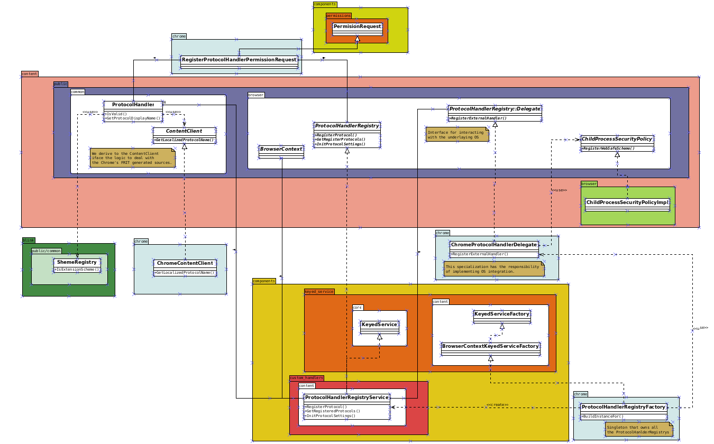

Protocol Labs and Igalia are pleased to announce a major milestone in our efforts to bring more extensibility and user agency to the web and to browsers:

*Support for pre-defined custom protocol handlers in Chromium!*

... ummm, what does that even mean? And why should you care?

In short: You can now build Chromium - the open source browser code used for Chrome, Brave, Edge, Opera and more - with support for "ipfs://" addresses by changing only a couple of lines of code.

Read on to learn why this is a key step towards browsers that can meet a far more diverse set of user needs while maintaining an interoperable core.

## Igalia and Protocol Labs

[Igalia](https://www.igalia.com/) has been working on improving the web for over 20 years. They're an open source consultancy who participate in web standards and work on Chromium, Webkit and Gecko - the three primary web platform rendering engines.

In 2019, we set up a contract with Igalia to work on web platform features and compatibility fixes to make life easier for decentralized web projects and deployment topologies where the browser interacted with services residing on the same computer.

This colloboration covered a *lot* of ground - from IANA to WHAT-WG to W3C to IETF to negotation and coordination with Apple, Google and Mozilla... resulting in a slew of changes catalogued in [this blog post](https://blog.ipfs.tech/2021-01-15-ipfs-and-igalia-collaborate-on-dweb-in-browsers/) in 2021.

Very few changes were specific to IPFS. A lot of the work was making browsers and the web platform more amenable to localhost-oriented application topologies and non-HTTP protocol work - fixing compat papercuts, aligning security models across engines, cleaning up dusty corners... making the web itself just a little bit better.

But our larger goal is to bring the web to places where it doesn't work well for people today, and enable experimentation in what a web with alternate protocols can look like. These are paradigmatic changes, so we needed to do more than just surface-level fixes.

## IPFS Browser Integrations So Far

IPFS has achieved a signficant amount of support in various ways across a number of browsers, from extensions to different levels of built-in support in Brave and Opera, to experiments with mobile operating systems. Looking back at the [IPFS browser update from 2019](https://blog.ipfs.tech/2019-10-08-ipfs-browsers-update/), the world looks *very* different:

* The IPFS Companion browser extension is available for [Firefox](https://addons.mozilla.org/en-US/firefox/addon/ipfs-companion/) and for [Chromium-based browsers](https://chrome.google.com/webstore/detail/ipfs-companion/nibjojkomfdiaoajekhjakgkdhaomnch), which pairs with a local IPFS node like [IPFS Desktop](https://docs.ipfs.tech/install/ipfs-desktop/)
* [Opera browser](https://www.opera.com/) has support for the `ipfs` and `ipns` schemes in their [Android](https://blog.ipfs.tech/2020-03-30-ipfs-in-opera-for-android/), [iOS](https://blog.ipfs.tech/2021-02-08-opera-ios-and-ipfs/) and desktop browsers, redirecting to the https://dweb.link gateway
* [Brave browser](https://brave.com/) bundles IPFS Companion, has `ipfs` and `ipns` scheme support, can redirect to a gateway and also can install and manage a [Kubo IPFS node](https://github.com/ipfs/kubo) to make the browser a full participant in the IPFS public network
* [Capyloon](https://capyloon.org/), a web-based mobile operating system based on KaiOS and Firefox OS, and built with Firefox's Gecko rendering engine, has `ipfs` and `ipns` scheme support backed by [Iroh](https://github.com/n0-computer/iroh), a Rust implementation of IPFS from number0.

There's interest and opportunities and challenges in various browsers - lots of accomplishments, but lots still to figure out.

Some notes on the table above:
* The native Firefox part is via the work Capyloon is doing to integrate IPFS via a protocol handler and bundling IPFS components in Rust from [Iroh](https://github.com/n0-computer/iroh) into Gecko, in the Capyloon fork, not in Mozilla's core repos. There's a tracking bug open for [IPFS support in Firefox](https://bugzilla.mozilla.org/show_bug.cgi?id=1354807), but no plans from Mozilla to implement at this time.
* The [Filecoin support in Brave](https://filecoin.io/blog/posts/brave-browser-adds-filecoin-to-wallet/) is in their native wallet. Also, NFT pinning support will come in 2023 - saving NFT assets and metadata to the local IPFS node and/or [nft.storage](https://nft.storage).

## Native Integration

Redirecting `ipfs` and `ipns` to an HTTP gateway is just a step along the road to a truly native integration of IPFS into the web platform. It's not ideal for a number of reasons, but does align with the HTTP-centric nature of the web today, which makes it a relatively simple integration. But without support for non-HTTP protocols in web browser cores, Opera and Brave both had to do custom work in their products to add even this level of integration - which is costly and complex.

If the underlying engine - Chromium - supported non-HTTP protocols better as a built-in feature, then *embedders* (Chromium lingo for products building on top of it) could more easily integrate and experiment, and we could spend more time working on what truly native IPFS support might look like in the web platform, instead of just redirecting to an HTTP gateway. Igalia agreed it was a worthy goal, and the feedback from the Chromium commmunity around the work was positive, so off we went.

## Major Chromium Refactor

Javi Fernandez of Igalia spent most of the last year refactoring epically large and senstive parts of the Chromium codebase to support non-HTTP addresses across the multiprocess architecture of this massive application. After many stages of work involving code reviews from a huge number of engineers in the Chromium community, Javi made the pre-defined handler approach so simple that embedders now can add a simple redirect integration of IPFS in two lines of code added to the [ChromeContentClient::AddAdditionalSchemes method](https://source.chromium.org/search?q=AddAdditionalSchemes&sq=&ss=chromium):

> schemes->predefined_handler_schemes.emplace_back(
>      "ipfs", "https://dweb.link/ipfs/?uri=%s");
>
>  schemes->predefined_handler_schemes.emplace_back(
>      "ipns", "https://dweb.link/ipns/?uri=%s");

He has detailed the new architecture in a couple of posts:

- [New Custom Handlers component for Chrome](https://blogs.igalia.com/jfernandez/2022/08/10/new-custom-handlers-component-for-chrome/)
- [Discovering Chrome’s pre-defined
Custom Handlers](https://blogs.igalia.com/jfernandez/2022/11/14/discovering-chromes-pre-defined-custom-handlers/)

And recently at IPFS Camp in Lisbon Portugal, Javi gave a talk about this work - which you can watch here:

@[youtube](WLCJ9ol8Fgk)

If you're interested in learning more, join the `#browsers-and-platforms` channel on the [Filecoin Slack](https://filecoin.io/slack/), which is bridged also to `#browsers-and-standards` on [Matrix](https://matrix.to/#/%23browsers-and-standards:ipfs.io) and the [IPFS Discord](https://discord.gg/vZTcrFePpt).