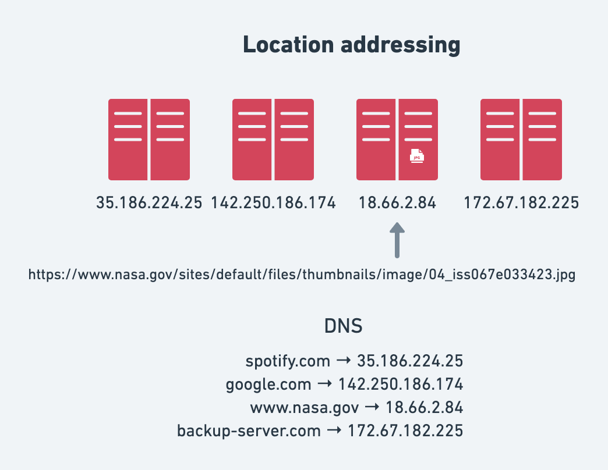
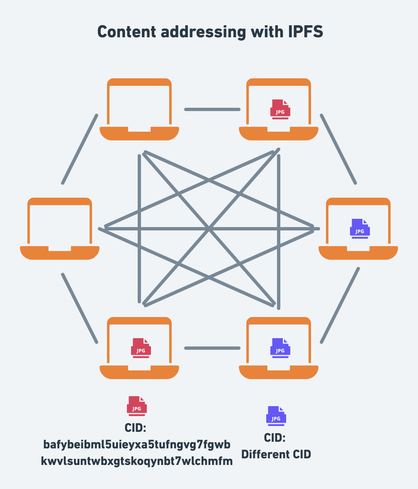

The Interplanetary File System (IPFS) is a peer-to-peer protocol for storing and accessing **files and websites**. As a decentralized **peer-to-peer** protocol, it's fundamentally different from the HTTP protocol that forms the foundation for the internet.

IPFS is a relatively new protocol compared to the time-honored HTTP protocol and comes with a different set of trade-offs. The goal of this blog post series is to help you understand the core concepts behind IPFS and introduce IPFS HTTP gateways, which help you reap many of the benefits of the IPFS network using HTTP.

This blog post is the first of a two-part series:

- Part one: You will learn about the challenges with the popular client-server model, how IPFS approaches these challenges with peer-to-peer networking and content addressing, the relationship between IPFS and HTTP(S), and finally a brief introduction to IPFS HTTP gateways.
- Part two: You will learn practical tips for using IPFS gateways in real-world applications, for example, improving CID access performance and reliability from the IPFS network, IPFS gateway resolution styles, caching, pinning, pinning services, integration with DNS, and running your own IPFS nodes and gateways.

If you're already familiar with the core concepts of IPFS and are interested in the practical guide for using IPFS gateways, stay tuned for part two of the blog series.

> Note: The blog post uses HTTP to refer to both HTTP and HTTPS for brevity and assumes that HTTPS should be used in every production application.

## The challenges with the client-server model

Typically, when you access a website, your browser uses several protocols to load the website:

- First, DNS is used by your browser to find the IP address of the server.
- Second, HTTP is used to request the website from the server.

Such interactions are characterized by the **client-server** model whereby your browser is a client interacting with an HTTP and DNS server.

While the client-server model has been the predominant model for the internet, it is fundamentally centralized and comes at the cost of resilience, reliance on gatekeepers, and single points of failure.

Practically speaking, a common challenge with the client-server model is that it puts all responsibility to ensure the availability of content on the server operator.

For example, when you open the following [URL of an image of Astronaut Jessica Watkins](https://www.nasa.gov/sites/default/files/thumbnails/image/04_iss067e033423.jpg) from the NASA website, you rely on AWS servers that host the NASA website.

When the servers are down or unreachable, you won’t be able to access the image.

Moreover, the HTTP protocol does not specify a way to **ask other servers** for the image; so the file is only available as long as the origin server hosts it.

## What about the big clouds?

So why not just use one of the big cloud providers, like AWS, GCP, Azure, and the like?

Plenty of websites, apps, and platforms are deployed to these clouds which provide redundancy and high availability by deploying to multiple servers and abstracting the details for you.

The problem is that many of the proprietary high-level abstractions (CDNs and storage services) offered by cloud providers are neither open-source nor standardized. This creates vendor lock-in, making it hard for customers to move from one cloud service to another.

Another challenge is that high-level cloud solutions are not implemented on the protocol layer, thereby creating walled gardens – lacking any form of **interoperability** (even across different cloud providers).

Moreover, the market concentration of the big cloud means that an outage can have an immense blast radius, affecting thousands of [sites](https://www.reuters.com/technology/google-amazon-several-other-websites-down-2021-11-16/) and [services](https://www.reuters.com/markets/commodities/amazons-prime-ring-other-apps-down-thousands-users-2021-12-07/); in some cases due to [human error](https://www.datacenterdynamics.com/en/news/microsoft-confirms-azure-outage-was-human-error/).

In reality, the big clouds offer convenience at the cost of resilience and interoperability. They allow you to think in terms of the client-server model assuming that the servers are always available, while in reality abstracting the details and complexity of how they achieve redundancy.

This is where peer-to-peer networking comes in.

## From client-server to peer-to-peer with IPFS

One of the core characteristics of the IPFS is that it is a _peer-to-peer_ network. In contrast to the client-server model where you typically have many clients consuming from a single server, with the peer-to-peer model, every computer (typically referred to as a _peer_) in the IPFS network wears both the hat of a server and a client. This means that every IPFS peer can become a productive member of the network.

> Note: The article uses the terms **peer** and **node** interchangeably to refer to computers running the IPFS software.

As illustrated in the diagram, instead of relying on a single server at the center of the network that clients connect to, each peer connects to multiple peers. Since the `jpg` file is stored on three of the peers, two of those three nodes can be down and the file will still be accessible to the network. What's more, any number of peers become a provider for the `jpg` file, once they download it from the network.

In summary, with IPFS, nodes pool their resources, e.g., internet connection and disk space, and ensure that the availability of files is **resilient** and **decentralized**.

## Location addressing vs. content addressing

In IPFS, data is **content-addressed** rather than _location-addressed_ as is common in the client-server model of the web. To understand the difference between the two approaches, let's go back to the example with the image from NASA.

In the example with the image loaded from NASA, we used location addressing to fetch the image in the form of a URL. The URL contained all the location information to find and fetch the image:

- _scheme_: the protocol `https`.
- _hostname_: DNS name `www.nasa.gov` mapped to an IP address of the server.
- _path_ to the location on the server: `/sites/default/files/thumbnails/image/04_iss067e033423.jpg`

The challenges with location addressing are numerous. We've all had the experience of going down an internet rabbit hole only to be abrupted by dead links because the link changed or the server is no longer hosting the files.

In a peer-to-peer network like IPFS, a given file might be hosted on a number of the IPFS nodes.

This is where _content addressing_ comes in handy. With IPFS, every single file stored in the system is addressed by a [cryptographic hash](https://en.wikipedia.org/wiki/Cryptographic_hash_function) of its contents known as a [**Content Identifier** or **CID**](https://docs.ipfs.io/concepts/glossary/#cid). The CID is a long string of letters and numbers that is unique to that file.

There are three crucial things to remember with regards to CIDs:

- Any difference –even a single bit– to the file (or file tree in the case of a folder) will produce a different CID. This property is known as **immutability**.
- The same content added to two different IPFS nodes will produce the same CID (given the same parameters).
- A single CID can represent a single file or a folder of files, e.g. a static website. This property is known as "[turtles all the way down](https://en.wikipedia.org/wiki/Turtles_all_the_way_down)".

The diagram illustrates what two different files look like on the network. The red jpeg represents one CID hosted on two nodes, while the purple jpeg represents a different CID hosted on two other nodes.

> **Note:** Depending on the size, IPFS may chunk (split) a single file into multiple blocks each with a CID of their own for efficiency reasons. Even so, the file will also have root CID. You can explore what this looks like for the NASA image using the [IPLD explorer](https://explore.ipld.io/#/explore/bafybeibml5uieyxa5tufngvg7fgwbkwvlsuntwbxgtskoqynbt7wlchmfm).

### You can ask any IPFS node for a CID

One of the benefits of content addressing is that you can retrieve a CID from any IPFS node as long as there's at least one node providing it to the network.

For example, if you ask an IPFS node for a CID that it doesn't have, the node can search the IPFS network, and if it finds another reachable IPFS node hosting the CID, it can fetch it and serve it back to you.

## Speaking IPFS

There are two primary ways to fetch files stored in the IPFS network:

- Running an IPFS node by installing one of the IPFS implementations as a daemon (long-running process) on your computer or a server in the cloud. The node becomes a member of the IPFS peer-to-peer network and announces what data it’s holding and responds to requests for data.
- Using an **IPFS Gateway** which allows fetching CIDs using the HTTP protocol.

The first option allows you to _speak the native IPFS protocol_. The latter serves as a bridge in situations where you might be constrained to using HTTP, such as in web apps where your app users may not be running an IPFS node.

Choosing the right approach depends on your use case and requirements. In reality, combining the two approaches is also perfectly valid.

> **Note:** In addition to the two ways above, the browser [Brave](https://brave.com/ipfs-support/) has a built in IPFS node, allowing you to directly interact with the IPFS network from the browser. Moreover, [js-ipfs](https://js.ipfs.io/) paves the way for an implementaion of the IPFS protocol that can be embedded as part of a web application running in the browser.

## What are IPFS gateways?

IPFS gateways are public services that translate between _Web2_ and _Web3_ thereby providing a bridge between HTTP and IPFS.

They allow you to use the HTTP protocol – which almost every programming language is capable of – to request data by its CID from the IPFS network.

You request data from an IPFS gateway by passing a CID in the HTTP request. Since CIDs are a hash of specific data, if the data is provided by a node on the network and accessible by the gateway, the gateway can get that specific data from the network no matter where it sits.

In its simplest form, a gateway is a computer running an IPFS node that also accepts HTTP requests for CIDs.

Typically, an HTTP request to an IPFS gateway follows the following stucture: `https://<gateway-url>/ipfs/<cid>`.

You can find public gateways via the [Public Gateway Checker](https://ipfs.github.io/public-gateway-checker/).

### Example

To get a sense of using an IPFS gateway, try opening the following gateway links with the CID of the image of Astronaut Jessica Watkins:

- [https://ipfs.io/ipfs/bafybeibml5uieyxa5tufngvg7fgwbkwvlsuntwbxgtskoqynbt7wlchmfm](https://ipfs.io/ipfs/bafybeibml5uieyxa5tufngvg7fgwbkwvlsuntwbxgtskoqynbt7wlchmfm)
- [https://cloudflare-ipfs.com/ipfs/bafybeibml5uieyxa5tufngvg7fgwbkwvlsuntwbxgtskoqynbt7wlchmfm](https://cloudflare-ipfs.com/ipfs/bafybeibml5uieyxa5tufngvg7fgwbkwvlsuntwbxgtskoqynbt7wlchmfm)

As you might notice, these are two different gateways that are capable of fetching the same image using IPFS' core pillars: content addressing and peer-to-peer networking.

In the example, you just request a single image; but remember how a CID can be a whole directory of files, i.e., a website. When loading a whole website from an IPFS gateway, it's better to use the subdomain gateway resolution style to avoid [violation of the same-origin policy](https://docs.ipfs.io/concepts/ipfs-gateway/#violation-of-same-origin-policy).

For example, instead of loading the IPFS documentation website (which is also deployed to IPFS 🤯): `https://ipfs.io/ipfs/bafybeiakks4s3ixictcn3alt45kfalkrotmfqishpgfl72pbnclhmk3rme` as we did with the image, you would load it as follows:

- [https://bafybeiakks4s3ixictcn3alt45kfalkrotmfqishpgfl72pbnclhmk3rme.ipfs.dweb.link/](https://bafybeiakks4s3ixictcn3alt45kfalkrotmfqishpgfl72pbnclhmk3rme.ipfs.dweb.link/)
- [https://bafybeiakks4s3ixictcn3alt45kfalkrotmfqishpgfl72pbnclhmk3rme.ipfs.cf-ipfs.com/](https://bafybeiakks4s3ixictcn3alt45kfalkrotmfqishpgfl72pbnclhmk3rme.ipfs.cf-ipfs.com/)

The subdomain gateway resolution style follows the following structure: `https://<cid>.<gateway-url>`.

## Summary

In this blog post, you learned about the challenges of the client-server model, the principles behind IPFS, namely peer-to-peer networking and content addressing, and how IPFS gateways provide a bridge between Web2 and Web3, allowing you to tap into the IPFS network using HTTP.

In the follow-up blog post, you will learn more about all the tips and tricks for using IPFS gateways in real-world applications, going into resolution styles, integration with DNS, caching, pinning, debugging, and more.

If you're interested in:

- Diving deeper, check out the [IPFS docs](https://docs.ipfs.io/)
- Running an IPFS node, [install IPFS](https://docs.ipfs.io/install/)
- Asking questions, join us in [the IPFS forum](https://discuss.ipfs.io/)
- Chatting with us, join us on [Discord](https://discord.com/invite/KKucsCpZmY) or [Matrix](https://matrix.to/#/#ipfs:matrix.org)
