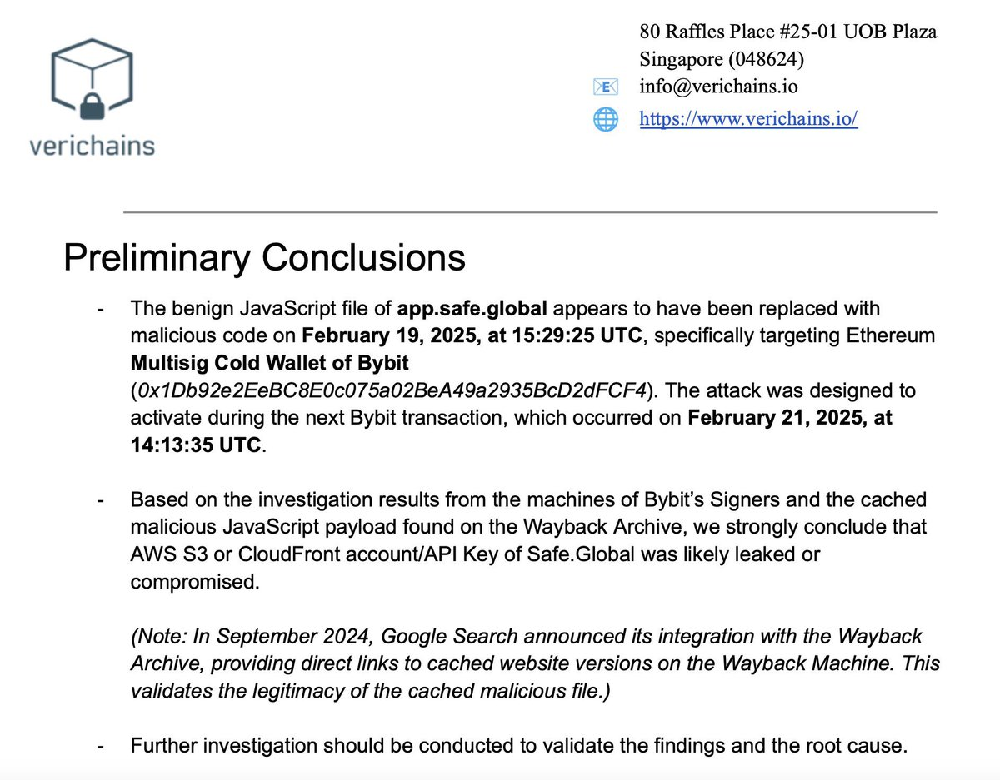
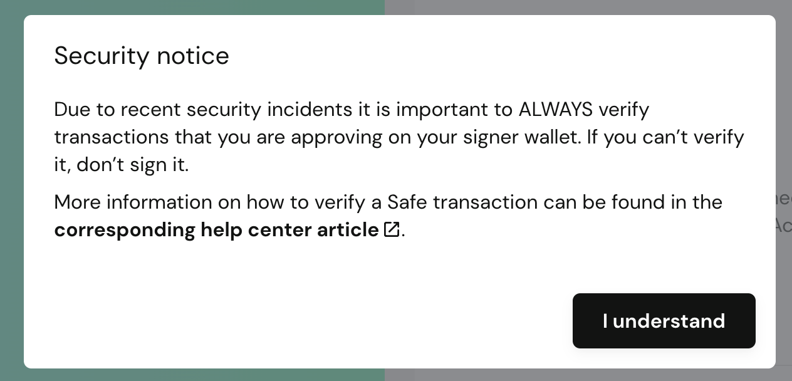
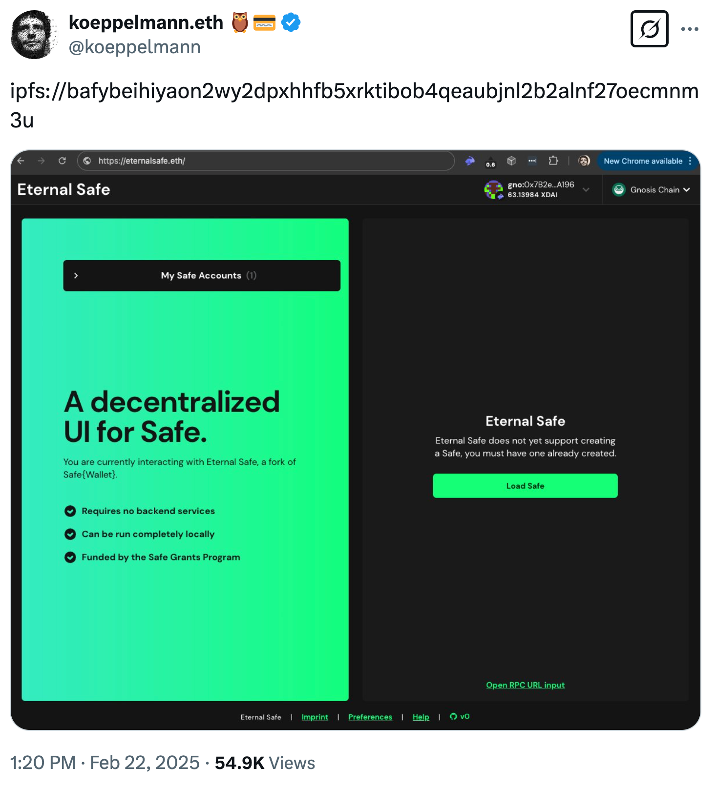
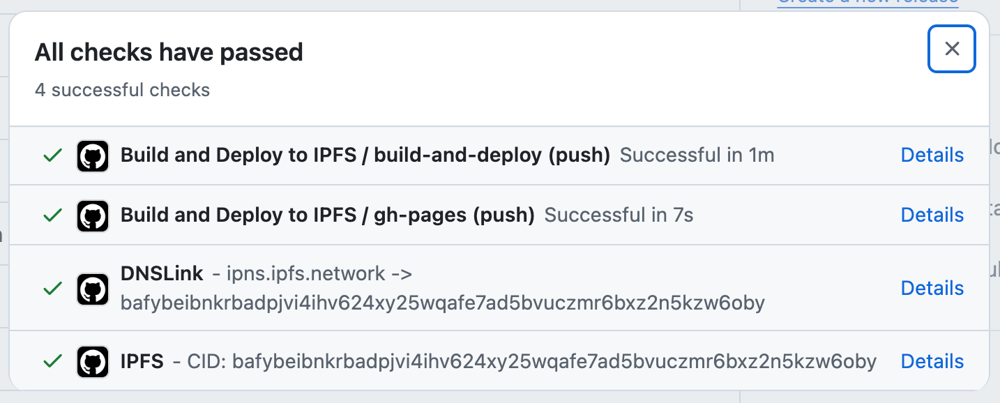

## The Bybit Hack and IPFS

Bybit's [recent hack](https://www.reuters.com/technology/cybersecurity/cryptos-biggest-hacks-heists-after-15-billion-theft-bybit-2025-02-24/), which resulted in the loss of $1.4 billion, is a reminder of the importance of verification for frontends, especially dapp frontends in the Web3 ecosystem.

Based on what we know at the time of writing, IPFS, through local verification, could have served as a preventive line of defense in this sophisticated hack, potentially preventing it altogether.

In this blog post, we will recap what we know about the hack and share our perspective IPFS' role. diving into some of the technical efforts we've been spearheading at [Interplanetary Shipyard](https://ipshipyard.com/) to improve the health of the ecosystem.

If you are a dapp developer, you can skip the final section where we provide concrete recommendations with links to tooling.

## So how did the hack happen?

The TL;DR is that hackers managed to gain access to the AWS S3 bucket that hosted the Safe frontend served from `app.safe.global` and uploaded a malicious version of the frontend days before the hack. The frontend specifically targeted the Bybit cold wallet, causing owners of the multisig to sign a malicious transaction while obscuring the malicious transaction in the frontend.

It's not exactly clear how the hackers managed to gain access to the AWS S3 bucket. Some reports suggest that one of the developers' credentials was compromised through social engineering.

> [Source](https://x.com/benbybit/status/1894768736084885929)

## Security is layered

Security in software systems is approached in layers, often referred to as ["defense in depth."](<https://en.wikipedia.org/wiki/Defense_in_depth_(computing)>) This strategy involves implementing multiple security measures rather than relying on a single protective mechanism. If one layer fails, additional layers provide backup protection. The modern web is a complex ecosystem and as the stakes increase considering the sums of money at play, so does the need for better security measures.

In the context of this hack, we've identified three failures that made the hack possible:

1. The Safe frontend was unverified (trust was based on _belief_  DNS, TLS PKI and HTTP server are returning valid data)
2. The Safe multisig owners signed a malicious transaction
3. There were no additional approval layers in the Safe smart contract to prevent the malicious transaction from going through.

Since IPFS is mainly concerned with the first point (ability to verify data by means of [content-addressing](https://docs.ipfs.tech/concepts/content-addressing/)), we'll focus on that. The other two points bring up broader ecosystem needs like clear signing (rather than the blind signing often seen across smart contract wallets), improved UX that strengthens security rather than working against it, and more effective tools for verifying transactions.

The Ethereum community responded quickly, addressing the second point and released [multiple](https://safeutils.openzeppelin.com/) [tools](https://koeppelmann.github.io/CirclesTools/SafeViewer.html) and [documentation](https://help.safe.global/en/articles/276344-how-to-verify-safe-wallet-transactions-on-a-hardware-wallet) to help users verify transactions before signing them.

## IPFS and frontend verification

The IPFS project has long advocated for wider adoption of client verification. Over a year ago, we published a [blog post](https://blog.ipfs.tech/dapps-ipfs/) discussing the importance of client verification and how IPFS can help.

> End-to-end integrity: as long as a user of your Dapp has the CID you shared, they can be sure they are running the exact code that you published by verifying locally. Local verification is crucial since Dapps interact with a blockchain **and malicious code can lead to loss of user funds**. Integrity is adjacent to trustlessness — because verification eliminates the need to trust the source of data.
> From [_The State of Dapps on IPFS: Trust vs. Verification (2024)_](https://blog.ipfs.tech/dapps-ipfs/)

End-to-end integrity through cryptographic hash verification is not new to many of us in the DWeb, Web3 and IPFS ecosystems.

In fact, we feel somewhat vindicated seeing the Gnosis founder share the CID of an open-source fork of the Safe frontend called [Eternal Safe](https://github.com/eternalsafe/wallet) shortly after the hack, while the Safe team conducted a forensic review of their services and frontend:

> [Source](https://x.com/koeppelmann/status/1893274676756881852)

### Native content addressing on the web

One of the longest standing goals we've had for the IPFS project is to make client-side verification integrated into browsers, making CIDs first-class citizens. In an ideal world, you should be able to use CIDs in browsers using `ipfs://` without necessrily installing a "full" IPFS node that runs as a separate process on your computer.

To this end, we've launched multiple projects with varying degrees of success. The main challenge we run into time and time again is browser contraints and the lack of extensibility APIs that would allow shifting trust away from a specific origin from which content is served to a self-certifying identifier like a CID, allowing content to be verified locally, regardless of the source.

Browser extensions distributed through extension stores are harder to compromise in comparison to HTTP servers, because rollout is staged rather than instant, and vetted code assets can be bundled within the extension itself. Moreover, publishing mandates signing by the author, ensuring that users are installing the extension from a trusted source. We are investigating how we could [package the Service Worker IPFS gateway as a browser extension](https://github.com/ipfs/in-web-browsers/issues/212) to improve the user experience.

The self-certifying approach with CIDs is in tension with the [Same-origin policy](https://developer.mozilla.org/en-US/docs/Web/Security#same-origin_policy_and_cors): the fundamental security mechanism of the web whereby trust is anchored to an origin using DNS and PKI. Yet, given that [Subresource Integrity (SRI)](https://developer.mozilla.org/en-US/docs/Web/Security/Subresource_Integrity) allows for hash verification of subresources, we're hopeful that we can work with standard bodies and browser vendors to expand on this foundation and provide mechanisms to verify top-level resources like HTML, JS, CSS, etc.

Having said that, we have some concrete recommendations for dapp developers that can be implemented today, while we advance efforts to make CIDs first-class citizens in browsers.

## IPFS for dapp developers

As a dapp developer, there are three key things you need understand and streamline into your development workflows today:

- How to deploy your frontend to IPFS.
- How to safely signal release CIDs to users.
- How users can and safely retrieve the frontend and be confident it's the same as the one you published.

Let's take a quick look at the state of the art for each of these.

### Deploying frontend to IPFS

To make deployments to IPFS as seamless as possible, we recently released [ipfs-deploy-action](https://github.com/ipfs/ipfs-deploy-action), a GitHub action that makes it easy to deploy your frontend (or any other static assets for that matter) to IPFS as part of CI/CD pipelines. It encapsulates best practices we've established over the years, like local CID generation and pinning with [CAR files](https://docs.ipfs.tech/concepts/glossary/#car).

The action is built with open tooling makes no assumption on your build process, so it works with any static site generator. Moreover, it sets the status of the commit with the CID allowing for more visibility and auditability of your deployments.

 
<a href="https://github.com/ipfs/ipfs-deploy-action" class="cta-button">
  Try ipfs-deploy-action
</a>

### Signaling the CID to users

Once you've deployed your frontend to IPFS, you need to signal the CID to users. This can be done in a few ways:

- Publishing the CID in the GitHub release notes, like [Eternal Safe](https://github.com/eternalsafe/wallet/releases/tag/v1) and [Uniswap](https://github.com/Uniswap/interface/releases/).
- Publishing the CID onchain with [ENS](https://ens.domains) or [IPCM](https://github.com/PinataCloud/ipcm)
- Regularly publishing cryptographically-signed [IPNS](https://docs.ipfs.tech/concepts/ipns/) records
- Leveraging [DNSLink](https://docs.ipfs.tech/concepts/dnslink/) with hardened resolver ([DNSSEC](https://www.cloudflare.com/learning/dns/dnssec/how-dnssec-works/)-only and/or non-ICANN resolver such as [this one for ENS](https://github.com/ethlimo/limo-web3-dns)).

Each of these has different security properties and tradeoffs, some of which have been evaluated in the [Dapps on IPFS](https://blog.ipfs.tech/dapps-ipfs/) blog post.

The quickest way to get up and running is with GitHub, which provides strong security and auditability. At a minimum, reuse GitHub Releases to publish both the original source code and CID. This provides your users with a means to load frontend in a verifiable way.

### Retrieving the frontend

With the CID in hand, users have a few ways to retrieve the frontend:

- Local IPFS node like [IPFS Desktop](https://docs.ipfs.tech/install/ipfs-desktop/) together with [IPFS Companion browser extension](https://docs.ipfs.tech/install/ipfs-companion/) provide `ipfs://cid` URI support with the highest level of security, including local CID verification and caching. Great solution for desktops, but doesn't work on mobile.
- In-browser verification with the [Service Worker Gateway](https://github.com/ipfs/service-worker-gateway#readme) is getting better, however, initial bootstrapping of the worker is still tied to an HTTP server which could serve malicious client code if successfully exploited. We are currently investigating how we could package the Service Worker IPFS gateway as a browser extension to close this gap and improve the user experience.
- Public Good HTTP Gateways, e.g. `ipfs.io`, `dweb.link`, and `eth.limo`, return deserialized assets which can't verified by end users. As the [IPFS Principles](https://specs.ipfs.tech/architecture/principles/#verification-matters) document states, **verification matters**, if you are not verifying, it's not IPFS. This is a supply chain equivalent of "not your keys, not your cheese".

 
<a href="https://docs.ipfs.tech/install/ipfs-desktop/#install-instructions" class="cta-button">
  Download IPFS Desktop
</a>
  
<a href="https://docs.ipfs.tech/install/ipfs-companion/" class="cta-button">
  Install IPFS Companion
</a>

## Collaboration Proposal: Let's work together

[Interplanetary Shipyard](https://ipshipyard.com/), is an independent collective of people maintaining many of the most popular implementations in the IPFS and libp2p ecosystem.

If you are looking to improve the security of your dapp, we'd love to hear from you at `contact [at] ipshipyard.com`.

- Curious to explore browser extensions for your dapp that enforce frontend security via the Service Worker Gateway and safelisted release CIDs?
- Want to sponsor browser improvements to remove dependency on DNS and PKI as trust anchor?

[Let's chat](https://ipshipyard.com/contact-us)!

## Final words

Striking the right balance between security and usability is hard. If there's one takeaway from this post, it's that verification is important at multiple steps of users' interaction with blockchains.

IPFS is not a silver bullet, but there's a good chance that if the owners of the Bybit Safe multisig loaded the frontend from a local IPFS node, this could have been prevented.
