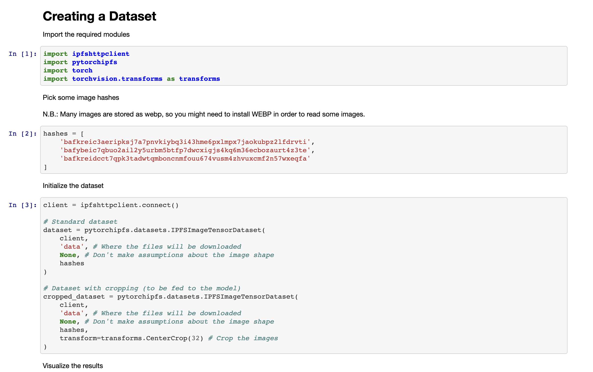
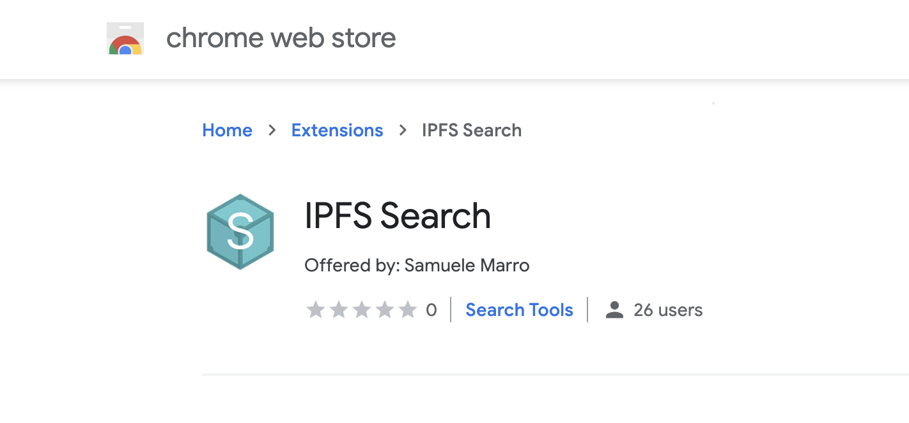
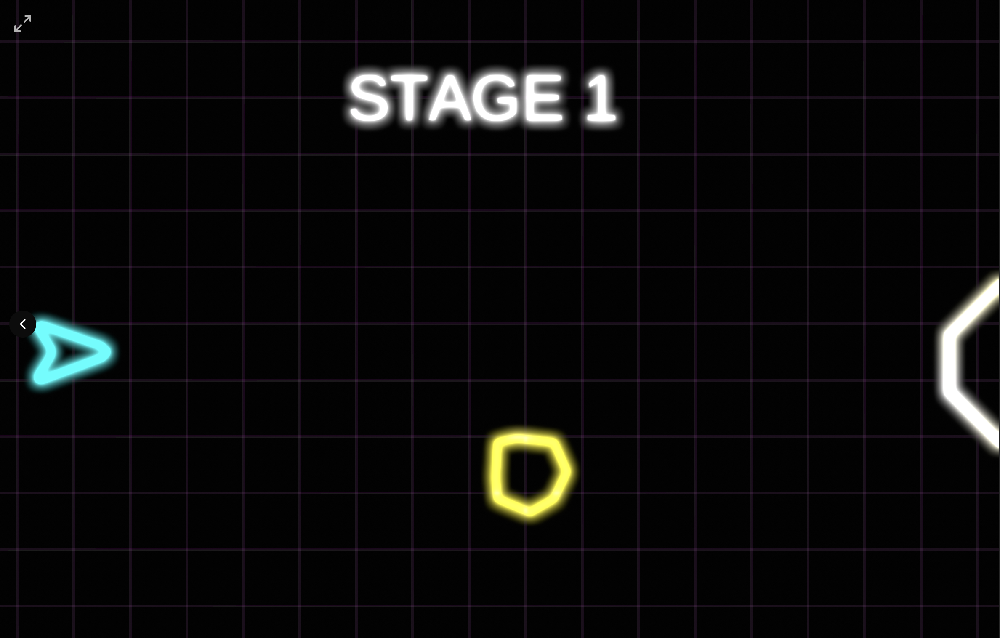

Gitcoin is [a popular platform](https://gitcoin.co/) for developers to collaborate and monetize their skills ($25 million+ so far) while working on Open Source projects through bounties and hackathons. Protocol Labs recently co-sponsored their [Gitcoin Grants Round 9 Virtual Hackathon](https://gitcoin.co/hackathon/gr9/onboard).

Gitcoin grant rounds are crowdsourcing experiments where open source projects can benefit from QF (Quadratic Funding) in which community contributions are matched using a quadratic formula by Gitcoin grant round sponsors. During Round 8 they added a Hackathon component and it was so successful, that this past March, they did it again, offering \~$500k in pooled prizes.

## Our challenges, the best of IPFS and Filecoin 🏆

For the **Gitcoin GR9 Hackathon**, Protocol Labs matched 100% of our ecosystem partners’ [Textile](https://blog.textile.io/funding-the-community/) and [Fleek’s](https://blog.fleek.co/posts/gitcoin-gr9-hackathon-fleek-winners) bounties.

Our goal is to amplify the ability of our ecosystem partners to be stewards of the IPFS/Filecoin ecosystem and decentralize growth and development. Moreover $23k in bounties for Filecoin and IPFS were offered for a total of $63k in prizes available for this sub-ecosystem in GR9. We wanted to see the best of the best for tools, libraries, APIs, apps, integrations, and more.

Out of 167 projects total, with 36 submissions to our ecosystem bounties, here are the prize winners:

## Textile winners

### Decentralized Media

_Best Video App or Platform_

A decentralized video player where users can configure and upload video to IPFS/Filecoin via Textile’s Powergate.

by sunnyrk

[https://github.com/sunnyRK/decentralized-media](https://github.com/sunnyRK/decentralized-media "https://github.com/sunnyRK/decentralized-media")

### Bradbvry

_Best App using Threads_

Bradbvry allows you to share a photojournal your last trip, built on IPFS using ThreadsDB and Ethereum.

by hugosanchez

[https://bradbvry.now.sh/landing](https://bradbvry.now.sh/landing "https://bradbvry.now.sh/landing")

### OmniAnalytics Miner Index Explorer

_Miner Index Visual Explorer_

Using data from Textile’s new Filecoin Miner Index API, a collection of visualizations to help network enthusiasts get a high level overview of the health and performance of storage miners.

by omnianalytics

[https://github.com/Omni-Analytics-Group/gitcoin-grants-round-9-textile-filecoin-hackathon](https://github.com/Omni-Analytics-Group/gitcoin-grants-round-9-textile-filecoin-hackathon "https://github.com/Omni-Analytics-Group/gitcoin-grants-round-9-textile-filecoin-hackathon")

## Fleek winners

See [Fleek’s blog](https://blog.fleek.co/posts/gitcoin-gr9-hackathon-fleek-winners) for more info

### 1st place: MintBot

A bot that allows creating an NFT directly from the Telegram app. Images are securely stored on IPFS using Fleek Storage JS.

by stevegachau

[https://github.com/stevegachau/MintBot](https://github.com/stevegachau/MintBot "https://github.com/stevegachau/MintBot")

### 2nd place: Stories

A dapp that allows reader to buy stories as NFTs, stored on Fleek Storage.

by ysongh

[https://github.com/ysongh/StoriesNFT](https://github.com/ysongh/StoriesNFT "https://github.com/ysongh/StoriesNFT")

### 2nd place: SpaceCase

Creates and manages Fleek user identities using the Fleek SpaceSDK.

by morganstar

[https://github.com/endowl/space-case](https://github.com/endowl/space-case "https://github.com/endowl/space-case")

### 3rd place: Fleek Chat

Chat service prototype and React template with login/registration for the Fleek SDK.

by belfordz

[https://github.com/xops/fleekchat](https://github.com/xops/fleekchat "https://github.com/xops/fleekchat")

### 3rd place: Bottle

A telegram bot to handle Web3 transactions that works with the Polygon/Matic L2 network and Fleek Storage.

by koder-abc-123

[https://github.com/koder-abc123/Bottle](https://github.com/koder-abc123/Bottle "https://github.com/koder-abc123/Bottle")

## IPFS winners

### Best Framework Support (tie): Kredeum NFTs

🖼 Best helper libraries for easily integrating or using IPFS in ways idiomatic to a given popular framework of any language.

@[youtube](PWYbeLTXTKE)

Created by Alain Papazoglou, [Kredeum NFTs](https://github.com/Kredeum/gr9) archives media on IPFS, mints the archived medias as NFTs on Polygon network, and sells them on Arkane and OpenSea.

### Best Framework Support (tie): PyTorchIPFS

Created by Ken Thorn, [PyTorchIPFS](https://github.com/kenthorn95/PyTorchIPFS) is a utility for integrating IPFS with PyTorch, one of the largest machine learning and big data frameworks.

### Best Developer Integration: PinABI

💻 Best extension for browser developer tools, VS Code or any other developer environment.

Created by jacekv, with [PinABI](https://github.com/jacekv/uploadABIToPinata) you are able to up and download your smart contracts ABI to and from IPFS and pin with Pinata. PinABI is currently written for Hardhat to be used as a task.

Example:

_Upload your Smart Contracts ABI using the following command:_

`npx hardhat upload --name [some pinning name]`

### Best Game on IPFS: Tiny Racing

👾 Best game or tool for building, integrating, publishing or supporting the development of games with IPFS.

@[youtube](rq8CuRoVUZQ)

Created by Leon Do, [Tiny Racing](http://tinyracing.crypto/) is a tiny, decentralized mobile game stored on IPFS with a blockchain domain, and built with Pinata, Unity, and Unstoppable Domains.

### Best Search Hack: IPFS Search

🔍 Best website, app, tool, library or API for searching the IPFS network, or enabling integration of IPFS with existing search platforms.

Built by Samuele Marro, [IPFS Search](https://chrome.google.com/webstore/detail/ipfs-search/lffnkibaadgoclbhfajpnhlobdoomfeh/related?hl=en-US) is a Chrome integration that allows you to search IPFS directly from the Chrome omnibox.

## Filecoin winners

### Filecoin integration with Duplicity

_Best Backup to Filecoin Integration_

🎯 Integrate an existing backup tool (e.g., duplicity, s3fs, etc.) with Filecoin.

A [Duplicity integration](https://gitlab.com/Shr1ftyy/duplicity/-/tree/filecoin-backend) with Filecoin.

by Shr1ftyy

### Filecoin integration with Restic

_Next Best Backup to Filecoin Integration_

A start to a [Restic integration](https://github.com/riton/restic/tree/feature/filecoin_backend) with Filecoin.

by riton

### Save The Wizard Home

👾 _Best Unity Game added to_ [_Slate_](https://slate.host/) _and stored on IPFS/Filecoin_

@[youtube](PKBaO0aZZKM)

[Save the Wizard Home](https://slate.host/ysongh1/cid:QmQjXrSu1UgvwzC673FSELrWU637SiaRPHQqgtKVxBkZBq) is an entertaining game reminiscent of Pong, built with Unity and now hosted on Slate.

by ysongh

### To The Moon

_Next Best Unity Game on_ [_Slate_](https://slate.host/) _and stored on IPFS/Filecoin_

[To The Moon](https://slate.host/lucasespinosa/cid:QmRrqMzQ8VjssmEr4jeUyg9eu6JSJCfqDu2FjZrnzVYxD8) is a fun space-inspired game built with Unity and now hosted on Slate.

by lucasespinosa28

## Other prizes awarded 🏅

**Filecoin Build Tutorial Improvements** to:

* Migrate a Simple Pinning Service to Powergate, by irohnin
* My Meme Marketplace, by electrone901
* Pinning service tutorial, by javipus

Congratulations to the many creative builders behind these amazing projects and help with trying out and improving our tutorials!

Thank you all for pushing the boundaries of what the decentralized web can do just a little bit further. 🚀

## Talks + workshops during Gitcoin GR9

Catch up on some of the workshops and code-alongs that took place during the event from teams in our ecosystem!

### Storing all your NFTs, assets, and databases on Filecoin with Andrew W. Hill

@[youtube](VWm9KaL0LkE)

Enjoy storing all your NFTs, assets, and databases on Filecoin: an introduction to clients and APIs to store your data.

Join Textile co-founder and CEO, Andrew W. Hill, for a technical introduction to Filecoin concepts, client options, and storage lifecycle where you’ll store your first data on the network.

### Build with IDX Open Identity on Ceramic with Joel Thorstensson

@[youtube](LvnCiFPK1OE)

IDX, from Ceramic, is a framework for user centric data. It makes it possible to build data rich applications without relying on a central database. In this workshop 3Box Labs co-creator Joel Thorstensson will show you how to get started with storing data in IDX.

## Want to get involved in a future hackathon?

Follow us on Twitter at [@IPFS](https://twitter.com/ipfs) or [@Filecoin](https://twitter.com/filecoin). You can also subscribe to the [IPFS weekly newsletter](https://ipfs.us4.list-manage.com/subscribe?u=25473244c7d18b897f5a1ff6b&id=cad54b2230), or the [Filecoin monthly](https://filecoin.us16.list-manage.com/subscribe?u=a1dfb670c4f1fb042e82a1f1d&id=cf409026a0). Or, join us in chat in the [Filecoin Slack](http://filecoin.io/slack) or the [IPFS Discord](https://discord.com/invite/vZTcrFePpt). We’ll see you there! 👋