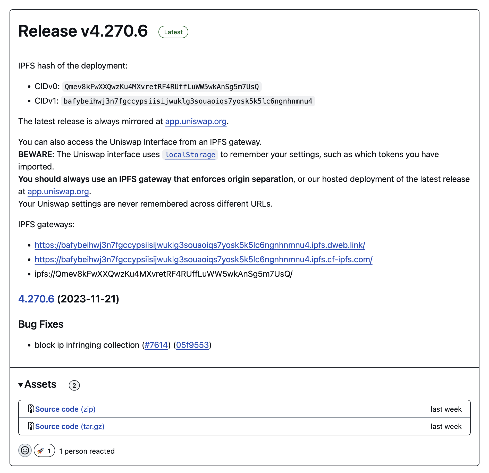

## Preface <!-- omit from toc -->

This blog post provides a comprehensive overview of the current landscape of dapps on IPFS through the lens of trust and verifiability. Given the nuance and breadth of this topic, this blog post is rather long.

For easier navigation, use the [table of contents](#contents).

## Contents <!-- omit from toc -->

- [Trust vs. verification in dapps](#trust-vs-verification-in-dapps)
- [The benefits of IPFS for (d)app developers and users](#the-benefits-of-ipfs-for-dapp-developers-and-users)
- [Primer on web app architectures: SPAs, MPA, PWA and dapps](#primer-on-web-app-architectures-spas-mpa-pwa-and-dapps)
  - [The client-server spectrum](#the-client-server-spectrum)
  - [SPA and MPA can be easily published to IPFS](#spa-and-mpa-can-be-easily-published-to-ipfs)
  - [SPA and MPA can also be PWA](#spa-and-mpa-can-also-be-pwa)
  - [Dapps](#dapps)
  - [How dapps get chain state](#how-dapps-get-chain-state)
- [Publishing dapps: approaches and trade-offs](#publishing-dapps-approaches-and-trade-offs)
  - [Without IPFS](#without-ipfs)
  - [Publishing to IPFS](#publishing-to-ipfs)
- [Loading dapps from IPFS: approaches and trade-offs](#loading-dapps-from-ipfs-approaches-and-trade-offs)
  - [From a public gateway](#from-a-public-gateway)
  - [With a local IPFS node](#with-a-local-ipfs-node)
  - [With a local IPFS node \& IPFS Companion browser extension](#with-a-local-ipfs-node--ipfs-companion-browser-extension)
  - [With the Brave browser](#with-the-brave-browser)
- [When running a Kubo node is not an option](#when-running-a-kubo-node-is-not-an-option)
- [What if content addressing were native to the web?](#what-if-content-addressing-were-native-to-the-web)
- [In-browser CID verification with JavaScript](#in-browser-cid-verification-with-javascript)
  - [Browser constraints](#browser-constraints)
  - [Approaches to IPFS in the browser](#approaches-to-ipfs-in-the-browser)
  - [Helia and IPFS in the browser](#helia-and-ipfs-in-the-browser)
  - [Verifying top-level pages, sub-resources, and async data](#verifying-top-level-pages-sub-resources-and-async-data)
  - [Fetching and verifying async data with Helia](#fetching-and-verifying-async-data-with-helia)
  - [Making Helia lighter and developer-friendly](#making-helia-lighter-and-developer-friendly)
  - [Helia in a Service Worker](#helia-in-a-service-worker)
  - [Local app installer](#local-app-installer)
- [Most users don’t use CIDs directly](#most-users-dont-use-cids-directly)
- [Naming systems and mutable pointer](#naming-systems-and-mutable-pointer)
  - [DNSLink](#dnslink)
  - [Ethereum Name System (ENS)](#ethereum-name-system-ens)
  - [IPNS](#ipns)
- [Conclusion](#conclusion)

## Trust vs. verification in dapps

If you are a decentralized web app (dapp) developer, there’s a good chance that you already publish the frontend of your dapp to IPFS. However, today, even if you do so, your users cannot benefit from the integrity IPFS provides without running their own IPFS node. If your users’ browser isn’t verifying that the frontend's source and resources match the CID you published, they are exposed to a wider attack surface, which can lead in the worst case to stolen funds.

The root of the problem lies in the **difficulty users face verifying the integrity of dapps deployed to IPFS in a browser without running an IPFS node**. This hurdle means that many users are **trusting** —often unknowingly– a specific IPFS gateway. This goes against the IPFS principle that [**verification matters**](https://specs.ipfs.tech/architecture/principles/#verification-matters) and puts users at risk.

Over the last couple of months, the [IPFS Shipyard](https://ipfs-shipyard.org/) team has been working with several teams in the dapp ecosystem to understand the challenges they face and the broader problem space. With the formation of the [IPFS Dapps Working Group](https://github.com/ipfs/dapps-wg/) by the IPFS Shipyard team along with the [Liquity team](https://www.liquity.org/) and the IPFS community, we aim to address some of the immediate pain points faced by the dapp developers and users and provide better tooling. One of the main goals is to **establish verified retrieval as the norm for retrieving CIDs on the web**.

This is not a new problem. Making CIDs native to the web platform has been a long-time goal of the IPFS project and remains a core goal of the [IPFS Ecosystem Working Group](https://blog.ipfs.tech/2023-introducing-the-ecosystem-working-group/). Making CIDs native to the web is an arduous road that involves wide-spanning collaboration with stakeholders including standard bodies, spec writers, browser vendors, and IPFS implementors.

It’s worth noting that _trustlessness_ is an aspirational property of dapps, but a misleading term because trust cannot be completely eliminated. A better way to look at this is in terms of **verifiability** that content addressing enables, in addition to less reliance on authority, e.g. PKI, DNS and authoritative servers. Moreover, the web’s trust model is deeply ingrained and rooted in the [**Same-origin policy**](https://developer.mozilla.org/en-US/docs/Web/Security/Same-origin_policy). One of the engineering challenges the working group faces is to meet the goal above within the boundaries and constraints of the same-origin policy.

> **Note:** while this blog post is heavily focused on Dapps, almost all of it applies to any static web application that can be published to IPFS. That is, Progressive Web Apps (**PWA**), Single Page Applications (**SPA**) and any app that does not rely on server side rendering.

## The benefits of IPFS for (d)app developers and users

IPFS is supposed to provide several benefits for web app developers and users:

- **Resilience & censorship resistance:** by having multiple copies of the frontend’s CID on the IPFS network you ensure that even if multiple providers are unavailable or censored, the frontend is still retrievable and usable. In the most extreme case, it’s enough for there to be a single provider for content to be retrievable.
- **End-to-end integrity:** as long as a user of your Dapp has the CID you shared, they can be sure they are running the exact code that you published by **verifying** locally. Local verification is crucial since Dapps interact with a blockchain and malicious code can lead to loss of user funds. Integrity is adjacent to trustlessness — because verification eliminates the need to trust the source of data.
- **Legal and regulatory compliance:** as regulatory bodies adopt regulation, e.g. **[MiCA](https://www.esma.europa.eu/esmas-activities/digital-finance-and-innovation/markets-crypto-assets-regulation-mica),** which applies to crypto assets and their Dapps, the degree to which services are decentralized comes under scrutiny. While the legal question cannot be answered by the blog post (this is not legal advice), IPFS, through the former two points, should provide the means to maximize decentralization and do so provably.
- **Data portability, no vendor lock-in, and [credible exit](https://subconscious.substack.com/p/credible-exit):** once you onboard data and make it content-addressed with CIDs, you are free to move it between implementations, services, and jurisdictions, theoretically, without paying the onboarding cost again.

The reality, however, is more complex because there are various approaches to publishing and fetching dapps from IPFS that make subtle trade-offs between **trustlessness, resilience, UX, and performance.**

In the next section, we’ll take a look at web app architectures, and what dapps are, and then dive deeper into the actual approaches you see in the wild.

## Primer on web app architectures: SPAs, MPA, PWA and dapps

The rapidly evolving nature of web application architectures has given birth to many terms, abbreviations, and web development frameworks. This section will attempt to provide a high-level overview of some of the main web app architecture patterns, how dapps and how they relate to publishing to IPFS. If you are already familiar with these, feel free to skip ahead.

### The client-server spectrum

Today’s web applications can be seen as being positioned somewhere on a **server-client spectrum** regarding where the logic (rendering, authorization, processing user input) lives. On the server end of the spectrum, you have server-rendered apps where most logic is encapsulated in the server, e.g. WordPress, Laravel, and Ruby on Rail apps. On the client end, you have Single Page Applications (SPA), where all routing and rendering logic is client side. SPAs typically have a single entry index.html with a JavaScript bundle that routes all use. Once the JS is loaded, it takes over rendering, navigation, and network (asynchronously submitting user input) responsibilities. Another approach that sits somewhere in the middle is the multi-page application (MPA) with a pre-rendered HTML file per route that typically contains only the necessary JS for the given route.

It’s worth noting that many modern web development frameworks support more than one architecture and even the blending of different approaches on a per-route basis. For example, a [Next.js supports both MPAs with Static Exports](https://nextjs.org/docs/pages/building-your-application/deploying/static-exports) and server-side rendering.

[web.dev has a useful article that delves into this topic in more detail](https://web.dev/articles/rendering-on-the-web).

### SPA and MPA can be easily published to IPFS

Because SPA and MPA are statically generated, you can easily host them on any server that can serve static files (HTML, JS, CSS, etc.). That makes them a great fit for publishing on both traditional CDNs and IPFS.

### SPA and MPA can also be PWA

A progressive web app ([PWA](https://developer.mozilla.org/en-US/docs/Web/Progressive_web_apps/Guides/What_is_a_progressive_web_app)), is a web app that runs in a browser while providing a user experience like that of a platform-specific native app, e.g. the ability to function offline, update in the background, and send notifications to the OS.

The key thing to understand is that what makes an app a PWA (web app manifest and and service worker) is complementary to MPAs and SPAs. [In other words, both SPA and MPA architectures can be used to build a PWA.](https://web.dev/learn/pwa/architecture)

### Dapps

Dapps, short for Decentralised Apps, is an umbrella term for applications deployed as a smart contract to a blockchain. Since interacting with smart contracts directly can be a clunky experience, dapps are typically comprised of two components:

- Smart contracts deployed to a smart contract blockchain like Ethereum (and other EVM chains, e.g. Filecoin).
- A frontend to interact with those contracts from the web browser. Typically the frontend will be a static app (SPA/MPA) that is deployed to a CDN and/or published to IPFS.

### How dapps get chain state

In this architecture, the static site will need to fetch blockchain state, specifically the state associated with the Dapp’s smart contracts. This can be done using the following approaches:

- The most naive is to use the [Ethereum JSON-RPC API](https://ethereum.org/en/developers/docs/apis/json-rpc/) which every Ethereum execution client/node exposes. The Ethereum execution client is software that keeps an up-to-date full state by synching with the rest of the network and updating the state tree every time a new block is produced. Dapps that rely on the JSON-RPC API will either use a hosted Ethereum node provider like Quicknode, Alchemy, and Infura, or run their own node.
- Since the JSON-RPC API is usually too low-level with unindexed data to provide rich frontend functionality, many Dapps will instead query an additional indexing layer like [The Graph](https://thegraph.com/). The Graph is a protocol for indexing and querying blockchain data and makes it possible to efficiently query chain state using GraphQL. For example, Uniswap uses [this approach](https://docs.uniswap.org/api/subgraph/overview) to fetch data from the Uniswap smart contracts.

In both approaches, retrieval of chain state happens as async requests invoked by the frontend code.

It’s also pretty common for the smart contracts and frontend of a dapp to be open source, which allows anyone to audit the code. For example, Uniswap publishes both the source of their [smart contracts](https://github.com/Uniswap/v3-core) and [interface](https://github.com/Uniswap/interface) on [GitHub](https://github.com/Uniswap).

One thing to note is that the degree of decentralization of a Dapp can vary based on several factors that are beyond the scope of this post.

**As a general rule of thumb, it’s only as decentralized as the least decentralized component.**

This blog post is mostly concerned with the frontend component and the different ways that IPFS enables maximizing decentralization of its distribution and trustlessness. Throughout the post, we’ll be looking at Uniswap as an example, given its importance and the amount of money it secures. That being said, the insights apply to any Dapp of this structure.

## Publishing dapps: approaches and trade-offs

### Without IPFS

The most naive and common approach is to just deploy the dapp to a web server or CDN like Vercel, AWS, Netlify, and Cloudflare.

For example, [the Uniswap team deploys](https://github.com/Uniswap/interface/actions/runs/7036990525/job/19150799879#step:11:1) their frontend to Cloudflare Pages (as well as IPFS as we'll see in the section below) and makes the latest version available at https://app.uniswap.org.

From the perspective of a user, this is arguably the most user-friendly and performant (with Cloudflare’s CDN), at the cost of being the least verifiable.

Dapp users have no way to verify that the source of the frontend matches the original code published on GitHub. Moreover, the reliance on DNS comes with risks such as fat finger human errors and other DNS attacks, e.g. DNS takeovers — these are admittedly unlikely but important to consider.

|                                  | Rating |
| -------------------------------- | ------ |
| Verifiable                       | ❌     |
| Resilience/Censorship resistance | ❌     |

#### At the mercy of multiple authorities

Another thing to consider about deploying without IPFS is that the app must comply with **the terms of service of multiple authorities**:

1. “.org” TLD owner
2. “uniswap.org” DNS Registrar
3. “uniswap.org” DNS Nameserver (when different to the registrar)
4. Certificate Authority (CA) that provides TLS cert for https://app.uniswap.org
5. CDN/HTTP Hosting service serves the site traffic
6. ISP/[AS](<https://en.wikipedia.org/wiki/Autonomous_system_(Internet)>) of the HTTP Hosting provider

### Publishing to IPFS

From the perspective of a Dapp developer, publishing to IPFS is pretty straightforward. You take your frontend build and add it to your IPFS node or to a pinning service. Publishing to IPFS results in a CID which represents that version of the frontend.

Uniswap, for example, has automated [publishing to IPFS with Pinata](https://github.com/Uniswap/interface/actions/runs/7036990525/job/19150799879#step:8:21) as part of their build process, and they publish the CID for each version in the release:



One thing to consider here is where the CID is generated. In the ideal case, this should happen in the build process, e.g. by packing the build outputs into a CAR file with a CID in the build process. If you upload the raw files to a pinning service, you are trusting the pinning service to generate the CID for the input data.

To increase the resilience and censorship resistance of your deployed app, you can pin the CID to more than one pinning service or IPFS node.

|                                  | Rating |
| -------------------------------- | ------ |
| Verifiable                       | 👍     |
| Resilience/Censorship resistance | 👍     |

## Loading dapps from IPFS: approaches and trade-offs

### From a public gateway

With the CID of a dapp at hand, you can load the frontend from any public IPFS gateway directly in your browser, e.g.:

https://bafybeihwj3n7fgccypsiisijwuklg3souaoiqs7yosk5k5lc6ngnhnmnu4.ipfs.dweb.link/

https://bafybeihwj3n7fgccypsiisijwuklg3souaoiqs7yosk5k5lc6ngnhnmnu4.ipfs.cf-ipfs.com/

The problem with this approach is that you haven’t verified the response, so you don’t know if you the response **matches the CID.** In effect, you are **trusting the gateway** to return the correct response.

Another minor challenge that arises is that each version you load and each gateway you load it from will have a different origin, so any local state the dapp relies on in localStorage or IndexedDB will be tied to that specific version of the dapp (CID) at that specific gateway, i.e., `bafy1.ipfs.cf-ipfs.com` is a different origin to `bafy1.ipfs.dweb.link` even though they are the same CID.

|                                  | Rating              |
| -------------------------------- | ------------------- |
| Verifiable                       | ❌                  |
| Resilience/Censorship resistance | 👍 (other gateways) |

> **Note:** Resilience depends on whether the content has been cached and the number of providers/copies on the network

Note that some Dapp developers will run their own dedicated gateways either on their infrastructure or by using a dedicated gateway service, e.g. Pinata, Filebase. This can result in better performance. As for trust, it shifts it around, and without verification, the users are left to decide whether they trust the gateway operator.

### With a local IPFS node

If you have a local IPFS node installed, e.g. [Kubo](https://docs.ipfs.tech/install/command-line/) or [IPFS Desktop](https://docs.ipfs.io/install/ipfs-desktop/), then you can use the IPFS gateway exposed by your local node. It looks as follows: http://bafybeihwj3n7fgccypsiisijwuklg3souaoiqs7yosk5k5lc6ngnhnmnu4.ipfs.localhost:8080/

Note that it will only work if you are running an IPFS node with the gateway listening on port 8080)

When you open this URL, the local IPFS node will handle content routing (finding providers for the CID), fetching the content, and verification.

The main hurdle with this approach is that it requires running an IPFS node in addition to typing a long URL. But you get the full benefits of **verifiability. The only thing you need to trust is the CID you received is indeed the one published by Uniswap.**

From a performance perspective, it may be slow on the first load, but once fetched and cached locally, a given CID will essentially load instantly.

|                                  | Rating |
| -------------------------------- | ------ |
| Verifiable                       | 👍     |
| Resilience/Censorship resistance | 👍     |

(Depends on whether the gateway has it cached and the number of providers/copies on the network)

### With a local IPFS node & IPFS Companion browser extension

[IPFS Companion](https://docs.ipfs.tech/install/ipfs-companion/) is a browser extension that simplifies access to IPFS resources and adds browser support for the IPFS protocol. It allows you to type IPFS protocol URLs, i.e., `ipfs://bafy...` directly in the browser, thereby improving the UX.

Under the hood, IPFS companion handles IPFS URLs and redirects them to the gateway of the local IPFS node.

|                                  | Rating |
| -------------------------------- | ------ |
| Verifiable                       | 👍     |
| Resilience/Censorship resistance | 👍     |

IPFS Companion also supports [DNSLink](https://dnslink.dev/) resolution (DNSLink is covered in more detail at the bottom of the article). When a user visits a URL, Companion will check for a [DNSLink](https://dnslink.dev/) DNS record for the hostname and, if found, will load the dapp from the local gateway instead of the remote origin. In this instance, trust is only delegated for the DNS resolution (hostname → CID).

### With the Brave browser

[Brave Browser](https://brave.com/ipfs-support/) comes with native support for IPFS URLs that can be resolved by a public gateway or the built-in IPFS node. The latter is practically the same as the previous approach with a local IPFS node and the IPFS companion browser extension, though the user experience is better because it works out of the box.

|                                  | Rating |
| -------------------------------- | ------ |
| Verifiable                       | 👍     |
| Resilience/Censorship resistance | 👍     |

## When running a Kubo node is not an option

All the previous examples that are verifiable depend on the user running an IPFS node, typically Kubo, a Go-based implementation of IPFS that runs as a separate process to the browser. Having a separate process frees you from the constraints imposed by browsers and affords more resources for the node to establish more connectivity to other IPFS nodes.


**However, running a Kubo node comes at the cost of a higher barrier to adoption, and in the case of mobile phones, is not an option.**

## What if content addressing were native to the web?

In an ideal world, content addressing would be native to the web, but what could that look like?

Content addressing is a paradigm shift to security on the web that is rooted in the same-origin policy. In many ways, this requires a reimagining of parts of the web which is beyond the scope of this post (though if you’re interested, check out Robin Berjon’s work on the [Web Tiles](https://berjon.com/web-tiles/).)

Browser vendors tend to be defensive about adding new browser APIs and implementing specs for a myriad of reasons: maintenance burden, security risks, and lack of financial incentive.

At a minimum, native IPFS support would involve the ability for the web browser itself to verify the integrity of content-addressed sites. A glimpse into that future is presented by `ipfs://` and `ipns://` in [Brave](https://brave.com/ipfs-support/) and [ipfs-chromium](https://github.com/little-bear-labs/ipfs-chromium/). It may arrive sooner in mainstream browsers if WebExtensions like [IPFS Companion](https://github.com/ipfs/ipfs-companion) can [register a protocol handler that is backed by a Service Worker](https://github.com/ipfs/in-web-browsers/issues/212).


Since it will likely take time to come to fruition, the next section below will cover the pragmatic interim approaches to in-browser verified retrieval of CIDs.

## In-browser verified retrieval of CIDs

To understand the emerging landscape of approaches to IPFS in the browser, it’s crucial to first understand some of the inherent constraints of the browser.

### Browser constraints

Browsers are sandboxed runtime environments that place critical constraints for using IPFS:

- Limits on the type (WebSockets, WebRTC, WebTransport) and number of connections a browser tab can open and/or [fail to dial before being blocked or throttled](https://github.com/ipfs/in-web-browsers/issues/211). This can hinder content routing DHT traversals and content retrieval connections.
- If a website is in a [secure context](https://developer.mozilla.org/en-US/docs/Web/Security/Secure_Contexts) when served over HTTPS, like most websites today, you are constrained to only opening connections to origins with a CA-signed TLS certificate, something that peers in the IPFS network rarely have. As you’ll see, there are two exceptions to this, namely WebTransport and WebRTC, that we’ll look into in the next section.
- Limits on the resources an inactive browser tab consumes, i.e., when you keep a tab open but it becomes inactive by moving to a different tab.

### Approaches to IPFS in the browser

From a high level, several threads of work remove the need to run a Kubo node:

- [**Trustless Gateway**](https://specs.ipfs.tech/http-gateways/trustless-gateway/): a *subset* of the [path-gateway](https://specs.ipfs.tech/http-gateways/path-gateway/) that allows for light IPFS clients to retrieve both the CIDs bytes and verification metadata (the Merkle DAG), thereby allowing you to [verify its integrity without trusting the gateway](https://docs.ipfs.tech/reference/http/gateway/#trustless-verifiable-retrieval).
- [Delegated routing](https://docs.ipfs.tech/concepts/how-ipfs-works/#how-content-routing-works-in-ipfs): a mechanism for IPFS implementations to use for [offloading content routing, peer routing, and naming to another server over HTTP](https://specs.ipfs.tech/routing/http-routing-v1/). This allows browsers to skip traversing the DHT and opening many connections in the process.
- [WebTransport](https://connectivity.libp2p.io/#webtransport): a new browser API to open persistent duplex connections from the browser in a similar fashion to WebSockets. But in contrast with WebSocket, [WebTransport supports self-signed certificates](https://connectivity.libp2p.io/#webtransport?tab=certificate-hashes), allowing its use in a p2p setting without reliance on certificate authorities. WebTransport support was also added to Kubo over a year ago, which in theory means that browsers should be able to connect to any arbitrary Kubo node even in a [Secure Context](https://developer.mozilla.org/en-US/docs/Web/Security/Secure_Contexts).
- WebRTC Direct: though WebRTC was designed for browser-to-browser, it can also be used for [browser-to-server connectivity](https://connectivity.libp2p.io/#webrtc?tab=browser-to-standalone-node) without trusted TLS certificates (see [spec](https://github.com/libp2p/specs/blob/master/webrtc/webrtc-direct.md)). This is useful in browsers like Safari and Firefox where WebTransport might not be available (as of Q1 2024).
- [Service Worker API](https://developer.mozilla.org/en-US/docs/Web/API/Service_Worker_API): a browser API that allows, among other things, intercepting network requests in web applications for either caching or providing offline functionality. Service workers can be used to implement a caching and verification layer by intercepting HTTP requests to IPFS gateways in existing apps that already use IPFS gateways without verifying.

[**Helia**](https://helia.io/) is where most of the active work is happening and implements many of these approaches for better IPFS support in the browser.

### Helia and IPFS in the browser

[Helia](https://github.com/ipfs/helia) is a lean, modular TypeScript implementation of IPFS that can run in server JS runtimes, e.g. Node.js and Deno, as well as in the browser. To explain browser-specific use-cases, this section will focus solely on **Helia in the browser.**

From a high level, Helia can do two main things in the browser:

- **Manage content-addressed data:** serializing user input and objects into content-addressable representation like dag-json or UnixFS (typically referred to as codecs in IPLD land), and packing CAR files.
- **Verified retrieval of CIDs**: e.g. given a CID, find providers for it, fetch it and verify the data for it. Helia can retrieve CIDs using both [Bitswap](https://specs.ipfs.tech/bitswap-protocol/) (over libp2p) and the [Trustless Gateway](https://specs.ipfs.tech/http-gateways/trustless-gateway/) (over HTTPS).

> **Note:** the short-lived nature of a browser tab makes it **unsuitable for providing CIDs to the network**. Even though in theory, Helia is capable of this, it's not recommended. The most practical approach to publishing CIDs from the browser is to delegate that to a long-running IPFS node, either by uploading directly to a [pinning service](https://docs.ipfs.tech/concepts/persistence/#pinning-services) or uploading CIDs to a self-hosted IPFS node.

### Verifying top-level pages, sub-resources, and async data

An important distinction to make in web applications is between top-level pages, sub-resources, and async resources and how they can be verified:

- **Top-level pages** refers initial HTML payload that is returned to the first request by the browser to a given address and bootstraps the loading of an app. For example, the `index.html` file in a given version of the IPFS website: [bafybeidfqp36qutohidaaapir743mvjefv5ipkbrvqx3li3x6vm47vrdam](https://explore.ipld.io/#/explore/bafybeidfqp36qutohidaaapir743mvjefv5ipkbrvqx3li3x6vm47vrdam/index.html).
  **Verification:** as discussed above, this is currently only possible with a local IPFS node that does top level verification when you load a CID via the local gateway, i.e. `cid.ipfs.localhost:8080`.
- **Sub-resources** refer to resources loaded after the initial HTML of the page was loaded, like a JS, CSS, and image files files that are included in script tags of the initial HTML. These resources may be from the same or other origins (unless explicitly prohibited by the [Content security policy](https://web.dev/articles/csp) set by the server).
  **Verification:** Either by loading the top level CID from a local gateway and ensuring that sub-resources are also loaded from the local node by using relative path.
  Another way relies on a feature called [Subresource Integrity (SRI)](https://developer.mozilla.org/en-US/docs/Web/Security/Subresource_Integrity) that ensures the browser verifies the hash of `<script>` and `<link>` elements with the integrity attribute, however, this has limited utility for CIDs since the SHA256 hash matches the hash in the CID only if the resources were encoded with raw leaves and fit into a single IPFS Block; because [IPFS chunks files before hashing and may result in different hashes](https://docs.ipfs.tech/concepts/faq/#why-doesn-t-my-sha-hash-match-my-cid).
  Another way, which is explored in more detail below, is to abstract much of the verification and fetching of CIDs into service workers, which allows you to intercept network requests and verify resources.
- **Async data** refers to data that is fetched asynchronously during the runtime of the app with the `fetch` API, e.g. JSON returned from an API.
  **Verification:** possible by using Helia or one of the abstractions on top of Helia to fetch CIDs. Like sub-resources, this can be abstracted into a service worker, so that the application code is just making fetch requests to relative path style gateways, e.g. `/ipfs/[CID]` in the app.

ℹ️ **Today, Helia can fetch and verify async data and sub-resources. However, top-level verification without deeper browser integration remains an open engineering problem that the [IPFS Dapps working group](https://ipfs.fyi/dapps-wg) is working on.**

### Verified retrieval data with Helia

Let’s look at a real-world example, and how you could add Helia (or another library) to add verification. The Uniswap frontend makes a bunch of trusted async fetch requests to the Cloudflare IPFS gateway without verifying the response.

One of them is to the following URL: `https://cloudflare-ipfs.com/ipns/tokens.uniswap.org` whose response is a JSON object of the tokens supported by Uniswap. This URL contains a [DNSlink](#dnslink) (which is covered in more detail below) to resolve to a CID. For the sake of simplicity, let's assume that we already have the resolved CID: `bafybeia5ci747h54m2ybc4rf6yqdtm6nzdisxv57pk66fgubjsnnja6wq4`.

The code for fetching this token list JSON from a trusted gateway looks along the lines of :

```jsx
const fetchJsonFromGateway = async (url) => {
  const response = await fetch(url)

  if (!response.ok) {
    throw new Error('failed to fetch')
  }

  json = await response.json()

  return json
}

const tokenListUrl = `https://cloudflare-ipfs.com/ipfs/bafybeia5ci747h54m2ybc4rf6yqdtm6nzdisxv57pk66fgubjsnnja6wq4`
const tokenList = await fetchJsonFromGateway(tokenListUrl)
```

With Helia, fetching and verifying the CID could look as follows:

```ts
import { createHeliaHTTP } from '@helia/http'
import { CID } from 'multiformats'
import { unixfs } from '@helia/unixfs'

const verifiedFetch = async (cid: string) => {
  const helia = await createHeliaHTTP()
  const fs = unixfs(helia)

  const decoder = new TextDecoder()
  let unparsedJson = ''

  for await (const chunk of fs.cat(CID.parse(cid))) {
    unparsedJson += decoder.decode(chunk, {
      stream: true,
    })
  }

  return JSON.parse(unparsedJson)
}

const tokenListCid = `bafybeia5ci747h54m2ybc4rf6yqdtm6nzdisxv57pk66fgubjsnnja6wq4`
const tokenList = await verifiedFetch()
```

The example above is more convoluted than necessary because the JSON is encoded as UnixFS, which is the default encoding for files and directories in IPFS. When working with JSON, it's better to to encode the data with one of `json`, `dag-json`, or `dag-cbor` codecs which are more suitable and provide better ergonomics for working with JSON data.

To demonstrate, here's an example with the same token list JSON encoded as `json` which has the CID `bagaaieracglt4ey6qsxtvzqsgwnsw3b6p2tb7nmx5wdgxur2zia7q6nnzh7q`

```ts
import { CID } from 'multiformats'
import { createHeliaHTTP } from '@helia/http'
import { json } from '@helia/json'

const fetchJsonCid = async (cid: string) => {
  const helia = await createHeliaHTTP()
  const j = json(helia)

  return await j.get(CID.parse(cid))
}

const tokenListCid = `bagaaieracglt4ey6qsxtvzqsgwnsw3b6p2tb7nmx5wdgxur2zia7q6nnzh7q`
const tokenList = await fetchJsonCid(tokenListCid)
```

See how these two compare below:

<iframe src="https://codesandbox.io/embed/qx7tw3?view=Editor+%2B+Preview&module=%2Fsrc%2Findex.ts"
     style="width:100%; height: 500px; border:0; border-radius: 4px; overflow:hidden;"
     title="helia-json-vs-unixfs-fetch (@helia/http@1)"
     allow="accelerometer; ambient-light-sensor; camera; encrypted-media; geolocation; gyroscope; hid; microphone; midi; payment; usb; vr; xr-spatial-tracking"
     sandbox="allow-forms allow-modals allow-popups allow-presentation allow-same-origin allow-scripts"
   ></iframe>

This is more involved than the `fetch` API, but comes with all the benefits of IPFS: data is verified and can be fetched from more than one gateway, thereby increasing resilience.

### Making Helia lighter and developer-friendly

To make it easier for developers to adopt Helia in dapps that lean heavily on gateways, we've been working on a couple of improvements:

- [Configurable block brokers](https://github.com/ipfs/helia/pull/280): a generic interface for resolving CIDs to blocks. Allows developers to choose (and even implement their own) block fetching approach for their app, e.g. Trustless Gateways, Bitswap, or a combination of the two. [Released in Helia v2.1.0](https://github.com/ipfs/helia/releases/tag/helia-v2.1.0)
- [@helia/http](https://github.com/ipfs/helia/issues/289): A browser optimised version of Helia that leans on trustless gateways and delegated routing to enable verified retrieval. This was the package that was used in the examples above.
- [@helia/verified-fetch](https://github.com/ipfs/helia/issues/348): A library that would provide a similar interface to the [Fetch API](https://developer.mozilla.org/en-US/docs/Web/API/Fetch_API) and accept native `ipfs://` and `ipns://` URIs and function like an IPFS gateway. We intend for it to serve as a drop-in replacement for `fetch` requests to trusted gateways.

### Helia in a Service Worker

Another thread of work involves a [Service Worker](https://github.com/w3c/ServiceWorker/blob/main/explainer.md) registered by the app that intercepts CID requests to gateways (that are unverified) and uses Helia to fetch and verify. This works for sub-resources and async data and assumes that the app already fetches CIDs from a trusted IPFS gateway, e.g. `fetch('/ipfs/[CID]')...` , because they can be detected and handled by the service worker.

From a technical perspective, the service worker is tied to the app’s origin and registered by the app’s code. Helia is imported and handles CID requests by fetching the raw blocks of the requested CID from trustless gateways (or directly from peers with supported transports), verifying, and caching.

It’s worth noting that caching is one of the primary reasons that service workers allow intercepting HTTP requests. Since CIDs are immutable, they make for an easy cache.

The benefit of this approach is that it can be adopted by apps that already rely on trusted gateways without significant architectural changes.

Check out the [Helia service worker gateway repo](https://github.com/ipfs-shipyard/helia-service-worker-gateway) to learn more about this approach or try it out on https://helia-service-worker-gateway.on.fleek.co/.

### Local app installer

The local app installer approach was recently laid out in a [blog post](https://www.liquity.org//blog/decentralizing-defi-frontends-protecting-users-and-protocol-authors) by the Liquity team. The idea is that you have a static web app that serves as a local installer which facilitates the fetching and verifying of dapps directly in the browser. The local app installer consists of PWA and utilizes a service worker with the ENS client library and Helia to resolve ENS names, download and verify dapps and cache them locally.


Top level integrity remains a challenge for verifying the initial installer PWA code. To address this, the Liquity team is exploring packaging the installer as part of a browser extension.

It’s worth pointing out that in this approach, each locally installed dapp must still be isolated into its own origin. The challenge here is that the initial payload (for the first load) for each origin, must still come from somewhere, i.e. a trusted server. Following initial payload, the frontend must only be fetched and verified once because it’s locally cached by the service worker.

For this reason, along with the inherent challenges of the web security model laid out earlier in this post, it’s useful to think about trust as a spectrum. In this approach trust is minimised to the initial interaction. To delve deeper into this approach, check out Liquity’s blog [post](https://www.liquity.org/blog/decentralizing-defi-frontends-protecting-users-and-protocol-authors).

## Most users don’t use CIDs directly

For the sake of simplicity, we assumed throughout this post that the starting point for a user is a CID, but in reality, this is rarely the case.

CIDs are long and not very human-readable, so they tend to be abstracted from the user. Moreover, because CIDs represent an immutable version of the frontend, giving users the latest versions requires something like a persistent address that can be updated upon every release.

## Naming systems and mutable pointer

There are three common approaches to this problem that provide a **stable identifier** that can change upon version releases. The following is a high level comparison:

- **DNSLink**
  - **What are they:** A DNS TXT record points to a specific CID.
  - **Human friendly:** 👍
  - **Verifiable:** 👎
  - **Example name:** [`blog.ipfs.tech`](http://blog.ipfs.tech) (technically `_dnslink.blog.ipfs.tech`)
  - **Integration with the IPFS:** through IPFS gateways under the `/ipns` namespace: [`ipfs.io/ipns/blog.ipfs.tech/`](http://ipfs.io/ipns/DNS.NAME) or using subdomain resolution: [`https://blog-ipfs-tech.ipns.cf-ipfs.com/`](https://blog-ipfs-tech.ipns.cf-ipfs.com/)
- **Ethereum Name System** (**ENS):**
  - **What are they:** records for a `.ETH` name are stored on-chain and can point to any URL or CID, e.g. `ipfs://bafy...`
  - **Human friendly:** 👍
  - **Verifiable:** Potentially
  - **Example name:** `vitalik.eth`
  - **Integration with the IPFS:**
    - **IPFS path gateways:** under the `/ipns` namespace: [ipfs.io/ipns/vitalik.eth](http://ipfs.io/ipns/vitalik.eth)`
    - **Subdomain gateways:** subdomain resolution (dots become dashes): [vitalik-eth.ipns.dweb.link](https://vitalik-eth.ipns.dweb.link/)
    - Using an ENS resolver like [eth.link](http://eth.link) or eth.limo: [vitalik.eth.limo](https://vitalik.eth.limo)
- **IPNS**
  - **What are they:** mutable pointers based on public keys and signed IPNS records pointing to a CID. Typically published to the DHT, though IPNS is transport agnostic and can be resolved and advertised using the delegated routing HTTP API.
  - **Human friendly:** 👎
  - **Verifiable:** 👍
  - **Example name:** `k51qzi5uqu5dhp48cti0590jyvwgxssrii0zdf19pyfsxwoqomqvfg6bg8qj3s`
  - **Integration with the IPFS:** through IPFS gateways
    - Path resolution: `https://cloudflare-ipfs.com/ipns/k51qzi5uqu5dhp48cti0590jyvwgxssrii0zdf19pyfsxwoqomqvfg6bg8qj3s`
    - Subdomain resolution : `https://k51qzi5uqu5dhp48cti0590jyvwgxssrii0zdf19pyfsxwoqomqvfg6bg8qj3s.ipns.dweb.link/`

Some of these approaches can be combined, and there are some crucial security implications to each of the approaches and the way they are implemented.

In the next paragraph, we’ll dive into the details and trade-offs of how each of these approaches.

### DNSLink

[DNSLink](https://dnslink.dev/) uses DNS [TXT](https://en.wikipedia.org/wiki/TXT_record) records in the `_dnslink` subdomain to map a DNS name, such as `blog.ipfs.tech` to an IPFS path, e.g. `/ipfs/bafy..`

The main benefit of DNSLink is that it relies on all existing DNS infrastructure and tooling to provide stable human-friendly names that can be updated. The main drawback of DNSLink is that it comes with the same risks and attack surface associated with DNS records mentioned earlier in the post, most notably is the lack of verifiability. This can potentially be addressed by things like DNSSec and querying multiple DNS resolvers.

For example, the Spark UI from the MakerDAO ecosystem is published to IPFS and uses DNSLink. Their DNSLink TXT record is `_dnslink.app.spark.fi` and has the value set to (at the time of writing):

`dnslink=/ipfs/bafybeihxc3olye3k2z4ty6ete7qe6mvtplq52ixpqgwkaupqxwxsmduscm`

DNSLinks can be resolved in a browser in ways:

- Using an IPFS gateway, under the ipns namespace, e.g. [ipfs.io/ipns/blog.ipfs.tech/](http://ipfs.io/ipns/DNS.NAME) or to ensure origin isolation, with the subdomain gateway would be [https://blog-ipfs-tech.ipns.dweb.link](https://blog-ipfs-tech.ipns.dweb.link/). (when using the subdomain gateway, dots are converted to dashes to avoid origin and TLS certificate complexity).
- Directly with the DNS name when its pointing to an IPFS Gateway. The IPFS gateway will resolve the DNSLink based on the `host:` header, e.g. https://app.spark.fi/.

### Ethereum Name System (ENS)

ENS is a crypto native on-chain domain registry. Records for a `.ETH` namespace can be purchased and configured on-chain, by interacting with the ENS smart contracts.

Each ENS name can have multiple records to link different profiles, e.g. GitHub, Twitter, and IPFS CIDs. The `contenthash` field can be used to point to a `ipfs://bafy...` URL, as specified [ENSIP-7](https://docs.ens.domains/ens-improvement-proposals/ensip-7-contenthash-field).

While ENS has a lot of similarities with DNS, like the dot-separated hierarchical structure, it is a fundamentally different system. Most notably, `.eth` is not a valid TLD in DNS, which means that it doesn’t natively resolve in most browsers.

To address this challenge, several solutions have emerged to allow easily resolving `.eth` domains in the browser:

- Cloudflare operates [eth.link](http://eth.link), which allows resolving ENS names with a content hash by appending `.link` to the ENS name. For example, [vitalik.eth.link](http://vitalik.eth.link) will load the content hash set on `vitalik.eth`.
  Under the hood, eth.link uses EthDNS to access information from ENS via DNS. In other words, it provides a DNS interface to the on-chain ENS registry. eth.link also provides a [DNS-over-HTTPS](https://en.wikipedia.org/wiki/DNS_over_HTTPS) endpoint to perform DNS resolution of .eth records: `https://eth.link/dns-query`. For example, `curl -s -H "accept: application/dns-json" "https://eth.link/dns-query?name=vitalik.eth&type=TXT"` will return the ENS records of `vitalik.eth`.
- [Eth.limo](http://Eth.limo) is a similar service to [eth.link](http://eth.link) that functions similarly, e.g. [vitalik.eth.limo](http://vitalik.eth.limo).
- Using an IPFS gateway, under the `ipns` namespace, e.g. [ipfs.io/ipns/vitalik.eth](http://ipfs.io/ipns/vitalik.eth) (path resolution) or [vitalik-eth.ipns.dweb.link](http://vitalik-eth.ipns.dweb.link) for subdomain resolution (when using the subdomain gateway, dots are converted to dashes to avoid origin and TLS certificate complexity).
  Under the hood, the IPFS gateway treats these the same way as DNSLink, but resolves `.eth` TLD via special ENS2DNS bridges (the default one is DoH at `resolver.cloudflare-eth.com`, [configurable in Kubo](https://github.com/ipfs/kubo/blob/master/docs/config.md#dnsresolvers)).
- The Metamask browser plugin will automatically redirect .eth addresses to an IPFS gateway, as described above.
- The Brave browser supports `.eth` domains and resolves them using the Cloudflare EthDNS resolver.

#### Verifiability of ENS

The fact that ENS domains are registered is on-chain makes them verifiable in principle. However, in the solutions laid out above, trust is delegated to a trusted server which handles the resolution of the ENS name to the CID, e.g. [eth.limo](http://eth.limo), or the DoH resolver at https://resolver.cloudflare-eth.com/dns-query.

ENS names can be resolved in the browser using the Ethereum RPC API by retrieving the state from the chain, howerver, trust is just shifted to the Ethereum RPC API endpoint.

A more verifiable approach would be to use an Ethereum light client, like [Helios](https://github.com/a16z/helios) or [eth-verifiable-rpc](https://github.com/dappnetbby/eth-verifiable-rpc), to verify ENS state using merkle proofs and the Ethereum state root hash, though this is still experimental and far from a common pattern in dapps.

### IPNS

IPNS is a system for creating [cryptographically verifiable mutable pointers](https://specs.ipfs.tech/ipns/ipns-record/) to CIDs known as **IPNS names**, for example, [`k51qzi5uqu5dhp48cti0590jyvwgxssrii0zdf19pyfsxwoqomqvfg6bg8qj3s`](https://cid.ipfs.tech/#k51qzi5uqu5dhp48cti0590jyvwgxssrii0zdf19pyfsxwoqomqvfg6bg8qj3s) is a base36-encoded IPNS name with its public key in-line. The public key can be used to verify corresponding IPNS records, which point to a CID and are signed by the private key. In other words, an IPNS name can be thought of as stable link that can be updated over time.

IPNS names are key pairs that are not human-friendly (like DNS and ENS), so while they offer a stable pointer that can change over time, you still need to get the IPNS name from _somewhere_.

A pretty common pattern is for ENS names to point to an IPNS name. Since updating ENS names requires paying gas for the on-chain transaction, this can be avoided by pointing the ENS name to an IPNS name, and updating the IPNS name to a new CID, upon new releases or updates.

Like CIDs, IPNS names can be resolved using IPFS gateways, either in a [verifiable](https://specs.ipfs.tech/http-gateways/trustless-gateway/#ipns-record-responses-application-vnd-ipfs-ipns-record) or trusted way. Trusted resolution is as simple as adding the name to the URL: https://cloudflare-ipfs.com/ipns/k51qzi5uqu5dhp48cti0590jyvwgxssrii0zdf19pyfsxwoqomqvfg6bg8qj3s. Verified IPNS resolution is a bit [more involved](https://specs.ipfs.tech/ipns/ipns-record/#record-verification), but can be done end-to-end with Helia in the browser as follows:

<iframe src="https://codesandbox.io/embed/f59ttx?view=Editor+%2B+Preview&module=%2Fsrc%2Findex.ts"
     style="width:100%; height: 500px; border:0; border-radius: 4px; overflow:hidden;"
     title="Helia-ipns"
     allow="accelerometer; ambient-light-sensor; camera; encrypted-media; geolocation; gyroscope; hid; microphone; midi; payment; usb; vr; xr-spatial-tracking"
     sandbox="allow-forms allow-modals allow-popups allow-presentation allow-same-origin allow-scripts"
   ></iframe>

## Conclusion

If you reached this far, congratulations. Hopefully, this blog post gave you an overview of the state of dapps on IPFS and the ongoing efforts to make verified retrieval of CIDs the norm.

While trust remains central to the web, leaning on the verifiability of CIDs is a net win for both dapp developers and users.

As we make more progress on the [`@helia/verified-fetch`](https://github.com/ipfs/helia/pull/392) library, we will publish more guides and examples demonstrating its broad applicability in dapps.

If you’re a dapp developer or user using IPFS, your input is valuable. We invite you to join the [IPFS Dapps Working Group](https://ipfs.fyi/dapps-wg) and help us shape the future of dapps on IPFS.
