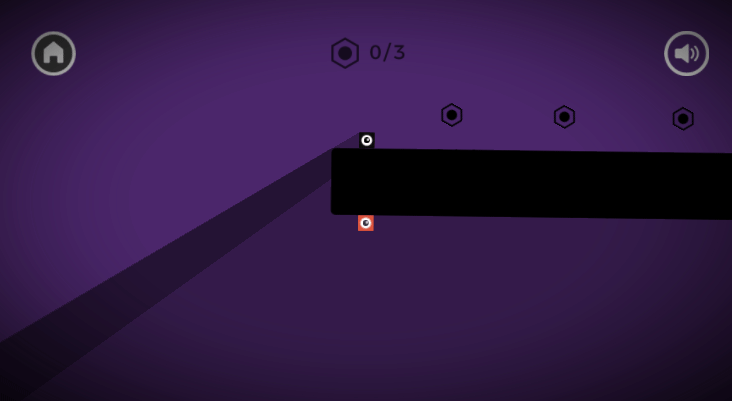
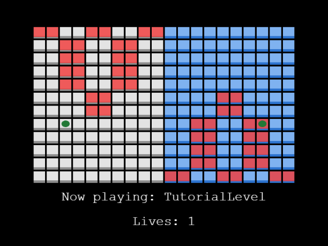
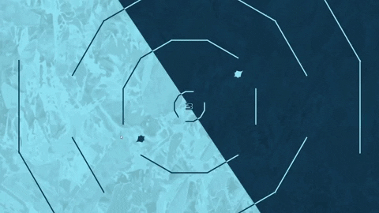
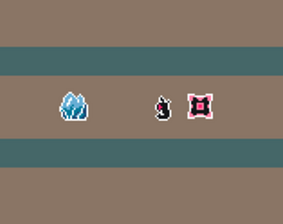
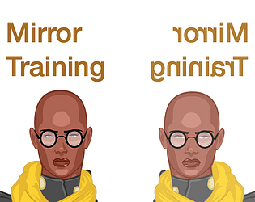
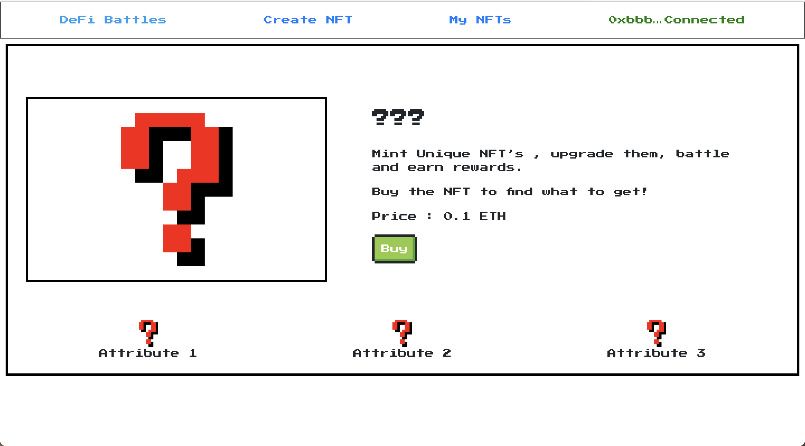

Earlier this spring, we were happy to partner with the folks at [Gamedev.js](https://gamedevjs.com/jam/2021/) for their 2021 hackathon event focused exclusively on games! Gamedev.js Jam celebrates HTML5 games where participants build a web game within 13 days of the jam on a given theme; this year’s was Mirrors.

The IPFS and Filecoin projects put up $5000 in Filecoin into the prize pool for the Decentralization category. As it was the first time the event hosted this category, the community of game developers were seeing some of these technologies for the very first time. Popular tools used were [Fleek.co](http://fleek.co/) and Pinata for hosting of assets and data.

Decentralized technologies are a great fit for independent game developers: no commercial platform commitments or restrictions, your games can live on whether you’re supporting them or not, no complex and costly back-end systems, and much of the infrastructure and bandwidth costs can be shifted to users and public networks like Ethereum or Layer 2 systems. We’re excited to work with game devs to bring their experiences to web3!

## Decentralized track challenge winners 🏆

👯 First place: [My Other Self](https://lo3ba.itch.io/my-other-self)

🎨 Second place: [OWNLY 1](https://microchipgnu.itch.io/ownly-1)

@[youtube](Q1a-i_r5fTw)

🪄 Third place: [Just Lasers and Reflections](https://svntax.itch.io/just-lasers-and-reflections)

💧Fourth place: [Reflectica](https://timmay.itch.io/reflectica)

👾 Fifth place: [Mirrors](https://johnonym.itch.io/mirrors)

💪 Sixth place: [Mirror Training Room](https://codyssia.itch.io/mirror-training)

❓Seventh place: [DeFi-Battles](https://shreykeny.itch.io/defi-battles)

🪞 Eighth place (Tie) [Mirror to Home](https://cdansantana.itch.io/mth)

🔮 Eighth place (Tie) [Rough Waters Decentralised Tarots](https://wetwilly.itch.io/rough-waters-decentralised-tarots)

Try out these awesome games and let us know what you think!

## Want to get involved in a future hackathon?

Follow us on Twitter at [@IPFS](https://twitter.com/ipfs) or [@Filecoin](https://twitter.com/filecoin). You can also subscribe to the [IPFS weekly newsletter](https://ipfs.us4.list-manage.com/subscribe?u=25473244c7d18b897f5a1ff6b&id=cad54b2230), or the [Filecoin monthly](https://filecoin.us16.list-manage.com/subscribe?u=a1dfb670c4f1fb042e82a1f1d&id=cf409026a0). Or, join us in chat in the [Filecoin Slack](http://filecoin.io/slack) or the [IPFS Discord](https://discord.com/invite/vZTcrFePpt). We’ll see you there! 👋