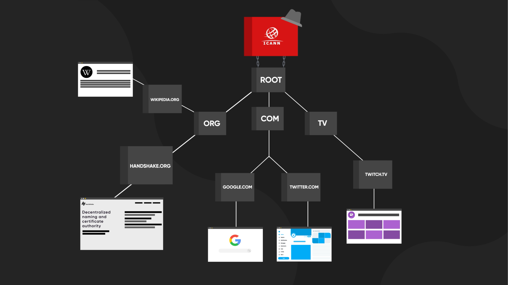
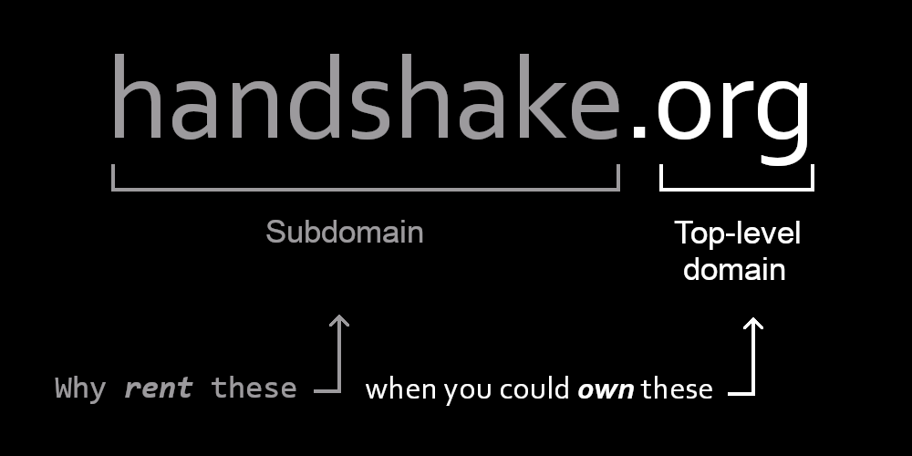

Domain names are things most end users take for granted. The average user doesn't spend time looking at DNS resolution or even knowing what a domain name server is. However, without domain name resolution, typing "google.com" into a browser will return an error with the confounding explanation that "the hostname you're looking for doesn't exist."

When you use your browser to visit a domain name like google.com, your DNS resolver will first ask the root for directions to the top-level domain "com".

  
Once "com" is found, your browser will then be directed to the owner of “com” — who keeps a list of directions to all the domains registered underneath “com” — for directions to the subdomain "google", which will then direct to google.com’s IP address and finally its website.

In a centralized environment, this may be an ideal setup. But what happens when the internet becomes decentralized?

## Introducing Handshake

In a decentralized internet, hostname resolution would be slightly different. The power that comes with controlling the top of the domain hierarchy would no longer be in the hands of a centralized entity, but instead governed by computer code. In other words, top-level domain names would be peer-based and would no longer exist under a single point-of-failure.

[Handshake (HNS)](https://handshake.org/) is a protocol that allows anyone to register a top-level domain without a long approval process or prohibitively high financial barriers imposed by a central entity (e.g. ICANN). This approach is revolutionary because it reinforces the original ethos of the internet as an open, free, and decentralized network, but also allows ordinary users to register a truly unique TLD that they would never have to worry about losing for saying or doing the "wrong thing."

Before appreciating how revolutionary Handshake is, first it’s necessary to understand why DNS servers are used in the first place.

## An Internet of Numbers

The early days of the internet were much like web3 is today. There were a lot of experiments trying to find the best and most user-friendly way to do things. The internet was the evolution of telnet, which allowed users to connect to bulletin board systems via phone lines. However, connecting to those systems required that the user know the connection address and port.

Browsers started using a centralized resolution system called the domain name system (DNS) to make things more user-friendly when the internet became more widespread. Instead of typing 208.65.153.238 into the address bar, a user could simply type "youtube.com," and DNS would do all the work for them.

Over time DNS resolvers became the backbone of the internet, and all top-level domain endings were registered with companies that were allowed to propagate on the broader internet. The Internet Corporation for Assigned Names and Numbers (ICANN) is the nonprofit that serves as an arbiter to register new top-level domains. You can't register a TLD that isn't of an accepted extension as determined by ICANN. However, the power of decentralization offers a valuable solution.

## Owning Your Own Name on the Decentralized Internet

Normally in the ICANN system, you can only rent subdomains on existing top-level domains like “.com”. To acquire your own TLD means waiting until applications are open again and paying exorbitant fees (last time it was $185,000 to review your application).

[Namebase](https://www.namebase.io/) is a service that allows you to buy a Handshake top-level domain, which can point directly to a website’s data on-chain. Anyone typing in that name will immediately be directed to your website. Handshake itself is responsible for putting that data on the blockchain, secured by a consensus protocol, and retrieving it as a DNS resolver.

Not only is the data that you have on the blockchain secure, but anyone can access your public data through your Handshake name. What's even more impressive is that you can use this data as a login token for other areas in web3.

Cross-login functionality isn't new, but how it works in the decentralized web is distinct from other methodologies. For example, many websites allow you to use your Google account to log in to their services. The account information is held by Google, enabling you to authenticate your username without building a whole new account. However, the data is still Google's.

With Handshake, the data used for authentication is owned by you and held securely on the blockchain. Google could choose to terminate your account at any time, which would cause you to lose access to everywhere you had logged into using those credentials.

Your in-app identity would be provable as the same across apps, and you could construct a higher-level reputation from that foundation. Imagine if all Twitter users had 'verified' status and you could also find them across their other social apps without any risk of following fake or wrong accounts by mistake.

Second-level domains of Handshake TLDs can be managed off-chain, allowing users to have a login that doesn't cost the owner transaction fees to register on the blockchain but which users can associate with an on-chain identity later, if they wish. It's the perfect combination of flexibility and utility.

### Handshake x IPFS

Handshake is a powerful tool in the IPFS ecosystem. [Fleek](https://fleek.co/) is a service that allows users to host websites directly on IPFS, leveraging location-based addressing and content persistence to ensure their sites don’t suffer the same outages and service restrictions as Web2 sites.

With Fleek, users can link their decentralized Handshake TLDs to their IPFS-hosted sites. The integration allows web developers to leverage both IPFS’ CID solution for content retrieval and Handshake’s solution for decentralized domain names.

  <iframe src="https://www.youtube.com/embed/OQiUK1Si_ck" style="position: absolute; top: 0; left: 0; width: 100%; height: 100%; border:0;" allowfullscreen title="Browsers 3000: Decentralizing the Internet's root with (HNS) Handshake - Tieshun Roquerre"></iframe>

## A New Age on the Internet Frontier

One of the things long-time users of the internet are likely to remember are the days of the domain name wars. People would go online and buy domain names, then sit on them, selling them back for considerable amounts to companies who wanted to build a website and unlock the power of the internet.

Part of the impetus for using the internet came from these early settlers. It seems to be happening all over again in web3. Already, users are buying up TLDs that they believe will hold value, speculating just like others did decades ago. The unstoppable march of technology makes decentralized hosting and name resolution the next big thing in web technology.

With hosting companies also getting in on the game, it might not be too long before browsers begin natively resolving Handshake. Until then, you can still be a part of the decentralized web and get in on the ground floor by checking out a Handshake on-ramp like Namebase.

To turn a phrase, the early user gets the username.

[_Browsers 3000_](https://events.protocol.ai/2021/browsers3000/) _is a five-week hackathon by Protocol Labs focused on decentralized solutions being built for the future of the web3 browser. This blog is a summary of a talk from_ [_Tieshun Roquerre_](https://twitter.com/TieshunR "Tieshun Roquerre")_, CEO of_ [_Namebase_](https://www.namebase.io/ "Namebase")_, discussing Handshake (HNS), a decentralized methodology for resolving DNS in the next iteration of the internet. Portions regarding IPFS, Fleek, and Handshake have been added. Check out the_ [_complete talk_](https://www.youtube.com/watch?v=OQiUK1Si_ck&list=PLuhRWgmPaHtR2MDeMaiUcsBmBqpIBqFEP&index=11) _(and others like it)._