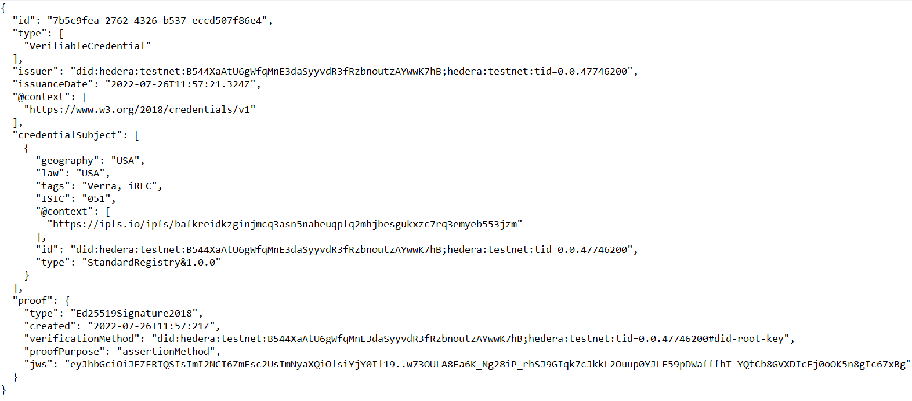

[Guardian](https://hedera.com/blog/guardian-v2-0-the-next-generation-of-esg-marketplaces-built-on-hedera) is a policy engine that links together tokenized digital environmental assets like carbon offsets, emissions, & RECs (Renewable Energy Certificates) to the physical reporting data that justifies their creation.

Guardian uses Hedera & IPFS to create provenance chains for ESG (Environmental, Social, and Governance) assets - specifically:

1. IPFS for decentralized storage of provenance chain artifacts
2. Hedera Consensus Service (HCS) to create an immutable & trusted history of all artifacts stored on IPFS
3. Hedera Token Service (HTS) to create either fungible or non-fungible tokens corresponding to the MRV data

When the tokens minted via Guardian are transferred to exchanges, prospective buyers can work backwards from the token to the corresponding The Measurement, Reporting & Verification (MRV) data that records the sustainability asset and be confident of that provenance - specifically the integrity of processes and identities of all parties that are involved in the ‘chain’ of events.

Guardian uses the W3C standards of Decentralized Identifiers (DIDs), Verifiable Credentials (VCs) and Verifiable Presentations (VPs) in order to capture the digitally signed documents that are stored on IPFS. Guardian uses VCs for a variety of data types - particularly:

* MRV data capturing the actual carbon reduction, removals or renewable energy generation.
* The policies that digitize the methodology. In this context of carbon debits & credits, a methodology is a framework document that defines the rules governing the MRV and the criteria for minting tokens corresponding to that MRV.

## Example

Consider a solar farm that creates renewable energy through photovoltaic panels. The owners of the farm wish to sell Renewable Energy Credits (RECs) representing the electricity generated by their panels. They will use Guardian to ensure that those RECs are auditable, discoverable and liquid.

Guardian will allow the solar farm owners to provide their business information and to describe the farm. This information is fundamental to trusting the RECs that will eventually be issued to represent the farm's electrical output - a farm in sunny Australia will have different annual output than one in cloudy Ireland. This project information will be captured in a digitally signed VC and the corresponding VP stored on IPFS. Guardian will also send an HCS message recording the CID of the file on IPFS to the Hedera network - this first HCS message effectively recording into history the establishment of the solar farm and its information.

Check out this [example](https://ipfs.io/ipfs/bafkreih6c5pa2u772k45c22e5hyscmv2eao4ntbvmhxym4pve7xevxv4qq) of such a VC recording the geolocation of a USA-based REC project stored on IPFS:

The proof at the bottom of the VC contains the digital signature of the Issuer of this VC. To verify this signature the public key of this Issuer can be retrieved by resolving the corresponding DID into its DID Document - this is also stored on IPFS.

If an accredited inspector visits the farm in order to verify the authenticity of the claims made by the owners, e.g. that the farm does indeed have the claimed number of panels and is indeed in sunny Australia, then the subsequent approval will also be captured as a VC and stored on IPFS - once again with a corresponding HCS message adding that approval to the provenance chain.

For privacy reasons, it may not be appropriate for the inspector’s own details such as their name to be publicly displayed on IPFS, it will be possible for such to only be visible to suitably authorized viewers of the provenance chain, perhaps a government auditor or similar.

Once the panels are turned on, the kWH of green electricity they start to generate will similarly be recorded - the MRV data captured as a VC, the VP stored on IPFS, and an HCS message sent to stamp these events into history.

When the solar panels generate 1 mWH of electricity, Guardian will mint a non-fungible token to represent that power. This rule, i.e. that a REC represents 1 mWH of electricity, is encoded in the policy that governs this Guardian instance.

With this REC now minted, a buyer will be able to work backwards through the provenance chain - this sequence described below:

 1. Begin at the REC token instance
 2. Confirm the token identifier is appropriate for this Guardian
 3. Find tx that minted the NFT. For this mint to be valid, it must be provably linked to MRV data that records the generation of 1 MwH of renewable electricity.
 4. Examine mint tx memo - value is an HCS tx timestamp
 5. Query mirror for the HCS message tx - it represents the creation and logging of an VP(VC(MRV))
 6. Confirm the topic identifier is valid for this Guardian
 7. Examine message contents, grab URL param - it is an IPFS CID
 8. Resolve CID to retrieve VP(VC(MRV)) - discoverable on [CO2.Storage](https://co2.storage/) and [IPFS Explorer](https://explore.ipld.io/)
 9. Examine VP(VC(MRV),
    1. Confirm it maps to the appropriate tokenID
    2. Verify signatures, retrieve DIDs as necessary
    3. Confirm the MRV data meets the criteria of the policy
10. If the token passes the above checks, purchase

Once the purchaser has the REC in their own Hedera account, it could be used to offset other tokens representing the purchaser's carbon emissions. These emissions tokens, if created via Guardian, would have their own provenance chain.

## Conclusion

Guardian uses Hedera & IPFS to create provenance chains for ESG assets - making tokenized sustainability assets like RECs trusted and discoverable. IPFS provides decentralized storage for the artifacts that make up the provenance chains and Hedera allows for a decentralized audit trail and tokenization layer. Guardian is using IPFS & Hedera together to bring the balance sheet of the planet to a public ledger.