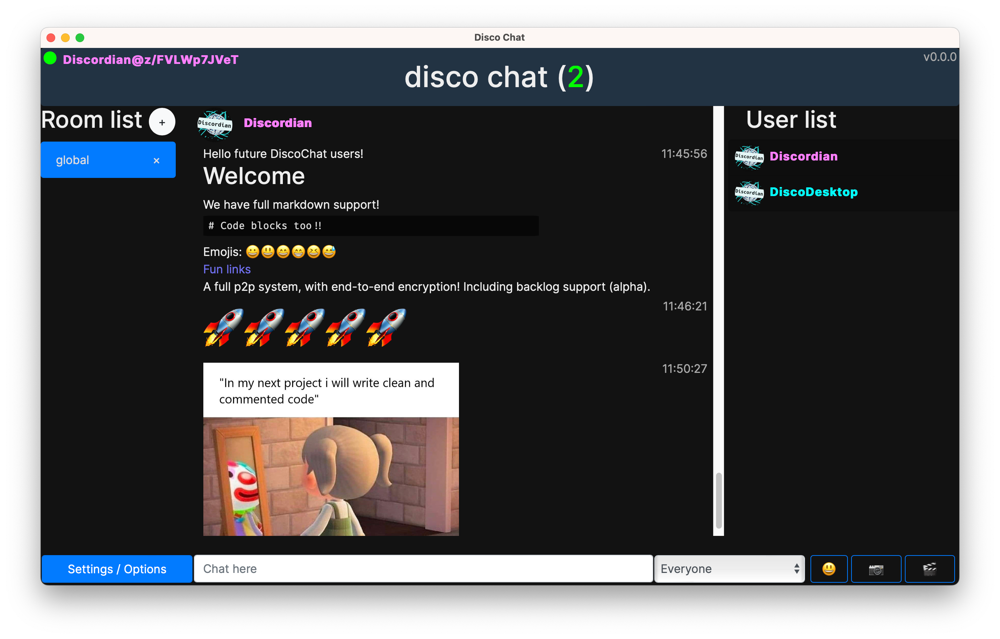

<style>
.type-rich li + li {
  margin-top:0em;
}
.type-rich h3 {
  font-weight: bold;
}

.type-rich h4 {
  font-weight: bold;
}
.type-rich li > ul {
  padding-top:0;
}
</style>


<span style="position:relative;top:-1em;">*A peer-to-peer chat application built using Tauri, JavaScript, and HTML.*</span>

### Table of Contents

- [What is Disco Chat?](#what-is-disco-chat)
  - [Disco Chat's Journey](#disco-chat-s-journey)
  - [Disco Chat Today](#disco-chat-today)
- [Disco Chat's Features](#disco-chat-s-features)
  - [IPNS Profiles](#ipns-profiles)
    - [Technical breakdown](#technical-breakdown)
  - [End-To-End Encryption](#end-to-end-encryption)
    - [Technical breakdown](#technical-breakdown-2)
- [Wrapping Up](#wrapping-up)
- [Links](#links)


[**Disco Chat**](https://github.com/TheDiscordian/disco-chat) is a fun, easy-to-use peer-to-peer desktop chat application sporting custom profiles, end-to-end encryption, offline chat sync, and more! It's meant to help show developers how to build applications like it. Today, it doesn't have binaries available, but there's [an issue open](https://github.com/TheDiscordian/disco-chat/issues/20) requesting help with that ❤️.

At it's core Disco Chat uses IPFS & libp2p, powered by a [Kubo](https://github.com/ipfs/kubo) node. It's **written in mostly JavaScript** with the **interface in HTML/CSS** to hopefully make it easy-to-use for most developers today. There's a **Rust component from [Tauri](https://tauri.app/)** which allows us to have a thin browser to work with on the desktop (and mobile in the future!), **giving us the full power of Kubo**, JavaScript, HTML, and CSS in a single application.

## What is Disco Chat?

As mentioned previously, Disco Chat is a peer-to-peer chat application primarily focused on showing developers how to build applications like it. **It's also a passion project of mine**, Discordian.

Disco Chat is **meant to demonstrate the most simple yet fully-featured peer-to-peer chat application**. Ultimately it should support full syncing backlog with peers, distributed IPNS profile persistance, offline chatting, end-to-end encryption for DMs, relaying messages to peers who can't connect directly to each-other, and it should be comfortable. Today, most of those features work well, though sadly mobile is currently unsupported (but used to be!).

Disco Chat is based upon [native-ipfs-building-blox](https://github.com/TheDiscordian/native-ipfs-building-blox), which is a great kit for getting started on building desktop IPFS applications using HTML/Javascript (Rust too if you like). If you're looking at taking some code snippets from Disco Chat for a totally different idea, **I highly recommend using native-ipfs-building-blox as a base**.

### Disco Chat's Journey

Disco Chat had its **beginnings as a truely minimal in-browser chat application**. You could set a nickname and write messages into a public channel, the backend could support multiple "rooms" but the frontend could not. This application exists today as the write-up [Create a Simple Chat Application](https://docs.ipfs.tech/how-to/create-simple-chat-app/) and a video titled [IPFS: Browser Connectivity Walkthrough](https://www.youtube.com/watch?v=xZiN9dLvMoU). Its goal, similar to Disco Chat, was to provide developers with the scaffolding they'd need to build an in-browser chat application, or whatever else they could dream up.

From there Disco Chat was born! After building the framework I thought it'd be fun to make my own chat application and see what struggles are involved with it. At this point Disco Chat still worked in a browser, complete with multiple-rooms, markdown, image sharing, video sharing, emojis, multi-line text, and more! It was **exciting opening up a web page that instantly connects you to a serverless chatroom** with other peers.

Disco Chat, and the original chat example relied on [CircuitRelayV1](https://github.com/libp2p/specs/blob/master/relay/circuit-v1.md) and [libp2p-webrtc-star](https://github.com/libp2p/js-libp2p-webrtc-star). Unfortunately these days it's **much harder to achieve relaying in a browser** with the deprecation of CirvuitRelayV1 in Kubo. On top of this, the **browser environments practically strangle most p2p techniques** making things like hole-punching very hard. That was already enough to convince me to persue other avenues, but now libp2p-webrtc-star is also deprecated. So continuing on the browser wasn't really feasible for the time being.

One day I'd love to see the browser version return, but for now we can continue work in a pseudo-browser environment so **porting it back to browser should be relatively straight-forward**.

### Disco Chat Today

I **wanted to keep Disco Chat in the browser** as it's easy to create graphical applications that work cross-platform, not to mention the current popularity of Javascript. First I looked at Electron, but I'm haunted by many complaints developers and users have about the behemoth (not to mention it's quite large). After some searching I **found Tauri, a very thin/lightweight browser view** tied together with Rust.

From there I **created [native-ipfs-building-blox](https://github.com/TheDiscordian/native-ipfs-building-blox)** to assist in creating desktop applications with a webview powered by a Kubo node in the background. The API on the Javascript side is exactly the same, but by using [ipfs-http-client](https://www.npmjs.com/package/ipfs-http-client) it's **Kubo handling all the heavy lifting** like running the IPFS node instead of js-ipfs. This **gives us a lot of powers like advanced hole punching techniques** using CircuitRelayV2 and being able to listen on a socket in general.

After this I **just dropped the browser-based Disco Chat into the [ui directory](https://github.com/TheDiscordian/disco-chat/tree/master/ui) with some tweaks** to make it work correctly with some of the js-ipfs API changes. After this I cleaned up that ui directory, added a boatload of comments, added IPNS-based profiles and end-to-end encryption.

## Disco Chat's Features

Disco Chat has many features, some notable ones:

- Chat rooms
- Emojis
- Markdown
- Image sharing
- Video sharing

And these are cool, but nothing that stands out as special in the web3 space (except maybe serverless & chainless chat rooms). To make Disco Chat stand out with some useful features other devs could learn from I did some brainstorming and reading with the community and my fellow teammates. I concluded many **devs get hung up on at least these two things** in a distributed and chainless/consensusless environment:

1. **How to have mutable data beyond just a website / redirect**
2. **How to encrypt or hide data**

So to assist with those problems, I created **IPNS-based profiles** for Disco Chat - to show off mutable data, and a **simple end-to-end encryption** feature - to show the basics of how to hide or encrypt data over IPFS (or any public room).

### IPNS Profiles

Previously, in the chat example a user's nickname was sent over with each message send. As it evolved into Disco Chat, a CID linking to a profile picture was also sent over with each message. Now, the **profile information isn't sent over at all**! Instead a CID of the profile info itself is published via [IPNS](https://docs.ipfs.tech/concepts/ipns/) using the user's PeerID (also known as their `self` key!). This means if a peer user wants to look another peer up, they already know the peer's PeerID thanks to libp2p, so they **only need to do an IPNS lookup on it to retrieve the profile info as needed / desired**.

#### Technical breakdown

The meat of the IPNS Profiles code lives in [ui/peers/ipns.js](https://github.com/TheDiscordian/disco-chat/blob/master/ui/peers/ipns.js), here's a *slightly* modified example, which might be **easier to snatch up as a snippet:**

```js
// fetchPeerInfo will try to resolve a PeerID over IPNS to get their profile information, returning it as an object
async function fetchPeerInfo(ipfs, id, timeout) {
  if (timeout == undefined) {
    timeout = 5000;
  }
  let peer = undefined;
  for await (const name of ipfs.name.resolve(id, {timeout: timeout})) {
    peer = name;
  }
  if (peer == undefined) {
    return;
  }
  const content = [];
  try {
    for await (const chunk of ipfs.cat(peer, {timeout: timeout, length: 1024})) {
      content.push(chunk);
    }
  } catch {
    return;
  }
  if (content.length == 0) {
    return;
  }
  try {
    peer = JSON.parse(new TextDecoder().decode(content[0]));
  } catch {
    return;
  }
  return peer;
}

// publishProfile publishes our profile information to IPNS
async function publishProfile(ipfs, currentNick, currentImg) {
  let cid = await ipfs.add(JSON.stringify({nick: currentNick, img: currentImg}));
  await ipfs.name.publish(cid.cid);
}
```

We have two functions here: `publishProfile` and `fetchPeerInfo`. 

**publishProfile** is what publishes your profile info to IPNS. It takes three arguments: 
- `ipfs` - an [IPFS core API](https://github.com/ipfs/js-ipfs/tree/master/docs/core-api) compatible object
- `currentNick` - a string representing the peer's nickname
- `currentImg` - a string CID representing the peer's avatar

**fetchPeerInfo** will fetch another peer's profile information, parse the JSON, and return an object (returning `undefined` upon error). It takes three arguments:
- `ipfs` - an [IPFS core API](https://github.com/ipfs/js-ipfs/tree/master/docs/core-api) compatible object
- `id` - a string representing the peer's PeerID
- `timeout` (*optional*) - an integer representing the time to wait while searching for the profile in milliseconds

I hope the usage is straight-forward, here's an example:

```js
// Connect to a local Kubo node
var ipfs = await IpfsHttpClient.create();
// Retrieve our PeerID as a string, and output it to console
var me = await ipfs.id().then(id => id.id.toString());
console.log(me);

// Publish our profile with the nickname "Example_Nickname"
// and picture "Qmcm32sVsMYhURY3gqH7vSQ76492t5Rfxb3vsWCb35gVme"
await publishProfile(ipfs, "Example_Nickname", "Qmcm32sVsMYhURY3gqH7vSQ76492t5Rfxb3vsWCb35gVme");

// Retrieve our own profile info
let peerInfo = await fetchPeerInfo(ipfs, me);
// Output our profile info as JSON to console
console.log("Got peer info: " + JSON.stringify(peerInfo));
```

### End-To-End Encryption

I often see questions along the lines of "How do I hide the data in a CID?" or sometimes more bluntly "How do I encrypt the data before I add it to IPFS?". For Disco Chat I implemented **one simple scheme** anyone can use. It will **encrypt any data you want** for a specific peer. Meaning, you and the peer you encrypt the data for can decrypt it, but no other peer can.

#### Technical breakdown

<div style="border-left:4px solid #e7c000;border-color:#e7c000;padding:1rem 1.5rem;margin:1rem 0;background-color:#fff7d2">
I highly recommend studying the <span style="font-weight:bold;">security implications</span> of using encryption in the wild or seeking consulting on the subject before using a specific scheme.
</div>

Disco Chat's encryption example lives in [ui/crypto.js](https://github.com/TheDiscordian/disco-chat/blob/master/ui/crypto.js). **After reading the above warning**, you'll need a few libraries this example depends on to get started:
- [noble-ed25519](https://www.npmjs.com/package/@noble/ed25519) - to work with ed25519 keys
- [aes-js](https://www.npmjs.com/package/aes-js) - to handle symmetric encryption
- [bs58](https://www.npmjs.com/package/bs58) - to decode PeerIDs

To decrypt a message all a reciever needs is the nonce used to generate the encrypted message, and the encrypted message itself. Here's a code snippet:

```js
// decryptMsg is called by the receiver to decrypt the message. It takes the
// encrypted message (msg), the sender's public key (from), and the unique
// nonce used to encrypt the message (n). If this message is from ourselves
// (me), it will use the `to` key to decrypt it.
//
// _priv_key is the private key to our PeerID.
// 
// This function can only decrypt messages meant for us, or messages sent by
// us.
async function decryptMsg(msg, n, from, to, me, _priv_key) {
  let other_pub = null;
  if (from != me) {
    other_pub = bs58.decode(from).subarray(6);
  } else {
    other_pub = bs58.decode(to).subarray(6);
  }
  let secret = await nobleEd25519.getSharedSecret(_priv_key, other_pub);
  let encryptedBytes = aesjs.utils.hex.toBytes(msg);
  let aesCtr = new aesjs.ModeOfOperation.ctr(secret, new aesjs.Counter(parseInt(n)));
  return aesjs.utils.utf8.fromBytes(aesCtr.decrypt(encryptedBytes));
}

// encryptMsg is called by the sender to encrypt a message. It takes the
// message (msg) and the receiver's public key (to). It returns a list
// containing the unique nonce and the encrypted message.
//
// _priv_key is the private key to our PeerID.
async function encryptMsg(msg, to, _priv_key) {
  let other_pub = bs58.decode(to).subarray(6);
  let secret = await nobleEd25519.getSharedSecret(_priv_key, other_pub);
  let uniqueN = window.crypto.getRandomValues(new Uint16Array(1))[0];
  let aesCtr = new aesjs.ModeOfOperation.ctr(secret, new aesjs.Counter(uniqueN));
  let encryptedBytes = aesCtr.encrypt(aesjs.utils.utf8.toBytes(msg));
  return [encryptedBytes, uniqueN];
}
```

**decryptMsg** decrypts the encrypted message fed to it. It takes six arguments: 
- `msg` - a string of the encrypted message to decrypt
- `n` - an integer representing the nonce used to encrypt the message
- `from` - a string CID representing the sender's PeerID
- `to` - a string CID representing the reciever's PeerID
- `me` - a string CID representing our own PeerID
- `_priv_key` - the private key of our own PeerID

It returns a string of the decrypted message.

**encryptMsg** encrypts the message fed to it. It takes three arguments: 
- `msg` - a string to encrypt
- `to` - a string CID representing the reciever's PeerID
- `_priv_key` - the private key of our own PeerID

It returns a list containing [encrypted data, nonce]. Both the encrypted data and the nonce will be needed the decrypt the message.

It's important to note that **these functions generate the secret every single time**. This is a moderately heavy operation, which technically only needs to be done once per peer. So if you're looking for performance, you should be caching secrets. This is left as an exercise for the reader 🙂.

The biggest challenge to using these functions will likely be in **retrieving your node's private key**. For Kubo, this is stored by default in your config file (`~/.ipfs/config`) and needs to be decoded. In Disco Chat, this is done on the Rust side in [src/main.rs](https://github.com/TheDiscordian/disco-chat/blob/master/src/main.rs#L66). The **[native-ipfs-building-blox](https://github.com/TheDiscordian/native-ipfs-building-blox) scaffolding has the Rust side of this built-in**, and just needs to be exposed on the JavaScript side:

```js
// Connect to a local Kubo node
var ipfs = await IpfsHttpClient.create();
// Retrieve our PeerID as a string, and output it to console
var me = await ipfs.id().then(id => id.id.toString());
console.log(me);
// A different PeerID for example purposes
var notMe = "12D3KooWQLS5bagAnf43kSdf5Nd9yiMW2sBksL43q94nduXzpdpV";

// retrieve our private key
let priv = await __TAURI__.invoke('get_priv_key');
// convert our key into something nobleEd25519 likes
var _priv_key = Uint8Array.from(atob(priv), c => c.charCodeAt(0));

// run encryptMsg to get the encryptedMessage and nonce
let [encryptedMessage, nonce] = await encryptMsg("hello world", notMe, _priv_key);
// we set "from" to "me" because the message is from us
let decryptedMessage = await decryptMsg(aesjs.utils.hex.fromBytes(encryptedMessage), nonce, me, notMe, me, _priv_key);

console.log(decryptedMessage); // "hello world"
```

## Wrapping Up

One day hopefully Disco Chat can end up back in a browser, and have a mobile version again. Today though, I feel it's fun to use and demonstrates some examples for mutable data and end-to-end encryption. If you're experienced with Tauri, or are just feeling adventurous [I'd love some help with building some Disco Chat binares](https://github.com/TheDiscordian/disco-chat/issues/20).

I hope this article was interesting to you, if it wasn't then at the very least I hope the above code examples help you. Let's all build the future of the web together, today.

## Links

- [TheDiscordian/disco-chat: A peer-to-peer messaging app | Github](https://github.com/TheDiscordian/disco-chat)
- [TheDiscordian/native-ipfs-building-blox: Create native IPFS powered desktop applications by using HTML/CSS/JS | Github](https://github.com/TheDiscordian/native-ipfs-building-blox)
- [Create a simple chat app | IPFS Docs](https://docs.ipfs.tech/how-to/create-simple-chat-app/)
  - [IPFS: Browser Connectivity Walkthrough (2021) | YouTube](https://www.youtube.com/watch?v=xZiN9dLvMoU)
- [Getting Started With IPFS & Filecoin](https://protocollabs.notion.site/Getting-started-with-IPFS-Filecoin-173c73d4d8d64765a42058594bc46bb7)