@[youtube](aZnFmlXHHzg)
*The video above is a condensed version of this post, if you're looking for a video containing the entirety of this post, head down to [the bottom of this page](#Videos) to find it.*

**Table of Contents**

- [What is the Client-Server Model?](#what-is-the-client-server-model)
  - [Limitations of the Client-Server Model](#limitations-of-the-client-server-model)
  - [Single Source of Truth](#single-source-of-truth)
  - [Location Based Addressing](#location-based-addressing)
  - [Single Point of Failure](#single-point-of-failure)
  - [Costly to Scale](#costly-to-scale)
  - [Restricted and Censored Content](#restricted-and-censored-content)
- [The Distributed Web](#the-distributed-web)
  - [Centralized vs Decentralized vs Distributed](#centralized-vs-decentralized-vs-distributed)
  - [Content Addressing](#content-addressing)
    - [The Composition of a CID](#the-composition-of-a-cid)
  - [Trustless Verification and Persistence](#trustless-verification-and-persistence)
  - [Unstoppable Data & Services](#unstoppable-data--services)
  - [Scaling & Inter-Planetary](#scaling--inter-planetary)
- [Conclusion](#conclusion)
- [Links](#links)
  - [Getting Started](#getting-started)
  - [Learning Resources](#learning-resources)
    - [Videos](#videos)
    - [Case Studies](#case-studies)
  - [Other Resources](#other-resources)

## What is the Client-Server Model?

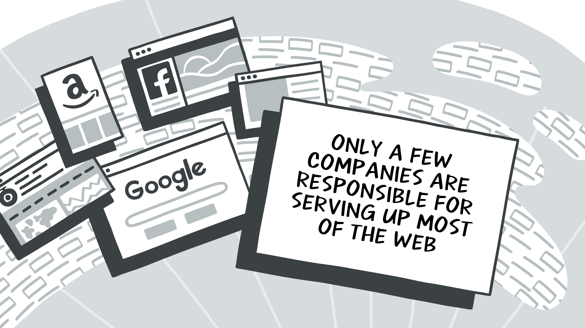
### Limitations of the Client-Server Model

Today, only a few companies are responsible for serving up most of the web. We have Google, Amazon, Facebook, and Fastly to name a few. These companies combined serve us our ads, web pages, social media, videos, images, and allow us to host servers and services on their infrastructures. To interact with these services, we also have to use their APIs. We send some data to their servers, and wait for a response. We then process that response and do whatever magic we need to do to create our apps and websites.

There are several problems with this design, from costs to privacy. Free services for example are often funded by ads. Ads can destroy privacy as all our data is routed through a few central points and sold to third parties. Effectively, free services are paid for by our attention and private information.

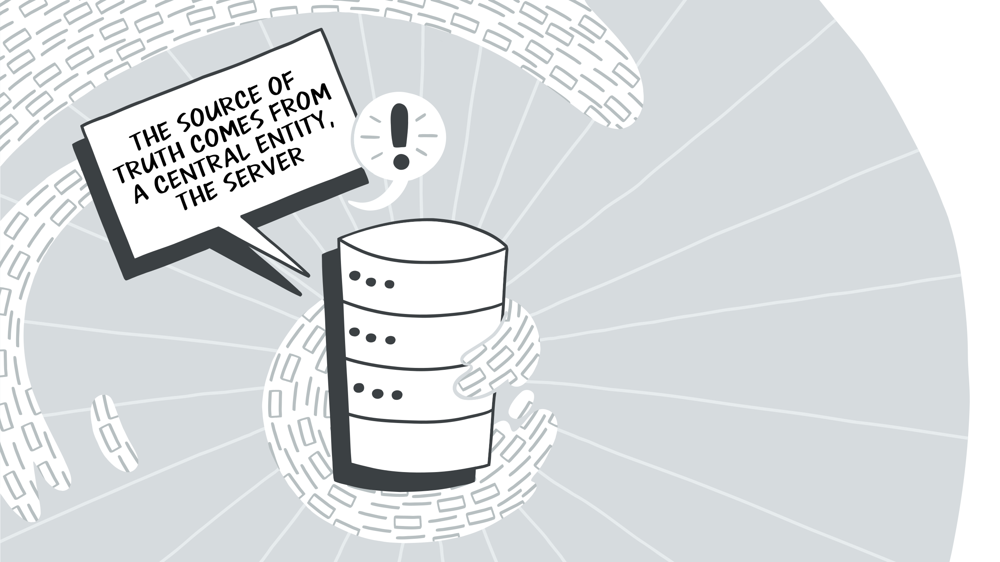
### Single Source of Truth

If you want to view a video, send a message, collaborate with remote teammates, or do anything on the web at all, you’re going through someone’s central server. This principle is fundamental to the client-server model. We use a client, such as a web-browser or chat app, and **communicate with a single entity**, that’s the server in the client-server model. Relying on just one point for our source of truth also opens up a whole host of problems like trust. Today, we have TLS certificates to verify an entity is who they say they are, however that doesn’t do us much good if that service is compromised. Even if we are sure of who the entity is, it still doesn’t help us know how advertisers or others are using our data, or even what data is being collected.

Developers building applications often rely on APIs operated by large centralized entities (e.g. Stripe, Google, Cloudinary, Auth0). The more APIs your application relies on, the more fragile it is. If any of the APIs are unavailable, your app stops functioning. Today, a popular way to build is to lean on the APIs of another remote service, which makes the web as a whole very fragile.

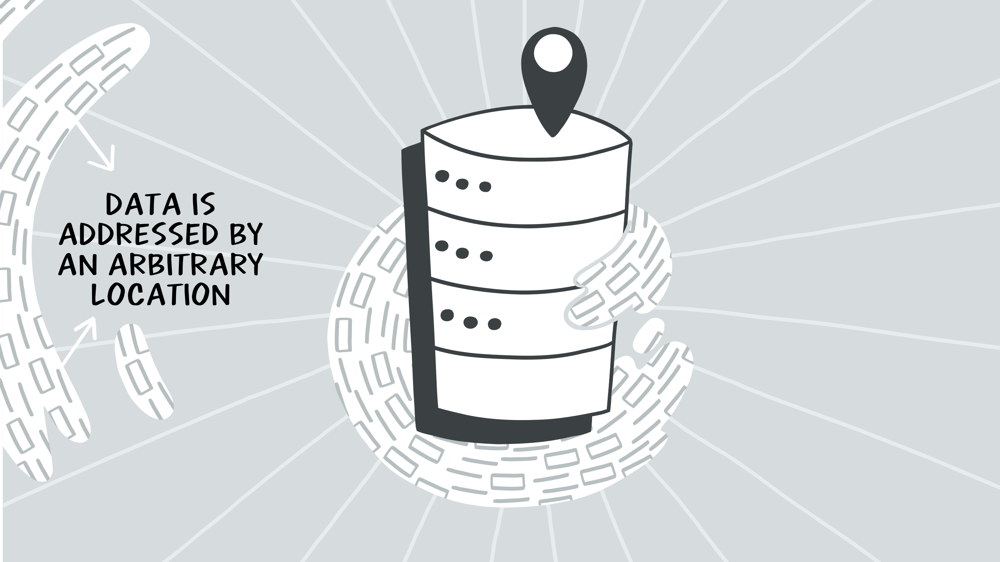
### Location Based Addressing

In the client-server model, if you want some data, you must know ***where*** it is. If you want an image, you typically need the full URL to that image to retrieve and share it. If that image is no longer available, you either need to search for it or upload a copy on another server to make it available again (*that's assuming you even have a copy yourself*). After uploading, you must also share the new location of that image. This principle is called **location-based addressing**, and it's how most of the World Wide Web functions today. You go to a website with a URL, and all data from that website is addressed by the location of the data. If the image analogy is too hard to follow, think of how you’d share a video on your favourite video platform; you’d likely just share the URL to the video, also known as the location of the video.

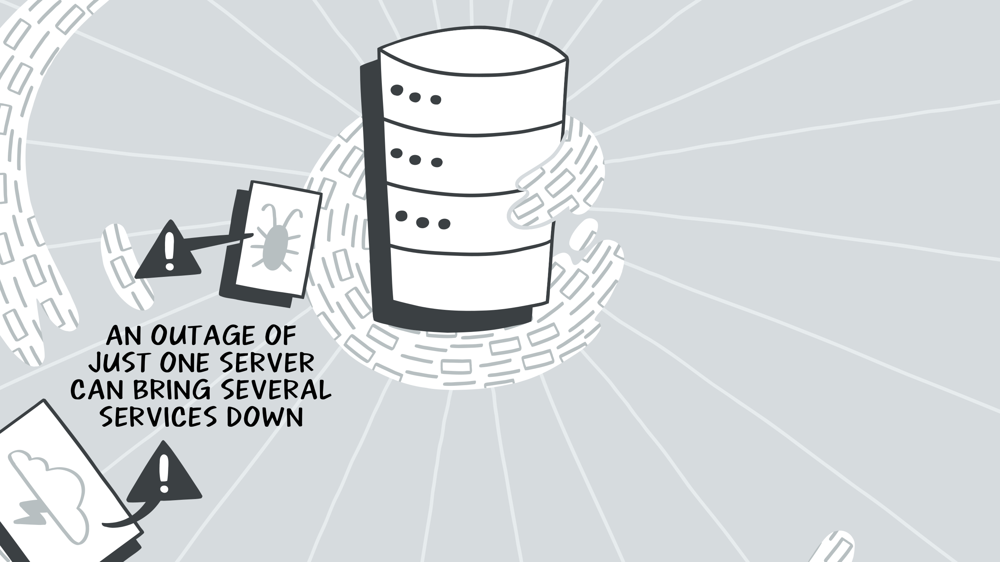
### Single Point of Failure

Think of when [AWS, Fastly, Facebook, or YouTube go offline](https://totaluptime.com/notable-network-and-cloud-outages-of-2021/). These events are treated as news, and often slow or even halt productivity. **When one of these services goes offline, it’s much more impactful than just a single image or video being lost**, you’ve now lost access to your ability to make new data available at all! All the data you have hosted in these central hubs is temporarily completely inaccessible, or worse, permanently. The location of the data cannot be accessed, because it’s offline. You cannot ask for the data from the wider web, and expect to receive it, even if another related entity has the very data you’re looking for.

You could of course, host your own service. Maybe distribute out the locations of your servers in a way that prevents a single outage from taking down your service. Let’s say you even come up with the next big idea for a website or platform, where you’re in control of all your infrastructure, not relying on some *other* central entity for your needs…

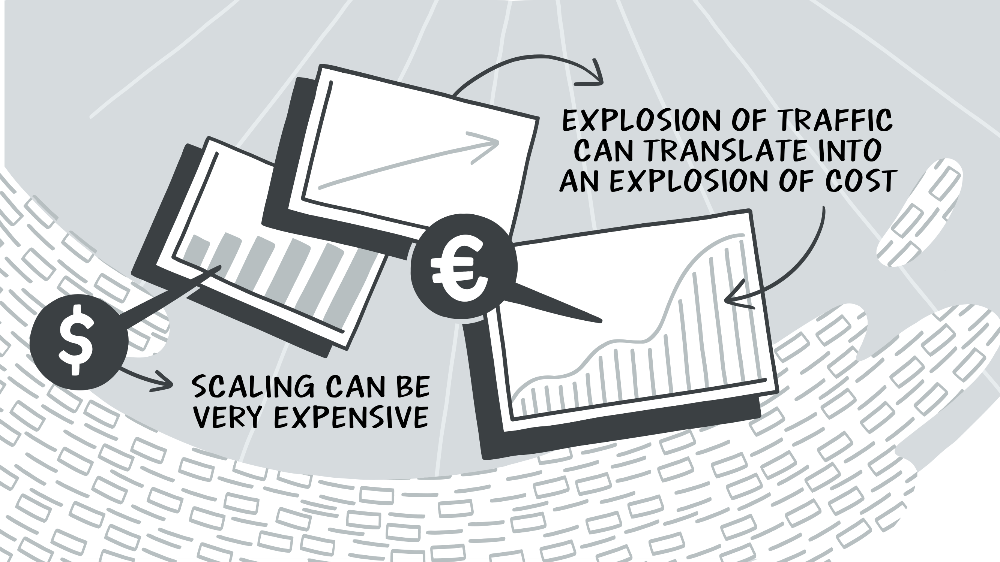
### Costly to Scale

This leads in to my next point: **Scaling can be very expensive**. These expenses don’t always, or maybe not even usually happen linearly. Meaning, an explosion of traffic can translate into an explosion of costs. Whether you host your own infrastructure, or you pay someone else to, you’ll be paying for it if you want it to scale and run effectively. The more users you have, the more traffic that generates, your CPU, RAM, and bandwidth expenses ramp up. On top of this, if users end up depending on your service, you’re obligated to keep this service running and available if you want to retain users and keep them happy. Not everyone can afford these costs, and they can be quite daunting, especially if you just want to create a fun project, technology, or even a blog. A lot of companies mentioned previously turn to advertising  to supplement these costs. This results in so much of humanity selling their private information in exchange for free services online.

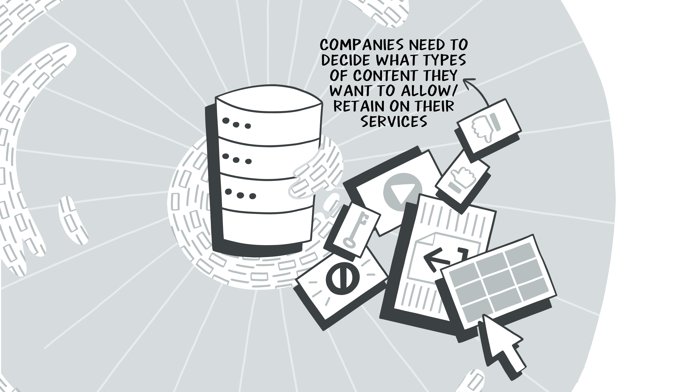
### Restricted and Censored Content

Content creators are often completely locked to a few platforms like YouTube, Instagram, and others. Those can be subject to a whole host of rules and regulations as well, far more restrictive than what your local government might allow, and you have no say in when or how those rules change.

If you want to host any content at all on one of these platforms you must ensure you’re abiding by their rules and regulations. This can be quite unfortunate when **popular content gets lost to rules changing or updating**, which is quite common with video and graphic media today. As a content creator sometimes it can feel like an impossibly daunting task to solve this problem. You could set up their own services as mentioned previously, however not everyone knows how to do that effectively, and aren’t prepared for the time and costs associated with doing that.

We can do better; **breaking free from the client-server model means re-thinking how the web works as we know it today**.  The client-server model represents web2 as we know it today. Love it or  hate it, there’s a clear and strong argument for how the web2  model, referring to the client-server model, can be improved. What do we call this new model?

## The Distributed Web

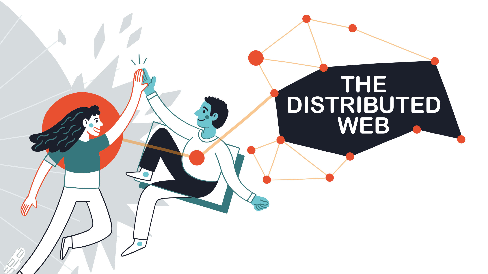

This new model is referring to **the distributed web**, so let’s talk about that, and how IPFS fits in. But first, for the uninitiated, let’s briefly discuss what the distributed web is, and what it means to you. Whether you’re a user or a developer, you can benefit from the distributed web, what I think of as web3.

### Centralized vs Decentralized vs Distributed

Pictured above are 3 networking models. The client-server model is a **centralized model**. This is why we’re always talking about central servers and single points of failure. You can see the central point in orange, this is the server. Then the spokes are the clients, who are often the users. This graphic should make it easy to see how if that central point is ever removed, then the users can no longer communicate with one-another.

The **decentralized model** is a huge improvement to the centralized model. It still operates in a client-server sort of way where you end up with hubs that serve users, and if a hub goes out, only a piece of the network is lost. While this is a nice improvement, it still doesn’t solve all the problems the client-server model carries with it. Today we see this model used with many things like ActivityPub and Matrix. When those services have an outage, it only affects a piece of the communities they represent, instead of the whole social network or chat service.

In the **distributed model** each user is also providing a piece of the network itself. If a user goes offline, the network functions as normal. If a major node goes down, the network can still function as well by leveraging the local peers. It is the champion of resilience, and the model that will take us forward. Some nodes might be bigger than others, but no single outage can take the entire network down. Let’s take a look at how IPFS fits into all this, and also dive deeper into the distributed model itself.

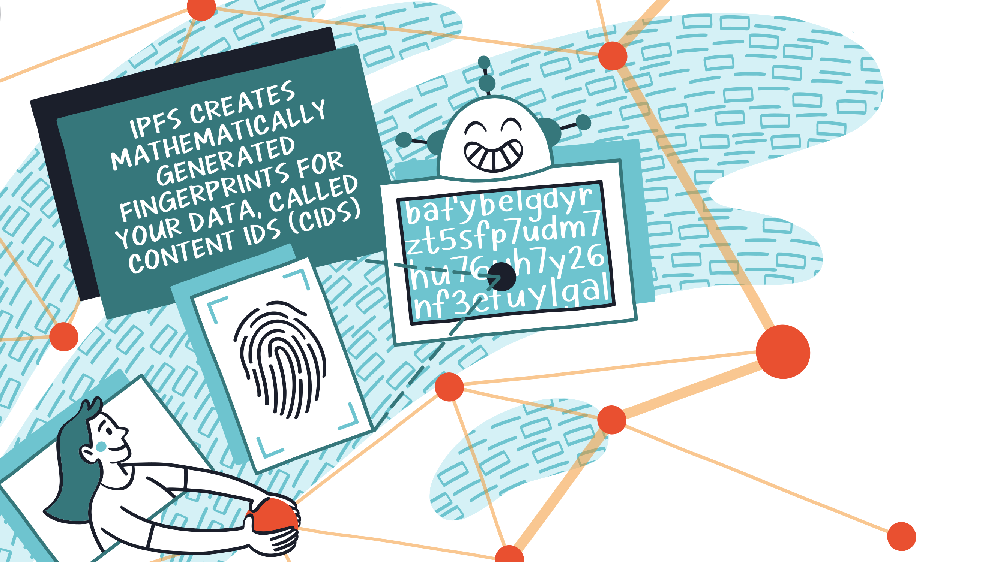
### Content Addressing

We went over location-based addressing, now let’s talk about one of the fundamental building blocks of an alternative called **content addressing**. IPFS creates mathematically generated fingerprints for data called content identifiers, or CIDs for short. This step relates to something called IPLD or Inter-Planetary Linked Data which is fundamental to how IPFS works to give us content addressing, **breaking us free from location-based addressing**.

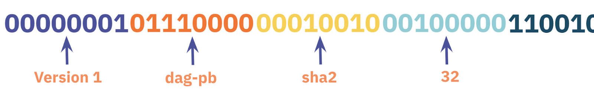
#### The Composition of a CID

Pictured above is the anatomy of a v1 CID, represented in binary.  On the far left of the image, not pictured here would be the multibase prefix. This is actually omitted because when working with binary, there actually isn’t a multibase prefix, you can save that byte. What the multibase prefix does is allows us to know what base encoding was used to create the CID, as IPLD supports many. 

Next we have the version identifier, which is whatever version number we’re working with, in this case, we’re working with a **version 1** CID.

Next, we have the multicodec, **dag-pb**, which indicates this DAG (directed-acyclic graph) is protocol buffer encoded. The multicodec field itself is an unsigned-varint. The list of supported codecs is available in the [github multiformats repository](https://github.com/multiformats/multicodec/blob/master/table.csv).

Next up is the multihash, which includes 3 things, a multihash algorithm, a multihash length, and then finally the hash digest itself. You can see here we’re working with a **sha2 hash of 32 bytes in length**, then the hash itself trails off the screen. The [multihash specification](https://github.com/multiformats/multihash) is also available in the multiformats github repository.

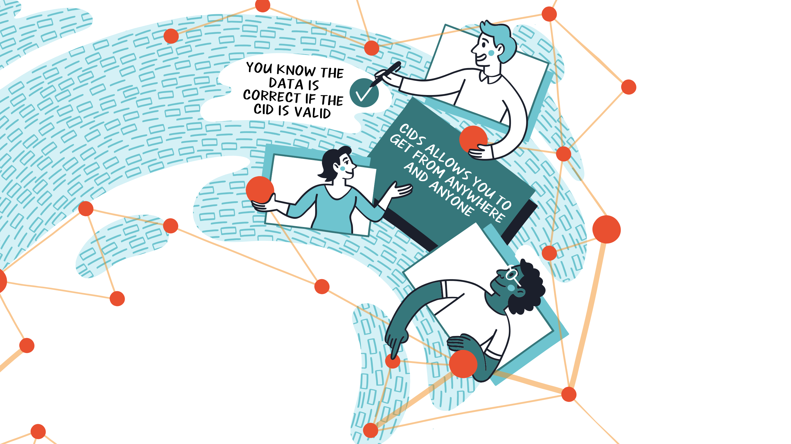
### Trustless Verification and Persistence

As we went over, **you don’t have to trust who’s sending data to you, as you can run the hash function of the CID** and verify it yourself. IPFS uses CIDs by either looking up the CID in the distributed hash table (the DHT), or by using bitswap and asking their local peers “do you have this CID?”. With this, it no longer matters where the data lives, as we know exactly what we want, so it doesn’t matter who has it, just that *someone* has it. We’ve now broken free from location-based addressing.

If you want to share a web page, an image, a video, or an article, you know if you send that CID to your friend they can download the exact same version of the data you also saw. As long as at least your node or someone else’s has a copy, you can share it. It wouldn’t matter if the initial hoster removed the data, only that you or someone else has a copy of the data. Through this, **data can live as long as there’s someone who wants it to**. With [Filecoin](https://filecoin.io/) you can even pay storage providers to cryptographically guarantee your data will live for some time, maybe even forever, but that dive is for another post. 

In the meantime, if you’re looking for a service to persist your data, I recommend checking out [web3.storage](https://web3.storage), [nft.storage](https://nft.storage), and [lighthouse.storage](https://lighthouse.storage). They’re all storage helpers eager to get your data available over IPFS and backed up to Filecoin.

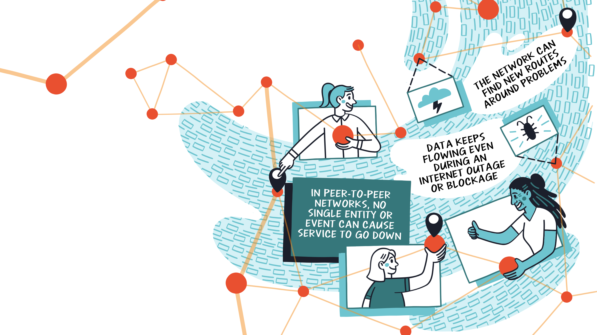
### Unstoppable Data & Services

Now that we’ve broken free of location-based addressing, and moved on to content addressing, what does that mean for us? It means that now transparently, **the network can find new routes around problems**. Problems in this case can be outages, we know that if our node goes down for a period of time that we’re in the clear if we’ve gotten our data onto some other nodes. Or even if a user running an IPFS node happens to have a copy of our data.

With IPFS your node will cache new data until it’s garbage collected,  which helps automatically strengthen the availability of related CIDs. This can aid in regional and even country-wide Internet outages because as long as some node on the local network has a copy of the data, it can still be served. What's more, it shows how in a peer-to-peer network no single node outage can cause the whole service to go down.

This knowledge is important when you’re designing your application. You can leverage a gateway, and if you’re tight on time in a hackathon that makes perfect sense. If you want to really create a resilient web3 peer-to-peer application, then it’s important to think about how to achieve resilience. To do that, you must be utilizing the peer-to-peer nature of IPFS. When you rely on a gateway, especially just a single one, then if that gateway slows or goes down, your entire application will go with it. **If you instead use IPFS directly, leveraging its peer-to-peer capabilities, then you’re on track to creating a virtually unstoppable service**.

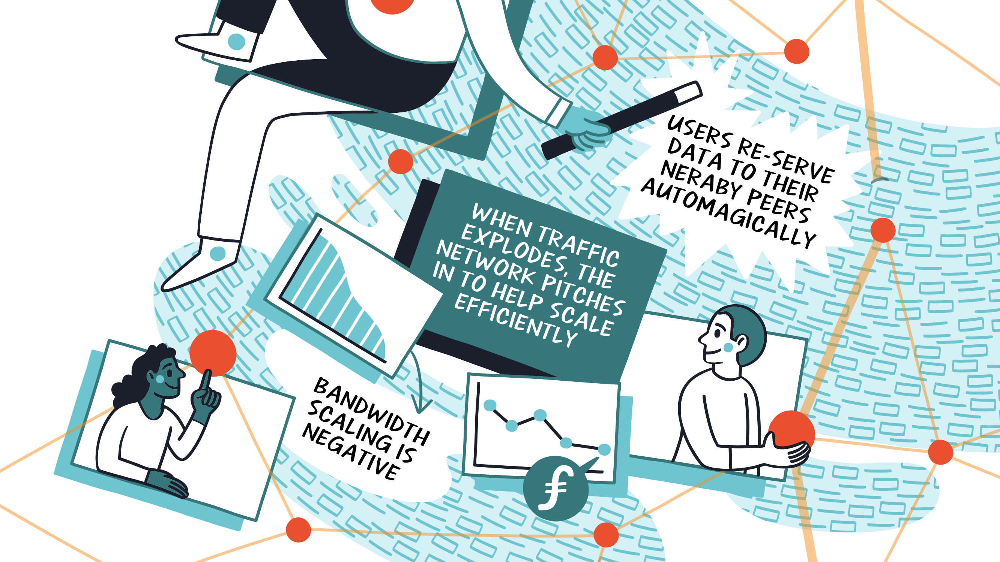
### Scaling & Inter-Planetary

We touched on how IPFS users help re-serve data they’re interested in to nearby peers. This happens when a user requests data from the network via a CID, their node caches it, then makes it available to the rest of the network. This aids in more than just resilience, you can see it as the network pitching in to help you scale efficiently too. Think about the client-server problem of when you create a popular app, and your traffic explodes. That situation is effectively flipped on its head with IPFS, resulting in negative bandwidth scaling costs.

If a bunch of nodes are attempting to download your CID, they’ll be automatically re-sharing the data as well. While your traffic explodes from people requesting your CID, those very same people are also helping send the data itself to their friends or colleagues automatically. **The more popular your CID is, the easier it is for people to retrieve the data from someone who might be more local to them**.

This property is very important to the inter-planetary aspect of IPFS. If someone on Mars had some data they originally retrieved from Earth, another Mars user shouldn’t have to wait to retrieve the same data from Earth. **The network should automatically figure out there’s another node on Mars willing to serve that data**. Content addressing and **the distributed web help us unlock such a future** on the network level, transparently.

## Conclusion

Web3 technologies like IPFS help us exit a world of centralization. This gives more power to the consumer, and less to companies looking to harvest your private information. IPFS also helps us achieve more resilience and interoperability for our data with a solid distributed design. 

If you wanna learn more, below are some links for how to begin using IPFS for new users and for developers looking to delve deeper into the technology.

## Links

### Getting Started

- [IPFS Desktop](https://docs.ipfs.tech/install/ipfs-desktop/)
- [IPFS Companion](https://docs.ipfs.tech/install/ipfs-companion/) (browser addon)

### Learning Resources

- [Getting started with IPFS & Filecoin](https://protocollabs.notion.site/Getting-started-with-IPFS-Filecoin-173c73d4d8d64765a42058594bc46bb7)
- [IPFS Docs](https://docs.ipfs.tech/)
- [IPFS Community Resources](https://docs.ipfs.tech/community/) (Discord, forums, etc)

#### Videos

- [Breaking Free from the Client-Server Model (Full Version, Live)](https://www.youtube.com/watch?v=hEcLeEXiLXY)
- [Breaking Free from the Client-Server Model (Condensed Version)](https://www.youtube.com/watch?v=aZnFmlXHHzg)
- [Introduction to IPFS & Filecoin](https://www.youtube.com/watch?v=5-0_DqXGY-M)

#### Case Studies

- [Fleek Case Study](https://docs.ipfs.tech/concepts/case-study-fleek/#overview)
- [Audius Case Study](https://docs.ipfs.tech/concepts/case-study-audius/)

### Other Resources

- [Hackathons Website](https://hackathons.filecoin.io)
- [Filecoin Grants Opportunities](https://github.com/filecoin-project/devgrants)