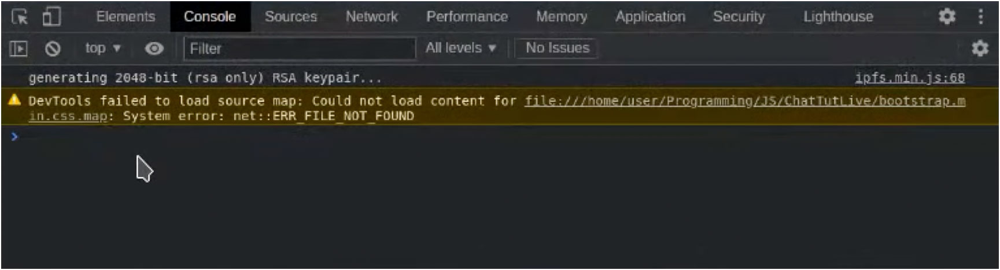
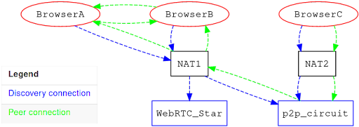
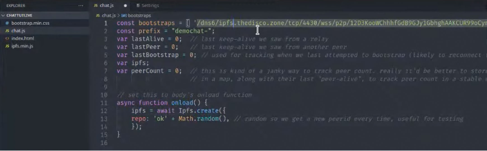
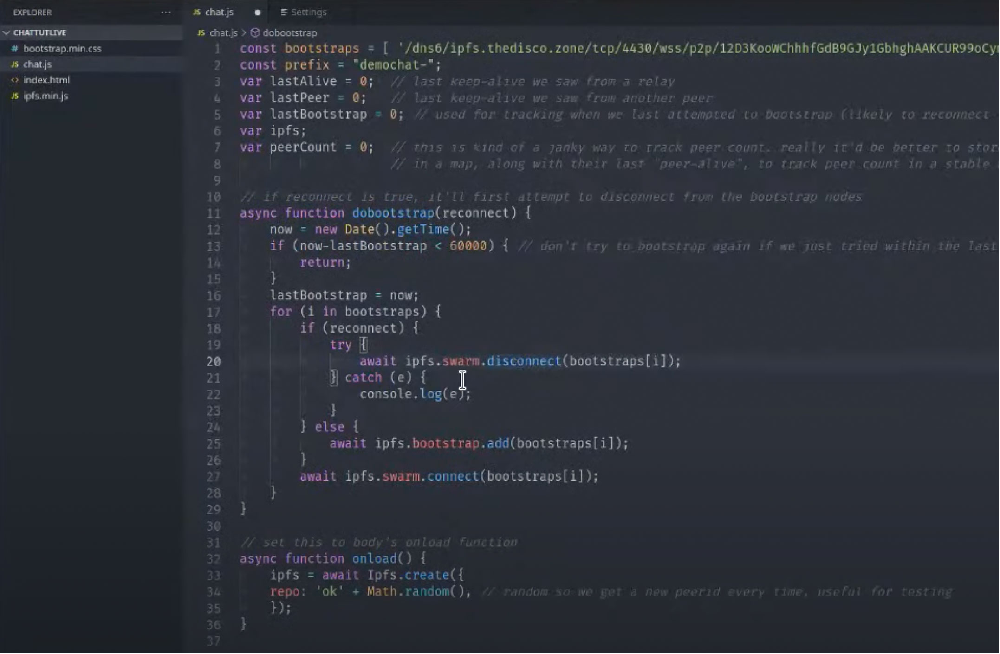
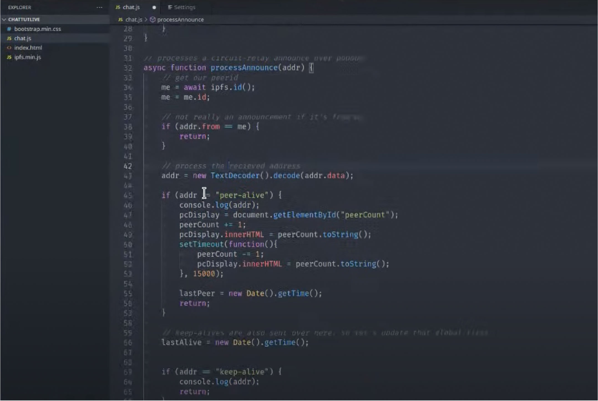
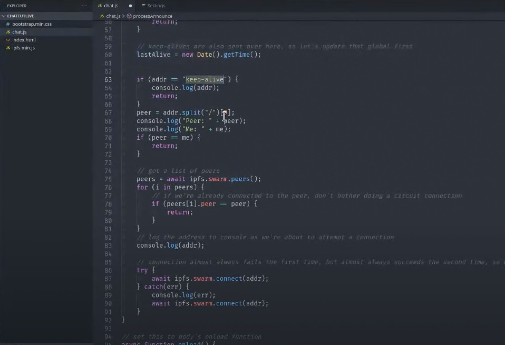
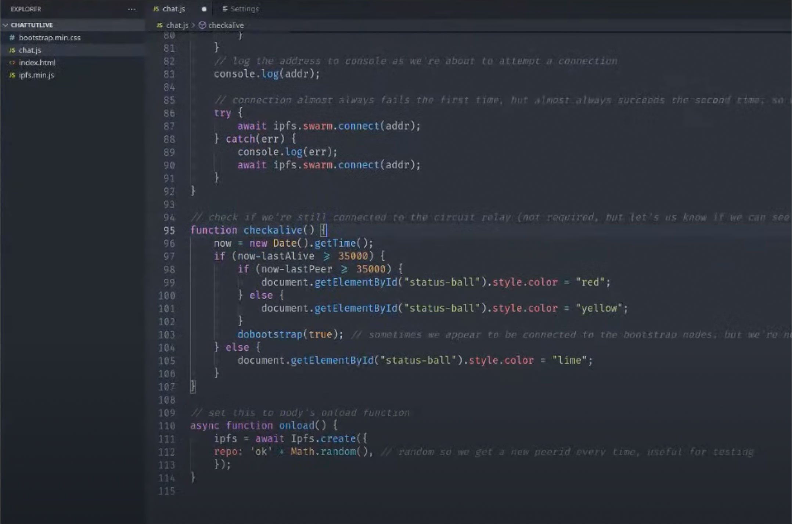
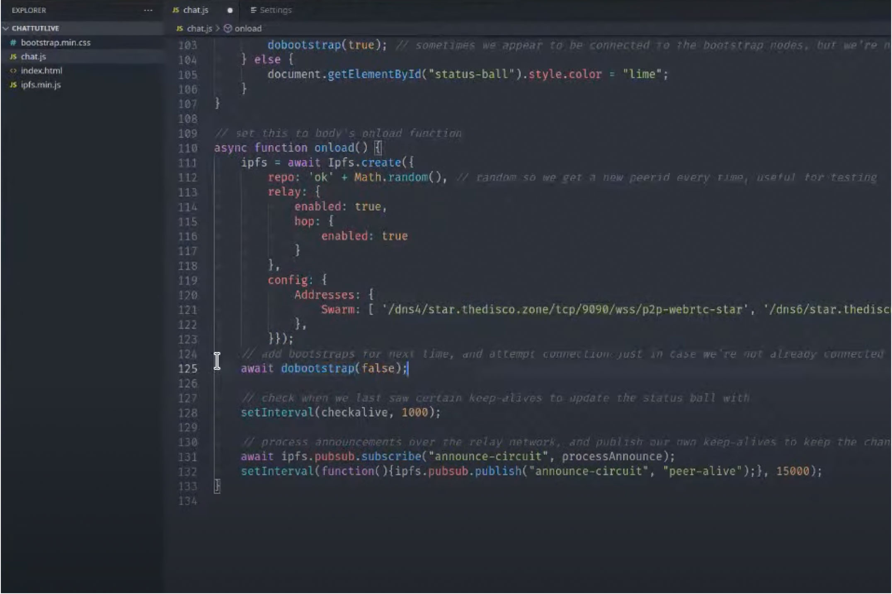
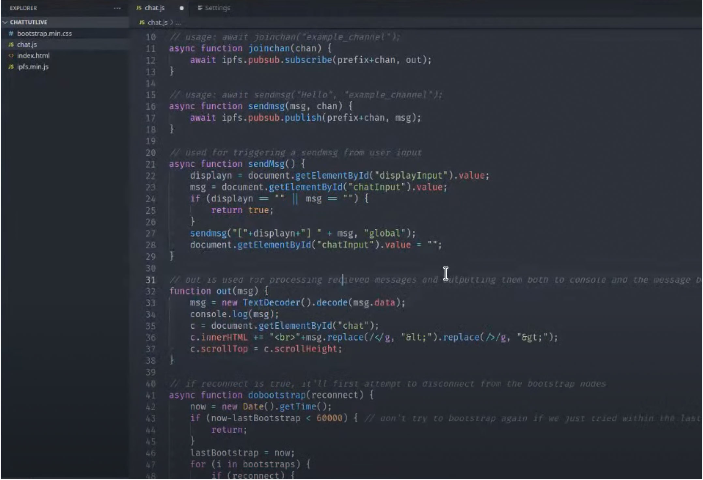

_From HackFS: Ryan Baumann from IPFS walks through the basics of browser integration using IPFS. This talk was delivered at HackFS, a three-week virtual hackathon dedicated to building a censorship-free decentralized internet. The complete discussion is_ [_available here_](https://www.youtube.com/watch?v=xZiN9dLvMoU&list=PLXzKMXK2aHh5iq_crvYF76EmPsZgcgLki&index=3)_._

The future of the internet is the decentralized web, but getting there requires infrastructure. At the heart of this infrastructure is IPFS, the InterPlanetary File System. Together with its name resolution system INFS (Interplanetary Name System), it presents a new way to hold and distribute content to browsers known as [content addressing](https://blog.ipfs.io/2021-06-03-ipfs-filecoin-content-persistence/).

Under this paradigm, data can be retrieved from wherever it is stored across the IPFS network based on its unique content ID (CID). This improves over the current location-based infrastructure where data is retrieved from specific servers and can be vulnerable to all kinds of security risks.

What this means for the average app developer is that instead of hosting an app and its requisite data on a centralized server, they can now upload their app to IPFS and run it directly from a decentralized storage network. This post takes a look at developing web browser interconnectivity through IPFS by putting together a very basic chat interface.

<b>Watch on YouTube</b> <a href="https://www.youtube.com/watch?v=xZiN9dLvMoU&list=PLXzKMXK2aHh5iq_crvYF76EmPsZgcgLki&index=3">IPFS: Browser Connectivity Walkthrough</a>

The best way to stay up to date with this browser connectivity guide for a simple chat interface is in the IPFS [documentation](https://docs.ipfs.io/how-to/create-simple-chat-app/).

## Getting Started

This tutorial isn't advanced, and most developers will be familiar with what’s going on. The only difference is that this guide uses IPFS for the backend to connect to or discover other clients and chat with them.

Most web developers will already have a text editor of choice installed. The core elements for this tutorial can be accessed[ here](https://workshop.thedisco.zone/) and a completed demo can be accessed [here](https://github.com/TheDiscordian/browser-ipfs-chat).

This guide will focus on the chat.js file as what will be edited. To this end, the user should have the index.html opened in a browser to check on their progress during the tutorial.

If you want more detailed info about the connection, you can open the browser console and drop in the command await ipfs.id() to get it.

_Fig.1: The In-Browser Console_

## Step 1: Connecting to Peers

Peer connection is at the heart of this particular IPFS chat applet. Typically, when people connect to IPFS, we want to speak to them through chat. To do so, you can subscribe to a particular channel. All users subscribed to the same channel will get messages sent to it. But how can you connect to other people?

_Fig. 2: A Potential User Network Setup_

There are two ways to connect to others over IPFS. The first relies on WebRTCStar, which relies on the NAT to work. If, however, the NAT is down for whatever reason, there is a backup plan. In addition to WebRTCStar, you can organically discover others through the p2p circuit. To ensure that the connections resolve, you’ll have to cater to both possibilities.

At the top of the file, you’ll need to get the bootstrap constant and include it.

  
_Fig. 3: The bootstrap Constant_

Next, you’ll attempt the connection; if the connection fails, it'll automatically retry. As a safeguard, you may want to ensure that you disconnect before retrying the connection.

_Fig. 4: The dobootstrap(reconnect)Function_

The next thing is to develop a processAnnounce() function, which you’ll use for subscribing to the public channel (pubsub). You will subscribe to a circuit called announcer and attach the processAnnounce() function to it. You’ll be storing your own ID for comparison, so you don't resend the messages you collect from yourself. It's important to keep sending keep-alive packets to the network since there is a tendency for the connection to drop if left dormant for too long.

_Fig. 5: The processAnnounce() Function Part I_

Once you collect the p2p circuit addresses, you’ll split them from the messages using a standard string split. You’ll get a list of peers from WebRTCStar as well since this is what you want to verify your connection. Next, you’ll attempt to connect twice. Typically, you perform the connection redundantly because the system rejects the first attempt, so a backup attempt is necessary to connect successfully.

_Fig. 6: The processAnnounce() Function Part II_

You can use the checkAlive() function to update your connection status and update it on the chat screen. You’ll also schedule a keep-alive packet to be sent every fifteen seconds to ensure you stay connected. Now that you’ve done the overhead for the connection, you can look at sending and receiving messages.

_Fig. 7: The checkAlive() Function_

We will then update the onload() function.

_Fig. 8: The Updated onload() Function_

## Step 2: Sending and Receiving Messages

You’ll be using two wrappers to interact with the chat system. We’ll be placing these below our bootstrap definitions, but above our dobootstrap(reconnect) function. The first is a standard joinChannel() function, using a string passed to the channel as a flag, allowing you to subscribe to a public channel and receive all sent messages from that channel. The sendmsg() (common m) function is used similarly, but you’ll be using it to send a strong message. Another function sendMsg() with a capital M is a higher-level function that allows you to collect input data from the text element and send it off. An out() function drops received messages into the chat.

_Fig. 9: Message Sending and Channel Joins_

## Additional Considerations

As is immediately apparent from inspecting the code, this system is developed to introduce what you can do on IPFS. However, it can serve as the basis for something more functional and robust. With a bit of effort, you can even include the ability to send emojis or even link to gifs within the chat. You can display embedded media as well. This tutorial doesn't encrypt any messages, but developers can add their own custom encryption if they see fit. All the messages are signed, allowing verification for messages, even if forwarded by a third party.
