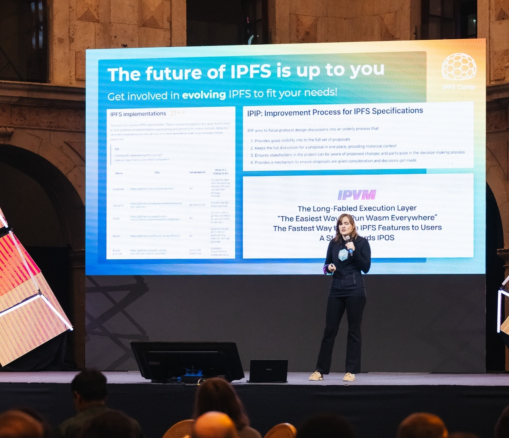
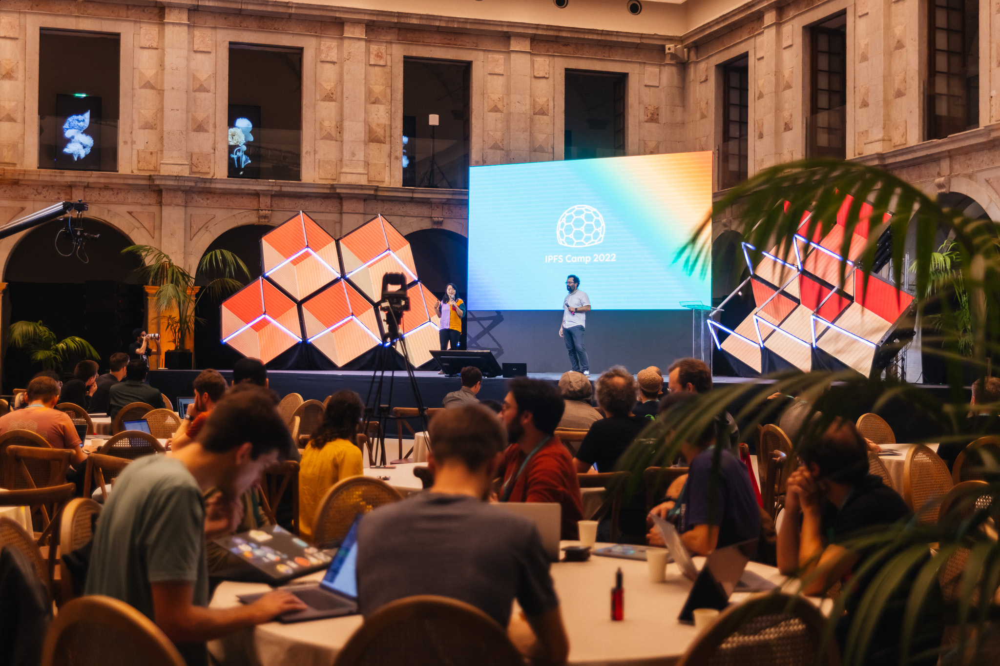
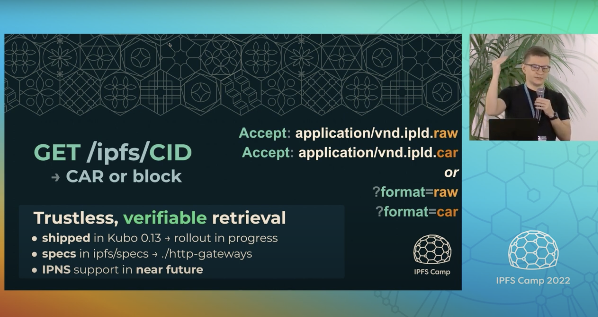
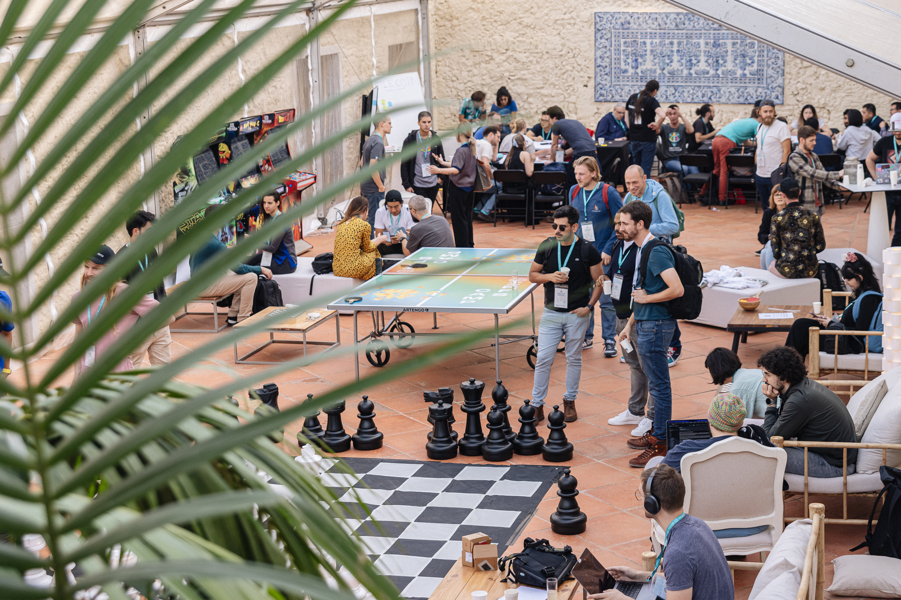
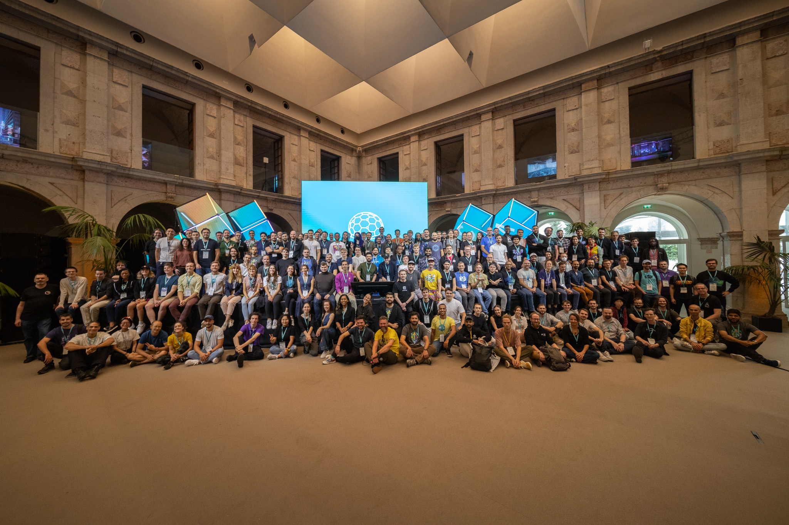
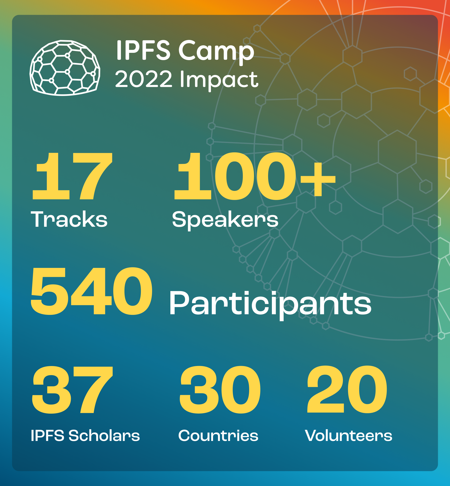

After a three-year hiatus, the IPFS community came together again for [IPFS Camp 2022](https://2022.ipfs.camp/) from October 28th-30th in Lisbon, Portugal. The 3-day event was a showcase of recent achievements, a celebration of the growing community, and an opportunity to chart new directions for the future of IPFS.

Over 550 attendees joined for a collection of talks, workshops, discussion circles, hacking time, and dinners. Here are just a few highlights of the over 100 sessions from the 3-day Camp. You can also watch all of the talks on the [IPFS YouTube channel](https://www.youtube.com/c/IPFSbot).

@[youtube](fGwhPLik3_4)

## The State of the IPFS Ecosystem

Much has changed since the IPFS Camp in 2019. Molly Mackinlay, Product and Engineering Lead at Protocol Labs, shared her reflections in her talk, ["The State of the IPFS Ecosystem"](https://www.youtube.com/watch?v=fGwhPLik3_4&t=2s).

Active monthly users of [IPFS-based dapps and tools](https://ecosystem.ipfs.tech/) has grown from 5 million to 50 million. The number of unique nodes continues to grow, making the network more resilient and distributed, and content more available. Meanwhile, performance is improving even as the network grows: it’s now 50x faster to find content across the network.

“We are now seeing 400 millisecond find times in IPFS at the 95th percentile,” Mackinlay said. “This is really thanks to all of the groups that went and rewrote the IPFS and libp2p DHT implementation… We improved the set of nodes that route data in IPFS. There was a massive amount of work that went into making that the case.”

IPFS as a protocol is maturing as well: it’s now supported in 5 browsers, natively or via extension: Brave, Opera, Chromium, Edge, and Firefox. And the recently revamped InterPlanetary Improvement Proposal (IPIP) process offers an open, lightweight process for IPFS protocol improvements with 17 IPIPs submitted since its introduction in July 2022.

## IPFS Implementations and Funding

__

It’s time to accelerate the IPFS ecosystem, and we’re excited to invest in making IPFS available everywhere! At IPFS Camp, Juan Benet, Michelle Lee, and Dietrich Ayala announced the new IPFS Implementations Fund. This fund will focus on a 5-year strategy to improve availability and developer choice for IPFS.

“Many IPFS startups have managed to build companies through finding a good VC pathway,” said Juan Benet, IPFS inventor and founder of Protocol Labs. “We wanted to find a way to equally support significantly sized teams working on IPFS implementations as public goods that will be delivered to the whole community.”

“The scope initially is going to be implementations \[and integrations\] of the protocol into spaces and environments where it’s not today,” said Dietrich Ayala, Ecosystem Lead, Browsers and Platforms at Protocol Labs. “We want many different groups to address a broad spectrum of programming languages, business verticals and diverse runtimes,” added Michelle Lee, Head of Developer Programs at Protocol Labs. “This might include designing for unique operating environments, compatibility with cloud-native tooling or fast-growing technologies such as WASM, or plugins and SDKs for popular.”

Additional information and how to apply will be released later in 2022.

_<iframe width="560" height="315" src="_[_https://www.youtube.com/embed/dBnmUiKc3P0_](https://www.youtube.com/embed/dBnmUiKc3P0 "https://www.youtube.com/embed/dBnmUiKc3P0")_" title="YouTube video player" frameborder="0" allow="accelerometer; autoplay; clipboard-write; encrypted-media; gyroscope; picture-in-picture" allowfullscreen></iframe>_

## Decentralization and Human Rights

In a main stage panel, three speakers from three different continents described how they have been using IPFS for digital preservation and censorship resistance.

**The Starling Lab**

Jonathan Dotan, Founding Director of The Starling Lab, spoke about how the academic research lab is using the latest cryptographic methods and decentralized web protocols to “meet the technical and ethical challenges of establishing trust” in humanity’s digital records. This includes sensitive records that involve the documentation of human rights violations, testimony of genocide, and war crimes. Projects include the Visual History Archive, which introduced tamper proof distributed storage of the largest collection of testimony from survivors of genocide, as well as 78 Days, a [case study](https://www.starlinglab.org/78days/) that documented the presidential transition from Donald Trump to Joe Biden.

“The Starling Lab was an early entrant into the \[Protocol Labs\] ecosystem because we got really excited about IPFS,” Dotan said. The Starling Lab creates research opportunities for journalists, historians, and lawyers by welcoming them into Web3. By utilizing IPFS, The Starling Lab can help implement tools to combat misinformation, whether accidental or intentional, by tracking “the provenance of digital content through the use of open source tools, best practices, and case studies designed to help reduce information uncertainty.”

_<iframe width="560" height="315" src="_[_https://www.youtube.com/embed/0gbMYNEIVZ8_](https://www.youtube.com/embed/0gbMYNEIVZ8 "https://www.youtube.com/embed/0gbMYNEIVZ8")_" title="YouTube video player" frameborder="0" allow="accelerometer; autoplay; clipboard-write; encrypted-media; gyroscope; picture-in-picture" allowfullscreen></iframe>_

**Not your key, not your content**

Phoebe Poon, Co-Founder of LikeCoin and Liker Land, spoke about her team's [decentralized publishing infrastructure](https://docs.ipfs.tech/concepts/case-study-likecoin/#ipfs-benefits) as well as tools for independent media. Their work is motivated by the “social context and political landscape in Hong Kong”, where pro-democratic media experience heavy censorship.

Over 8,000 journalists use Likecoin's IPFS-based publishing tools to ensure content distribution and maintain journalistic integrity.

**Censorship in Catalonia**

Xavi Vives, researcher at Interplanetary Mind Map, shared his experience using IPFS to prevent censorship in Catalonia. On October 1, 2017, Catalan citizens pushed for a vote to separate from Spain, and encountered violence and censorship in response.

“IPFS had a pretty significant role because the site where the people had to check their data for how and when to vote was a static site and was mirrored on IPFS,” Vives said. “So for several days, while the state was shutting down site after site, people were spinning up new nodes.”

Eventually, citizens couldn’t even access IPFS gateways, and because of this, Vives and others began working on a decentralized voting system called Vocdoni. However, they were building beneath the fear and paranoia of exposure, and spent two years working on the protocol in secret. Because of this, they couldn’t find financing, hire employees, or build a community. To this day, Vocdoni is still under investigation, and has struggled beneath news defamation and conspiracy theories.

Vives added, “The enemy of decentralization is very powerful… violence, fear, money and control go a long way.”

## Improving the IPFS Protocol Specification

_<iframe width="560" height="315" src="_[_https://www.youtube.com/embed/1Lm-uh_8sNc_](https://www.youtube.com/embed/1Lm-uh_8sNc "https://www.youtube.com/embed/1Lm-uh_8sNc")_" title="YouTube video player" frameborder="0" allow="accelerometer; autoplay; clipboard-write; encrypted-media; gyroscope; picture-in-picture" allowfullscreen></iframe>_

In July 2022, the new Interplanetary Protocol Improvement Process (IPIP) was introduced to establish a clear process for proposing and evaluating IPFS protocol improvements.

As part of the IPFS Implementations track, IPFS specs steward Marcin Rataj (@lidel) presented an update on IPFS specifications and the IPIP process “Every implementation is a special snowflake. It’s built from different parts of our stack,” said Rataj. “\[Most\] implementations do not implement all the parts. They focus on things that are relevant to use cases \[and that is\] why we are investing in specs to make it easy for people to implement specific blocks of the IPFS stack without having to reference legacy code.”

Since July, 17 IPIP improvements have been proposed, indicating broader participation in IPFS protocol design. Learn more about the process and how to participate in the \`[ipfs/specs](https://github.com/ipfs/specs/blob/main/IPIP_PROCESS.md)\` repository.

## Voice Gems: A 1000 Year Archive

The [Voice Gems](https://reeps100.com/project/voicegems) project is a “vibrant, unprecedented meditation highlighting the most remarkable, influential, and critically endangered voices on earth to generate digital gemstones and physical sculptures.” The various works can be manifested as NFTs, print, 3-D print, digital video, large scale projection, and cast sculpture. In his talk, Voice Gems creative director Harry Yeff showcased his portfolio of speed-of-light radio transmission, AI synthetic voices, and how emerging technologies provide an artistically explosive and vital discussion on new methods of preservation.

“If you remove all musical connotations, there’s a huge responsibility for us to think about what is the scope, what is the limit, but also there are still innovations happening in voice,” said Yeff.

## Choose Your Own Adventure

## 

IPFS Camp 2022 was the first decentralized event of its kind. With over 17 different tracks, attendees had the chance to pick and choose what to join. All of these tracks are also now available on the [IPFS YouTube channel](https://www.youtube.com/c/IPFSbot):

* [IPFS Implementations](https://youtube.com/playlist?list=PLuhRWgmPaHtQchZjO3xBBFDiiqERmjA-a): Meet the teams taking IPFS to the next level and learn how you can find an IPFS implementation to work on.
* [IPFS 101: Introduction & User Apps](https://youtube.com/playlist?list=PLuhRWgmPaHtSLRL9zSyKzjuHSpilhp1kL): A hands on session on getting started with IPFS.
* [IPFS 201: Design Patterns & Developer Tools](https://youtube.com/playlist?list=PLuhRWgmPaHtRP0kfWyDuod_kVHE-5dGGL): covering IPFS app architectures, developer tools, design patterns and everything you need to know to build apps using IPFS.
* [Content Routing](https://youtube.com/playlist?list=PLuhRWgmPaHtRqhFZ-CAstJ0RIq7Vs-4eO): Approaches and protocols to content routing in IPFS, what we've learned so far, and directions for the future.
* [Data Transfer](https://youtube.com/playlist?list=PLuhRWgmPaHtR2-LVmm5_Yv8TA3NhA_QOK): How do IPFS nodes request, send, and receive content?
* [Compute Over Data](https://youtube.com/playlist?list=PLuhRWgmPaHtTU1u9TGOVviM234URBdEGa): Producing data without leaving the Merkle Forest - How do we do it?
* [IPFS Operators and Enterprise](https://youtube.com/playlist?list=PLuhRWgmPaHtSAA-XdMRvvgsp2fTwQgtLN): Explore applications & deployments of IPFS in large scale cloud & enterprise use cases.
* [Measurement and Performance](https://youtube.com/playlist?list=PLuhRWgmPaHtSEd9SWIaoKsxMkannW8zX3): A data-driven approach to the design and operation of IPFS and libp2p through rigorous network measurements, performance evaluation and recommendations for builders and operators.
* [Libp2p Day](https://youtube.com/playlist?list=PLuhRWgmPaHtRXZI9K7llOftzDTgS-Nin-): The first ever libp2p Day: a gathering for libp2p builders, contributors, and maintainers.
* [Libp2p Privacy](https://youtube.com/playlist?list=PLuhRWgmPaHtRG4jtV_C_RWzp8g95E3tfP): Dive into the current privacy work happening on libp2p and get the chance to provide feedback on direction and next steps.
* [Gaming, Metaverse, and Video](https://youtube.com/playlist?list=PLuhRWgmPaHtTAVs3_fI-NG2C3NQknS7IK): Learn more about the landscape of gaming and video production in Web3.
* [Browsers & Platforms](https://youtube.com/playlist?list=PLuhRWgmPaHtQohNbRjFJDS70WoElZ8ep5): Learn the current status, ongoing challenges, and upcoming work to integrate IPFS and related technologies into browsers and the web itself.
* [Decentralized Science (DeSci)](https://youtube.com/playlist?list=PLuhRWgmPaHtRlUVSiY2fUREl85pgcwxLO): Learn more about the projects that are revolutionizing research through open collaboration on IPFS.
* [Lightning Talks 1](https://youtube.com/playlist?list=PLuhRWgmPaHtQkLjEcIlywENb7UkTKp1BT) & [Lightning Talks 2](https://youtube.com/playlist?list=PLuhRWgmPaHtQ2w6a7Y-n6PP9M_8pCvIiq): Explore a lineup of 15-minute talks covering all kinds of juicy IPFS related topics.
* [Growing With IPFS](https://youtube.com/playlist?list=PLuhRWgmPaHtS7_4qMSclvVY5xTsm9pF53): Learn about how to grow your skills and/or your project with IPFS.

## Thank you for making IPFS Camp 2022 an extraordinary experience!

The event could not have been possible without the dedication of our awesome track leaders, the 100+ speakers, the 37 IPFS Scholars who were awarded travel stipends and expanded the community, the amazing 20+ volunteers who augmented our event staff, and of course, everyone who traveled from over 30 countries to participate in the 2022 edition of IPFS Camp.

Lisbon was a beautiful, friendly, and inspiring city; we want to thank all of the local production staff and community who made IPFS Camp possible. In collaboration with [Renovar a Mouraria](https://renovaramouraria.pt/en/), a non-profit organization that focuses on the inclusion and development of the most diverse neighborhood in Lisbon, school supplies and furniture from the event were donated to the local community. Additionally, through a partnership with [Re-Food](https://re-food.org/en/home/), over 1,000 meals were donated.

Thank you to our incredible community for making IPFS Camp 2022 an amazing experience. Keep an [eye out for updates](https://twitter.com/IPFS) on the next event!