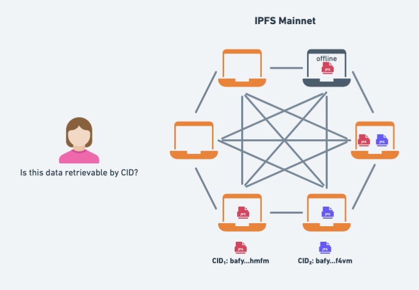

## 🎉 Improved debugging with IPFS Check

The [Shipyard team](https://www.ipshipyard.com/) is thrilled to share an overhauled version of [IPFS Check](https://check.ipfs.network), an improved debugging tool for [IPFS Mainnet](https://docs.ipfs.tech/concepts/glossary/#ipfs-mainnet), that is both simpler to use, and more powerful.

Try it out at [check.ipfs.network](https://check.ipfs.network)

@[youtube](XeNOQDOrdC0)

## 🧰 Debugging retrievability on IPFS can be tricky

CIDs, which lie at the heart of IPFS free you from having a single provider for data. This is pretty magical, becuase you can always retrieve data by its CID, as long as there is at least one provider for it, without prior knowledge of that provider. In other words, retrievability of data on IPFS is resilient to the unavailability of any single provider.

However, decoupling data from a single provider comes with a tradeoff, failure modes are more nuanced than in the client-server model.

In IPFS, when you try to fetch a CID, some providers may be online, while others may be offline, use other non-compatible network protocols, be slow, overloaded, or behind NAT and require hole punching to be reached.

Moreover, with the advent of [Delegated Routing](https://docs.ipfs.tech/concepts/how-ipfs-works/#how-content-routing-works-in-ipfs) and the [Network Indexer](https://docs.ipfs.tech/concepts/ipni/), CIDs may be routed by either the DHT or the Network Indexer, or both.

The result is that the likelihood of encountering an error when retrieving data is dependent on the availability of providers, which can constantly change, and vary depending on the network conditions of both the client and the providers. And whether they've successfully announced their CIDs to the DHT or the Network Indexer.

As a user looking to retrieve data by CID, you may experience different things, depending on the CID you are looking for, and the network conditions when you try to retrieve it.

Up until now, there was no easy way to get a detailed overview of whether a given CID is retrievable, and if not, why.

## 🔍 IPFS Check helps you debug  IPFS Mainnet

IPFS Check fills a gap in the IPFS ecosystem: the ability to easily check if data is routable and retrievable by CID on IPFS Mainnet.

The IPFS Check is a web app and doesn't require any setup or installation.

You can use it to check if data is routable and retrievable by CID on IPFS Mainnet, and if not, to get a detailed breakdown of why, for each provider. Moreover, you can see which multiaddresses and network transports are used to reach which providers and whether NAT hole punching was required.

It's especially useful to get an _outside perspective_ of your IPFS node's network setup, and whether it is correctly configured.

## Recent updates to IPFS Check

As part of the recent overhaul, we've landed several improvements to IPFS Check:

- **Supports CID only checks**: you can now do a multi-provider check by CID, without needing to pass a specific multiaddr.
- **IPNI support**: By default, IPFS Check will search for providers both in the IPNI and the DHT.
- **NAT traversal**: you can now in the results whether retrieval requires NAT traversal (if there are two successful sonnection multiaddrs and one of them contains `p2p-circuit`)
- **Network Protocol**: you can now see in the results which specific multiaddr was used for the connection, which tells you which network protocol was used, e.g. QUIC.

We hope you find it useful!

If you have any questions or feedback, open an issue or a discussion in the [GitHub repo](https://github.com/ipfs/ipfs-check/).
