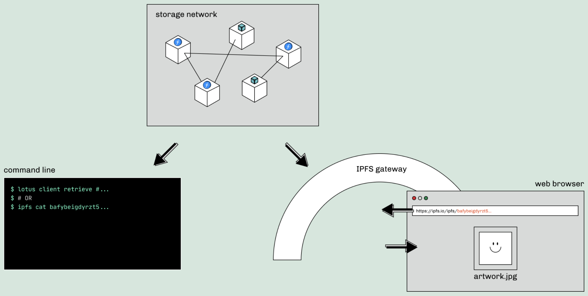

There are two fundamental problems facing the sustainability of content on the internet: addressing and persistence.

_Addressing_ refers to the way in which internet users can find the content that they’re looking for online. Today, the Web leans into location addressing, or finding content by where it is located, as opposed to content addressing, which allows network participants to confidently and consistently ensure their content does not change over time without a clear record of that change. _Persistence_ refers to the ability of those network participants to continue accessing content in perpetuity, without worries of the content disappearing or becoming unavailable for any reason.

The consequences of these problems are not theoretical; internet users experience them every day. As the Web has evolved in the past few decades, the fragility of location addressing and persistence has become more apparent. Try to access your favorite sites as a child — GeoCities, Blingee, Myspace, and more. You’ll find many of those sites difficult to find or altogether removed. When internet users are faced with error messages such as _404 page not found_, they are experiencing the downsides of location addressing and lack of content persistence on today’s internet. If the content (the image, text, webpage, video, etc.) has been changed, removed, or abandoned, it becomes irretrievable.

This isn’t how it should be. Content on the public Web should be available to anyone, anytime — even a thousand years in the future.

The solution is a decentralized storage stack that addresses the issues of addressing and persistence to enable a more complete and resilient internet experience for all users. Together, IPFS and Filecoin provide these assurances for the Web and its users.

## IPFS for Content Addressing

Broadly speaking, today’s web browsing operates through what is known as _location addressing._ Location addressing retrieves online information from specific locations on the web ─ i.e. from behind URLs. However, this has its obvious downsides. Location addressing is centralized; whoever controls that location controls the content. And anything behind a location-addressed URL can be changed. The language of an article, the colors of a digital artwork, or the properties of a recorded identity. Location-addressed URLs are exploitable.

The solution is _content addressing._ Content-based addressing allows you to access data based on a unique fingerprint of that piece of data; no matter _where_ it is stored, if you have that unique fingerprint of the data, you should be able to retrieve the content. In content-based addressing (within the context of IPFS), content is no longer retrieved from single locations on the web. Rather, content is retrieved from any participating nodes on the IPFS network that have the content you’re requesting. Pieces of content are shared by many parties, and content can always be retrieved either entirely from one node (such as a [pinning service node](https://docs.ipfs.io/concepts/persistence/#persistence-versus-permanence)) or collected in bits and pieces from multiple nodes.

For an overall look at the value of content addressing and how you can use IPFS content identifiers/fingerprints (CIDs) to properly address NFTs, [see here.](/2021-04-05-storing-nfts-on-ipfs/)

Content addressing, however, is only part of the solution. Just because information can be retrieved through IPFS no matter where it is stored, doesn’t mean it is guaranteed to be around forever. To have a complete solution, _content persistence_ is key.

## The Value of Content Persistence

Once the retrieval of online content is reoriented around content-based addressing, the question becomes: how do we ensure the content continues to be available throughout time? In other words, how do we make sure the content _persists_? Without content that is reliably stored over time, similar issues of today emerge, with a fragmented, incomplete, and amnesic Web.

As with most solutions around data and information, there are centralized and decentralized options. The centralized option would be to go with a service that promises to always store the content in their servers. Centralized storage, however, doesn’t achieve true persistence, as it is subject to a single centralized point of failure.

Decentralized content persistence is the only way to ensure that content remains available over time. By ensuring that completely separate, interoperable nodes are all storing data that is backed by strong cryptographic guarantees, information is protected from becoming unavailable due to the actions (or inaction) of any central service. The question becomes: how? Filecoin is building the foundation for content persistence, as well as a set of tools and services on top to aid in that mission.

## Filecoin for Content Persistence

[Filecoin](http://filecoin.io/) is the incentivization layer built to complement IPFS’ solution to content addressing by providing _content persistence._ IPFS ensures that content cannot change over time without a clear record and solves the issue of URLs not resolving. Filecoin ensures that content-based addressing remains resilient over time by making sure that the content that is being retrieved keeps being available.

Filecoin achieves this mission through [novel cryptography, consensus protocols, and game-theoretic incentives](https://filecoin.io/blog/posts/filecoin-features-verifiable-storage/), providing true decentralized storage. At the heart of it all is Filecoin’s unique approach to storage verification.

Filecoin’s storage verification system solves a previously intractable problem for decentralized storage: How can storage providers _prove_ that they are really storing the data they say they are through time and that they are dedicating unique physical space for it?

In a centralized storage service, you have to place your trust in well-known companies that guarantee the integrity and security of their systems. On the Filecoin network, anyone in the world can offer storage space. But to maintain trust on a decentralized network like Filecoin, you need a way to establish trust in the global network _itself_.

To verify storage on Filecoin’s decentralized network, you need to prove two things. First, you need to prove that the right set of data is stored in a given storage space. Second, you need to prove that the same set of data has been stored continuously over a given period of time.

Filecoin’s [proving algorithms](https://filecoin.io/blog/posts/what-sets-us-apart-filecoin-s-proof-system/) perform these verification tasks. _Proof-of-Replication_ proves that a given storage provider is storing a physically unique copy of a client’s original data, while _Proof-of-Spacetime_ proves that the client’s data is stored continuously over time.

In addition to its proof system, the Filecoin network also relies on game-theoretic incentives to discourage malicious or negligent activity. All storage providers that agree to store data on the Filecoin network must provide collateral in the form of Filecoin tokens at the time of agreement. Any storage provider that fails Proof-of-Spacetime checks is penalized, loses a portion of the collateral and is eventually prevented from offering storage again to clients.

Together, novel cryptography, consensus protocols, and game-theoretic incentives allow Filecoin to provide true decentralized storage.

Filecoin has baked content persistence into its core mission to “store humanity’s most important information.” And it is well on its way to achieving that mission. To date, the network supports [5.8 Exbibytes](https://filfox.info/en) of storage (for reference, that is sufficient to store all Wikipedia articles 250 million times over).

## Content Addressing and Persistence in Action: NFTs

Today, one of the fastest growing types of content in the crypto space is [NFTs](https://nftschool.dev/concepts/non-fungible-tokens/). However, NFTs have been the subject of scrutiny for matters of availability and permanence, all of which boil down to the concepts of content addressing and persistence. When an NFT is minted and traded, what is actually being talked about is the _record_ of the (for example) artwork. The content and the metadata of that artwork (the colors, shapes, sounds, etc.) do not automatically live on the blockchain. “Content” refers to the image itself. “Metadata” refers to the descriptive text, artist information, CID of the actual content, and more. This [exposes many NFTs to issues](https://cointelegraph.com/news/opensea-collector-pulls-the-rug-on-nfts-to-highlight-arbitrary-value) of addressing and persistence, if that content and metadata of the NFT are not stored reliably. Using IPFS to solve the addressing concern of NFTs is quickly becoming the norm, and a large and growing ecosystem of pinning services ensures availability of all the IPFS data.

Protocol Labs recently launched [nft.storage](http://nft.storage/) to make handling content addressing and persistence as easy as possible, specifically for NFTs. Nft.storage allows anyone to generate the metadata for minting and storing their NFTs on Filecoin for free, with nothing more than a few lines of code. Developers register for an account, generate an API access key, and can use a simple client library to generate metadata and permanently store their NFTs.

NFTs stored via nft.storage are not only available via the IPFS network, they are also protected from disappearing by Filecoin, which incentivizes storage providers around the world to continue storing the NFT content and metadata long-term.

## Evolving Network Participants in Content Persistence

Right now, agreements to keep content stored over time are economic relationships between individuals and the nodes that keep the content online. The model has proven immensely sustainable for the Filecoin ecosystem. However, the ecosystem is also preparing for greater numbers of people who want to store their information online, and create solutions to accommodate more decentralized needs of ownership and payment. By providing storage for developers of NFT applications, nft.storage is on the frontlines of that role, encouraging NFT best practices by making them as easy as possible to implement and by removing the economic consideration from creators and collectors.

A wave of other ecosystem partners will continue to emerge to incentivize the persistence of vital data by adopting different economic roles within the IPFS and Filecoin ecosystem. These ecosystem partners will make the basic relationship between individual and storage providers more varied, flexible, and sustainable. [DataDAOs](https://filecoin.io/blog/posts/the-future-of-datadaos/) are on the horizon and well-positioned to shape the evolution of data storage and payment on distributed systems. The term describes a DAO (Decentralized Autonomous Organization) dedicated to the storage, maintenance, processing, and (possibly) licensing of potentially massive datasets. By shouldering the technical and financial responsibility of storing the datasets, dataDAOs can effectively monetize critical data while remaining true to a broader commitment to decentralized content persistence. Other ecosystem partners, like [Ocean Protocol](https://oceanprotocol.com/) and [Filehive](https://filecoin.io/blog/posts/decentralized-data-markets-with-filehive/), do not operate as DAOs, but play a similar role as ecosystem partners that rely on Filecoin to maintain the data they are monetizing and licensing to others.

## Conclusion

The internet today, though immensely powerful, has long exposed critical weaknesses in the way it stores and maintains data. Content addressing and persistence are at the root of this issue; specifically, _centralized_ content addressing and persistence. Only through decentralized, verifiable solutions can we ensure that our online information remains secure and available indefinitely. Together, IPFS and Filecoin solve the issues of addressing and persistence, exemplified most recently by nft.storage — a solution that demonstrates an elegant technical stack and a sustainable economic model.

Learn more at:

- [nft.storage](http://nft.storage/)
- [NFT School](https://nftschool.dev/)
- [IPFS Documentation - content addressing](https://docs.ipfs.io/concepts/content-addressing/)
- [IPFS Documentation - minting an NFT with IPFS](https://docs.ipfs.io/how-to/mint-nfts-with-ipfs/#a-short-introduction-to-nfts)