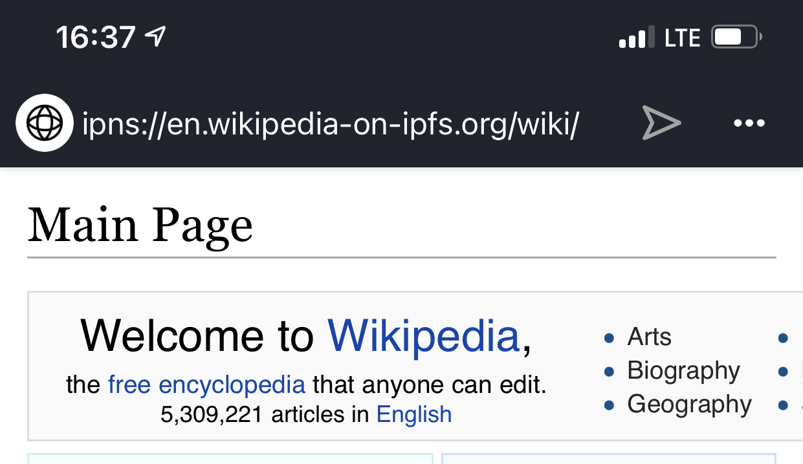
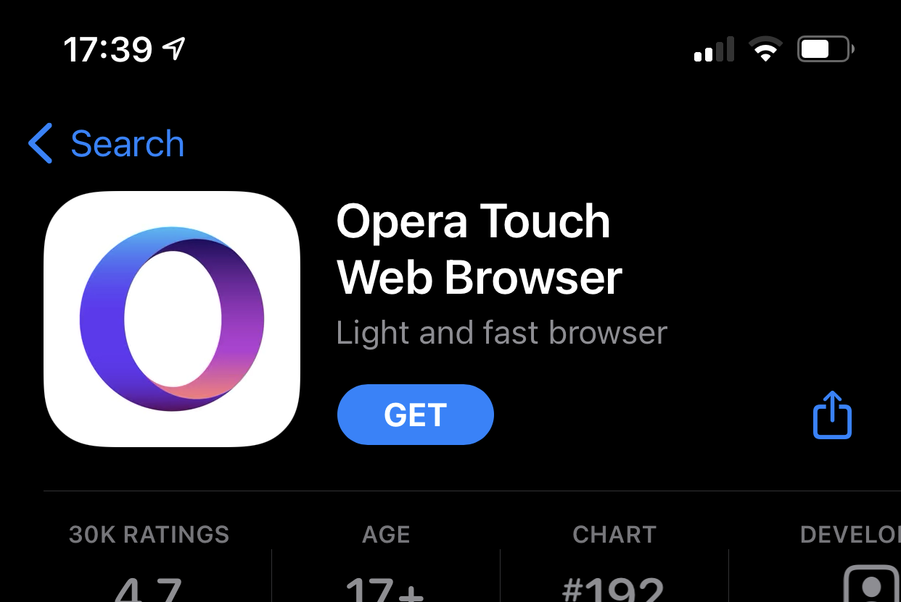

In 2020 we announced a big moment for IPFS: The first official support of IPFS protocol addressing in a major browser, when [Opera released IPFS support in their Android browser](https://blog.ipfs.io/2020-03-30-ipfs-in-opera-for-android/). This was an important step in IPFS browser support generally, by building interest and momentum. We didn’t stop there, and we’ve got not just one… BUT TWO releases to share with you today!

First, Opera has now added support for IPFS addressing to Opera Touch, their iOS browser.

Second, support for IPFS addressing in Opera desktop browser for Windows, macOS, and Linux will be coming in their next release, currently planned for March 2021.

As a special surprise for EthDenver, you can download a preview build of Opera for desktop which has IPFS addressing support! Give it a spin at [ethdenver2021.opera.com](https://ethdenver2021.opera.com).

With these releases, Opera will now support `ipfs://` and `ipns://` addressing across their browser product line on all major operating systems: Windows, macOS, Linux, iOS, and Android.

## How do I use it?

First, install Opera Touch on your iOS device. If you’re reading this on an iOS device, [click to install now](https://apps.apple.com/us/app/opera-touch-web-browser/id1411869974).

Then you can open content using IPFS protocol addresses, like the [blog you’re reading now](ipns://blog.ipfs.io), [Wikipedia](ipns://en.wikipedia-on-ipfs.org), or this [Persian room guardian](ipfs://bafybeigdyrzt5sfp7udm7hu76uh7y26nf3efuylqabf3oclgtqy55fbzdi) by [Anya Boz](https://www.anyabozartist.com/the-persian-cat). You can easily upload files to IPFS using the [IPFS desktop application](https://docs.ipfs.io/install/ipfs-desktop/) or [Share.ipfs.io](https://share.ipfs.io).

## How does it work?

Opera Touch supports navigating to addresses for `ipfs://` and `ipns://` protocol schemes, which are handled by a remote HTTP gateway. By default the gateway used is `dweb.link`, which is operated by Protocol Labs. The ability to select a different gateway is coming in the next update of Opera Touch.

Native representation of IPFS addresses in browsers is important, even when the content is loaded from an HTTP gateway as IPFS URIs are resolved out of the box, without the need for any additional extensions or opt-in settings, which familiarizes users and developers with decentralized concepts of content-addressing and creates a path to readiness for when native nodes are available.

## What’s next?

Opera desktop browser support for IPFS addressing will ship soon, and we’re discussing what additional features to add next to build on top of this foundation of universal addressing support across the Opera browser line. Have ideas for what you’d like to see in Opera next? Let us know on the [IPFS forums](https://discuss.ipfs.io/), or tweet your ideas to [@Opera](https://twitter.com/opera) and [@IPFS](https://twitter.com/ipfs) on Twitter!

[Install Opera Touch on iOS now!](https://apps.apple.com/us/app/opera-touch-web-browser/id1411869974)