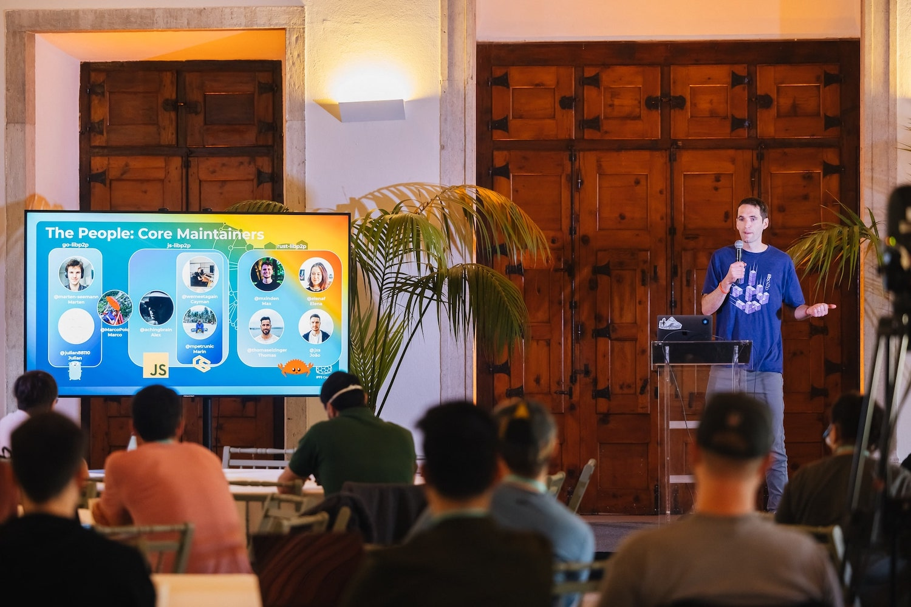
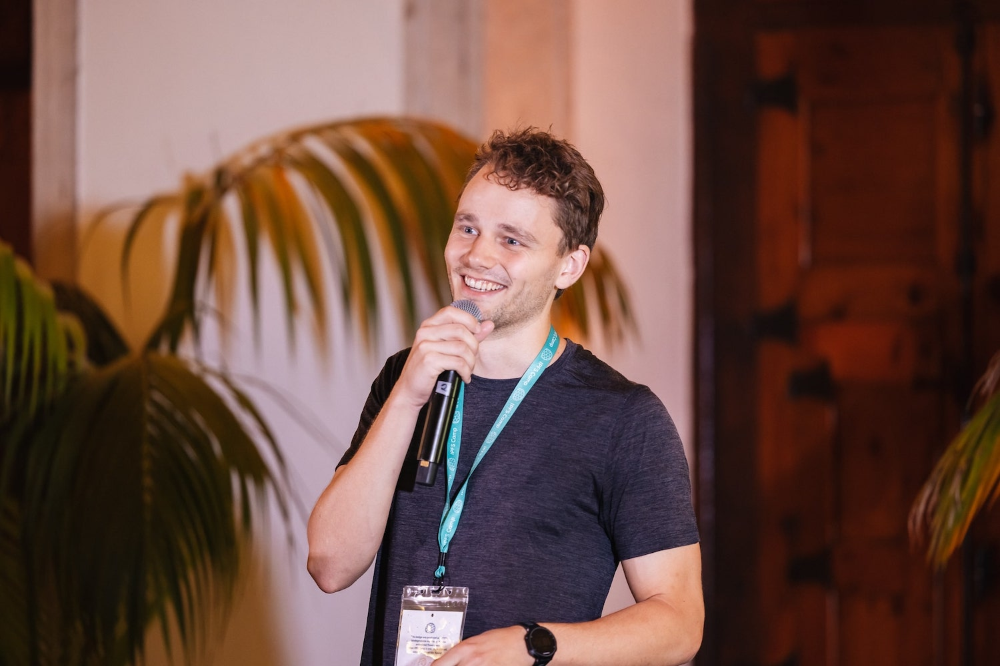
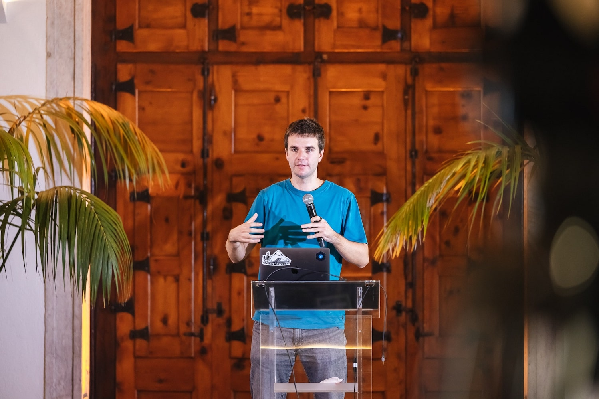
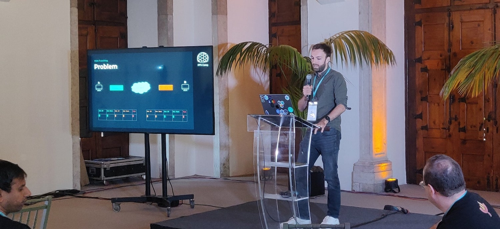
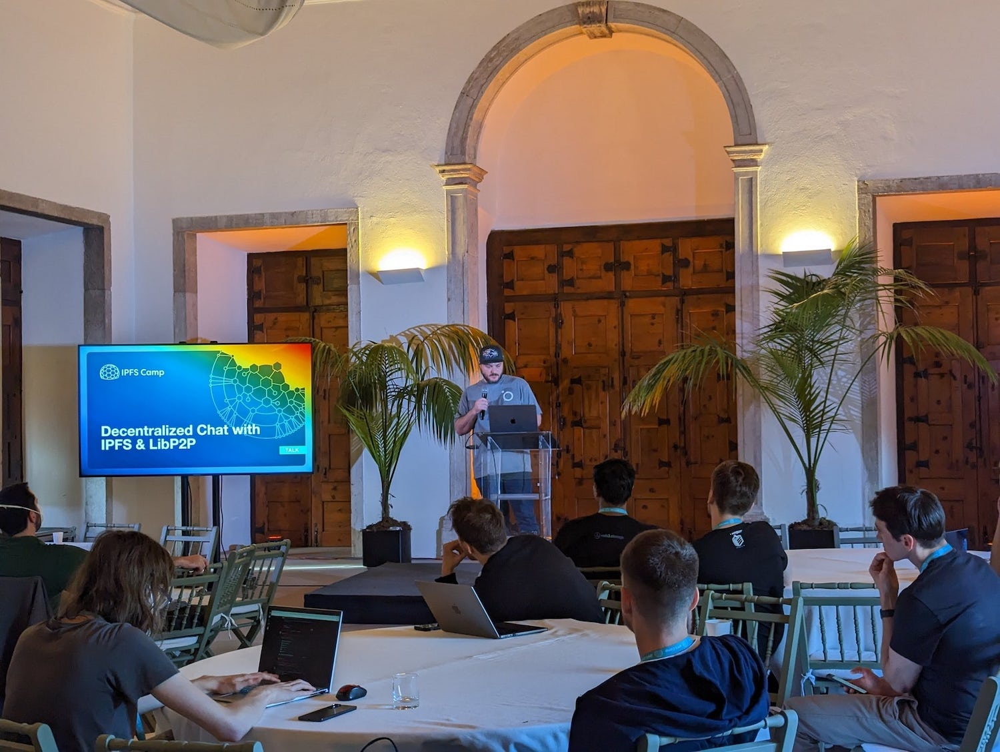
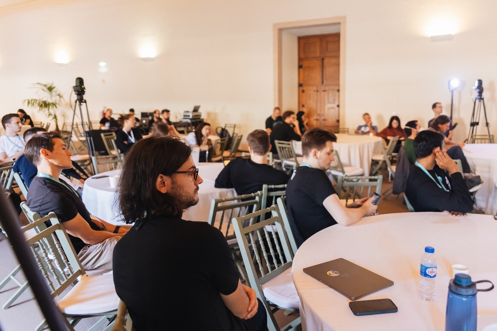

---
tags:
- libp2p
title: libp2p Day 2022 Recap
description: Recap of libp2p Day during IPFS Camp 2022 in Lisbon!
date: 2022-11-22
permalink: "/2022-11-22-libp2p-day-2022-recap/"
translationKey: ''
header_image: /libp2p-day-blog-header.png
author: Prithvi Shahi
---

**Table of Contents**

[[toc]]

## Introduction

    <figure>
        
        <figcaption style="font-size:x-small;">Go, JS, and Rust libp2p core maintainers introduced by Steve Loeppky.
            <a href="https://twitter.com/IPFS/status/1586670754766143490?s=20&t=I8wcyY6Ie0tPKvQf40Mv0g">[Pic credit.]</a>
        </figcaption>
    </figure>
    <figure>
        
        <figcaption style="font-size:x-small;">Max Inden gave a high level introduction to libp2p.
            <a href="https://twitter.com/IPFS/status/1586665721559392256?s=20&t=I8wcyY6Ie0tPKvQf40Mv0g">[Pic credit.]</a>
        </figcaption>
    </figure>

Last month, on October 30th 2022, libp2p users and contributors gathered together for the first ever libp2p Day! 

The day included talks from maintainers, contributors, community members, and users. Topics included latest libp2p updates, preview of future roadmap items, bleeding-edge demos on browser connectivity using new transport protocols, and much more.

Speakers shared new, exciting developments built on libp2p and represented organizations like [Little Bear Labs](https://littlebearlabs.io/), [ChainSafe Systems](https://chainsafe.io/), [Status.im](https://status.im/), [Gather](https://www.gather.town/), [Quiet](https://www.tryquiet.org/), [Pyrsia](https://pyrsia.io/), [Satellite.im](http://satellite.im/), and [Protocol Labs](https://protocol.ai/).

In the larger context, libp2p Day was hosted at [IPFS Camp 2022](https://2022.ipfs.camp/) as a part of a diverse lineup where speakers covered topics across domains such as libp2p, IPFS, content routing, decentralized computation, and more!

<blockquote class="twitter-tweet">
🎥 3 days of <a href="https://twitter.com/hashtag/IPFSCamp?src=hash&amp;ref_src=twsrc%5Etfw">#IPFSCamp</a> in one short video. 23 tracks, 100+ speakers, and the IPFS community. Watch the recap and relive the fun.⛺️️ 🎉 Who is ready for next year? <a href="https://t.co/IolaZZduIB">pic.twitter.com/IolaZZduIB</a>
&mdash; IPFS (@IPFS) <a href="https://twitter.com/IPFS/status/1587053346829094915?ref_src=twsrc%5Etfw">October 31, 2022</a></blockquote> 

### Goals

The goals of libp2p Day were to:

1. Share updates on libp2p and highlight new developments through demos
2. Gather the libp2p ecosystem, give a spotlight to projects building on libp2p, and energize the community
3. Empower newcomers and existing users to become contributors and spec authors

### Takeaways

Some highlights and learnings from libp2p Day and IPFS Camp were:

#### Browser Connectivity Unlocked

First-class support for WebTransport enables libp2p nodes running in the browser ([currently limited to Chromium](https://caniuse.com/webtransport)) to connect directly with peers on a host machine. WebTransport support was first added as an experimental feature in [go-libp2p v0.23.0](https://github.com/libp2p/go-libp2p/releases/tag/v0.23.0) and [Kubo v0.16.0](https://github.com/ipfs/kubo/releases/tag/v0.16.0#-webtransport-new-experimental-transport). The remaining WebTransport work is [tracked here](https://github.com/libp2p/go-libp2p/issues/1827).

WebRTC browser-to-server has also made significant progress. Since libp2p Day, the specification [been merged](https://github.com/libp2p/specs/tree/master/webrtc), and the [rust-libp2p implementation](https://github.com/libp2p/rust-libp2p/commit/a7148648858fe10e9ba4c2793c7e12392b49c0ab) has shipped! The Go and JS implementations are also tracking closely.

Check out the [WebTransport](#webtransport-transport) and [WebRTC](#why-webrtc) demos below, as well as the [new libp2p connectivity site](https://connectivity.libp2p.io/).

#### libp2p Interoperability

The libp2p ecosystem continues to flourish with several implementations, each with its own set of supported features. It’s paramount to ensure these features and implementations are compatible and that new releases don’t introduce regressions. libp2p teams are spending the tail end of 2022 and much of 2023 focusing on testing libp2p interoperability.

Checkout [libp2p Interoperability Testing with Testground](#libp2p-interoperability-testing-with-testground) to learn more.

#### Demand for libp2p + HTTP

With the growing demand for libp2p + HTTP, especially by [Protocol Labs ProductDev](https://pl-strflt.notion.site/Teams-c1757afbec9946d68daadf5bc0212b97) teams like Bedrock and [dag.house](http://dag.house)), the team has started drafting an [HTTP specification](https://github.com/libp2p/specs/pull/477), with plans to make this a top priority going into 2023. libp2p + HTTP will enable use cases like integrating directly with CDN infrastructure or allowing a static HTTP cache to respond to requests from a libp2p node.

## Recap of talks

Below is list of all talks alongside a brief outline:

    <figure>
        
        <figcaption style="font-size:x-small;">Marten Seemann presented on browser connectivity.
            <a href="https://twitter.com/IPFS/status/1586676794383638535?s=20&t=I8wcyY6Ie0tPKvQf40Mv0g">[Pic credit.]</a>
        </figcaption>
    </figure>
    <figure>
        
        <figcaption style="font-size:x-small;">Dennis Trautwein described solutions to problems encountered during NAT traversal.
            <a href="https://twitter.com/physikerwelt/status/1586683911584813058">[Pic credit.]</a>
        </figcaption>
    </figure>

### Intro to libp2p: helping with real world application problems

Max Inden (rust-libp2p maintainer, Software Engineer at Protocol Labs)

@[youtube](J7ZWbpo2AZk)

Max introduced libp2p by giving an overview of the supported transport protocols, secure channels, multiplexing mechanisms, how libp2p [traverses NATs](https://research.protocol.ai/publications/decentralized-hole-punching/), how libp2p discovers peers, how libp2p uses [Kademlia](https://pdos.csail.mit.edu/~petar/papers/maymounkov-kademlia-lncs.pdf) for peer-to-peer routing, [GossipSub](https://arxiv.org/abs/2007.02754) for publishing and subscribing messages, and how libp2p exchanges data using [BitSwap](https://research.protocol.ai/publications/accelerating-content-routing-with-bitswap-a-multi-path-file-transfer-protocol-in-ipfs-and-filecoin/delarocha2021.pdf). He briefly reviewed the different implementations and projects using libp2p and previewed libp2p’s future focus.

### A month in PL EngRes libp2p Development and how you can be involved

Steve Loeppky (Engineering Manager of libp2p team at Protocol Labs)

@[youtube](sG2j1EqVB0Q)

Steve outlined a typical month of libp2p development for implementations like Go, JS, and Rust and the work done to support the wider community. He showcased recent work to improve the [libp2p documentation](http://docs.libp2p.io), the [implementation roadmaps](https://github.com/libp2p/specs/blob/master/ROADMAP.md#implementation-roadmaps) and their planned features, and highlighted the team structure, project [values](https://pl-strflt.notion.site/libp2p-a27f9e5cb69648538e444163ce3f7309) and [core tenets](https://github.com/libp2p/specs/blob/master/ROADMAP.md#core-tenets).

### Browser connectivity state of the union and demo

Marten Seemann (go-libp2p maintainer, Software Engineer at Protocol Labs)

@[youtube](qG_1bYVtGO4)

Marten gave an updated version of a [P2P Paris talk](https://www.youtube.com/watch?v=aXYUw9tikaQ) covering the intricacies of browser communication with other nodes and discussed recent breakthroughs. He outlined the current capabilities with libp2p in the browser and gave an overview of WebSockets, [WebTransport](https://github.com/libp2p/specs/tree/master/webtransport), and [WebRTC](https://github.com/libp2p/specs/tree/master/webrtc), and future next steps.
To top it off, Marten linked to [the brand new libp2p connectivity website](https://connectivity.libp2p.io/), a site he put together to make the libp2p connectivity story easier to understand!

### WebTransport Transport

Alex Potsides (js-libp2p maintainer, Software Engineer at Protocol Labs)

@[youtube](Dt42Ss6X_Vk)

Alex demoed WebTransport [using the browser to fetch a file from Kubo directly](https://github.com/libp2p/js-libp2p-webtransport/tree/main/examples/fetch-file-from-kubo).

Alex underscored the incredible accomplishment in his talk: browsers can leverage WebTransport to talk directly to a distributed network. He described WebTransport availability in browsers today and how it compares to WebRTC concerning application performance.

### Why WebRTC

Ryan Plauche (Software Engineer at [Little Bear Labs](https://littlebearlabs.io/))

Max Inden ( rust-libp2p maintainer, Software Engineer at Protocol Labs)

@[youtube](ZBIFFuakFHQ)

Later, Max dove deeper into WebRTC by offering an overview of its history and describing its advantages, namely, how WebRTC enables connections between peers using [self-signed certificates](https://en.wikipedia.org/wiki/Self-signed_certificate) and allows for hole punching in the browser. He then described the [Browser to Server specification](https://github.com/libp2p/specs/tree/master/webrtc#browser-to-public-server) in greater detail and previewed Browser-to-Browser connectivity.

From [Little Bear Labs](https://littlebearlabs.io/), Ryan presented the work he and his colleagues [John](https://github.com/John-LittleBearLabs) & [Chinmay](https://github.com/ckousik) accomplished to support WebRTC in libp2p. He gave a fantastic demo of WebRTC browser-to-server using one browser client (a react app with a js-libp2p dialer) and two servers (two go-libp2p listeners). He also verified the demo in real-time using Chrome’s chrome://webrtc-internals page to observe the data channels and prove that the intended messages were passed using WebRTC!

### Decentralized NAT Hole Punching

Dennis Trautwein (Research Engineer at [ProbeLab](https://research.protocol.ai/groups/probelab/))

@[youtube](bzL7Y1wYth8)

Dennis presented his project on measuring the success rates of the novel decentralized hole-punching mechanism. He described the hole-punching mechanism and gave an overview of the [Direct Connection Upgrade through Relay (DCUtR) protocol](https://github.com/libp2p/specs/blob/master/relay/DCUtR.md). He then discussed how measurements are made and the findings on success rates. Dennis ended the presentation with a call to action: participate in the [NAT Hole Punching Measurement Campaign](https://discuss.libp2p.io/t/call-for-participation-nat-hole-punching-measurement-campaign/1690)!

### libp2p in Nim

Tanguy (nim-libp2p maintainer, Software Engineer at [Status.im](https://status.im/))

@[youtube](Iv9VrLPloGI)

Tanguy spoke about the [Nim programming language](https://nim-lang.org/) and drew contrasts between the features and goals of Nim, Go, and Rust. He focused on [nim-libp2p](https://github.com/status-im/nim-libp2p) which underpins applications like [Codex](https://github.com/status-im/nim-codex), [Waku](https://our.status.im/peer-to-peer-messaging-where-whisper-falls-short-and-waku-picks-up/), and [Nimbus](https://nimbus.team/). Tanguy detailed currently supported features in nim-libp2p, what it’s missing, and outlined plans for incoming features (GossipSub improvements, Tor transport, C bindings, running in the browser, and Bluetooth transport.)

Fun fact: nim-libp2p recently became the first libp2p implementation to cut a 1.0 release 🥳

### libp2p Interoperability Testing with Testground

Laurent Senta (Productivity Engineer at Protocol Labs)

@[youtube](b2SkC4dYV-A)

Laurent gave a talk introducing [Testground](https://docs.testground.ai/) and how it helps achieve libp2p’s interoperability goal ([as mentioned in Steve’s presentation](https://youtu.be/sG2j1EqVB0Q?t=1064).) He explained the importance of interop testing between libp2p implementations and how Testground’s language & runtime agnostic framework is a perfect fit for this use case. In the overview, Laurent described a ping test, how to make a test runnable in Testground, and how build and runtime parameters are specified in test configurations. Notably, he shared how Testground and interop testing has already caught bugs (within a month of tests being enabled)!

Laurent also previewed upcoming features (support for complex test suites, Node JS and Browser JS tests, etc.) and plans for quality of life improvements (simplify debugging, documentation, and stability improvements.)

    <figure>
        
        <figcaption style="font-size:x-small;">Drew Ewing presented the Iridium and the Satellite.im project.
            <a href="https://twitter.com/Satellite_im/status/1586734161066278912">[Pic credit.]</a>
        </figcaption>
    </figure>
    <figure>
        
        <figcaption style="font-size:x-small;">A glimpse into the audience.
            <a href="https://twitter.com/IPFS/status/1586744753839919107?s=20&t=I8wcyY6Ie0tPKvQf40Mv0g">[Pic credit.]</a>
        </figcaption>
    </figure>

### WebRTC signaling data over QR Codes

Gorka (Tech lead at [Gather](https://www.gather.town/))

@[youtube](EQFUPZK9CwI)

Gorka demonstrated a novel experiment: WebRTC data exchange over QR codes. He described how it’s possible to share any data using QR codes and explained how this method could be used to exchange signaling data to establish a WebRTC connection between two devices on the same network.

### Formal Analysis of GossipSub

Ankit Kumar (PhD student at Northeastern University)

@[youtube](T3QLhijHAwA)

Ankit presented on work he and his colleagues at Northeastern University did to formally specify the GossipSub protocol. This critical work cross validated the [prose specification](https://github.com/libp2p/specs/blob/master/pubsub/gossipsub/gossipsub-v1.1.md) against GossipSub implementations in the Filecoin and Ethereum networks. Ankit detailed how the team at Northeastern used the [ACL2S theorem prover](http://acl2s.ccs.neu.edu/acl2s/doc/) as a part of the formalization effort and arrived at a scoring function (used to determine good peers vs. bad peers) with four essentials properties needed to prevent Sybil attacks. He shared findings and discussed which properties were satisfied on Filecoin and Ethereum, and outlined future directions to develop a verified network stack.

### Introducing Quiet - Encrypted P2P team chat without servers, just Tor

Holmes Wilson (Founder of [Fight for the Future](https://www.fightforthefuture.org/))

@[youtube](owSd7uuGwmw)

Holmes presented [Quiet](https://github.com/TryQuiet/quiet), a slack alternative focused on privacy, built on IPFS, OrbitDB, and Tor .onion services. *Quiet teams* operate in private libp2p and IPFS networks (over Tor) which use a modified libp2p WebSockets transport combined with Tor, as well as BitSwap and PubSub for messaging. Holmes also provided contrasts between Quiet and other privacy focused (Signal) and non-privacy focused team messaging apps (e.g. Matrix and Mattermost.)

### How Pyrsia is Using libp2p To Take Over the World

Elliot Frisch (Blockchain Developer at [JFrog](https://jfrog.com/))

@[youtube](aIxmQKWUjNY)

Elliot introduced and gave a demo of [Pyrsia](https://pyrsia.io/), a binary build & distribution system written in Rust and built on top of libp2p for messaging (instead of HTTP or SSH.) He detailed how Pyrsia seeks to provide provenance when distributing binaries with the aim to prevent known exploits like the [SolarWinds hack](https://www.wired.com/story/solarwinds-hack-supply-chain-threats-improvements/), [Log4Shell exploit](https://news.sophos.com/en-us/2021/12/17/inside-the-code-how-the-log4shell-exploit-works/), [malicious crates in rust](https://blog.rust-lang.org/2022/05/10/malicious-crate-rustdecimal.html), and [domain takeovers](https://jfrog.com/blog/npm-package-hijacking-through-domain-takeover-how-bad-is-this-new-attack/).

### Decentralized Chat with IPFS & libp2p

Drew Ewing (CTO at [Satellite.im](http://satellite.im))

@[youtube](baqWhUACUAg)

Drew introduced Satellite, a decentralized video, voice, and chat application that utilizes libp2p and IPFS. He described [Iridium](https://github.com/Satellite-im/iridium), an abstraction layer that bootstraps both IPFS and libp2p and uses [DIDs](https://www.w3.org/TR/did-core/) for user identity. He ended the presentation with a demo where he generated a DID, created a new user account, and sent messages. You can play with a demo here: [https://core.satellite.im/](https://core.satellite.im/)

### DOS Defense - Do’s and Dont’s

Max Inden ( rust-libp2p maintainer, Software Engineer at Protocol Labs)

@[youtube](jZrAnnFO-2c)

Max’s third talk of the day outlined how to prevent DoS attacks by explaining what an application should do (bound resources, enforce backpressure, etc.) and what an app should avoid. This was a fun, interactive session where Max presented code snippets and had participants point out how an attacker could take advantage of flaws in the code.

### Intro to Lodestar

Cayman Nava (js-libp2p & [Lodestar](https://github.com/chainsafe/lodestar) maintainer, Blockchain Engineer at [ChainSafe Systems](https://chainsafe.io/))

@[youtube](1DStPz32k_4)

Cayman gave an overview of [Lodestar](https://github.com/chainsafe/lodestar), an Ethereum consensus client implemented in TypeScript and its use of js-libp2p. He described the unique challenges of writing high performance TypeScript/JavaScript, and explained how the ChainSafe team uses metrics and CPU profiling to test js-libp2p and Lodestar in production.

### The power of two choices: Why the Kademlia binary tree isn’t balanced and what we can do about it

Petar Maymounkov (co-author of [Kademlia](https://pdos.csail.mit.edu/~petar/papers/maymounkov-kademlia-lncs.pdf), Senior Research Engineer at Protocol Labs)

@[youtube](0dKz_K-7eoI)

The final talk by Petar was a great way to cap off libp2p Day. Petar discussed peer ID distribution in the Kademlia DHT - existing problems and solutions to those problems. In the first half of the talk, he showed that in an experiment (run many times over) of picking a thousand random numbers and inserting them into a binary tree, the distribution of leaf depths is always going to be the same, even though the tree is different in each experiment. Furthermore, Petar described how a theorem that looks at distribution of depths in the tree can be used to summarize the imbalance/non-uniformity of the Kademlia binary tree.

The second half of the talk provided a solution and described the power of two choices, an algorithm for picking peer IDs results in an overall more balanced binary tree with a shallower depth distribution. Petar explains that a well-balanced tree can give us a better inference of network size.

## Get Involved/Stay Tuned

A big thank you to the attendees, speakers, and organizers of libp2p Day! 🤩 It was a pleasure to have everyone together for the first libp2p Day and we hope to see you at the next one. To those who couldn’t make it this time around, we hope you can make it next time. Until then, these recordings will help you get up to speed.

- If you’d like to get involved and contribute to libp2p, you can reach out to us using these means: [https://libp2p.io/#community](https://libp2p.io/#community)
- If you’re a self-starter and want to start pushing code immediately, feel free to ping the maintainers in any of these help wanted/good first issues: [go-libp2p](https://github.com/libp2p/go-libp2p/issues?q=is%3Aopen+is%3Aissue+label%3A%22good+first+issue%22), [js-libp2p](https://github.com/libp2p/js-libp2p/issues?q=is%3Aopen+is%3Aissue+label%3A%22good+first+issue%22), and [rust-libp2p](https://github.com/libp2p/rust-libp2p/issues?q=is%3Aopen+is%3Aissue+label%3Agetting-started).
- If you want to work in and around libp2p full-time, there are various teams hiring including the implementation teams.  See [https://jobs.protocol.ai/jobs?q=libp2p](https://jobs.protocol.ai/jobs?q=libp2p) for opportunities across the [Protocol Labs Network](https://plnetwork.io/).
- There is a call for participants in the [NAT Hole Punching Measurement Campaign](https://discuss.libp2p.io/t/call-for-participation-nat-hole-punching-measurement-campaign/1690). Please check it out, any help is appreciated!

To learn more about libp2p generally, checkout:

- The [libp2p documentation portal](https://docs.libp2p.io/)
- The [libp2p connectivity website](https://connectivity.libp2p.io/)
- The [libp2p curriculum put together by the Protocol Labs Launchpad program](https://curriculum.pl-launchpad.io/curriculum/libp2p/introduction/)

You can reach out to us and stay tuned for our next event announcement by joining our [various communication channels](https://libp2p.io/#community), joining the [discussion forum](https://discuss.libp2p.io/), following us on [Twitter](https://twitter.com/libp2p), or saying hi in the #libp2p-implementers channel in the [Filecoin public Slack](http://filecoin.io/slack).

Cheers!