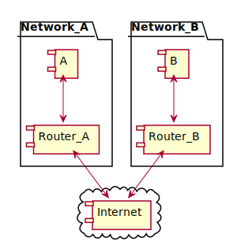
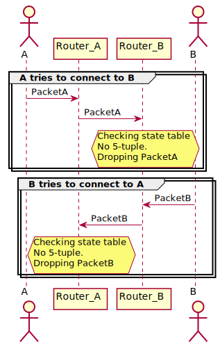
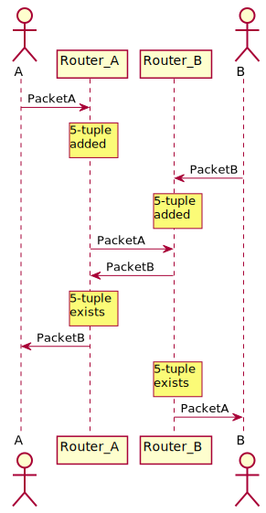
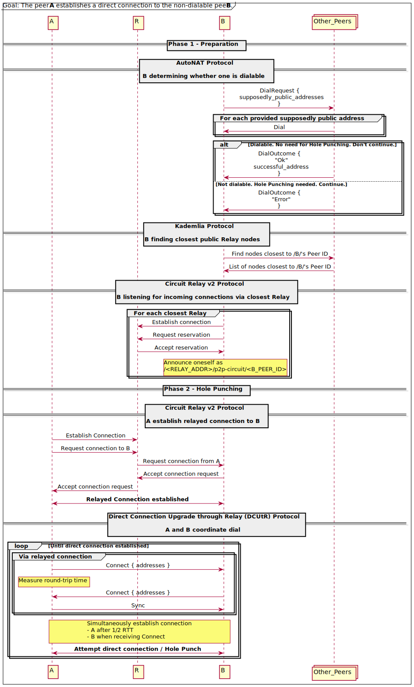
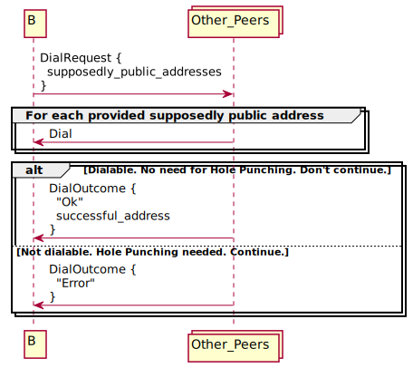
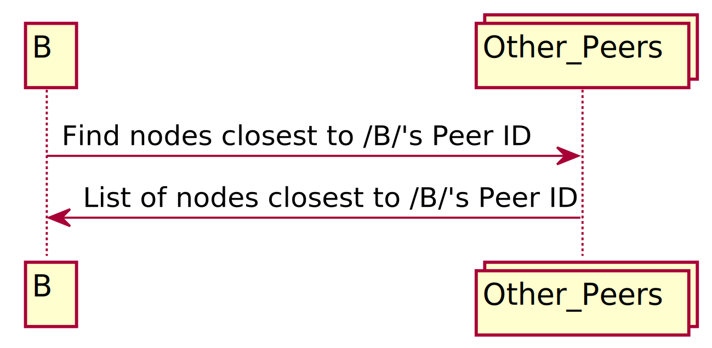
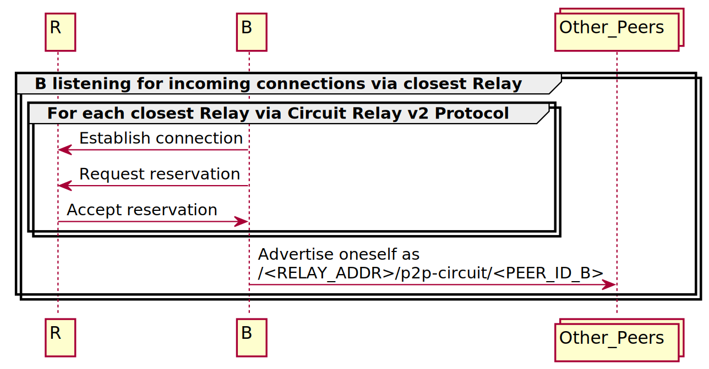
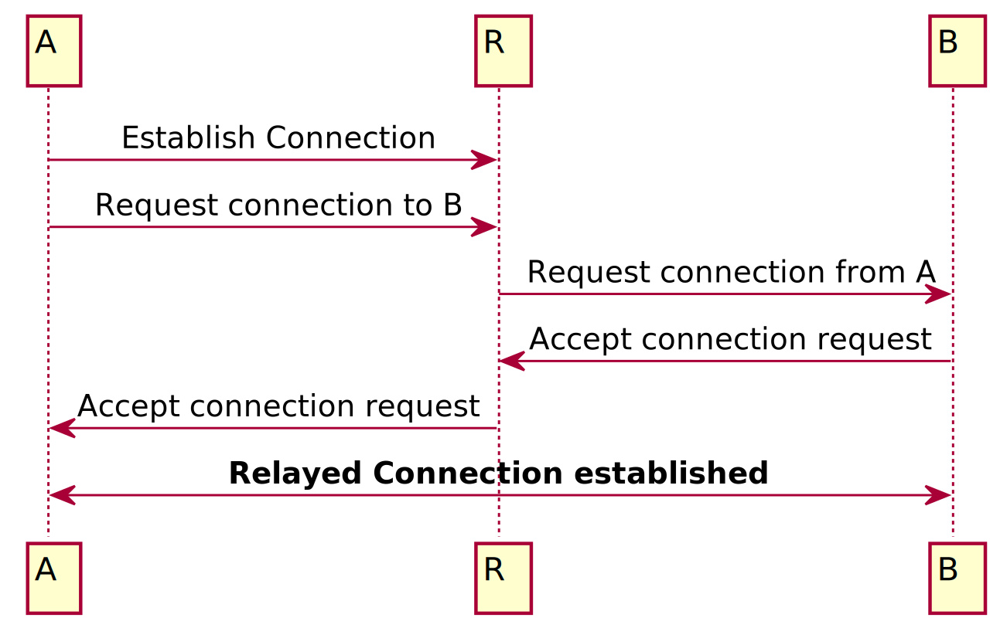
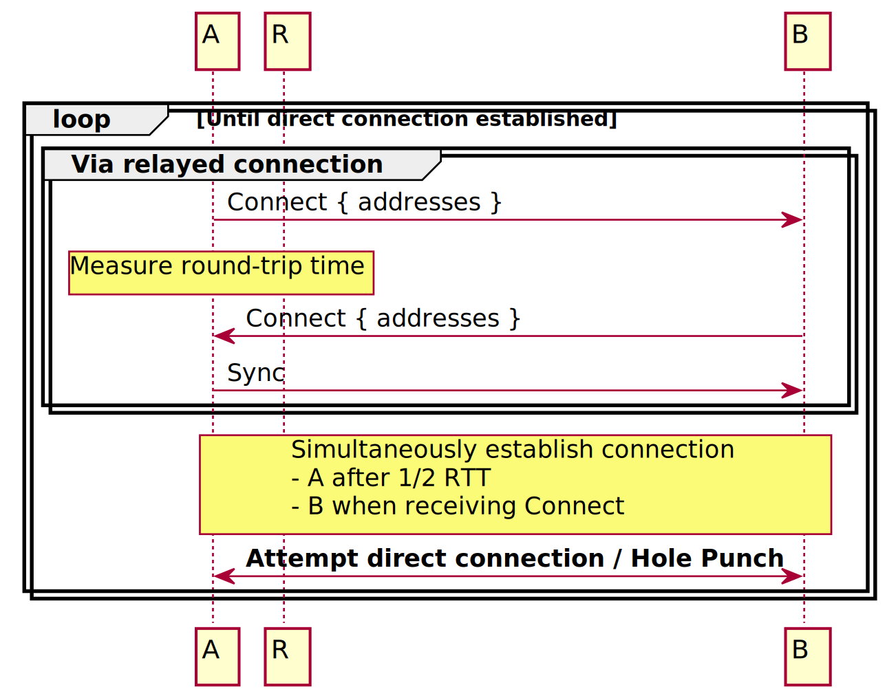

---
tags:
- libp2p
title: Hole punching in libp2p - Overcoming Firewalls
description: 
date: 2022-01-20
permalink: "/2022-01-20-libp2p-hole-punching/"
translationKey: ''
header_image: /libp2p-hole-punching-banner.svg
author: Max Inden
---

In case you haven't yet heard the great news, [libp2p](https://docs.ipfs.io/concepts/glossary/#libp2p) can now punch holes.

The below explains why we want to punch holes, what we are punching those holes into, and most interestingly, how we punch those holes.

# The Problem with Firewalls

Computers in today's internet can be divided into two groups: public and non-public computers. In other words, those that you can dial and those that you cannot. Public computers can dial public computers. Non-public computers can dial public computers. But public computers cannot dial non-public computers, nor can non-public computers dial other non-public computers.

For the sake of simplicity, this post focuses on firewalls and won't talk about Network Address Translation (NA). In addition, this post assumes a worst-case scenario where neither of two peers is able to leverage [UPnP](https://en.wikipedia.org/wiki/Universal_Plug_and_Play) or set up manual port forwarding.

Also, we will be using the terms _computer_ and _node_ interchangeably. 

## Firewalls in a nutshell

Firewalls control the bytes flowing in and out of a network. They usually do so using a state table of 5-tuples. A 5-tuple is used to identify a connection between two endpoints. It consists of the IP source address, the IP destination address, the transport protocol (TCP or UDP), the source port number, and the destination port number of a connection. On TCP, a firewall can determine the lifetime of these 5-tuples based on the TCP connection state (e.g., through `SYN` and `FIN`). On UDP, given that the protocol itself is connectionless, firewalls use timeouts to garbage collect the 5-tuple entries in the state table.

| Source IP   | Destination IP | Transport Protocol | Source Port | Destination Port |
|-------------|----------------|--------------------|-------------|------------------|
| 192.168.0.2 | 198.51.100.0   | TCP                | 12345       | 443              |
| 192.168.0.2 | 198.51.100.1   | UDP                | 12345       | 53               |
| ...         | ...            | ...                | ...         | ...              |

The simplest security measure all major consumer firewalls enforce to protect their network is the following:

1.  When forwarding an outgoing packet, add a 5-tuple for said connection to the state table.
2.  When receiving an incoming packet, check whether there is a 5-tuple for an outgoing connection matching the incoming packet.
    1.  If there is, it is a response to a previous outgoing packet, and thus the packet is forwarded to the destined machine within the network.
    2.  If there is not, drop the packet.

## An example

Let's look at an example. Two computers, *A* and *B*, each in their own network, are connected to the internet via a separate home router each, with those home routers acting as firewalls.

The sequence diagram below depicts the scenario where computer *A* emits a packet destined for *B*. Said packet is first sent to *A*'s router, which in turn forwards it to *B*'s router.

*A*'s router forwards the packet to *B*'s router. *B*'s router checks its state table, cannot find a matching 5-tuple (IPA, IPB, TCP, PortA, PortB) and thus drops the packet. In a nutshell, this is why the Internet is divided into two, public and non-public computers.

The same applies to packets sent from *B* to *A*; see the second half of the sequence diagram.

Now, please do not go around disabling all your firewalls! They serve their purpose. After all, *A* and *B* most likely don't want random strangers connecting to them. However, they do still want to connect to each other.

# Hole Punching

Hole punching is one mechanism to overcome the problem described above. Let's see how it works.

Imagine that we have some mysterious mechanism to synchronize *A* and *B*. Such a mechanism would allow *A* and *B* to dial each other "at the same time".

1.  *A*'s first packet (e.g., in the case of TCP, an `SYN`) passes through router *A* and thus adds a 5-tuple to router *A*'s state table. The same happens on the other side, where the packet sent by *B* triggers a 5-tuple being added to *B*'s router's state table. Packet *A* and packet *B* "punched holes" into their respective routers' firewalls.
2.  Both packets arrive at the opposite router after having crossed paths somewhere in this crazy thing called _the internet_. Whether they really cross paths is something for another blog post, but still an amusing image to have in mind.
3.  Once *A*'s packet arrives at router *B*, router *B* checks its state table, finds a 5-tuple previously added through the packet sent by *B*, and forwards the packet to computer *B*. Same with *B*'s packet, arriving at router *A*, matching a 5-tuple in router *A*'s state table and thus forwarded to computer *A*.

In case you haven't noticed, we just fixed our problem. *A* and *B* can now happily exchange packets. Take a look at the sequence diagram below, depicting the same process.

There are situations in which hole punching will not work, most notably when one of the nodes is behind a symmetric NAT. In such cases, nodes can instead explicitly add port mappings, either manually or by using [UPnP](https://en.wikipedia.org/wiki/Universal_Plug_and_Play). As a last resort, nodes can leverage external [relay](https://docs.ipfs.io/concepts/glossary/#relay) nodes.

# Hole Punching in libp2p

Based on the above concept, hole punching looks fairly easy to do! But it is a lot more complex than one would think. In addition, we didn't even cover the _mysterious mechanism to synchronize *A* and *B*_. 

Introducing libp2p's way of decentralized hole punching. Those familiar with [IETF's ICE](https://datatracker.ietf.org/doc/html/rfc8445) will spot many similarities. Libp2p's hole punching mechanisms are heavily inspired by ICE.

One can partition libp2p's way of hole punching in roughly 2 phases, a preparation phase, and a hole punching phase. We will go into each of them in more detail further below.

## Overview

Here is a sequence diagram of the whole process. Don't worry; we will go into each step separately. Maybe the sole purpose of this huge diagram is to prove the point above that hole punching "is a lot more complex than one would think".

## Phase 1 - Preparation

### 1.1 Determine whether one is dialable (AutoNAT)

In step 1 of phase 1, a node determines whether it is dialable. In other words, it determines whether computers outside of their own network can connect to it. The main protocol involved here is the [libp2p *AutoNAT* protocol](https://github.com/libp2p/specs/blob/master/autonat/README.md). (The corresponding ICE protocol to libp2p's AutoNAT protocol (and libp2p's [identify protocol](https://github.com/libp2p/specs/blob/master/identify/README.md)) is [STUN](https://datatracker.ietf.org/doc/html/rfc8489).)

In our case, computer *B* from above determines whether it is dialable. It does so with the help of random public nodes, e.g., bootnodes of its peer-to-peer network.

*B* reaches out to a subset of public nodes of its peer-to-peer network, asking each node to it (*B*) on a set of addresses that it suspects it could be reachable under. Each of the contacted nodes goes ahead and attempts to dial each of *B*'s addresses. They report the outcome back to *B*, i.e., whether they succeeded to dial *B*, including the address that succeeded, or whether they didn't succeed with any of the provided addresses. Based on a set of reports, *B* can gauge whether it is publicly dialable or not. In the case where *B* is publicly dialable, no hole punching is needed. In the case where *B* is not dialable, *B* proceeds to the next step of the first phase.

### 1.2 Find closest public Relay nodes (e.g. through Kademlia)

*B* now knows that nodes outside its local network cannot dial it. Well, they "cannot dial it **directly**". However, they could do so **indirectly** through some public relay node. We will go into what *indirect* dialing looks like in the next step.

For now, let's find a couple of public nodes in our peer-to-peer network that can serve as relay nodes. This step is not defined by libp2p, as it heavily depends on the peer-to-peer network. In the case of [IPFS](https://ipfs.io/), each public node in the IPFS network serves as a [relay](https://docs.ipfs.io/concepts/glossary/#relay) node. *B* would either do a lookup on the [Kademlia DHT](https://github.com/libp2p/specs/blob/master/kad-dht/README.md) for the closest peers to its own [Peer ID](https://docs.ipfs.io/concepts/glossary/#peer-id) or just choose a subset of the public nodes it is already connected to. (Just a note: Latency matters in the choice of one's public relay node, though that is for another blog post.)

### 1.3 Listen for connections via Relay (Circuit Relay v2)

Back to the previous question. How can a node be **indirectly** dialable through a relay node? This is enabled through the [libp2p Circuit Relay v2 protocol](https://github.com/libp2p/specs/blob/master/relay/circuit-v2.md). Drawing the connection to IETF's ICE once more, this would be the equivalent of the [TURN protocol](https://datatracker.ietf.org/doc/html/rfc5766).

The [libp2p Circuit Relay v2 protocol](https://github.com/libp2p/specs/blob/master/relay/circuit-v2.md) protocol allows relay nodes to limit the resources used to relay connections (e.g., by the number of connections, the time, and amount of bytes). In the case of IPFS, this allows every public node in the network to serve as a relay without the fear of high resource consumption.

For each of the public relay nodes discovered in the previous step, *B* would do the following: First, *B* connects to the remote node and requests a so-called "reservation", basically saying: "Hey, I am not dialable. Given that you are dialable, would you mind listening for incoming connections on my behalf, forwarding each of them to me over this connection?".

If the remote accepts the reservation request, *B* can advertise itself as being reachable through the remote Relay node. In other words, instead of advertising its own IP address (which is useless given that *B* is not publicly dialable), *B* advertises a "relayed" address, which contains the IP address of the remote relay node plus its own peer ID.

    /<RELAY_ADDR>/p2p-circuit/<PEER_ID_B>

(The above is a so-called [multiaddr](https://github.com/multiformats/multiaddr). It is a composable network addressing schema. The address above reads as: "You can reach peer *B* with the peer ID /B/PEERID via the relay at the address RELAYADDR".)

Note: It is very important that *B* keeps the outgoing connection to the relay node alive. *B* is not publicly dialable; thus, the relay would not be able to establish a connection to *B*. When the relay receives a connection request for *B*, it relays it using the initial connection from *B*.

## Phase 2 - Hole punching

Entering the next phase. Now that everything is prepared (phase 1), we can punch some holes (into firewalls).

For that, let's imagine node *A* got a hold of *B*'s relayed address through some mechanism. One possible scenario in the IPFS world could be that *B* is advertising the availability of a specific chunk of data, and *A* discovered the data provider *B* on the Kademlia DHT. Given the relayed address, *A* would now like to establish a direct connection to *B*. As *B* is advertising a relayed address and not a direct address, *A* knows that *B* is not directly dialable but only dialable through a relay node.

### 2.1 Establish relayed connection (Circuit Relay v2)

Before establishing a direct connection using hole punching, *A* first has to establish a relayed connection to *B* via the public relay node. Using the information contained in *B*'s advertised address, *A* first establishes a direct connection to the relay node and then requests a relayed connection to *B* from the relay. The relay forwards said request to *B*, which accepts the request. The relay once more forwards the acceptance to *A*. From now on, *A* and *B* can use the bi-directional channel over the relay to communicate.

*A* and *B* upgrade the relayed connection with a security protocol like TLS. Thus the relay cannot eavesdrop on the connection between the two.

### 2.2. Coordinate simultaneous dial (DCUtR)

Over the relayed connection established in the previous step, *A* and *B* can now coordinate the hole punch, ultimately leading to a direct connection between *A* and *B*. This coordination is happening via the [libp2p DCUtR protocol](https://github.com/libp2p/specs/blob/master/relay/DCUtR.md) which stands for "Direct Connection Upgrade through Relay" protocol. In case you still remember the introduction to this blog post, this is the magical synchronization mechanism, or rather a pretty good time synchronization mechanism.

There are two stages to do a *direct connection upgrade through a relay*, exchanging *Connect* messages and sending a single *Sync* message.

First off, *A* sends a *Connect* message to *B*. That *Connect* message contains the addresses of *A*. libp2p offers multiple mechanisms to discover one's addresses, e.g., via the [libp2p identify protocol](https://github.com/libp2p/specs/blob/master/identify/README.md). *B* receives the *Connect* message on the relayed connection and replies with a *Connect* message containing its (non-relayed) addresses. *A* measures the time between sending its and receiving *B*'s *Connect* message and thereby determines the round trip time between *A* and *B* (on the relayed connection).

Next, *A* sends a *Sync* message to *B*. Once sent out, *A* waits for half the round trip time, then it dials *B* via the addresses received in *B*'s *Connect*. On the other end, as soon as *B* receives *A*'s *Sync* message, it immediately dials *A* with the addresses provided in *A*'s *Connect* message.

Now, if you do the math, *A* starts after half the round trip time between *A* and *B* via the relay, and *B* starts once it receives the *Sync*. This should roughly account to the same point in time.

# Hole Punching

So you can already guess what happens once both *A* and *B* dial each other simultaneously, &#x2026; a **hole punch**. Let's play through this one more time, using the sequence diagram on generic hole punching from the beginning of this blog post:

> 1.  *A*'s packet would pass through router *A* and thus add a 5-tuple to router *A*'s state table. Same on the other side, where the packet sent by *B* would trigger a 5-tuple being added to *B*'s router's state table. Packet *A* and packet *B* "punch holes" into their router's firewalls.
> 2.  Both packets, each then forwarded to the opposite router, would cross paths somewhere in this crazy thing called _the internet_. (Whether they really cross paths is something for another blog post, but still an amusing image to have in mind.)
> 3.  Once *A*'s packet arrives at router *B*, router *B* checks its state table, finds a 5-tuple previously added through the packet sent by *B*, and forwards the packet to computer *B*. Same with *B*'s packet, arriving at router *A*, matching a 5-tuple in router *A*'s state table and thus forwarded to computer *A*.

Quite a process, huh?!

# Closing

Hole punching in libp2p is fully specified in the [libp2p specification](https://github.com/libp2p/specs/). It is implemented in [go-libp2p](https://github.com/libp2p/go-libp2p) and [rust-libp2p](https://github.com/libp2p/rust-libp2p/), though in the latter it is not yet released (see [tracking issue](https://github.com/libp2p/rust-libp2p/issues/2052)).

Compatible hole punching client shipped in [go-ipfs 0.11](https://github.com/ipfs/go-ipfs/releases/tag/v0.11.0). For now, it is hidden behind the [`Swarm.EnableHolePunching`](https://github.com/ipfs/go-ipfs/blob/master/docs/config.md#swarmenableholepunching) configuration flag, but we will enable it by default later this year to improve the connectivity of peers behind firewalls.

If you want to:

-   **Learn** more, check out the libp2p [documentation](https://docs.libp2p.io/) and [specification](https://github.com/libp2p/specs/).
-   **Get involved**, check out the repository of your favorite libp2p implementation. Look out for "help wanted" labeled issues.
-   **Work** on things like the above full-time, [we are hiring](https://protocol.ai/join/).
