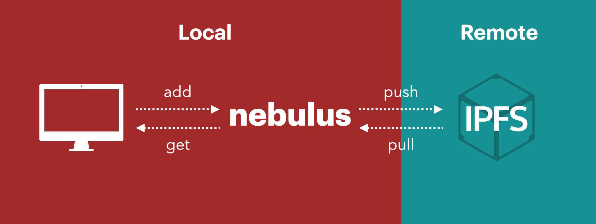

The strength and addressability of the public IPFS network — without the network

In July, [Nebulus](https://nebulus.dev/), a “Virtual IPFS Network”, was released. Nebulus allows users to use the logic and content addressability of IPFS _without_ having to use the public network.

## **The Virtual IPFS Network**

The IPFS network as the ecosystem is familiar with it today is in reality a bundle of two things: 1) Content Addressable Storage, and 2) Peer-to-Peer Network. “Content Addressable Storage” refers to the logic that the IPFS network leverages to organize, store, and reference data. This largely hinges on the use of Content Identifiers, or CIDs, that allow files to be located by the content within them, rather than by their location on the network.

[Content addressability](https://blog.ipfs.io/2021-04-05-storing-nfts-on-ipfs/) is fundamental to creating networks of information that remain live and available over time, even if their individual locations (like a webpage) disappear. “Peer-to-Peer Network” refers to the public, permissionless, global IPFS network. On IPFS, any user can upload and retrieve information from the network.

To use IPFS today, a user’s only option is to use this “bundle” — meaning to use the content-addressable benefits of IPFS, you must publish everything to the public network. Information, however, does not _need_ a peer-to-peer network to leverage content-addressable storage. Information can be stored locally — say, on a personal computer — using the logic of IPFS such as CIDs.

Nebulus lets users work with IPFS files and storage locally _before_ publishing to the public IPFS network (or, never publishing at all). When using the “bundled” IPFS solution, there is no distinction between _local_ and _remote,_ meaning **ipfs.add()** always adds to both local and public IPFS networks. With Nebulus, users can choose to use Nebulus as an “offline buffer”, allowing them to work privately with IPFS files and publish to IPFS only if/when needed.

In summary, Nebulus unbundles the IPFS file format (“Content Addressable Storage”) from the IPFS network (“Peer-to-Peer Network”).

## **Why Use a Virtual IPFS Network?**

“Proof of existence” describes the desire a network participant may have to prove they owned or had a file at one point in time. Prior to Nebulus, the only way to do this was to upload the entire file onto the public network.

However, users may prefer to be able to prove they had information at a certain point in time _without_ having to reveal all the information at once. In this case, Nebulus users can publish just the hash of a file to the public IPFS network, and retain the contents of the file for later. The hidden contents would still be organized for the IPFS network, just held privately until the publisher wishes to upload them to the public network.

Nebulus also opens up possibilities for private and permissioned storage. Files can be organized with content addressable storage in the manner of the IPFS network, but kept privately and off-chain, granted only to specific people who have access.

Another example is clever adaptations of consumer applications like NFTs. NFTs can be created, verified, and sold without revealing their contents, with the metadata chosen to be shown at a later date in time. NFTs have been one of the earliest case studies of Nebulus.

## **Rarepress: Virtual IPFS in Action**

[Rarepress](https://rarepress.org/) is a [project being developed](https://twitter.com/skogard) to allow people to easily (and for free) mint, trade, and program Ethereum NFTs. Rarepress removes entirely the obstacle that faces many NFT innovators: the management of IPFS nodes and pinning services within the NFT minting process.

Rarepress leverages Virtual IPFS to store files under the IPFS CID without sharing them on the public IPFS network. Only when a user mints their NFTs are they shared on IPFS and broadcasted to the public, peer-to-peer network.

Nebulus’ innovative solution to unbundling IPFS gives daily IPFS users more flexibility, nuance, and sovereignty about how best to use decentralized technologies to their benefit. By allowing users to leverage content addressability without forcing public storage, Nebulus will incentivize sustainable and persistent information storage on both public and private networks. Get started with [Nebulus](https://nebulus.dev/).