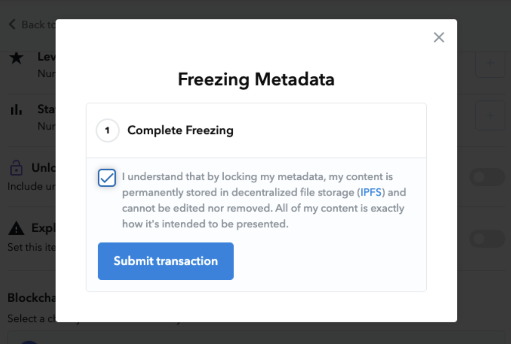

Our friends at [OpenSea](https://opensea.io/) recently [launched](https://opensea.io/blog/announcements/decentralizing-nft-metadata-on-opensea/) a feature to “freeze” NFT metadata, enabling NFT creators to properly decentralize their NFTs using IPFS and Filecoin. OpenSea is one of the largest NFT marketplaces in the web3 space, creating a market for millions of NFTs today. Using IPFS and Filecoin, NFT creators that use OpenSea can now create immutable NFT metadata using IPFS [content addressing](https://blog.ipfs.io/2021-04-05-storing-nfts-on-ipfs/) and [provable and decentralized storage with Filecoin](https://blog.ipfs.io/2021-06-03-ipfs-filecoin-content-persistence/).

## **Refresher: Anatomy of an NFT**

An NFT is a token that lives on a blockchain like Ethereum, and is freely tradable inside of that ecosystem. An NFT is typically created with a reference to metadata that includes various details about **what** that token represents, such as the NFT’s name, description, and a reference to the raw NFT asset itself (image, video, audio, etc.). Today we see all sorts of interesting applications for NFTs - spanning from [property deeds](https://www.theverge.com/2021/4/16/22388177/nft-house-real-estate-opensea-thousand-oaks-california), to [music](https://async.art/music), to [art](https://ipfsgateway.makersplace.com/ipfs/QmXkxpwAHCtDXbbZHUwqtFucG1RMS6T87vi1CdvadfL7qA), and more!

## **Why IPFS?**

When NFT creators are making NFTs, they choose how to reference their raw NFT asset… creating a link between the token that lives on a blockchain and the associated data that might live elsewhere in the world. In the past, creators might have used location-addressed URLs pointing at centralized servers that store this information. Unfortunately, these “normal” URLs can be susceptible to issues such as broken links, 404 errors, or in the case of some NFTs, [“rug pulls”](https://twitter.com/neitherconfirm/status/1369285946198396928?lang=en).

Thankfully, IPFS can help! IPFS uses [content addressing](https://blog.ipfs.io/2021-04-05-storing-nfts-on-ipfs/) to reference data. When an NFT Creator uses IPFS to reference data, they’re creating a unique fingerprint (known as a CID) of the content itself. This unique fingerprint can replace traditional URLs -- anyone can find the data associated with this fingerprint just by using the CID to request the data. When using IPFS content-addressed URLs in NFT metadata, creators can ensure that there is an **immutable link** to their content embedded on the blockchain.

## **Why Filecoin?**

Having resilient content-addressed references to NFT metadata is only part of the solution. In addition, content needs to be persistently stored and available for anyone to retrieve for the long-term. This is exactly the problem [Filecoin was created to address](https://blog.ipfs.io/2021-06-03-ipfs-filecoin-content-persistence/).

Filecoin offers **verifiable** **storage** on a **decentralized network**. Due to Filecoin’s cryptographic proofs and economic mechanisms, Filecoin storage providers (miners) are incentivized to store their users’ data as long as users need, ensuring that precious data like NFTs are **protected, never lost, and highly available for the long term.**

## **OpenSea’s Decentralized and Immutable NFT Metadata**

With OpenSea’s [new “frozen metadata” feature](https://opensea.io/blog/announcements/decentralizing-nft-metadata-on-opensea/), NFT creators can get the benefits of IPFS content addressing and Filecoin decentralized, verifiable storage immediately! Creators can seamlessly push content into IPFS and Filecoin to create immutable links to the NFT’s metadata and ensure the content is stored in perpetuity.

Read more about OpenSea’s decentralized metadata feature, and how they use IPFS and Filecoin, on the [OpenSea blog](https://opensea.io/blog)!

We’re really excited to see this feature ship and for the wave of decentralized, immutable storage to continue to rock NFT marketplaces and the rest of web3.

## **Additional Resources**

If you’d like to get started using IPFS and Filecoin for your NFT project, please check out our list of resources:

* [Free Storage with NFT.Storage](https://nft.storage)
* [NFT School](https://nftschool.dev "NFT School")
* [Best Practices for Storing NFT Data Using IPFS](https://docs.ipfs.io/how-to/best-practices-for-nft-data/#types-of-ipfs-links-and-when-to-use-them)
* [Minting an NFT with IPFS](https://ipfs.us4.list-manage.com/track/click?u=25473244c7d18b897f5a1ff6b&id=bcae62b60f&e=7fccf7a909)
* [Storing NFTs on IPFS](https://blog.ipfs.io/2021-04-05-storing-nfts-on-ipfs/)
* [IPFS, Filecoin, and Content Persistence](https://blog.ipfs.io/2021-06-03-ipfs-filecoin-content-persistence/)