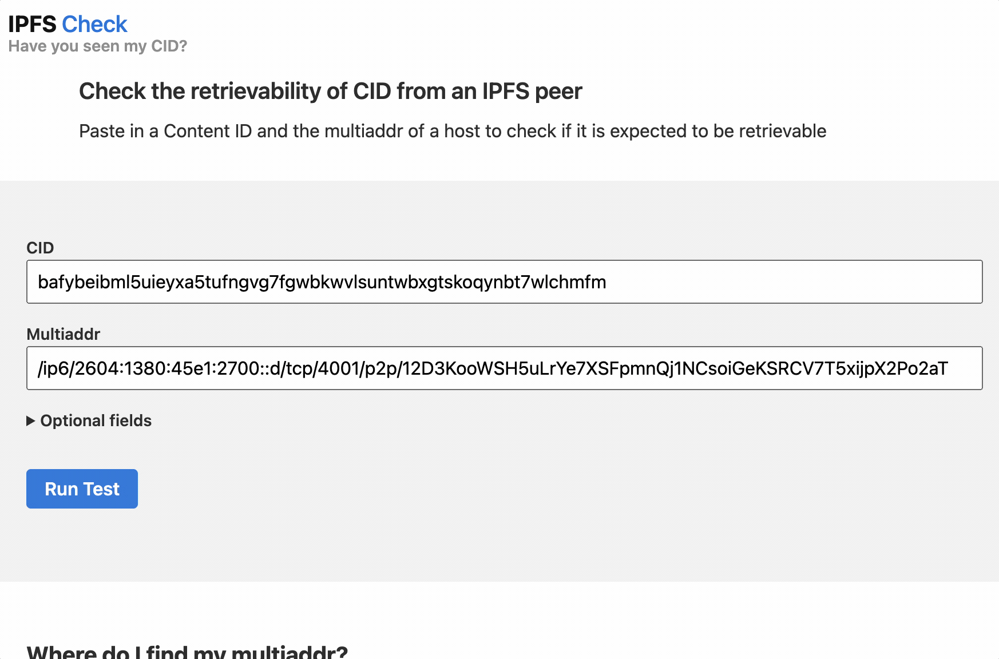
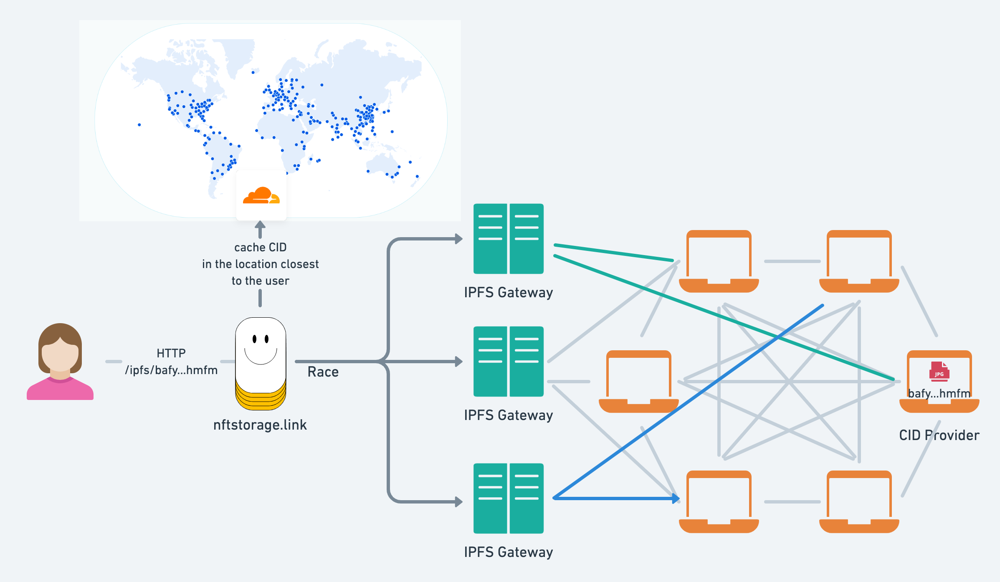

The Interplanetary File System (IPFS) is a peer-to-peer protocol for storing and accessing **files and websites**. As a distributed **peer-to-peer** protocol, it's fundamentally different from the HTTP protocol. With the help of IPFS Gateways, it's possible to reap the benefits of IPFS using the HTTP protocol.

This blog post is the second of a two-part series about IPFS gateways:

[The first part](https://blog.ipfs.io/2022-06-09-practical-explainer-ipfs-gateways-1/) was mostly theoretical and covered:

- The principles behind IPFS.
- The challenges with the client-server model.
- How IPFS approaches these challenges with peer-to-peer networking and content addressing.
- The relationship between IPFS and HTTP(S).
- An introduction to IPFS HTTP gateways.
- IPFS gateway resolution styles.

In this second part, you will learn practical tips and tricks for using IPFS gateways in real-world applications:

- [Common challenges with IPFS HTTP Gateways](#common-challenges-with-ipfs-http-gateways)
- [IPFS gateway request lifecycle](#ipfs-gateway-request-lifecycle)
- [Debugging IPFS content discovery and retrieval](#debugging-ipfs-content-discovery-and-retrieval)
  - [Debugging with kubo and IPFS Check](#debugging-with-kubo-and-ipfs-check)
  - [Debugging with pl-diagnose](#debugging-with-pl-diagnose)
- [Content publishing lifecycle](#content-publishing-lifecycle)
- [Debugging content publishing](#debugging-content-publishing)
- [Pinning, caching, and garbage collection](#pinning-caching-and-garbage-collection)
- [Public vs. dedicated vs. self-hosted gateways](#public-vs-dedicated-vs-self-hosted-gateways)
- [Best practices for self-hosting an IPFS node/gateway](#best-practices-for-self-hosting-an-ipfs-nodegateway)
- [Tip: Pin your CIDs to multiple IPFS nodes](#tip-pin-your-cids-to-multiple-ipfs-nodes)
- [Tip: Use a custom domain that you control as your IPFS gateway](#tip-use-a-custom-domain-that-you-control-as-your-ipfs-gateway)
- [Summary](#summary)

<!-- - Common challenges with IPFS gateways
- IPFS gateway request lifecycle
- Debugging IPFS content discovery and retrieval
- Content publishing lifecycle
- Debugging content publishing
- Pinning, caching, and garbage collection
- Differences between IPFS gateways
- Best practices for self-hosting IPFS nodes
- Caching and garbage collection
- Improving CID access performance and reliability from the IPFS network -->

By the end of this blog post, you should be equipped with the knowledge and tools to use IPFS gateways confidently and systematically debug when you face problems.

> **Note:** The blog refers assumes you are using [kubo](https://github.com/ipfs/go-ipfs) (until recently known as go-ipfs) since it's the most popular IPFS implementation. This is not to take away any thunder from the other implementations, e.g, js-ipfs.

## Common challenges with IPFS HTTP Gateways

One of the questions most frequently asked by developers using IPFS in our various community channels is **why CIDs aren't retrievable via public IPFS gateways** or in other cases, why are CIDs so slow to load.

For example, when you first upload content to your local IPFS node, it's not uncommon to get [504 Gateway Time-out](https://developer.mozilla.org/en-US/docs/Web/HTTP/Status/504) when requesting the CID from a public gateway.

IPFS gateways abstract the distributed aspect of IPFS while giving you a familiar HTTP interface, but that doesn't mean that complexity is gone.

From a high level, when faced with challenges (either slowness or timeouts) fetching a CID from an IPFS gateway, it's typically related to one of the following:

- The IPFS gateway.
- The provider of the CID, i.e. the IPFS node pinning the CID might be unreachable or down.
- You (or the pinning service) are not providing your CIDs to the IPFS network. Providing is the process by which providers of a given CID advertise it to the distributed hash table (DHT) to make it discoverable.
- Network latency between the client and the IPFS gateway or the gateway and the provider.

Given all of these factors, it's difficult giving blanket advice. This is where understanding the lifecycle of a CID request to an IPFS gateway is useful as it will allow debugging problems quickly.

## IPFS gateway request lifecycle

When a request for a CID reaches an IPFS gateway, the gateway checks whether the CID is cached locally before attempting to retrieve it from the network.

If the CID is in the gateway's cache, the gateway will respond to the HTTP request with the CID's content.

> **Note:** Cache here can be either an HTTP cache or the local data store of the IPFS node.

If the CID is not in the cache, the CID has to be retrieved from the IPFS network. This is a two-step process:

1. **Content discovery/routing**: asking direct peers and querying the [DHT](https://docs.ipfs.io/concepts/dht/#distributed-hash-tables-dhts) to find the peer IDs and [network addresses](https://multiformats.io/multiaddr/) of peers providing the CID (referred to as _providers_).
2. **Content retrieval**: connecting to one of the providers, fetching the CID's content, and streaming the response to the client.

> **Note:** This assumes that the gateway is separate from the IPFS node providing the CID. However, in many cases they are the same, e.g., when you are running a self-hosted IPFS node to which you pin CIDs that is also a gateway, in which case content retrieval is instant.

## Debugging IPFS content discovery and retrieval

When trying to debug why a CID isn't retrievable from a gateway, the most useful thing to do is to narrow down the root cause.

It can be either a problem with **content routing**: finding provider records for the CID in the DHT – or a problem with **content retrieval**: connecting to the peer from the provider records in the DHT.

### Debugging with kubo and IPFS Check

If you are running a running [kubo (formerly known as go-ipfs)](https://github.com/ipfs/go-ipfs) IPFS node, run the following command to determine if any peers are advertising the CID (making it discoverable):

```
ipfs dht findprovs [CID]
```

If providers for the CID are found by searching the DHT, their **Peer IDs** are returned:

```
12D3KooWChhhfGdB9GJy1GbhghAAKCUR99oCymMEVS4eUcEy67nt
12D3KooWJkNYFckQGPdBF57kVCLdkqZb1ZmZXAphe9MZkSh16UfP
QmQzqxhK82kAmKvARFZSkUVS6fo9sySaiogAnx5EnZ6ZmC
12D3KooWSH5uLrYe7XSFpmnQj1NCsoiGeKSRCV7T5xijpX2Po2aT
```

**If no providers were returned, the cause of your problem might be content publishing. Skip to the next section to learn how content publishing work and how to resolve such issues.**

If provider records have been found (the list of **Peer IDs**), the next step is to get the network addresses of one of those peers with the following command:

```
ipfs id -f '<addrs>' [PEER_ID]
```

The result of this command looks as follows:

```
/ip4/145.40.90.155/tcp/4001/p2p/12D3KooWSH5uLrYe7XSFpmnQj1NCsoiGeKSRCV7T5xijpX2Po2aT
/ip4/145.40.90.155/tcp/4002/ws/p2p/12D3KooWSH5uLrYe7XSFpmnQj1NCsoiGeKSRCV7T5xijpX2Po2aT
/ip6/2604:1380:45e1:2700::d/tcp/4001/p2p/12D3KooWSH5uLrYe7XSFpmnQj1NCsoiGeKSRCV7T5xijpX2Po2aT
/ip6/2604:1380:45e1:2700::d/tcp/4002/ws/p2p/12D3KooWSH5uLrYe7XSFpmnQj1NCsoiGeKSRCV7T5xijpX2Po2aT
```

To check if the CID is retrievable from the returned addresses, copy one of the public addresses and the CID into [IPFS Check](https://check.ipfs.network/):



IPFS Check will test whether the peer/node is dialable and whether the CID is retrievable from it.

### Debugging with pl-diagnose

[pl-diagnose](https://pl-diagnose.on.fleek.co/#/diagnose/access-content) is an alternative web-based tool that can perform a lot of the steps above directly from the browser.

You case use it to look up providers for a CID, checking if a [multiaddr](https://multiformats.io/multiaddr/) is reachable by other peers, and whether a node is serving the CID.

## Content publishing lifecycle

Now that you're familiar with content retrieval, we'll take a look at the other end of retrieval, namely **content publishing**. Content publishing is how your content becomes discoverable to peers in the IPFS network.

> **Note:** The term **publishing** is a bit misleading, because it refers to the publishing of provider records to the DHT; not the actual content. For this reason, you might see the term **advertising** also used.

This is a continuous process that starts when you first add content to an IPFS node and repeats every 12 hours (by default) as long as the node is running.

When you add a file to an IPFS node using the `ipfs add` command, here's how it becomes published and discoverable across the network:

1. The file is chunked into blocks and a [Merkle DAG](https://docs.ipfs.io/concepts/merkle-dag/) is constructed. You get back the root CID of the DAG.
2. The blocks of the file are made available over [Bitswap](https://docs.ipfs.io/concepts/bitswap/) so any peers can request.
3. Mappings of CIDs to network addresses (including CIDs of the block and the root CID) are advertised to the DHT. These **provider records** have an expiry time of 24 hours (accounting for provider churn) and need to be **reprovided** by the node every 12 hours (accounting for peer churn).

## Debugging content publishing

IPFS network measurements conducted by the [ProbeLab](https://blog.ipfs.io/2022-06-15-probelab/), show that [_content publishing is a bottleneck_](https://youtu.be/75ewjnT6B9Y?t=115) in IPFS. While there are efforts explored in that talk to improve this, it's useful to understand how to troubleshoot problems related to content publishing.

Generally speaking, as you add more files to your IPFS node, the longer reprovide runs take.
**When a reprovide run takes longer than 24 hours (the expiry time for provider records), your CIDs will become undiscoverable**.

To find out how long a reprovide run takes, run the following command:

```sh
ipfs stats provide
```

The result should look like this:

```
TotalProvides:          7k (7,401)
AvgProvideDuration:     271.271ms
LastReprovideDuration:  13m16.104781s
LastReprovideBatchSize: 1k (1,858)
```

If you notice that the `LastReprovideDuration` value is reaching close to 24 hours, you should consider one of the following options:

- Enabling the [Accelerated DHT Client](https://github.com/ipfs/go-ipfs/blob/master/docs/experimental-features.md#accelerated-dht-client) in Kubo. This configuration improves content publishing times significantly by maintaining more connections to peers and a larger routing table, and batching advertising of provider records. It should be noted that this comes at the cost of increased resource consumption.
- Change the [reprovider strategy](https://github.com/ipfs/go-ipfs/blob/master/docs/config.md#reproviderstrategy) from `all` to either `pinned` or `roots` which both only advertise provider records for explicitly pinned content:
  - `pinned` will advertise both the root CIDs and child block CIDs (entire DAG) of explicitly pinned content.
  - `roots` will only advertise the root CIDs of pinned content reducing the total number of provides in each run. This strategy is the most efficient but should be done with caution, as it will limit discoverability to only root CIDs. If you are adding folders of files to IPFS, only the CID for the pinned folder will be advertised (all the blocks will still be retrievable with Bitswap once a connection to the node is established).

To manually trigger a reprovide run, run the following command:

```
ipfs bitswap reprovide
```

## Pinning, caching, and garbage collection

Existing IPFS [implementations](https://ipfs.io/#install) have a caching mechanism that will keep CIDs local for a short time after the node has fetched it from the network, but these objects may get garbage-collected periodically.

[Pinning](https://docs.ipfs.io/concepts/glossary/#pinning) is the mechanism that allows you to tell IPFS to **always** store a given CID — by default on your local node. In addition to [local pinning](https://docs.ipfs.io/how-to/pin-files/), you can also pin your CIDs to [remote pinning services](https://docs.ipfs.io/how-to/work-with-pinning-services/).

In other words, caching is the mechanism by which CID is kept around on the node for a short period until garbage-collected while pinning is a deliberate choice you make to keep the CID stored on the node.

Caching is the reason why requesting a CID for the first time from a gateway can take time while subsequent requests are much faster.

**Pinning services** are services that run IPFS nodes for you and allow you to upload files and pin CIDs, making them available to the IPFS network. Examples include:

- [web3.storage](https://web3.storage/)
- [Pinata](https://www.pinata.cloud/)
- [nft.storage](https://nft.storage/)
- [Filebase](https://filebase.com/blog/introducing-support-for-ipfs-backed-by-decentralized-storage/)
- [Infura](https://infura.io/product/ipfs)

> Note: Some pinning services, like Pinata, don't publish provider records to the DHT. In such situations, consider direct [peering](https://docs.ipfs.io/how-to/peering-with-content-providers/).

One thing to note about caching is that it is often multi-layered. In addition to caching done by the IPFS node, it's common to add another layer of HTTP caching based on HTTP cache-control headers. Since CIDs are immutable, there's a wide range of caching opportunities, e.g. putting a CDN or an edge cache in front of an IPFS gateway node.

**Garbage collection** is the process by which an IPFS node frees up storage by deleting data that is no longer required. To read more about garbage collection, [check out the following article](https://blog.logrocket.com/guide-ipfs-garbage-collection/).

## Public vs. dedicated vs. self-hosted gateways

In its simplest form, a gateway is an IPFS node that also accepts HTTP requests for CIDs.

But the reality of IPFS gateways is nuanced, as there are different flavors of IPFS gateways: public, dedicated, and self-hosted.

**Public gateways** allow anyone to use HTTP to fetch CIDs from the IPFS network.

You can find public gateway operators in the [public gateway checker](https://ipfs.github.io/public-gateway-checker/) and check whether they are online and the latency from your location.

Beware that many of the public gateways are provided on a best-effort basis without any SLA. Public gateways are prone to abuse which is why many of them implement request limits.

**Dedicated gateways** such as [Infura](https://blog.infura.io/post/introducing-ipfs-dedicated-gateways), and [Pinata](https://medium.com/pinata/announcing-dedicated-ipfs-gateways-60f599949ce) are services that combine **CID pinning** with an IPFS gateway and guarantee the availability of your pinned CIDs via their gateway.

Another rather unique example of a public gateway is [nftstorage.link](https://nftstorage.link/) which races CID requests across multiple public gateways to provide the fastest response in addition to caching responses at the edge (find the [source code on GitHub](https://github.com/nftstorage/nftstorage.link/tree/main/packages/edge-gateway#high-level-architecture)).



[NFT.Storage Gateway SuperHot perma-cache](https://nft.storage/blog/post/2022-05-24-superhot-gateway-announcement/) is a paid feature recently launched by the NFT.Storage team, which is similar to dedicated gateways. It gives you the ability to preload your CIDs in all of Cloudflare's 270 points of presence, giving a lightning-fast read experience via the closest CDN location to your users

Finally, a **self-hosted gateway** refers to an IPFS node(s) configured as a gateway that is hosted by you, either on your local machine or in the cloud.

Choosing from the three approaches depends on your requirements, if performance is critical, self-hosting an IPFS node and gateway or using a dedicated gateway is a reasonable choice that can complement the usage of public gateways.

## Best practices for self-hosting an IPFS node/gateway

If you are running an IPFS node that is also configured as an IPFS gateway, there are steps you can take to improve the discovery and retrievability of your CIDs.

- Set up [peering](https://docs.ipfs.io/how-to/peering-with-content-providers/) with the pinning services that pin your CIDs.
- Ensure that you are correctly returning HTTP cache headers to the client if the IPFS gateway node is behind a reverse proxy. Pay extra attention to `Etag`, `Cache-Control` and `Last-Modified` headers. Consider leveraging the list of CIDs in `X-Ipfs-Roots` for smarter HTTP caching strategies.
- Put a CDN like Cloudflare in front of the IPFS gateway.
- Consider enabling the [Accelerated DHT Client](https://github.com/ipfs/go-ipfs/blob/master/docs/experimental-features.md#accelerated-dht-client) (see the content publishing [section](#debugging-content-publishing) for trade-offs).
- Test and monitor your internet connection speed, with a tool like [Speedtest CLI](https://www.speedtest.net/apps/cli).
- Monitor disk I/O and make sure that no other processes are causing disk I/O bottlenecks with a tool like [iotop](https://linux.die.net/man/1/iotop) or [iostat](https://linux.die.net/man/1/iostat).

## Tip: Pin your CIDs to multiple IPFS nodes

Drawing on the principles laid out above, it's sensible to pin your CIDs to multiple IPFS nodes to ensure reliable availability and resilience to failures of nodes and network partitions.

With IPFS, increasing redundancy is typically done by [pinning](https://docs.ipfs.io/concepts/persistence/#persistence-versus-permanence) your CIDs on multiple IPFS nodes or pinning services.

As a general rule of thumb, the more nodes pinning a CID in the IPFS network, the better the chances of it being retrievable.

To make pinning easier, there's a vendor-agnostic [Pinning Service OpenAPI Specification](https://ipfs.github.io/pinning-services-api-spec/) that is [already supported by many IPFS node implementations, client libraries, and existing pinning services](https://github.com/ipfs/pinning-services-api-spec#adoption).

Using this remote pinning API, you can [implement pinning to multiple services](https://docs.ipfs.io/how-to/work-with-pinning-services/#use-an-existing-pinning-service) as part of your workflow for uploading immutable data to IPFS.

If you're not running an IPFS node, you can start by uploading a file to one service and then using the returned CID to pin it to other services.

## Tip: Use a custom domain that you control as your IPFS gateway

Imagine the following scenario: you deploy your web app to IPFS which contains media with absolute URLs to a public gateway experiencing an outage. For example, your web app displays the image with an absolute path to the CID: `https://bafybeibml5uieyxa5tufngvg7fgwbkwvlsuntwbxgtskoqynbt7wlchmfm.ipfs.dweb.link`.

You may be able to reach your media using a different gateway, but since the web app's content is immutable, the links to the IPFS gateway which is down will not load.

For these reasons, it's sensible to use a domain within your control to route HTTP traffic to a gateway. This approach potentially gives you the flexibility to implement additional performance optimizations.

Practically speaking, this can be implemented using several approaches depending on your willingness to run infrastructure:

- Point a domain you control, e.g., `*.ipfs.yourdomain.io` point to a reverse proxy like nginx which will proxy requests to a public gateway, allowing you to switch public gateways if there's downtime.
- Use a service like [Cloudflare workers](https://workers.cloudflare.com/) or [Fastly Compute@Edge](https://www.fastly.com/products/edge-compute) to implement a lightweight reverse proxy to IPFS gateways.

## Summary

In this blog post, you learned many tips, tricks, knowledge, and tools to use IPFS gateways effectively and systematically debug when you face problems.

We started with common challenges with IPFS gateways and went into the details of content discovery, publishing, the gateway request lifecycle, the different kinds of IPFS gateways, caching, garbage collection, pinning, and best practices when self-hosting IPFS nodes/gateways.

If you're interested in:

- Diving deeper, check out the [IPFS docs](https://docs.ipfs.io/)
- Running an IPFS node, [install IPFS](https://docs.ipfs.io/install/)
- Asking questions, join us in [the IPFS forum](https://discuss.ipfs.io/)
- Chatting with us, join us on [Slack](https://filecoin.io/slack), [Discord](https://discord.com/invite/KKucsCpZmY), or [Matrix](https://matrix.to/#/#ipfs:matrix.org)
