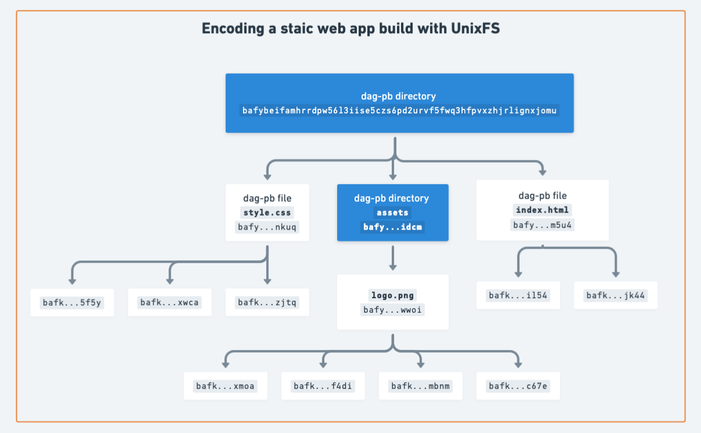
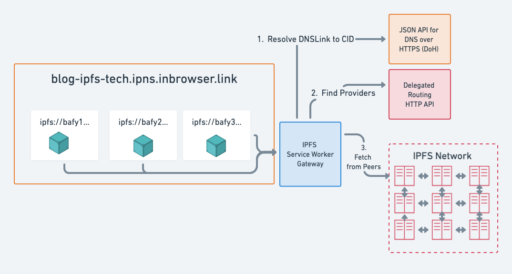
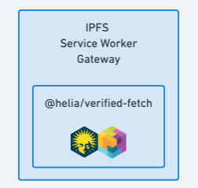
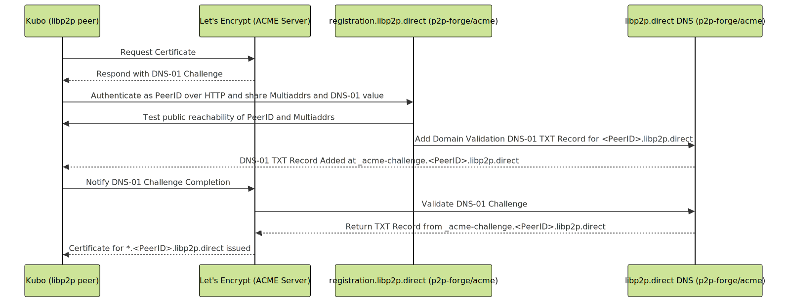

## Update From Interplanetary Shipyard

Earlier this year, [we introduced Interplanetary Shipyard](https://blog.ipfs.tech/shipyard-hello-world/), as the evolution of the maintainers leading the open-source development of libp2p and the most popular IPFS implementations, tooling and infrastructure.

In our introduction, we shared our roadmap and vision, a key part of which is to make IPFS work on the web.

In this blog post, we'll share all the progress we've made since then and what we have planned for the future.

## IPFS on the Web

For as long as IPFS has existed, one of the key goals has been to make it possible to use IPFS on the web. That is, **resilient**, **decentralized**, and **verified** data retrieval on the Web.

But what does it mean for IPFS to work on the Web?

**Resilient**: Data is retrievable in a browser even if some providers go offline.
**Decentralized**: You can connect to other peers from a browser for content routing and retrieval while immune to censorship and chokepoints that disrupt the network.
**Verified**: You verify data locally, ensuring integrity without assuming trust (aka trustless).

Data refers to anything that can be addressed by a CID: files, directories, web apps/dapps, videos, etc.

While the Web platform has by far the widest reach, it's also the most challenging platform to make IPFS work on due to the inherent constraints of the platform and the discrepancies between browsers.

Gateways like `ipfs.io` are a double-edged sword, because they make IPFS content accessible to the web, but they also highlight the challenges of IPFS on the web. Initially conceived as a crutch to bootstrap the network until a more decentralized and resilient solution was in place, public gateways became entrenched as the default to access IPFS content on the web to the detriment of the principles of IPFS.

At [Interplanetary Shipyard](https://ipshipyard.com/), we've been tackling this challenge head on with a number of projects across the libp2p and IPFS stacks to make IPFS on the web a reality:

- [**Verified Fetch**](#verified-fetch)
- [**Service Worker Gateway**](#service-worker-gateway)
- [**New browser transports**](#browser-transports)
- [**AutoTLS with libp2p.direct**](#autotls-with-libp2p-direct)
- [**IPFS over HTTP**](#ipfs-over-http)
- [**Browser Developer Tools**](#browser-developer-tools)
- [**Delegated Routing HTTP API**](#delegated-routing-http-api)
- [**Bitswap improvements**](#bitswap-improvements)
- [**libp2p improvements**](#libp2p-improvements)

Let's take a look at each of these projects in more detail.

### Verified Fetch

[Verified Fetch](https://www.npmjs.com/package/@helia/verified-fetch) is a TypeScript library for verified retrieval of IPFS content we [released earlier this year](https://blog.ipfs.tech/verified-fetch/) and built on top of [Helia](https://github.com/ipfs/helia/). We designed it to make IPFS retrieval by CID as easy as the [Fetch API](https://developer.mozilla.org/en-US/docs/Web/API/Fetch_API) that most developers are already familiar with. We focused on getting a seamless developer experience with a simple API, while abstracting away all the complexities of IPFS: **content routing, transports, and verification**.

Verified Fetch works great for loading content-addressed static assets or sub-resources asynchronously as part of a web app or dapp, for example, images, videos, or JSON.

From a developer experience standpoint, Verified Fetch follows the following pattern:

- Take a CID as input
- Return a [`Response` object](https://developer.mozilla.org/en-US/docs/Web/API/Response)

This foundational API surface, while simple, enables a wide range of retrieval use-cases while abstracting away the complexities of data types, content routing, transports and verification. Moreover, returning a `Response` object allows for easy integration with the browser's caching mechanisms and use in [Service Workers](https://developer.mozilla.org/en-US/docs/Web/API/Service_Worker_API).

Verified Fetch is great for loading content-addressed static assets or "sub-resources" asynchronously, for example, images, videos and even IPLD encoded data.

  See the Pen <a href="https://codepen.io/2color/pen/VwoWWGQ">
  @helia/verified-fetch Direct Retrieval with Libp2p</a> by Daniel Norman (<a href="https://codepen.io/2color">@2color</a>)
  on <a href="https://codepen.io">CodePen</a>.

 
<a href="https://npmjs.com/package/@helia/verified-fetch" class="cta-button" target="_blank"> Install Verified Fetch</a>

But what about loading full dapps or websites from IPFS? Unlike static assets, web apps and websites require a way to resolve standard URLs to their corresponding content addressed resources.

This is where the Service Worker Gateway comes in, which builds on top of Verified Fetch.

## Service Worker Gateway

The [Service Worker Gateway](https://github.com/ipfs/service-worker-gateway) is a Web native IPFS gateway that runs in the browser. It implements the [IPFS Gateway spec](https://specs.ipfs.tech/http-gateways/subdomain-gateway/) in a [Service Worker](https://developer.mozilla.org/en-US/docs/Web/API/Service_Worker_API) and fetches IPFS content directly from providers on the network in addition to verifying it locally.

In a [previous blog post](https://blog.ipfs.tech/dapps-ipfs/), we looked at how web publishing with works with IPFS. This can be summarized as:

- The web app is static, i.e. just files and directories containing HTML, JS, CSS, images, etc. that make up the app. This is typically the build output of a frontend framework or a static site generator.
- The web app's build outputs are encoded with [UnixFS](https://docs.ipfs.tech/concepts/glossary/#unixfs) and addressed by a [CID](https://docs.ipfs.tech/concepts/content-addressing/#cid) which represents the root of the app (see diagram below).
- There are IPFS nodes (aka providers) that have the blocks for the CID.

### Decentralized Frontends with the Service Worker Gateway

The Service Worker Gateway unleashes new possibilities for decentralized web publishing:

- **Decentralized:** with peer-to-peer retrieval.
- **Trustless:** with local verification, removing the implicit trust in any given gateway or provider.
- **Offline use:** Visited pages are cached in the Cache API, enabling offline support for every static web app.

 
<a href="https://inbrowser.link" class="cta-button" target="_blank">Try the Service Worker Gateway</a>

For example, the IPFS blog is statically generated and has a distinct CID for each version. With the help of Fleek, each [build is encoded with UnixFS, given a CID](https://github.com/ipfs/ipfs-blog/runs/31658981603) and provided to the IPFS network. The [DNSLink](https://docs.ipfs.tech/concepts/dnslink/) record is also updated to the latest release CID.

Now, instead of using a trusted gateway, e.g. `https://blog-ipfs-tech.ipns.dweb.link/`, you can load the blog using the Service Worker Gateway at [blog-ipfs-tech.ipns.inbrowser.link](https://blog-ipfs-tech.ipns.inbrowser.link).

> **Note:** There's an inherent trade off with the Service Worker Gateway: it requires an initial upfront cost of fetching and installing the Service Worker which fetches and verifies data. This is why the first load may be slower than using a trusted gateway.

### Note on composability

The Service Worker Gateway also highlights the focus on composability across the JavaScript/TypeScript implementations of IPFS and libp2p:

The [Service Worker Gateway](https://github.com/ipfs/service-worker-gateway) depends on [Verified Fetch](https://github.com/ipfs/helia-verified-fetch), which depends on [Helia](https://github.com/ipfs/helia) which depends on [js-libp2p](https://github.com/libp2p/js-libp2p).

### Service Worker Gateway: What's new

As we embarked on this project, we focused on getting the basics right:

- Service Worker lifecycle management with custom gateways and delegated routing configuration.
- Subdomain origin isolation according to the [Subdomain Gateway specification](https://specs.ipfs.tech/http-gateways/subdomain-gateway/).
- Testing infrastructure to ensure compliance with the specs.
- Basic error handling and fallback to trusted gateways.
- Correct caching of assets.
- Division of responsibilities between the Verified Fetch library and the Service Worker Gateway to ensure they are both useful without duplicating functionality.
- HTTP retrieval from recursive gateways and HTTP gateway providers.

> **Note:** There's a subtle difference between recursive gateways and HTTP gateway providers. Recursive gateways, like `ipfs.io` and `trustless-gateway.link`, will fetch content by CID from providers when the content is not locally available.
> HTTP gateway providers on the other hand, are IPFS HTTP gateways discovered via the [IPNI](https://docs.ipfs.tech/concepts/ipni/) (with the `transport-ipfs-gateway-http` protocol) that only return blocks for CIDs they have.

Over the last few months, we've been improving the reliability and user experience. Most importantly, we've added support for direct peer-to-peer retrieval with js-libp2p under the hood. This means that the Service Worker Gateway can now leverage a broader set of provider peers that have either WebTransport or Secure WebSocket enabled.

This brings us to the next topic: **browser transports**, which play a crucial role in making both IPFS and libp2p on the web a reality.

## Browser transports

Browser transports (protocols) are the bread and butter of the web and the Achilles heel of IPFS on the web. If you can't communicate with other peers, you can't do much.

Browsers communicate over the internet using a number of transport protocols, each with their own strengths and weaknesses. Assuming a web app is in a [Secure Context](https://developer.mozilla.org/en-US/docs/Web/Security/Secure_Contexts), i.e., served over HTTPS as most modern web apps are, the following transport protocols are available:

- **HTTPS**: Request/Response HTTP over TLS.
- **Secure WebSocket**: Secure bidirectional streaming communication over WebSockets.
- **WebRTC**: Initially conceived for real-time browser-to-browser communication, e.g. for video, audio, and data streaming.
- **WebTransport**: A QUIC based replacement for WebSockets.

The following table summarizes the capabilities of each transport:

|                  | Bi-directional streaming | Requires TLS Certificate and domain | Widely supported | Useable in Service Worker | Browser-to-Browser |
| ---------------- | ------------------------ | ----------------------------------- | ---------------- | ------------------------- | ------------------ |
| HTTPS            | ❌                       | ✅                                  | ✅               | ✅                        | ❌                 |
| Secure WebSocket | ✅                       | ✅                                  | ✅               | ✅                        | ❌                 |
| WebRTC           | ✅                       | ❌                                  | ✅               | ❌                        | ✅                 |
| WebTransport     | ✅                       | ❌                                  | ❌               | ✅                        | ❌                 |

> **Note:** while streaming is technically possible with HTTPS, browsers don't allow reading from the response until the request has been fully sent. See [this issue](https://github.com/whatwg/fetch/issues/1254) for more details.

### HTTPS and Secure WebSockets

HTTP is widely supported in browsers and implementations of IPFS. Perhaps most common is the [IPFS HTTP Gateway](https://docs.ipfs.tech/reference/http/gateway/#trusted-vs-trustless), a general purpose retrieval API with HTTP semantics that is broadly used in IPFS implementations, tooling and infrastructure.

#### Request/Response vs Bi-directional streaming

Request/response protocols like HTTP are not very well suited for streaming protocols like [Bitswap](https://docs.ipfs.tech/concepts/bitswap/). WebSocket (and WebRTC and WebTransport), are bi-directional streaming protocols and are well suited for libp2p based protocols like Bitswap. What's more, WebSockets are supported in all modern browsers and are compatible with Service Workers.

#### TLS certificates for HTTP and WebSockets

Where things get slightly tricky is TLS for **both HTTP and WebSockets**, i.e. HTTPS and Secure WebSockets, which are required by Secure Contexts and Service Workers.

HTTPS and Secure WebSockets require a CA-signed TLS certificate and a domain, which most peers in the IPFS network do not have by default.

To address this, we've been working on a project to automate the issuance of wildcard Let's Encrypt TLS certificates for all publicly dialable IPFS nodes. More on that in the [AutoTLS](#auto-tls-with-libp2pdirect) section below.

### WebRTC

WebRTC is a browser-to-browser communication protocol, e.g. for video, audio, and data streaming.

In the context of IPFS and libp2p, there are two implementations of [WebRTC](https://github.com/libp2p/specs/tree/master/webrtc):

- **WebRTC:** for browser-to-browser communication.
- **WebRTC-Direct:** for browser-to-server communication without the need for trusted TLS certificates.

The spec for [WebRTC for browser-to-browser communication in libp2p](https://github.com/libp2p/specs/blob/master/webrtc/webrtc.md) was ratified last year and includes a decentralized signalling mechanism for exchanging SDPs that leverages Circuit Relays. We've written an [extensive guide](https://docs.libp2p.io/guides/getting-started/webrtc/) to help you get started and also ran a workshop at IPFS Camp. It's also used by [Universal Connectivity](https://github.com/libp2p/universal-connectivity) and [IPFS Share](https://share.ipfs.io) to demonstrate the possibilities of browser-to-browser communication.

We've also seen the ecosystem thrive with projects like [Topology](https://www.youtube.com/watch?v=2FFjJ-jBymQ), [OrbitDB](https://github.com/orbitdb/orbitdb), and [Canvas](https://canvas.xyz/) that rely on js-libp2p and WebRTC as the foundation for their browser-to-browser communication.

It's also worth noting that WebRTC is the only browser transport with a mechanism for NAT hole-punching, which is the process of establishing a direct connection between two peers through a network address translator (NAT). This is a crucial part of establishing a direct connection between two peers in a decentralized network like IPFS.

### WebRTC-Direct

WebRTC-Direct was designed a transport protocol to allow browser-to-server communication without the need for a domain name and CA-signed TLS certificates.

WebRTC-direct is stable as of [go-libp2p v0.36.1](https://github.com/libp2p/go-libp2p/releases/tag/v0.36.1) and enabled by default in [Kubo as of 0.30.0](https://github.com/ipfs/kubo/releases/tag/v0.30.0).

This is a huge milestone, because it means that browsers can dial publicly reachable IPFS nodes with WebRTC-direct enabled without TLS certificates or domain names. We therefore recommend upgrading to the latest version of Kubo to take advantage of this.

### Limits of WebRTC in browsers

There are two caveats with WebRTC in browsers:

- WebRTC isn't available in Service Workers.
- [Chrome limits the number of WebRTC connections per window to 500](https://issues.chromium.org/issues/41378764) after which it will prevent establishing new connections.

### WebTransport

[Two years ago, the IPFS and libp2p projects made a bet on the promise of WebTransport](https://blog.libp2p.io/2022-12-19-libp2p-webtransport/) and it's been a bumpy road. WebTransport is a promising protocol, especially for libp2p and IPFS, because it allows bi-directional streaming communication with many modern improvements over WebSockets, **without the need for CA-signed certificates and a domain**. This was a game changer, since most peers in the IPFS network do not have a domain name.

However, the WebTransport specification is still in draft, and browser implementations have had a [number of bugs and issues](https://github.com/libp2p/js-libp2p/issues/2572), that we've been working with the browser vendors to address. As such, browser compatibility breaks as soon as the interoperability target changes.

While we still believe in the longer term promise of WebTransport, we've reoriented our immediate priorities to WebRTC-Direct (which is now available) and [AutoTLS](#autotls-with-libp2pdirect). Nonetheless, we continue to work with browser vendors and standard bodies to get WebTransport to a stable and interoperable state.

## AutoTLS with libp2p.direct

AutoTLS is a new feature that significantly improves how browsers (Helia, Service Worker) can connect to Kubo nodes.

As mentioned above, Secure WebSockets is the only streaming transport that works reliably in Service Workers, but requires a TLS certificate and domain.

To overcome this, the Shipyard team has been working on a project to automate the issuance of wildcard TLS certificates for publicly dialable Kubo nodes. This way, nodes can use [Secure WebSockets libp2p transport](https://github.com/libp2p/specs/blob/master/websockets/README.md) without needing to register a domain name.

We call this service **AutoTLS** and it's powered by the `libp2p.direct` domain.

[AutoTLS](https://github.com/ipfs/kubo/blob/master/docs/config.md#autotls) enables publicly reachable Kubo nodes, i.e. nodes dialable from the public internet, to get a wildcard TLS certificate unique to their PeerID at `*.<PeerID>.libp2p.direct` without needing to register and configure a domain name. This enables direct libp2p connections and direct retrieval of IPFS content from browsers using Secure WebSockets.

### How AutoTLS works

Under the hood, the infrastructure behind `libp2p.direct` has two roles:

- An [ACME DNS-01 Challenge](https://letsencrypt.org/docs/challenge-types/#dns-01-challenge) broker for getting wildcard TLS certificate for `*.[PeerID].libp2p.direct`. To do so it authenticates PeerIDs requesting certificates, verifies their network reachability and sets the TXT DNS record for the [ACME challenge](https://letsencrypt.org/docs/challenge-types/#dns-01-challenge) at `_acme-challenge.<PeerID>.libp2p.direct`.

- The authoritative DNS Server for `*.libp2p.direct`. Notably, the IP addresses it resolves to are encoded in the DNS name, e.g. `1-2-3-4.<peerID>.libp2p.direct` resolves to the A record with the IP `1.1.1.1`. This keeps the DNS server stateless and simple to operate while ensuring that even when a Kubo node's IP address changes, it's resolvable without coordination.

> **Note:** AutoTLS is not a replacement for Let's Encrypt or other TLS certificate authorities. It's a complementary service for getting a TLS certificate for your Kubo node's unique PeerID without the need for your own domain name.

AutoTLS is provided as a public good service and operated by [Interplanetary Shipyard](https://ipshipyard.com) and is available on an opt-in basis with [Kubo 0.32.0](https://github.com/ipfs/kubo/releases/tag/v0.32.0).

We're also adding support for AutoTLS in [js-libp2p](https://github.com/libp2p/js-libp2p/pull/2800), which would allow the JavaScript ecosystem to also reap the benefits of AutoTLS.

AutoTLS is available in [Kubo v0.32.0](https://github.com/ipfs/kubo/releases/tag/v0.32.0) or [IPFS Desktop v0.40.0](https://github.com/ipfs/ipfs-desktop/releases/tag/v0.40.0) (which includes Kubo). We encourage you to try it out and [share your feedback](https://github.com/ipfs/kubo/issues/10560).

 
<a href="https://github.com/ipfs/ipfs-desktop/releases/tag/v0.40.0" class="cta-button" target="_blank">Download IPFS Desktop</a>

## IPFS over HTTP

A theme that runs through many of the projects in this blog post is the use of HTTP as the blueprint for interoperability.

This is driven by the following reasons:

- HTTP is ubiquitous in the web ecosystem and is well understood by developers.
- HTTP is supported in all modern browsers and is compatible with Service Workers.
- HTTP has powerful caching primitives with wide adoption across both infrastructure providers and open source infrastructure, opening the door to flexible caching which matches well with the immutable nature of content addressed data.

More about this in a recent talk from IPFS Camp:

@[youtube](4GwxrQ9Z3Bk)

## Browser developer tools

Along with the new browser transports, we've also been working on a number of developer tools to make it easier to debug web applications that rely on libp2p and IPFS. Historically, debugging IPFS and libp2p in the browser meant enabling logging and then grepping through the logs.

We've now released a [browser extension](https://github.com/libp2p/js-libp2p-devtools) that allows you to inspect the libp2p node and interact with it straight from the browser developer tools.

So how does it work? The browser extension pairs with a [metrics implementation](https://github.com/libp2p/js-libp2p/tree/main/packages/metrics-devtools) that you add to your js-libp2p node. The extension then fetches the metrics from the node over RPC and displays them in the browser developer tools.

This relies on the same [metrics interface](https://github.com/libp2p/js-libp2p/blob/main/packages/interface/src/metrics/index.ts) that js-libp2p exposes, which can also be used for monitoring js-libp2p with Prometheus (in Node.js)

Learn more about the browser extension in this talk from IPFS Camp:

@[youtube](JChwfTA6SX0)

## Delegated Routing HTTP API

The [Delegated Content Routing HTTP API](https://specs.ipfs.tech/routing/http-routing-v1/) allows IPFS nodes to offload content and peer routing to another process/server using an HTTP API. In addition, it allows for composability and experimentation with different routing systems.

Since the spec was [ratified in 2022](https://specs.ipfs.tech/ipips/ipip-0337/), it's been positively received and gradually implemented and integrated in the ecosystem:

- The IPFS Foundation provides a [public delegated routing endpoint](https://docs.ipfs.tech/concepts/public-utilities/#delegated-routing) backed by [someguy](https://github.com/ipfs/someguy) with the URL `https://delegated-ipfs.dev/routing/v1` that is operated by Interplanetary Shipyard.
- The [cid.contact](https://cid.contact) network indexer exposes a compatible `/routing/v1/providers` endpoint for finding providers for a CID.
- Helia has both a [client](https://github.com/ipfs/helia-delegated-routing-v1-http-api/tree/main/packages/client) and a [server implementation](https://github.com/ipfs/helia-delegated-routing-v1-http-api/tree/main/packages/server) of the Delegated Routing HTTP API. The client is configured by default in [Helia](https://github.com/ipfs/helia) with the public Delegated Routing endpoint.
- js-libp2p also supports the [Delegated Routing HTTP API with the Helia client](https://github.com/libp2p/js-libp2p/blob/main/doc/CONFIGURATION.md#setup-with-delegated-content-and-peer-routing)
- The [Boxo](https://github.com/ipfs/boxo/tree/main/routing/http) SDK comes with a client and server implementation of the Delegated Routing HTTP API which is used by Kubo
- Kubo both uses the Delegated Routing HTTP API for querying the IPNI. Additionally, you can expose a delegated routing endpoint since [Kubo v0.23](https://github.com/ipfs/kubo/blob/ecb81c92221c8c563d7d245df193dc96163a76d0/docs/changelogs/v0.23.md#self-hosting-routingv1-endpoint-for-delegated-routing-needs).

### How Delegated Routing HTTP API helps IPFS on the web?

The [Distributed Hash Table (DHT)](https://docs.ipfs.tech/concepts/dht/) is the default routing system for IPFS and is used for finding peers and providers for CIDs in the network. Traversing the DHT however requires opening connections to around log₂(N) peers in the network, where N is the total number of peers. For a network such as IPFS, this can easily mean establishing connections to tens of peers just to find a single provider.

The Delegated Routing HTTP API empowers resource constrained clients like web browsers by significantly reducing the number of network connections necessary to fetch content addressed data directly from provider peers.

In other words, you can reduce the number of connections to 1 by offloading routing to another process/server using the HTTP API, e.g. the public goods endpoint at `https://delegated-ipfs.dev/routing/v1`.

### Introducing filtering for Provider and Peer records

There are many cases where most of the results from the Delegated Routing HTTP API are not actionable by clients, because the client does not support either the **network transport protocol**, e.g. TCP, or the **transfer protocol**, e.g. GraphSync.

[IPIP-484](https://specs.ipfs.tech/ipips/ipip-0484/) introduces filtering for Provider and Peer records, which allows for more efficient routing. For browsers, IPIP-484 reduces the overhead of unactionable results returned by the API. For Kubo it means less load establishing connections to peer that only support GraphSync. Moreover, it makes [manual debugging easier](https://delegated-ipfs.dev/routing/v1/providers/bafybeicklkqcnlvtiscr2hzkubjwnwjinvskffn4xorqeduft3wq7vm5u4?filter-protocols=transport-bitswap,unknown&filter-addrs=!p2p-circuit,webrtc-direct,wss,tls) with the filters in the query parameters.

IPIP-484 is already implemented in [Boxo](https://github.com/ipfs/boxo/tree/main/routing/http) SDK, [someguy](https://github.com/ipfs/someguy), [Helia](https://github.com/ipfs/helia-delegated-routing-v1-http-api), [Kubo](https://github.com/ipfs/kubo), and [Rainbow](https://github.com/ipfs/rainbow).

## Bitswap improvements

Bitswap is the most prevalent data transfer protocol in the IPFS network. Our experience operating the public IPFS Gateways on behalf of the IPFS Foundation gives us an opportunity to measure and optimize Bitswap at scale.

Based on tracing and metrics from the public IPFS Gateways, we've [identified and released](https://github.com/ipfs/boxo/blob/main/CHANGELOG.md) a number of performance improvements to the [Go implementation of Bitswap in Boxo](https://github.com/ipfs/boxo/tree/main/bitswap), which is used by Kubo and Rainbow.

## Libp2p improvements

Libp2p is a dependency of most of the above projects and is the bedrock of the entire IPFS stack.

Beyond the work mentioned earlier on transports, we've also been working on numerous improvements and specs to libp2p that support the above projects. Check out the [js-libp2p Roadmap](https://github.com/libp2p/js-libp2p/blob/main/ROADMAP.md) for more details.

### AutoNAT v2

[AutoNAT v2](https://github.com/libp2p/specs/blob/autonat-v2/autonat/autonat-v2.md) is a new version of the AutoNAT protocol that provides more precise reachability information for nodes.

It provides higher granularity in determining reachability for the node, e.g. AutoNAT v2 allows us to determine reachability for all combinations of (`ipv4/ipv6`, `tcp/udp`).

AutoNAT v2 is implemented in [go-libp2p](https://github.com/libp2p/go-libp2p/releases/tag/v0.36.1) and already enabled by default in [Kubo v0.30.0](https://github.com/ipfs/kubo/releases/tag/v0.30.0).

While not directly related to IPFS on the web, AutoNAT v2 improves the network layer of non-browser IPFS nodes, which is a crucial part of the IPFS network infrastructure.

### NAT Hole Punching

A number of fixes and improvements to [NAT hole punching](https://blog.ipfs.tech/2022-01-20-libp2p-hole-punching/) have been implemented in go-libp2p which should help improve connectivity of IPFS nodes behind NATs.

> **Note:** NAT hole punching in browsers is different from NAT hole punching in QUIC and TCP. Browsers use [ICE with STUN servers for WebRTC NAT traversal](https://developer.mozilla.org/en-US/docs/Web/API/WebRTC_API/Protocols#ice), while non-browser libp2p peers use [Circuit Relay v2](https://docs.libp2p.io/concepts/nat/circuit-relay-v2/) and [DCUtR](https://docs.libp2p.io/concepts/nat/dcutr/).

### js-libp2p Amino DHT Bootstrapper

The [js-libp2p Amino DHT Bootstrapper](https://github.com/libp2p/js-libp2p-amino-dht-bootstrapper) is a new Amino DHT bootstrapper like the go-libp2p and rust-libp2p, but implemented in js-libp2p.

Beyond the obvious benefit of having another bootstrapper as a public good, it also allows us to stress test js-libp2p with high traffic. By monitoring with Prometheus, we've been able to find and resolve a number of bugs in several js-libp2p packages.

The bootstrapper supports TCP and Secure WebSockets and can be connected to at `/dnsaddr/va1.bootstrap.libp2p.io/p2p/12D3KooWKnDdG3iXw9eTFijk3EWSunZcFi54Zka4wmtqtt6rPxc8`.

### libp2p over HTTP

[Libp2p over HTTP](https://github.com/libp2p/specs/tree/master/http) defines how libp2p nodes can offer and use an HTTP alongside their other transports to support application protocols with HTTP semantics. This allows a wider variety of nodes to participate in the libp2p network.

For example, the [backend for the AutoTLS service](https://github.com/ipshipyard/p2p-forge) exposes an API which uses libp2p over HTTP to authenticate libp2p Peer IDs in HTTP requests.

More on this in a talk from IPFS Camp:
@[youtube](CNZBzt5tFvg)

### WebSockets single encryption

Historically, Secure WebSockets in libp2p involved double encryption:

- First, a Secure WebSocket connection is secured using a CA-signed TLS certificate tied to a hostname.
- Then, on the libp2p layer, the connection is authenticated and encrypted again using [Noise](https://noiseprotocol.org/) to prevent [MITM attacks](https://en.wikipedia.org/wiki/Man-in-the-middle_attack) by authenticating the libp2p Peer ID.

While Noise is necessary for Peer ID authentication, it's not strictly needed for encryption. Seeing as double encryption is obviously suboptimal in terms of resource consumption, we've been working on an optimization to [introduce explicit opt-in delegation of encryption to TLS](https://github.com/libp2p/specs/pull/625).

At the time of writing, constrainsts in the WebSocket API prevent this from being implemented. If ratified and implemented, this optimization should reduce the computational overhead of each Secure WebSocket connection which can add up when opening many connections.

## What's next?

As we mark this milestone, we're also looking ahead to the next phase of our work.

There are several areas where we'll be focusing our efforts in the coming months:

- Productionising of AutoTLS infrastructure and integrations in Kubo and other IPFS implementations
- HTTP Retrieval in Boxo/Kubo
- More examples, documentation, and guides
- Improved error handling in the Service Worker Gateway
- Integration of the Service Worker Gateway into IPFS Companion

## Support our work

Interplanetary Shipyard is a small team of highly experienced full-time maintainers. If you use IPFS and libp2p, please consider supporting [our work](https://ipshipyard.gitwallet.co/).

## Summary

All the above projects are either complete or nearing completion. This is the result of arduous collaboration across both the libp2p and IPFS stacks in addition to standard bodies and browser vendors.

**Resilient, decentralized, and verified** IPFS retrieval on the web is finally a reality.

This breadth and reach of this work is only possible because of the open-source nature of the IPFS and libp2p projects. But it also underscores the importance of funding the Interplanetary Shipyard team so that we can continue to shepherd these efforts across the ecosystem.

🍎 We're excited to see these projects come to fruition and can't wait to see what the IPFS community builds on top of them.
