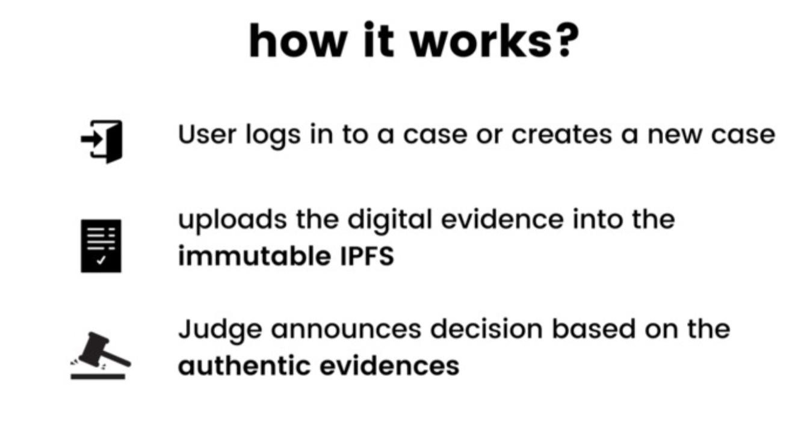

Last month, the IPFS project partnered with two different universities to sponsor student-led and organized hackathons focused on introducing ground-breaking initiatives at both the global and local level.

[Cal Hacks](https://helloworld.calhacks.io/), a nonprofit organization composed of University of California, Berkeley students, held a global hackathon to unite the innovators, creators, and troublemakers of the world, called [hello:world](https://helloworld.calhacks.io/). The goal was to inspire students to build something out of this world in the following categories: sustainability, connectivity, education, or community and civic engagement.

Similarly, the Associated Students of the University of California (ASUC) also held [CivHacks](https://www.civhacks.com/), an annual hackathon focused on providing a welcoming, engaging and creative environment to support social good in tech culture, open to several categories including health, sustainability, student success, and civics.

## Winning projects 🏆

### Cal Hacks’ hello:world

[Ecogift](https://devpost.com/software/ecogift)  
Decentralised rewards system for waste management

@[youtube](l-vlJeMRMdY)

[Contentish](https://devpost.com/software/contentish)  
A real-time social networking dapp built on top of IPFS & Node!

### ASUC’s CivHacks

[Anonymous Hawk](https://devpost.com/software/anonymous-hawk)  
Blockchain and IPFS based news reporting site for safety of reporters and tamper proof news.

@[youtube](UywwmP-B6uc)

[Void Replica](https://devpost.com/software/void-replica)  
Using IPFS to detect plagiarized student assignments

[Immutable](https://devpost.com/software/immutable-ipfs-for-storing-authentic-evidences)  
Using the immutability of IPFS to maintain the authenticity of evidences in lawsuit.

[Sustainablox](https://devpost.com/software/roblox-sustainability-game)  
A game teaching young children (ages 4-7) correct waste sorting.

@[youtube](8BjgME5iBqw)

## Workshop: Introduction to IPFS

During these events, the IPFS project was happy to participate by introducing students to IPFS and the Web3 ecosystem.

### 🕸️ Introduction to IPFS - NFTs, P2P and Web3 - by Protocol Labs

<iframe src="https://drive.google.com/file/d/1nhO8kPD66F8t9nBcBkBilq_bjjFkIQTH/preview" width="640" height="480"></iframe>

Dietrich Ayala, developer onboarding and ecosystem development lead, led a quick introduction to IPFS, the content distribution protocol used for NFTs and Web3 dapps, which uses peer-to-peer networking and content-addressing (instead of location!) to securely and resiliently transfer data and files on the internet.

## Want to get involved in a future hackathon?

Follow us on Twitter at [@IPFS](https://twitter.com/ipfs) or [@Filecoin](https://twitter.com/filecoin). You can also subscribe to the [IPFS weekly newsletter](https://ipfs.us4.list-manage.com/subscribe?u=25473244c7d18b897f5a1ff6b&id=cad54b2230), or the [Filecoin monthly](https://filecoin.us16.list-manage.com/subscribe?u=a1dfb670c4f1fb042e82a1f1d&id=cf409026a0). Or, join us in chat in the [Filecoin Slack](http://filecoin.io/slack) or the [IPFS Discord](https://discord.com/invite/vZTcrFePpt). We’ll see you there! 👋