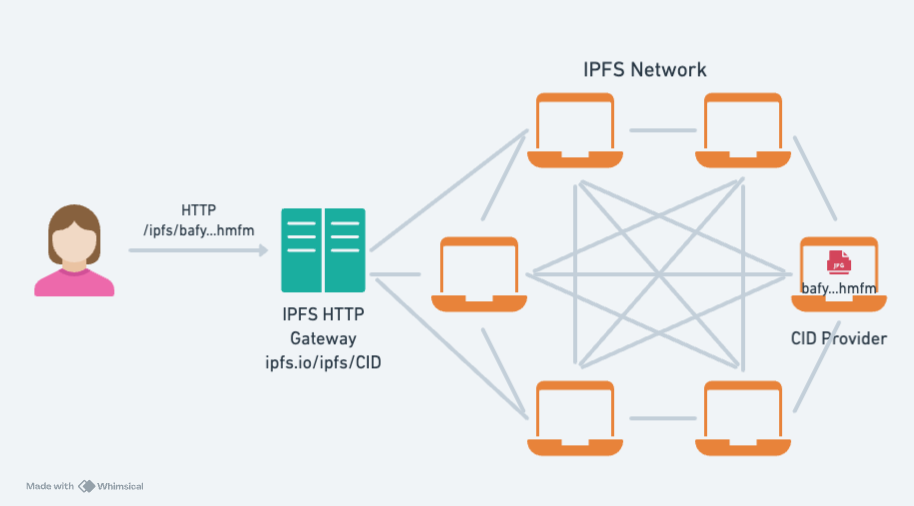

## Announcing @helia/verified-fetch

The Shipyard team is thrilled to announce **`@helia/verified-fetch`** is now ready for broader adoption. Verified Fetch is a [`fetch`](https://developer.mozilla.org/en-US/docs/Web/API/Fetch_API)-like library streamlining verified retrieval of IPFS content in browsers and JS runtimes, with native support for IPNS, and DNSLink resolution. [Try it out](https://www.npmjs.com/package/@helia/verified-fetch) and let us know what you think.

This blog post covers the challenges of IPFS retrieval in browsers and how `@helia/verified-fetch` addresses them with runnable examples. Feel free to jump ahead to [Solution: Verified Fetch](#solution-verified-fetch)

## Problem: Verified IPFS retrieval in browsers is hard

IPFS stands out as the leading decentralized network for distributing content-addressed data (with CIDs), spanning a wide range of use cases such as [off-chain voting](https://docs.ipfs.tech/case-studies/snapshot/), NFTs, [censorship-resistant Wikipedia](https://blog.ipfs.tech/24-uncensorable-wikipedia/), and [dapp distribution](https://blog.ipfs.tech/dapps-ipfs/).

However, developing web applications for the browser with an IPFS implementation capable of verified content retrieval has been an ongoing challenge for developers. The main reason lies in the inherent constraints of the Web Platform: TCP connections aren't allowed, and Certificate Authority signed certificates are required in Secure Contexts which increases the overhead to peer-to-peer retrieval. Other reasons include the apparent complexity of IPFS and the historical lack of focused tooling for verified IPFS retrieval on the Web.

For this reason, many developers use a **trusted gateway** and call it a day. That's understandable and speaks to the ease and utility of gateways as an abstraction of IPFS.

### IPFS Gateways are a useful abstraction for IPFS retrieval

Trusted IPFS Gateways abstract much of the complexity (peer-to-peer connectivity, content routing, content retrieval, verification) of IPFS with a straightforward HTTP API to the IPFS network:



The beauty of IPFS Gateways is in how simple they are to use: you append the CID to the URL of the Gateway and all IPFS magic is handled by the gateway for you.

For example, fetching an image with the CID: [`bafk...beom`](https://cid.ipfs.tech/#bafkreie7ohywtosou76tasm7j63yigtzxe7d5zqus4zu3j6oltvgtibeom) is as simple as constructing the URL: `https://ipfs.io/ipfs/bafkreie7ohywtosou76tasm7j63yigtzxe7d5zqus4zu3j6oltvgtibeom` which can be passed to the `src` attribute of an ``, as follows:


### Trusting an IPFS Gateway without verifying is an anti-pattern

**Nonetheless, fetching from a third-party IPFS gateway without verifying is an anti-pattern** and goes against [the principles of IPFS](https://specs.ipfs.tech/architecture/principles/#verification-matters).

Content addressing in IPFS frees you from the model of a single canonical source for data. This is a powerful concept and the root of IPFS' benefits: resilience, censorship resistance, and trustlessness. But, **fully reaping the benefits of IPFS requires verification**.

### Verification facilitates resilience and multi-source retrieval

Verifying IPFS content as part of the retrieval process allows you to fetch it from multiple sources –either providers or gateways– without trusting them because verification ensures the integrity of the data.

This comes with the downstream benefit of resilience: if one provider or gateway is unavailable, unreachable, or censored, you can still retrieve the CID from another (as long as other providers are available). A [recent outage of the Unpkg CDN](https://www.theverge.com/2024/4/12/24128276/open-source-unpkg-cdn-down) is a great example of why multi-source retrieval is useful.

### Trustless IPFS Gateways enable verification in browsers

[Trustless IPFS Gateways](https://specs.ipfs.tech/http-gateways/trustless-gateway/) have been gaining steam as a means of enabling verification and its downstream benefits with the simplicity of IPFS Gateways over HTTP. In fact, at the time of writing, most [public gateways](https://ipfs.fyi/gateways) support Trustless Gateway responses.

Trustless IPFS Gateways' response types are [fully and incrementally verifiable](https://docs.ipfs.tech/reference/http/gateway/#trustless-verifiable-retrieval): clients can decide between a [raw block](https://docs.ipfs.tech/concepts/glossary/#block) ([`application/vnd.ipld.raw`](https://www.iana.org/assignments/media-types/application/vnd.ipld.raw)) or a [CAR stream](https://docs.ipfs.tech/concepts/glossary/#car) ([`application/vnd.ipld.car`](https://www.iana.org/assignments/media-types/application/vnd.ipld.car)).

Trustless IPFS Gateways are useful for browsers because they can be composed in a way that unleashes many of the aforementioned benefits of IPFS and content addressing.

> **Note:** Browser constraints prevent you from opening connections to "random" addresses that don't have a CA signed certificate, making it hard to build IPFS clients for browsers that go straight to providers. Newer transport such as [WebTransport](https://docs.libp2p.io/concepts/transports/webtransport/) and [WebRTC-direct](https://docs.libp2p.io/concepts/transports/webrtc/) address this challenge in a way that may be able to reduce dependency on IPFS Gateways in the future.

## Solution: Verified Fetch

[`@helia/verified-fetch`](https://www.npmjs.com/package/@helia/verified-fetch) or simply **Verified Fetch** is a new JavaScript library by [The Shipyard team](https://blog.ipfs.tech/shipyard-hello-world/) that makes verified IPFS retrieval from trustless gateways easy. It's written in TypeScript with Web APIs so you can run it in browsers as well as modern JS runtimes.

It's the culmination of multiple streams of work we undertook to bring seamless and deeper IPFS integrations to browsers and improve the development experience with IPFS.

### Familiar, like the Fetch API

Verified Fetch is modeled after the [Fetch API](https://developer.mozilla.org/en-US/docs/Web/API/Fetch_API) and returns [`Response` object](https://developer.mozilla.org/en-US/docs/Web/API/Response) making it easy to adopt and reason about.

For example, fetching the CID of a JSON object is as simple as:

```ts
import { verifiedFetch } from '@helia/verified-fetch'
const resp = await verifiedFetch(
  'ipfs://baguqeeradnk3742vd3jxhurh22rgmlpcbzxvsy3vc5bzakwiktdeplwer6pa'
)
const obj = await resp.json()
```

Under the hood, Verified Fetch handles both fetching from trustless gateways and verification:

<iframe height="300" style="width: 100%;" scrolling="no" title="Fetching a CID with @helia/verified-fetch example" src="https://codepen.io/2color/embed/oNOyarL?default-tab=js%2Cresult&editable=true" frameborder="no" loading="lazy" allowtransparency="true" allowfullscreen="true">
  See the Pen <a href="https://codepen.io/2color/pen/oNOyarL">
  Fetching a CID with @helia/verified-fetch example</a> by Daniel Norman (<a href="https://codepen.io/2color">@2color</a>).
</iframe>

### Fast and Resilient Retrieval with Multiple Gateways

Verified Fetch supports retrieval from multiple trustless gateways, ensuring both performance and resilience. It comes [pre-configured with three default gateways](https://github.com/ipfs/helia/blob/b67ac5f16eca1df5534c985045250bdb334a85cf/packages/block-brokers/src/trustless-gateway/index.ts#L6-L15), but can be easily customized:

```ts
import { createVerifiedFetch } from '@helia/verified-fetch'

const verifiedFetch = await createVerifiedFetch({
  gateways: ['https://trustless-gateway.link', 'https://cloudflare-ipfs.com'],
})
```

### Mutable Pointers: DNSLink & IPNS

Mutable pointers are a powerful way to have a stable pointer that can be updated over time. In the IPFS ecosystem, there are two approaches to this: [IPNS](https://docs.ipfs.tech/concepts/ipns/) and [DNSLink](https://docs.ipfs.tech/concepts/dnslink/).

Verified Fetch supports both using the `ipns://` prefix, and resolves them to a CID, which in turn is fetched and verified.

### Resolving IPNS names with Verified Fetch

IPNS names are resolved using the [Delegated routing over HTTP](https://docs.ipfs.tech/concepts/glossary/#delegated-routing) provided by the [`https://delegated-ipfs.dev` endpoint](https://docs.ipfs.tech/concepts/public-utilities/#delegated-routing).

<iframe height="300" style="width: 100%;" scrolling="no" title="Resolving and Fetching a DNSLink with @helia/verified-fetch example" src="https://codepen.io/2color/embed/BaEVMWW?default-tab=js%2Cresult&editable=true" frameborder="no" loading="lazy" allowtransparency="true" allowfullscreen="true">
  See the Pen <a href="https://codepen.io/2color/pen/BaEVMWW">
  Resolving and Fetching a DNSLink with @helia/verified-fetch example</a> by Daniel Norman (<a href="https://codepen.io/2color">@2color</a>)
</iframe>

Note that you can deploy and configure your own Delegated Routing endpoint with [someguy](https://github.com/ipfs/someguy).

To configure the endpoint in Verified Fetch, pass the endpoint to the `routers` config option:

```ts
import { createVerifiedFetch } from '@helia/verified-fetch'

const verifiedFetch = await createVerifiedFetch({
  routers: ['https://delegated-ipfs.dev'],
})
```

### Resolving DNSLink domains with Verified Fetch

DNSLink records are resolved to a CID with a configurable [DNS over HTTPS](https://en.wikipedia.org/wiki/DNS_over_HTTPS) endpoint, which comes preconfigured to Cloudflare and Google:

<iframe height="300" style="width: 100%;" scrolling="no" title="Resolving and Fetching a DNSLink with @helia/verified-fetch example" src="https://codepen.io/2color/embed/YzMvRmv?default-tab=js%2Cresult&editable=true" frameborder="no" loading="lazy" allowtransparency="true" allowfullscreen="true">
  See the Pen <a href="https://codepen.io/2color/pen/YzMvRmv">
  Resolving and Fetching a DNSLink with @helia/verified-fetch example</a> by Daniel Norman (<a href="https://codepen.io/2color">@2color</a>)
</iframe>

### ENS names are also supported with DNSLink

Verified Fetch can also resolve [ENS names](https://ens.domains/) that have the [Contenthash record](https://docs.ens.domains/ensip/7) set with the help of [EthDNS](https://eth.link/) (A DNS bridge to ENS names). To do so, pass a DNS over HTTP EthDNS endpoint to the `dnsResolvers` option, like the [one provided by eth.limo](https://github.com/ethlimo/documentation/blob/master/dns-over-https/doh.md):

```ts
import { createVerifiedFetch } from '@helia/verified-fetch'
import { dnsJsonOverHttps } from '@multiformats/dns/resolvers'

const verifiedFetch = await createVerifiedFetch({
  dnsResolvers: {
    'eth.': dnsJsonOverHttps('https://dns.eth.limo/dns-query'),
    '.': dnsJsonOverHttps('https://cloudflare-dns.com/dns-query'),
  },
})
const resp = await verifiedFetch(
  'ipns://vitalik.eth/images/scaling-files/cryptokitties.png'
)
```

The following example uses Verified Fetch to [resolve `vitalik.eth`](https://app.ens.domains/vitalik.eth?tab=records) to a CID, fetch the CID, and verify the bytes of the image from Vitalik's website:

<iframe height="500" style="width: 100%;" scrolling="no" title="Resolving and Fetching a DNSLink with @helia/verified-fetch and custom DoH endpoint example" src="https://codepen.io/2color/embed/wvZXRPa?default-tab=js%2Cresult" frameborder="no" loading="lazy" allowtransparency="true" allowfullscreen="true">
  See the Pen <a href="https://codepen.io/2color/pen/wvZXRPa">
  Resolving and Fetching a DNSLink with @helia/verified-fetch and custom DoH endpoint example</a> by Daniel Norman (<a href="https://codepen.io/2color">@2color</a>)
</iframe>

### Supports a wide range of data types

As you may have noticed, you can use Verified Fetch to fetch a wide range of data types. Verified Fetch abstracts much of the complexity of IPLD codecs, supporting [UnixFS](https://docs.ipfs.tech/concepts/file-systems/#unix-file-system-unixfs), [dag-cbor](https://ipld.io/specs/codecs/dag-cbor/), and [dag-json](https://ipld.io/specs/codecs/dag-json/) out of the box. This frees you to focus on your application. The `text()`, `.blob()`, and .`arrayBuffer()` methods will work as expected without a detailed content type.

By default, if the response can be parsed as JSON, Verified Fetch sets the `Content-Type` header of the Response object to as `application/json`, otherwise it sets it as `application/octet-stream`.

[You can also pass the `Accept` header](https://github.com/ipfs/helia-verified-fetch/tree/main/packages/verified-fetch#the-accept-header) to override [certain](https://github.com/ipfs/helia-verified-fetch/blob/089635d6cd5b10aefbed013e95637ddb90b166e5/packages/verified-fetch/src/utils/select-output-type.ts#L12-L62) response processing to modify the `Content-Type` of the response. For example, you may want to fetch a `dag-cbor` CID with the `Accept` header set to `application/vnd.ipld.dag-json` for easier handling in JavaScript:

<iframe height="300" style="width: 100%;" scrolling="no" title="Fetching a CID with @helia/verified-fetch example" src="https://codepen.io/2color/embed/ExJdayy?default-tab=js%2Cresult&editable=true" frameborder="no" loading="lazy" allowtransparency="true" allowfullscreen="true">
  See the Pen <a href="https://codepen.io/2color/pen/ExJdayy">
  Fetching a CID with @helia/verified-fetch example</a> by Daniel Norman (<a href="https://codepen.io/2color">@2color</a>)
</iframe>

Finally, since you can store **any** kind of file with UnixFS, if you want the `Content-Type` header of the `Response` object to be sniffed on the [Magic Bytes of the retrieved binary data](https://en.wikipedia.org/wiki/Content_sniffing), you can pass the `contentTypeParser` option as follows:

<iframe height="300" style="width: 100%;" scrolling="no" title="Content-Type sniffing with contentTypeParser @helia/verified-fetch example" src="https://codepen.io/2color/embed/JjVmoLy?default-tab=js%2Cresult&editable=true" frameborder="no" loading="lazy" allowtransparency="true" allowfullscreen="true">
  See the Pen <a href="https://codepen.io/2color/pen/JjVmoLy">
  Content-Type sniffing with contentTypeParser @helia/verified-fetch example</a> by Daniel Norman (<a href="https://codepen.io/2color">@2color</a>)
</iframe>


### Customizable

By default, Verified Fetch uses [`@helia/http`](https://github.com/ipfs/helia/tree/main/packages/http#heliahttp): a lightweight version of Helia on IPFS over HTTP with Trustless Gateways. However, you can [pass an instance of Helia that is customized to your needs](https://github.com/ipfs/helia-verified-fetch/tree/main/packages/verified-fetch#usage-with-customized-helia). A common use-case might be when running on Node.js where you might want to lean more heavily on peer-to-peer retrieval using Bitswap over TCP. In that case, you would likely be better served by a Helia instance backed by libp2p as follows:

```ts
import { createHelia } from 'helia'
import { createVerifiedFetch } from '@helia/verified-fetch'

const verifiedFetch = await createVerifiedFetch(
  // Create a Helia instance instance backed by js-libp2p
  await createHelia()
)
```

### 📕 Docs & Examples

In addition to the embedded examples above, check out the [README](https://github.com/ipfs/helia-verified-fetch/tree/main/packages/verified-fetch) for a more elaborate overview of usage patterns and reconfigurability.

We also have a [ready-to-run example](<https://github.com/ipfs-examples/[text](https://inbrowser.dev/ipns/example.ipfs.garden)helia-examples/tree/main/examples/helia-browser-verified-fetch>) showing `@helia/verified-fetch` in the browser handling different content types.

## What's next for Verified Fetch?

This release of Verified Fetch leans heavily on IPFS Gateways. But the journey doesn't end there. Our long-term vision is to [enable direct retrieval from content providers, e.g. Kubo nodes](https://github.com/ipfs/helia/issues/255), which would further increase the resilience of retrievals.

Verified Fetch is already powering IPFS retrieval in the [Service Worker Gateway](https://github.com/ipfs-shipyard/service-worker-gateway), a novel approach to in-browser IPFS gateways. This has given us the chance to dogfood and refine Verified Fetch.

## Try it out today

We built Verified Fetch with app developers in mind. We understand that for developers to be productive with IPFS, you need good abstractions.

We invite you to try it out and can't wait to see what you build with it 🚢.

<br />
<a href="https://npmjs.com/package/@helia/verified-fetch" class="cta-button">
  @helia/verified-fetch docs
</a>

## Share your feedback

If you are new to Helia and mostly interested in retrievals, `@helia/verified-fetch` is a great place to get started.

For questions, discussions, and feedback join the [IPFS Forums](https://discuss.ipfs.tech/) or the [#ip-js](https://discord.com/channels/806902334369824788/1136320721044381706) channel in the [IPFS Discord](https://discord.com/invite/ipfs). Finally, the [Helia and Dapps Working Groups](https://lu.ma/ipfs?tag=helia) meet regularly to coordinate and discuss the development of the Helia and advance the tooling for Dapps in the IPFS ecosystem.

If you've already been using [Helia](https://github.com/ipfs/helia/), please take a moment to [fill out the Helia feedback survey](https://ipfs.fyi/helia-feedback). Your feedback will help us understand developer needs and challenges as well as inform our priorities and shape Helia’s roadmap.

<br />
<a href="https://ipfs.fyi/helia-feedback" class="cta-button">
  Helia Feedback Survey
</a>