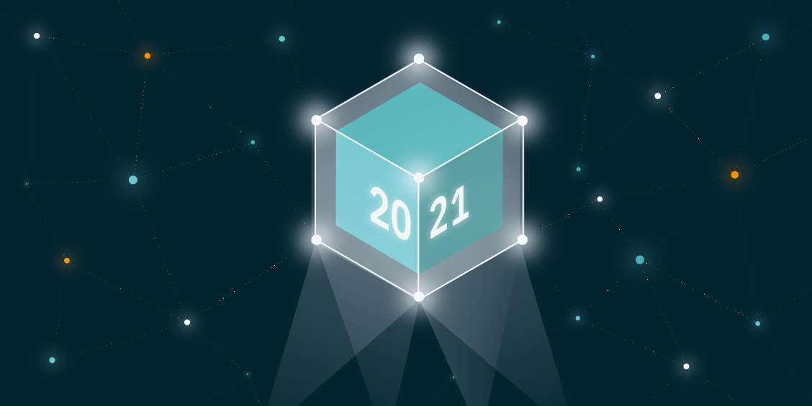

## **IPFS 2021 in Review**

Web3 applications had a great run in 2021 as mainstream users were introduced to concepts like NFTs. This was all possible thanks to the infrastructure developments that were already there to support them with decentralized storage. Throughout the year, IPFS collaborated with projects such as OpenSea, Brave, Pinata, and Audius to make this happen. It also added important features to its Go and JavaScript implementations as well as the IPFS Cluster codebase. [Get a refresh](https://blog.ipfs.io/2022-01-11-IPFS-in-2021/) on everything that happened in 2021.

## **Brand New on IPFS**

1. Last week, the Bitflix movie NFT platform [chose](https://twitter.com/BitflixNFTs/status/1479478241459011584?s=20) IPFS for its decentralized storage needs to ensure the NFTs are safe and secure.
2. Ecosys, an open source ecology platform, is [using](https://twitter.com/octopuce_node/status/1480555606385860612?s=20) IPFS for web hosting.
3. The DINPS 2022 workshop is looking for papers related to IPFS, distributed storage, p2p networks, and edge computing. Submissions are open until March 5 with more information available on the [official website](https://research.protocol.ai/sites/dinps/calls/).
4. The Moralis + Avalanche Hackathon is hosting an IPFS and Filecoin track where participants will compete for the Best Use of IPFS or NFT.Storage for Content-Addressed Data. Register now on the [event website](https://moralis.io/avalanche-hackathon/).

## **Around the Ecosystem**

Be sure to check out developerAlly’s upcoming [workshop](https://www.youtube.com/watch?v=bIZNW_c6Hx4) on how to create NFTs using IPFS and Filecoin. It will take place on January 13 at the NFTHack 2022 weekend-long hackathon and summit.

The second libp2p community call happened earlier today - couldn’t make it? Be sure to stay tuned for details on the next one [here](https://discuss.libp2p.io/t/libp2p-community-calls/1157).

Watch a [tutorial](https://www.youtube.com/watch?v=1YnInXG682U) on how to upload a website to an IPFS node run by Cybercon, a dedicated server provider working with decentralized websites and apps.

Find out how you can use Fleek to deploy and host a website using IPFS and connect it to a .eth ENS domain by watching Sarah Amann’s [video](https://www.youtube.com/watch?v=H-0Drm0-ZeM).

Enjoy MawaMaverick’s [in-depth look](https://www.youtube.com/watch?v=ieHXypfhsWk) at the future of Web3 and IPFS.

## Want to help build the new internet?

[**Filecoin Green Program Administrator**](https://jobs.lever.co/protocol/33a795a3-a69e-4f89-82d7-3da0bd5626ce): We are searching for a Program Administrator who will help to track, manage and direct a team developing tomorrow’s environmental accounting tools. [**Filecoin Green**](https://medium.com/@filecoingreen) is a fast-growing initiative dedicated to measuring, reducing and mitigating environmental impacts within the Filecoin ecosystem and beyond. The team aims to catalyze this by enabling teams across the Filecoin ecosystem to verifiably report their emissions, and to use these data as the basis for impact reductions. **Protocol Labs**, Remote.

[**Community Manager**](https://valist.io/roles/community-manager.pdf): Valist is hiring a community manager to help expand outreach, community, and brand awareness. In this role, you will have a strong influence on our growth strategies, forge and develop great relationships with our community members and key partners, and create high quality content. You will be working closely with technical co-founders and engineers. **Valist**, Remote.

[**Blockchain Engineering Lead**](https://jobs.lever.co/3box/bdbda170-a119-4842-84e8-e208b94f4c52): As 3Box Labs’ first Blockchain Engineer you will lead engineering, implementation and optimization of the Ceramic Blockchain and contribute to the overall cryptoeconomic design of the network. You'll tackle some of the most novel challenges in decentralized tech, work closely with our rapidly growing open source community and many of the best technologists in the world, and help reinvent how data is managed online. **3Box Labs**, Remote.

[**Head of Content**](https://jobs.lever.co/protocol/330b0744-ebea-4bc3-90de-e817b470b8cb): Protocol Labs is seeking a Head of Content to develop and execute effective content deliverables for our portfolio and ecosystem projects including Filecoin and IPFS. The ideal candidate is an exceptional writer with a proven experience in communicating blockchain and Web3 concepts to developers, non-developers, enterprises, and newcomers. **Protocol Labs**, Remote.

[**Developer Relations**](https://boards.greenhouse.io/textileio/jobs/4075619004): Textile is seeking someone to run large-scale community projects. These include amplifying our grants program to fund community projects, curating governance groups where we bring community stakeholders into our technology planning, engaging with external teams like Gitcoin and EthDenver to support large-scale developer events, and giving technical presentations at events. This position also includes day-to-day engagement with our Slack group, helping to triage GitHub issues, hacking on demos, writing blog posts and technical guides, and more. We are looking for a self-directed leader who wants to build a developer community while staying hands on with technology. **Textile**, Remote.

[**Senior Software Engineer**](https://jobs.lever.co/protocol/3490e571-4d47-487e-a47f-b02f08668290): Distributed systems engineering lies at the center of many projects at Protocol Labs. With IPFS, libp2p, Filecoin, and other related projects, we are laying the foundation for a more resilient, more secure, distributed version of the web. This requires rigorous engineering from protocol design through all the phases of implementation. We strike a balance between pragmatism, deeply informed protocol design, and strict application of strong engineering principles. All of this happens in an environment defined by curiosity, passion, and a love for open source. **Protocol Labs**, Remote.

[**Fullstack Engineer**](https://boards.greenhouse.io/textileio/jobs/4017984004): Textile's web products and services are written primarily in Golang and TypeScript, and communicate with Textile's core gRPC services. You will own the end user experience and have full ownership over the product stack, from research and development to implementation and production monitoring. **Textile**, Remote.