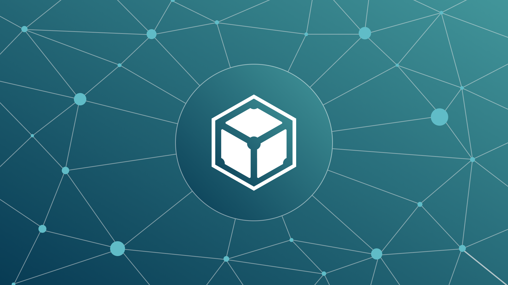

## **Not Your Data Storage Infrastructure, Not Your NFTs**

In IPFS, resilience is the way that people individually and collectively participate in the network to store and govern data. It is context specific, and requires active participation of stakeholders to govern the storage of their data. Data storage resilience could be improved by leveraging existing Web3.0 data governance frameworks, such as Decentralized Autonomous Organizations (DAOs), to coordinate data storage infrastructure and utilization in a way that owners of data are able to govern how it is stored and used. To learn more about these concepts, read [**this piece**](https://kelsienabben.substack.com/p/not-your-storage-architecture-not) by Protocol Labs PhD Fellow, Kelsie Nabben, as she dives into how distributed storage and content addressing make end-user applications more resilient.

## **Brand New on IPFS**

1. Check out this recently released short (and fun!) tutorial from [**Pancy**](https://pancy.medium.com/) on how to ‘[**Build a Decentralized App on IPFS using WebAssembly**](https://pancy.medium.com/build-a-decentralized-app-on-ipfs-using-webassembly-d89238a3c9c6)’.
2. [**js-libp2p v0.36.0**](https://github.com/libp2p/js-libp2p/releases/tag/v0.36.0) is now live! Read the [**release notes**](https://github.com/libp2p/js-libp2p/releases/tag/v0.36.0) for the breaking changes, features, bug fixes, and assets.
3. Looking to get started with IPFS? Watch this brand new [**tutorial video**](https://www.youtube.com/watch?v=A7yZaYhrwyM)to see how you can download a go-ipfs distribution onto your Linux machine.
4. KEN Labs and Protocol Labs have launched a 3 month [**Education Program**](https://kencloud.com/educate.html) with the intent to teach students about the Metaverse through the lens of IPFS, Filecoin, & Libp2p. [**Learn more**](https://kencloud.com/educate.html).

## **Around the Ecosystem**

Attending ETHDenver? Join the Filecoin community for an evening of food, drinks and great company at the [**Filecoin & Friends Happy Hour**](https://www.eventbrite.com/e/filecoin-friends-happy-hour-at-ethdenver-tickets-259853878947) on Wednesday, February 16th in Denver! [**Details here**](https://www.eventbrite.com/e/filecoin-friends-happy-hour-at-ethdenver-tickets-259853878947).  
  
OpenSea just released a [**new tutorial**](https://docs.opensea.io/docs/creating-an-nft-contract) for creating your own NFT smart contract that you can trade on OpenSea using IPFS, MetaMask, Ethers.js, and more!  
  
The DINPS 2022 workshop is looking for papers related to IPFS, distributed storage, p2p networks, and edge computing. Submissions are open until March 5 with more information available on the [**official website**](https://research.protocol.ai/sites/dinps/calls/).  
  
Community member markg85 is adding IPFS support to VideoLAN for Android. Check out the docs, source, and APK [**here**](https://bafybeiei4hefy7infgbcszbst5dgiz2buh3kkt77flrybe7bs5zxlac2ki.ipfs.dweb.link/).  
  
[**Capyloon**](https://capyloon.org/) is an experimental user agent that aims to give you what you privacy and control through freedom from the constraints imposed by OS vendors and service providers who decide what you can or can't do online, and how. [**Check out**](https://capyloon.org/) the current prototype that explores support for IPFS.  
  
Introducing [**Lens**](https://lens.dev/), a new social NFT platform that uses IPFS by default for addressing media assets and metadata!  
  
The NFT.Storage team just released a [**2022 Roadmap**](https://nft.storage/blog/post/2022-01-31-q1-roadmap-and-beyond/), take a look to find out what’s coming this year.  
  
Considering joining a Filecoin and/or IPFS hackathon but still not convinced? [**Read this thread**](https://twitter.com/KenLabs_Web3/status/1490167630774542338?s=20&t=H6HeJPrCXbKomL5iRIWs8Q) by our friends at KEN Labs highlighting 10 reasons you should build with Protocol Labs today!  
  
The Ecosystem Working Group is a collection of 50+ people across 3+ organizations that are passionate about the long-term adoption of Web3 and dedicated to growing the Filecoin, IPFS and libp2p ecosystems. All hands meetings are hosted regularly to check in on progress and showcase the growth of various developers, applications, storage providers, clients and communities around the world. In case you missed it, [**check out the recording**](https://www.youtube.com/watch?v=-9rKtrwMkG0) from last week’s meeting.

## Want to help build the new internet?

[**Community Manager**](https://valist.io/roles/community-manager.pdf): Valist is hiring a community manager to help expand outreach, community, and brand awareness. In this role, you will have a strong influence on our growth strategies, forge and develop great relationships with our community members and key partners, and create high quality content. You will be working closely with technical co-founders and engineers. **Valist**, Remote.

[**Blockchain Engineering Lead**](https://jobs.lever.co/3box/bdbda170-a119-4842-84e8-e208b94f4c52): As 3Box Labs’ first Blockchain Engineer you will lead engineering, implementation and optimization of the Ceramic Blockchain and contribute to the overall cryptoeconomic design of the network. You'll tackle some of the most novel challenges in decentralized tech, work closely with our rapidly growing open source community and many of the best technologists in the world, and help reinvent how data is managed online. **3Box Labs**, Remote.

[**Developer Relations**](https://boards.greenhouse.io/textileio/jobs/4075619004): Textile is seeking someone to run large-scale community projects. These include amplifying our grants program to fund community projects, curating governance groups where we bring community stakeholders into our technology planning, engaging with external teams like Gitcoin and EthDenver to support large-scale developer events, and giving technical presentations at events. This position also includes day-to-day engagement with our Slack group, helping to triage GitHub issues, hacking on demos, writing blog posts and technical guides, and more. We are looking for a self-directed leader who wants to build a developer community while staying hands on with technology. **Textile**, Remote.

[**Fullstack Engineer**](https://boards.greenhouse.io/textileio/jobs/4017984004): Textile's web products and services are written primarily in Golang and TypeScript, and communicate with Textile's core gRPC services. You will own the end user experience and have full ownership over the product stack, from research and development to implementation and production monitoring. **Textile**, Remote.