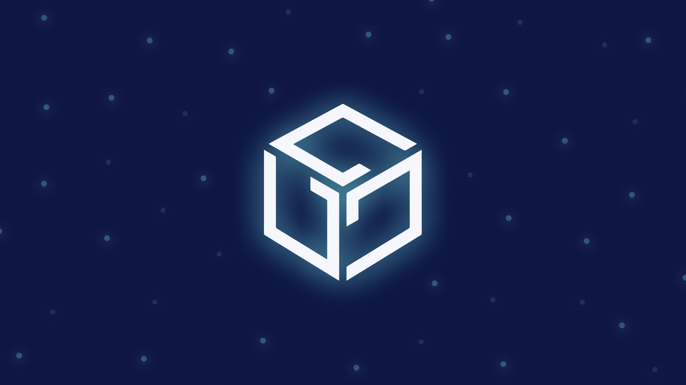

## **Gala Games: Decentralized Gaming Supported by IPFS and Filecoin**

Game development is at a completely different place than where it was a decade or two ago. Today’s games are rich multimedia and art experiences, but that depth comes at a cost. All the amazing design, code, and infrastructure in these releases are requiring similar advancements in storage solutions. As immersive games cross over the Web3 frontier, developers in the space will need tools at their disposal to organize, analyze, archive, and deploy massive amounts of data. [Gala Games](https://app.gala.games/about/) is a solution that meets these needs and helps different teams and projects develop games on chain. Learn more about Gala Games and how they’re using IPFS and Filecoin for their large amount of backup data in this [recent blog post](https://blog.ipfs.io/2022-02-27-gala-games-decentralized-gaming/).

## **Brand New on IPFS ✨**

1. [DAS has now integrated IPFS](https://dasystems.medium.com/bit-now-supports-ipfs-content-12c39489cfae)! You can now decentralize your websites with IPFS, and show your IPFS content on your bit.cc page - with no fee and no gas.
2. Read how [Lit Protocol](https://litprotocol.com/) and [Audius](https://audius.co/) are leveraging IPFS and Filecoin to give artists individual expression in this [new blog post](https://blog.ipfs.io/2022-02-10-ipfs-filecoin-impact-on-music-media-culture/).
3. Check out [Studio 721](https://www.721.so/), an open source website for creating and uploading metadata and artwork to IPFS and deploying NFT smart contracts with the Ethereum and Polygon blockchains.
4. Web3 builder Pancy is building an NFT store with AVAX and NFT.Storage, read [this Twitter thread](https://twitter.com/pancychain/status/1493650754346700803) to find out about his learnings throughout the process.

## **Around the Ecosystem 🌎**

Around a quarter of all ETHDenver Hackathon submissions were submitted for the IPFS and Filecoin bounties! Amazing work, builders. Stay tuned for a full ETHDenver recap.  
  
NextDNS now supports and acts as an unfiltered gateway for ENS Domains, Unstoppable Domains, HNS, and IPFS. Read the [announcement](https://twitter.com/NextDNS/status/1491034351391305731).  
  
Interested in learning about the past, present, and future of Web3? Look no further! Check out this [video](https://www.youtube.com/watch?v=Yc1L566oEeU&t=1s) about exactly that from the Faber Web3 Webinar featuring David Dias.

  
The [Filecoin Virtual Machine Early Builders Program](https://fvm.filecoin.io/foundry) is seeking individuals with expertise and interest in smart contract programming, large-scale data, compute-over-data, data governance (data DAOs), and more. [Apply now](https://fvm.filecoin.io/foundry)! Applications close on February 24th.  
  
Vivid Labs and Shopify are now enabling traditional e-commerce businesses to launch NFT collections and marketplaces, powered by Fileocin, NFT.Storage, Textile, and Estuary! [Learn more](https://cointelegraph.com/news/the-industry-will-need-to-have-dynamic-nfts-says-vivid-labs-ceo-halsey-minor).   
  
As of last week, the Filecoin ecosystem and [Polygon Studios](https://polygonstudios.com/) announced that they are deepening their collaboration in NFTs, games, and the metaverse. [Learn more](https://filecoin.io/blog/posts/filecoin-and-polygon-studios-deepen-collaboration-in-nfts-games-and-the-metaverse/).   
  
Learn how to download an NFT image from IPFS and display it on a game object in this [tutorial](https://www.youtube.com/watch?v=-yc_n1uRb9M) by Blockchain Dapp Community. It uses the ChainSafe gaming SDK and Unity3D.  
  
Earlier this month Max Inden and Dietrich Ayala spoke at FOSDEM ‘22! If you missed it, watch the recordings:

* [Edges are Infrastructure: IPFS Everywhere for a More Resilient Future](https://fosdem.org/2022/schedule/event/ipfs/)
* [Peer-to-Peer Hole Punching Without Centralized Infrastructure](https://fosdem.org/2022/schedule/event/peer_to_peer_hole_punching_without_centralized_infrastructure/)

## **Build with IPFS 🏗**

[BuildQuest](https://buildquest.ethglobal.com/), the 12-day game jam and metaverse hackathon begins on March 4th! Join to receive mentorship and support from the best companies and mentors in the space, plus you'll have a shot at winning one of over $100k in prizes available. [Sign up!](https://buildquest.ethglobal.com/)  
  
[ETHernals](https://ethernals.devfolio.co/) hosted by EthIndia kicks off on February 25th through March 27th. Apply within two days for an opportunity to explore the world of decentralization by building around DAOs, NFTs, DeFi, and more! [Learn more](https://ethernals.devfolio.co/).

[Register now](https://emamo.com/event/web3con/tickets) for [Web3Con](https://www.web3con.dev/), hosted by DeveloperDAO. Join experts from the metaverse for Gather.town meetups, workshops and a hackathon starting from February 28 - March 6, 2022.

To stay up to date with all upcoming events and hackathons happening in the IPFS and Filecoin ecosystems, [check out the Hackathons website](https://hackathons.filecoin.io/).

## **Want to help build the new internet? 💼**

[**Senior Social Media Manager**](https://boards.greenhouse.io/protocollabs/jobs/4282182004): Protocol Labs is seeking a Senior Social Media Manager to both build best-practice growth strategies, own social tactics, and posting across all of our various channels. Your goal is to assist, educate, and excite every member of our community. You will be responsible for communication with our community primarily on Twitter, Reddit, and Slack but also occasionally over email, Telegram, Discord and other channels. This audience includes everyone from industry leaders, Protocol Labs partners, and investors to miners, developers, and users. **Protocol Labs**, Remote.

[**Community Manager**](https://valist.io/roles/community-manager.pdf): Valist is hiring a community manager to help expand outreach, community, and brand awareness. In this role, you will have a strong influence on our growth strategies, forge and develop great relationships with our community members and key partners, and create high quality content. You will be working closely with technical co-founders and engineers. **Valist**, Remote.

[**Blockchain Engineering Lead**](https://jobs.lever.co/3box/bdbda170-a119-4842-84e8-e208b94f4c52): As 3Box Labs’ first Blockchain Engineer you will lead engineering, implementation and optimization of the Ceramic Blockchain and contribute to the overall cryptoeconomic design of the network. You'll tackle some of the most novel challenges in decentralized tech, work closely with our rapidly growing open source community and many of the best technologists in the world, and help reinvent how data is managed online. **3Box Labs**, Remote.

[**Developer Relations**](https://boards.greenhouse.io/textileio/jobs/4075619004): Textile is seeking someone to run large-scale community projects. These include amplifying our grants program to fund community projects, curating governance groups where we bring community stakeholders into our technology planning, engaging with external teams like Gitcoin and EthDenver to support large-scale developer events, and giving technical presentations at events. This position also includes day-to-day engagement with our Slack group, helping to triage GitHub issues, hacking on demos, writing blog posts and technical guides, and more. We are looking for a self-directed leader who wants to build a developer community while staying hands on with technology. **Textile**, Remote.

[**Fullstack Engineer**](https://boards.greenhouse.io/textileio/jobs/4017984004): Textile's web products and services are written primarily in Golang and TypeScript, and communicate with Textile's core gRPC services. You will own the end user experience and have full ownership over the product stack, from research and development to implementation and production monitoring. **Textile**, Remote.