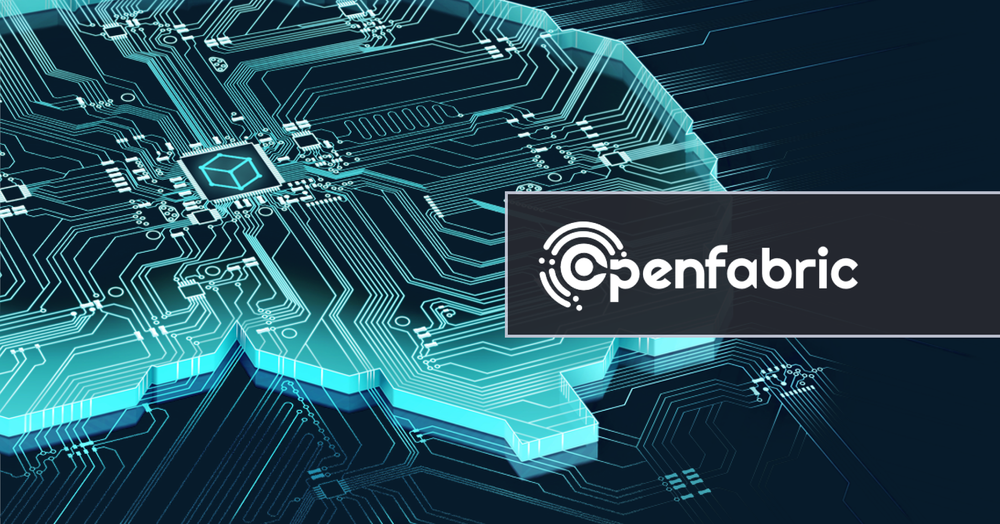

## Openfabric Brings Web3 and AI Together

[**Openfabric**](https://openfabric.ai/) is a platform for building and connecting apps in an ecosystem where everyone has quick, easy, low-cost, and hassle-free access to powerful AIs. It leverages Web3 infrastructure to address the most challenging problems faced by AI platforms. Find out more about how IPFS is a core component of the decentralized operating system (DOS) developed by Openfabric on the IPFS [**blog**](https://blog.ipfs.tech/2022-05-12-openfabric/).

## **Brand New on IPFS ✨**

1. [**Watch**](https://www.youtube.com/watch?v=Ecx8VOQBKpw) Jonathan Victor discuss [**NFT.Storage**](https://nft.storage/) and the future of the metaverse at the recent Harvard in Tech Webinar.
2. Cloudflare announced that it will make it possible for its customers to serve their sites on the IPFS network! Learn more on the Cloudflare [**blog**](https://blog.cloudflare.com/cloudflare-pages-on-ipfs/).
3. [**PooZone**](https://poo.zone/) has [**integrated**](https://twitter.com/Poo_Zone/status/1526510329639092224?s=20&t=sCK5F5yXr4WVbYO-uPMNxw) with the [**4EVERLAND**](https://www.4everland.org/) cloud computing platform to better store and manage data on IPFS.
4. The 4EVERLAND community has also announced a new campaign around its [**Bucket**](https://dashboard.4everland.org/) feature. [**Find out**](https://medium.com/4everland/keep-your-storage-decentralized-with-4everland-bucket-and-win-great-prizes-d2d9d14bdbcc) how you can win prizes by using it to upload your backups to IPFS.

## **Around the ecosystem 🌎**

[**Check out this recording**](https://www.youtube.com/watch?v=75ewjnT6B9Y&ab_channel=Samoura%C3%AFTV) from the Paris P2P Festival featuring Yiannis Psaras as he talks about IPFS measurements and improvements opportunities at the Paris P2P Festival.  
  
Take a look at this [**guide**](https://www.youtube.com/watch?v=IeR1oQpaAYM&ab_channel=AlphaTime) on how to deploy decentralized websites and dapps for your ENS domains with IPFS and Fleek by Alpha Guide.  
  
The ETHGlobal [**Hack Money 2022**](https://defi.ethglobal.com/) virtual hackathon is still happening. [**Catch **](https://www.youtube.com/watch?v=Ubl0iZJkJC4&ab_channel=ETHGlobal)Konstantin Tkachuk’s workshop on IPFS and Filecoin and how they share the future of Web3.  
  
Don’t miss this [**Q&A**](https://www.youtube.com/watch?v=fzk_od87-Ds&ab_channel=LisaLoud) at Global NFT Summit about minting NFTs with IPFS and friends.  
  
From May 2 - 22, [**Gitcoin**](https://gitcoin.co/) is [**celebrating**](https://twitter.com/gitcoin/status/1521040036694736896) the L2 Rollathon focused on scaling solutions. IPFS and Filecoin are among the virtual hackathon’s lead sponsors. [**Register now**](https://gitcoin.co/hackathon/rollathon/onboard)!  
  
ETHGlobal’s [**Hack Money**](https://defi.ethglobal.com/) virtual DeFi hackathon is happening now through May 27th, [**apply now**](https://hack.ethglobal.com/hackmoney2022) and take your chances at building the future of finance.  
  
If you happen to be in Berlin on May 24, check out the [**NFT and DeFi with IPFS and Filecoin Meetup**](https://lu.ma/ipfs-nft-meetup). It’s a great opportunity to meet digital artists, NFT developers, and hackathon winners in the ecosystem.  
  
[**Register**](https://gssoc.girlscript.tech/#card-1) for the GirlScript Summer of Code! The three-month long open-source program will continue until May 31st. Learn more on the [**official website**](https://gssoc.girlscript.tech/#about-gssoc).

## **Want to help build the new internet? 💼**

[**Developer Growth Advocate**](https://jobs.filebase.com/20702): Filebase is looking for a highly motivated technologist to join as a Developer Growth Advocate and help grow the Filebase brand across the ecosystem. You will help to lay the groundwork for the world to have an easy (and cost-effective) alternative to the traditional cloud of today. Our Developer Advocate will continue to foster Filebase relationships within multiple developer ecosystems - Blockchain/Crypto/Web3 and the traditional Object Storage landscape. **Filebase**, Remote.

[**Startup Operator, Asia Ecosystem Growth**](https://boards.greenhouse.io/protocollabs/jobs/4382529004)**:** As a member of the Ecosystem Growth team at Protocol Labs, you’ll scope, lead and manage initiatives that help grow Filecoin storage providers in Asia, with an initial focus in China. Your work will span multiple areas, including business development, process improvement, project management, analytics, and more. In this role, you will work closely with the Ecosystem team’s leadership to structure and solve complex problems, then drive solutions forward across the organization. **Protocol Labs**, Remote.

[**Rust Engineer**](https://angel.co/company/fleekhq/jobs/1505997-rust-engineer-remote): Fleek is looking for an experienced and dedicated Rust Engineer to help build new canister-based products and services on Dfinity's Internet Computer. [**Fleek**](https://fleek.co/) is an Open Web developer platform with everything you need to build sites and apps on the new web and the underlying protocols that power it (Dfinity, Ethereum, IPFS, Filecoin, and more). From hosting, storage, gateways, domains, databases, and more, Fleek has everything you need to seamlessly build and manage Open Web sites. **Fleek**, Remote.

[**Growth Marketing Lead**](https://jobs.lever.co/MoNA/2f653ef6-c3da-4e0f-ba3c-1f294d24ece3): The Growth Marketing Lead will be responsible for Mona’s digital marketing strategy across multiple media channels. In this role, you will develop, implement, measure, and optimize our approach over time with the related goals of driving people into our metaverse spaces, 3D architects to build metaverse spaces, and expanding the overall footprint of the Mona brand. The digital marketing strategy will integrate closely with our existing organic content strategy. **Mona**, Remote.

[**Developer Relations**](https://boards.greenhouse.io/textileio/jobs/4075619004): Textile is seeking someone to run large-scale community projects. These include amplifying our grants program to fund community projects, curating governance groups where we bring community stakeholders into our technology planning, engaging with external teams like Gitcoin and EthDenver to support large-scale developer events, and giving technical presentations at events. This position also includes day-to-day engagement with our Slack group, helping to triage GitHub issues, hacking on demos, writing blog posts and technical guides, and more. We are looking for a self-directed leader who wants to build a developer community while staying hands on with technology. **Textile**, Remote.