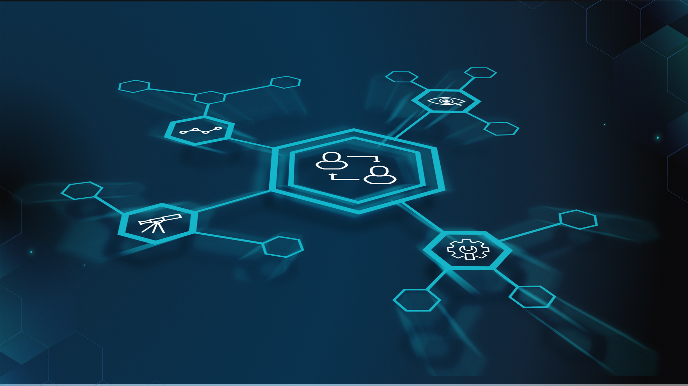

## **Introducing ProbeLab**

ProbeLab is an effort to apply solid scientific measurement methodologies to benchmark and optimize network protocols that operate in decentralized P2P environments. It was born out of the need for developing a deeper understanding of how permissionless, decentralized networks can be made more performant and comparable to their centralized counterparts. [Keep reading](https://blog.ipfs.io/2022-06-15-probelab/) to learn more about the project.

## **Brand New on IPFS ✨**

1. Check out the newly launched [Skiff Drive](https://twitter.com/skiffprivacy/status/1537119521382666241), a tool to protect your files with end-to-end encryption and share your work securely. [Sign up](https://skiff.com/drive) and get 10GB for free.
2. Itsuki, an NFT project led by artist [Leroosh Derrick](https://twitter.com/Leroosh_Derrick?s=20&t=OdKI18VWJggkbr8t2UWzwg), is [relying](https://twitter.com/ItsukiNFT/status/1537125438002065409?s=20&t=OdKI18VWJggkbr8t2UWzwg) on NFT.Storage powered by IPFS and Filecoin for its upcoming launch on July 6th.
3. Filecoin Green launched a $1 million Green Grants program for regenerative finance projects on the IPFS and Filecoin stack. [Learn more](https://filecoin.io/blog/posts/filecoin-green-s-1-million-green-grants-program-will-support-climate-positive-regenerative-finance-refi-initiatives/) on the Filecoin blog.
4. Bueno is a no-code tool for NFT creators that just [started working](https://twitter.com/buenonft/status/1541768422433951745?s=20&t=OdKI18VWJggkbr8t2UWzwg) with Pinata to provide users with IPFS uploads. [Read along](https://www.bueno.art/blog/bueno-pinata-ipfs) to find out more.

## **Around the ecosystem 🌎**

NFT.NYC was a blast! The community welcomed builders from around the ecosystem with a number of side-events like Mona x NFT.NYC, Wake Up and Dance, and the NFT.Storage Social. Stay tuned for the next community event in a city near you!

Right after NFT.NYC, the Protocol Labs community gathered at the New York Historic Society for the Funding the Commons event. Learn more about the initiative and public goods on the [PL Research blog](https://research.protocol.ai/blog/2022/what-are-public-goods-and-commons/) and check out the [event recap video](https://twitter.com/protocollabs/status/1540840681786281984?s=20&t=Vji469uHd3vfWMJPAKb5Og).

[Read](https://twitter.com/dietrich/status/1540364548099784704?s=20&t=OdKI18VWJggkbr8t2UWzwg) this thread by Dietrich Ayala to learn about IPFS and how it’s made available in browsers.

Don’t miss Atlantis World’s [interview](https://www.youtube.com/watch?v=-c3wnmGsE0A) with Juan Benet where they discussed Filecoin Green, Funding the Commons and regenerative crypto economics.

Check out a recap of the June All Hands meeting for the IPFS, Filecoin, and libp2p Ecosystem Working Group. A full recording of the event is available on [Youtube](https://www.youtube.com/watch?v=Uw4R5PyLPfI&list=PL_0VrY55uV18-DugtNhjS5_-taPz0hnAO&index=3).

Lighthouse Labs’ Justine Massicotte shared her views on how we can prevent the metaverse from becoming a nightmare and IPFS’ role in doing so. Read more on [Coindesk](https://www.coindesk.com/layer2/metaverseweek/2022/05/26/how-to-prevent-the-metaverse-from-becoming-a-nightmare/).

Join ETHGlobal and the Protocol Labs community for the third annual [HackFS](https://fs.ethglobal.com/) from July 8th-23rd. [Apply now](https://ethglobal.com/auth?use_redirect=events/hackfs2022/apply)!

[DINPS](https://t.co/WVy17t2EkB) is back on July 10th in Bologna, Italy! Join for a collection of papers, demos and tutorials plus two keynotes from folks of the Ethereum Foundation and Cornell University. [See the full schedule](https://t.co/WVy17t2EkB).

Protocol Labs and the Filecoin Foundation are proud sponsors of the [Sustainable Blockchain Summit](https://sbs.tech/) happening in Paris, France on July 22nd and 23rd. [Reserve your spot](https://www.eventbrite.com/e/sustainable-blockchain-summit-tickets-336114797407) or [apply to be a speaker](https://protocollabs.typeform.com/SBS-Paris-CFP).

## **Want to help build the new internet? 💼**

[**Senior Golang Backend Engineer (IPFS)**](https://consensys.net/open-roles/gh_jid?gh_jid=4322032)**:** In this role, you will use your knowledge of Golang to design and implement backend services to support high volume access to IPFS services. You will be using your knowledge of system design to create new APIs, daemons, and web services that enable our customers to access decentralized storage at scale. You will collaborate with a team of senior engineers to build a key component of the decentralized world. **Consensys**, Remote.

[**Developer Growth Advocate**](https://jobs.filebase.com/20702): Filebase is looking for a highly motivated technologist to join as a Developer Growth Advocate and help grow the Filebase brand across the ecosystem. You will help to lay the groundwork for the world to have an easy (and cost-effective) alternative to the traditional cloud of today. Our Developer Advocate will continue to foster Filebase relationships within multiple developer ecosystems - Blockchain/Crypto/Web3 and the traditional Object Storage landscape. **Filebase**, Remote.

[**Rust Engineer**](https://angel.co/company/fleekhq/jobs/1505997-rust-engineer-remote): Fleek is looking for an experienced and dedicated Rust Engineer to help build new canister-based products and services on Dfinity's Internet Computer. [**Fleek**](https://fleek.co/) is an Open Web developer platform with everything you need to build sites and apps on the new web and the underlying protocols that power it (Dfinity, Ethereum, IPFS, Filecoin, and more). From hosting, storage, gateways, domains, databases, and more, Fleek has everything you need to seamlessly build and manage Open Web sites. **Fleek**, Remote.

[**Growth Marketing Lead**](https://jobs.lever.co/MoNA/2f653ef6-c3da-4e0f-ba3c-1f294d24ece3): The Growth Marketing Lead will be responsible for Mona’s digital marketing strategy across multiple media channels. In this role, you will develop, implement, measure, and optimize our approach over time with the related goals of driving people into our metaverse spaces, 3D architects to build metaverse spaces, and expanding the overall footprint of the Mona brand. The digital marketing strategy will integrate closely with our existing organic content strategy. **Mona**, Remote.

[**Developer Relations**](https://boards.greenhouse.io/textileio/jobs/4075619004): Textile is seeking someone to run large-scale community projects. These include amplifying our grants program to fund community projects, curating governance groups where we bring community stakeholders into our technology planning, engaging with external teams like Gitcoin and EthDenver to support large-scale developer events, and giving technical presentations at events. This position also includes day-to-day engagement with our Slack group, helping to triage GitHub issues, hacking on demos, writing blog posts and technical guides, and more. We are looking for a self-directed leader who wants to build a developer community while staying hands on with technology. **Textile**, Remote.