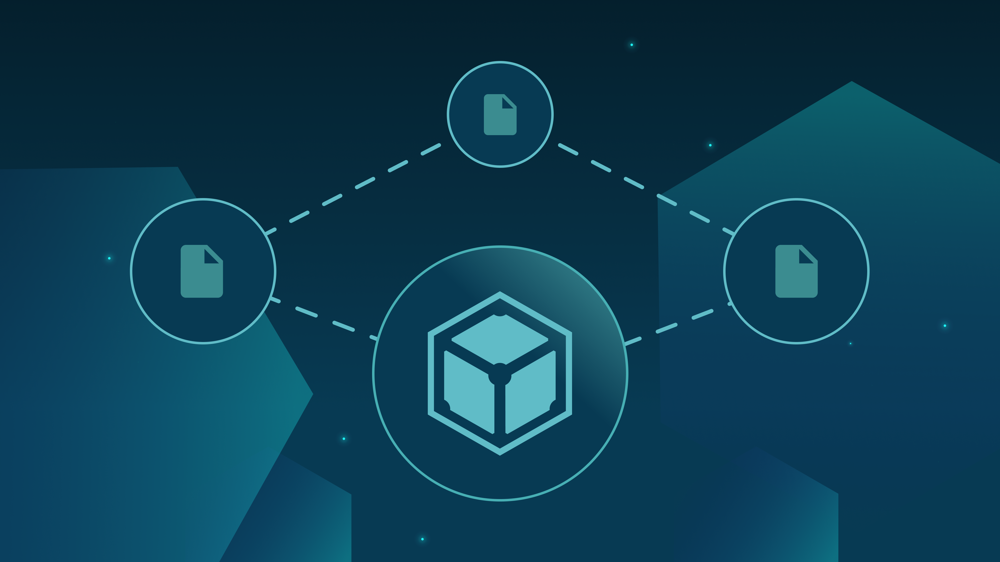

## **A Practical Explainer for IPFS Gateways - Part 1**

[Learn about IPFS gateways](https://blog.ipfs.io/2022-06-09-practical-explainer-ipfs-gateways-1/) with this two-part series explaining how they work and how to use them. The first post in the series takes a look at the challenges with the popular client-server model, how IPFS approaches these challenges with peer-to-peer networking and content addressing, the relationship between IPFS and HTTP(S), and finally a brief introduction to IPFS HTTP gateways. Read it on the [IPFS blog](https://blog.ipfs.io/2022-06-09-practical-explainer-ipfs-gateways-1/).

## **Brand New on IPFS ✨**

1. js-IPFS@0.63.0 is rocketing forward with major improvements to its foundation along with many small bug fixes. [Read more](https://blog.ipfs.io/2022-06-01-js-ipfs-0-63/) on that and updates to libp2p and PeerIDs.
2. [ChainSafe Storage](https://app.storage.chainsafe.io/) is offering 20 GB of free storage on Filecoin and IPFS to help users migrate seamlessly from Web 2.0 to Web3. [Try it for yourself](https://app.storage.chainsafe.io/)!
3. Go-ipfs v0.13.0 is live and packed with improvements. Jump into it now on [Github](https://github.com/ipfs/go-ipfs/releases/tag/v0.13.0) and see a breakdown of everything that’s changed.
4. The latest ipfs-desktop release is also live, implemented with go-ipfs v0.13.0. [Check out](https://github.com/ipfs/ipfs-desktop/releases/tag/v0.21.0) the useful improvements of IPFS users on desktop.

## **Around the ecosystem 🌎**

Catch up with the [highlights](https://www.youtube.com/watch?v=j_u-LO2W6K8) of the latest PL EngRes All Hands: May 2022 meeting. The Working group dove into upcoming milestones and improvements coming to IPFS, Filecoin, libp2p, and IPLD.

Read through The Block Research’s [primer](https://www.theblockcrypto.com/post/149172/decentralized-storage-a-primer-commissioned-by-w3bcloud) on decentralized storage commissioned by W3BCLOUD. It covers IPFS and Filecoin’s role in establishing these services as a new standard.

The P2P community in Paris is growing strong and just celebrated its first festival in two years. Catch up with this [recap](https://blog.ipfs.io/2022-06-02-libp2p-at-paris-p2p/) of libp2p’s participation in the Paris P2P Festival 2022.

Collaborate with Web3 game developers around the world at [BlockJam](https://globalblockjam.com/) starting June 17th. Check out the [speaker list](https://globalblockjam.com/talks.html) and [sign up now](https://www.crowdcast.io/e/nervos-presents-blockjam/register).

Don’t miss ConsensusFactory, a virtual event happening on June 22 looking into different scalability approaches. Take a look at the [speaker list](https://consensus-factory.io/) and [register now](https://solarisevents.typeform.com/consensus?typeform-source=consensus-factory.io).

[NFT.NYC](https://www.nft.nyc/) is shaping up to be a packed event this summer. Keep your eyes peeled for side-events from around the community such as [Mona x NFT.NYC](https://www.eventbrite.com/e/mona-x-nftnyc-tickets-344345776487), [Wake Up and Dance](https://www.eventbrite.com/e/wake-up-dance-with-nftstorage-x-daybreaker-tickets-347343101567), and [NFT.Storage Social](https://www.eventbrite.com/e/nftstorage-social-tickets-344885711447).

Join the community from June 24-25 for an in-person [Funding the Commons](https://fundingthecommons.io/) event at the New York Historical Society, featuring a Schelling Point Pop Up. [Register now](https://www.eventbrite.com/e/funding-the-commons-registration-321958224717)!

Join ETHGlobal and the Protocol Labs community for the third annual [HackFS](https://fs.ethglobal.com/) from July 8th-23rd. [Apply now](https://ethglobal.com/auth?use_redirect=events/hackfs2022/apply)!

[DINPS](https://t.co/WVy17t2EkB) is back on July 10th in Bologna, Italy! Join for a collection of papers, demos and tutorials plus two keynotes from folks of the Ethereum Foundation and Cornell University. [See the full schedule](https://t.co/WVy17t2EkB).

Protocol Labs and the Filecoin Foundation are proud sponsors of the [Sustainable Blockchain Summit EU](https://sbs.tech/) happening in Paris, France on July 22nd and 23rd. [Reserve your spot](https://www.eventbrite.com/e/sustainable-blockchain-summit-tickets-336114797407) or [apply to be a speaker](https://protocollabs.typeform.com/SBS-Paris-CFP).

Watch this [tutorial](https://www.youtube.com/watch?v=8S8unFCq0fM) on how to build a Medium clone with a Web3 twist using React, Moralis, Solidity, and IPFS.

## **Want to help build the new internet? 💼**

[**Senior Golang Backend Engineer (IPFS)**](https://consensys.net/open-roles/gh_jid?gh_jid=4322032)**:** In this role, you will use your knowledge of Golang to design and implement backend services to support high volume access to IPFS services. You will be using your knowledge of system design to create new APIs, daemons, and web services that enable our customers to access decentralized storage at scale. You will collaborate with a team of senior engineers to build a key component of the decentralized world. **Consensys**, Remote.

[**Developer Growth Advocate**](https://jobs.filebase.com/20702): Filebase is looking for a highly motivated technologist to join as a Developer Growth Advocate and help grow the Filebase brand across the ecosystem. You will help to lay the groundwork for the world to have an easy (and cost-effective) alternative to the traditional cloud of today. Our Developer Advocate will continue to foster Filebase relationships within multiple developer ecosystems - Blockchain/Crypto/Web3 and the traditional Object Storage landscape. **Filebase**, Remote.

[**Startup Operator, Asia Ecosystem Growth**](https://boards.greenhouse.io/protocollabs/jobs/4382529004)**:** As a member of the Ecosystem Growth team at Protocol Labs, you’ll scope, lead and manage initiatives that help grow Filecoin storage providers in Asia, with an initial focus in China. Your work will span multiple areas, including business development, process improvement, project management, analytics, and more. In this role, you will work closely with the Ecosystem team’s leadership to structure and solve complex problems, then drive solutions forward across the organization. **Protocol Labs**, Remote.

[**Rust Engineer**](https://angel.co/company/fleekhq/jobs/1505997-rust-engineer-remote): Fleek is looking for an experienced and dedicated Rust Engineer to help build new canister-based products and services on Dfinity's Internet Computer. [**Fleek**](https://fleek.co/) is an Open Web developer platform with everything you need to build sites and apps on the new web and the underlying protocols that power it (Dfinity, Ethereum, IPFS, Filecoin, and more). From hosting, storage, gateways, domains, databases, and more, Fleek has everything you need to seamlessly build and manage Open Web sites. **Fleek**, Remote.

[**Growth Marketing Lead**](https://jobs.lever.co/MoNA/2f653ef6-c3da-4e0f-ba3c-1f294d24ece3): The Growth Marketing Lead will be responsible for Mona’s digital marketing strategy across multiple media channels. In this role, you will develop, implement, measure, and optimize our approach over time with the related goals of driving people into our metaverse spaces, 3D architects to build metaverse spaces, and expanding the overall footprint of the Mona brand. The digital marketing strategy will integrate closely with our existing organic content strategy. **Mona**, Remote.

[**Developer Relations**](https://boards.greenhouse.io/textileio/jobs/4075619004): Textile is seeking someone to run large-scale community projects. These include amplifying our grants program to fund community projects, curating governance groups where we bring community stakeholders into our technology planning, engaging with external teams like Gitcoin and EthDenver to support large-scale developer events, and giving technical presentations at events. This position also includes day-to-day engagement with our Slack group, helping to triage GitHub issues, hacking on demos, writing blog posts and technical guides, and more. We are looking for a self-directed leader who wants to build a developer community while staying hands on with technology. **Textile**, Remote.