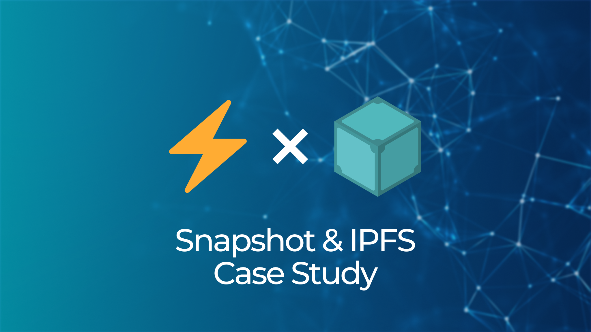

## **Snapshot IPFS Case Study**

Snapshot is an open-source voting platform for Web3 projects, DAOs, and communities that uses IPFS as its main storage layer. It is unique in its use of IPFS to store proposals and user votes using a technique known as ‘off-chain’ voting, where the cryptographic signatures proving user votes are persisted to IPFS instead of being stored on the blockchain. Read this [case study](https://blog.ipfs.tech/2022-08-25-snapshot-ipfs-case-study/) to learn more about how this lowers the barriers to entry for community governance.

## **Brand New on IPFS ✨**

1. [IPFS Camp 2022](https://2022.ipfs.camp/) is back! Join the community in Lisbon on October 28th-30th for an event focused on celebrating and advancing IPFS, more details coming soon.
2. Kubo (formerly go-ipfs) v0.15.0 is live. Review all the library updates and bug fixes, Blake3 support, Fx Options plugin, and more on [Github](https://github.com/ipfs/kubo/releases/tag/v0.15.0).
3. Kubo v0.14.0 now [supports](https://github.com/ipfs/kubo/releases/tag/v0.14.0#delegated-routing) experimental protocol for delegated routing. Learn more about it on the IPFS [blog](https://blog.ipfs.tech/2022-09-02-introducing-reframe/).
4. Check out [Opensquare Art](https://t.co/TrdDYttxkq)’s new Shop Builder for launching no-code minting websites that store NFTs on IPFS and Filecoin via [NFT.Storage](https://nft.storage/).

## **Around the ecosystem 🌎**

Are you building on or enjoying IPFS? The Protocol Labs research team wants to know what activities, projects or contributions to IPFS you have found to be most valuable from the past year. Submit a response using this brief form: [IPFS | Crowdsourcing Valuable Contributions](https://forms.gle/5kUzDSna1yoWScpm7).

Catch up on the August PL EngRes WG All Hands in this full [recording](https://youtu.be/-WEHplQxFrY) of the meeting. It covered exciting projects and deep dives on Thunderdome and Drand’s new timelock encryption launch.

Learn everything about IPFS’s content addressing and content routing subsystems, its content exchange strategies, and how IPFS deals with dynamic, mutable content with [ResNetLab on Tour](https://research.protocol.ai/tutorials/resnetlab-on-tour/).

Listen to a recent discussion with Protocol Labs and Outlier Ventures on building with IPFS in the metaverse, recorded in [Twitter Spaces](https://twitter.com/IPFS/status/1562820869721690112?s=20&t=UY-nwvksa3D4WNnll-zc5w).

Read Dietrich Ayala’s take on the challenges of hiring in web3 in a recent Forbes [article](https://www.forbes.com/sites/ninabambysheva/2022/08/29/web3-growth-stymied-by-scarcity-of-programmers/?sh=2f7fb5907fa4). PL is [looking for](https://boards.greenhouse.io/protocollabs) “developers who are able to think about what the next generation of the internet will look like.”

[Tune in](https://anchor.fm/futureofnft/episodes/Bridging-Web-2-into-Web-3--IPFS--Filecoin--and-NFT-Storage-with-Jonathan-Victor-from-Protocol-Labs-e1mvjdh) to this recent episode of the Future of NFT podcast and listen to Jonathan Victor discuss bridging the gap between web2 and web3 and NFT.Storage’s use of IPFS and Filecoin.

Find out who are the first research funding recipients of 2022 on the Protocol Labs Research [blog](https://research.protocol.ai/blog/2022/protocol-labs-research-funding-recipients-2022/). The 11 awards include [RFPs](https://github.com/protocol/research-grants/tree/master#requests-for-proposals-rfps), [Summer Research Grants](https://github.com/protocol/research-grants/tree/master#protocol-labs-summer-research-grant), [doctoral fellowships](https://github.com/protocol/research-grants/tree/master#protocol-labs-doctoral-fellowship), and a [postdoctoral fellowship](https://github.com/protocol/research-grants/tree/master#protocol-labs-postdoctoral-fellowship).

Join the IPFS and Filecoin communities for DevCon 2022 in Bogota on October 11th-14th. [Tickets](https://devcon.org/en/) are available now.

The [Filecoin Green](https://green.filecoin.io/) community will be at DevCon with a LATAM-focused sustainability summit on October 12. Get your [tickets](https://www.eventbrite.com/e/sustainable-blockchain-summit-latam-tickets-397452199227) early, become a [partner](https://sbs.tech/), or [apply ](https://airtable.com/shr4CeIwfweFUHEkr)to be a speaker.

Funding the Commons is back at [Schelling Point](https://schellingpoint.gitcoin.co/), Oct. 10th in Bogota! Interested in speaking at the FTC track? Fill out the [speaker form](https://airtable.com/shruR7QCn4Bx8tqgg).

## **Want to help build the new internet? 💼**

[**Distributed Computation Engineer:**](https://ipfs.us4.list-manage.com/track/click?u=25473244c7d18b897f5a1ff6b&id=4f2511a4c1&e=c8385b3b0b) Define, implement and extend virtual machine concepts to the next generation of p2p, decentralized computation over content-addressed data. We seek talented engineers that are excited to work on a new model of trustless and verifiable computation - where code is distributed over blockchains and executed next to specific copies of data. If successful, we will transform data processing for large-scale datasets, improve cost and efficiency, and open up data processing to larger audiences. You will be part of this project from the very beginning. **Protocol Labs**, Remote.

[**Rust Cryptography Engineer**](https://boards.greenhouse.io/protocollabs/jobs/4616824004): Protocol Labs is an open-source R&D lab where we build protocols, tools, and services to radically improve the internet, and one of those is Lurk Lab. The team is growing and looking for a Lurk Lab Engineer who can build core functionalities of the Lurk language, with specific focus on the development and implementation of applications. The ideal candidate will be fluent in Rust, familiar with zero-knowledge proofs and related cryptographic primitives, and experienced developing user-centric applications. **Protocol Labs**, Remote.

[**Senior Golang Backend Engineer (IPFS)**](https://consensys.net/open-roles/gh_jid?gh_jid=4322032)**:** In this role, you will use your knowledge of Golang to design and implement backend services to support high volume access to IPFS services. You will be using your knowledge of system design to create new APIs, daemons, and web services that enable our customers to access decentralized storage at scale. You will collaborate with a team of senior engineers to build a key component of the decentralized world. **Consensys**, Remote.

[**Rust Engineer**](https://angel.co/company/fleekhq/jobs/1505997-rust-engineer-remote): Fleek is looking for an experienced and dedicated Rust Engineer to help build new canister-based products and services on Dfinity's Internet Computer. [**Fleek**](https://fleek.co/) is an Open Web developer platform with everything you need to build sites and apps on the new web and the underlying protocols that power it (Dfinity, Ethereum, IPFS, Filecoin, and more). From hosting, storage, gateways, domains, databases, and more, Fleek has everything you need to seamlessly build and manage Open Web sites. **Fleek**, Remote.

[**Developer Relations**](https://boards.greenhouse.io/textileio/jobs/4075619004): Textile is seeking someone to run large-scale community projects. These include amplifying our grants program to fund community projects, curating governance groups where we bring community stakeholders into our technology planning, engaging with external teams like Gitcoin and EthDenver to support large-scale developer events, and giving technical presentations at events. This position also includes day-to-day engagement with our Slack group, helping to triage GitHub issues, hacking on demos, writing blog posts and technical guides, and more. We are looking for a self-directed leader who wants to build a developer community while staying hands on with technology. **Textile**, Remote.
