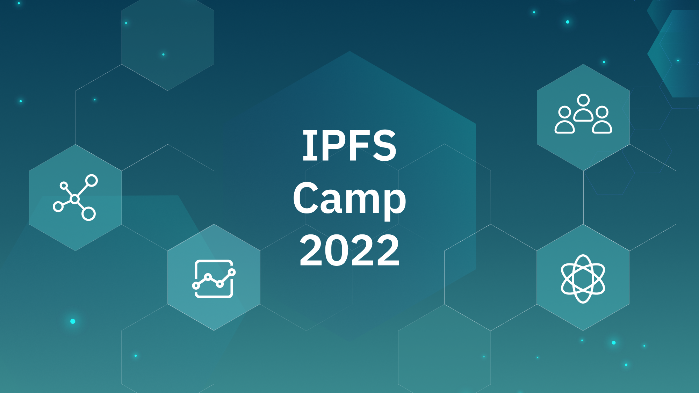

## **Announcing the Second Ever IPFS Camp!**

After a long hiatus, the IPFS community is excited to join together again on October 28th-30th in Lisbon, Portugal. [**IPFS Camp**](https://2022.ipfs.camp/) is a gathering for devs, operators, implementers, researchers – and you. Join the event for talks, workshops, discussion circles, hacking time, and more, covering topics such as content routing, user and developer tools, and privacy. [**Read along**](https://blog.ipfs.tech/2022-09-09-announcing-ipfs-camp-2022/) to learn more about the featured tracks and how you can help make IPFS Camp amazing. [**Grab your ticket**](https://2022.ipfs.camp/), [**apply to be a speaker**](https://airtable.com/shrOxmXUqwojf0Bjj) or [**propose a new track**](https://airtable.com/shrBQqf7YJRPdrgUo).

## **Brand New on IPFS ✨**

1. Get a better understanding of how content-addressing and trustless verification enable a fundamental change in the way we use the internet on the IPFS [**blog**](https://blog.ipfs.tech/ipfs-breaking-free-client-server/).
2. DAO-governed gaming and streaming platform [**Get Set Play**](http://getsetplay.io/) is [**storing**](https://twitter.com/getsetplay_io/status/1570819932949979136?s=20&t=wbbl_6P9Rhz5yAo67RY7sw) its NFT data on IPFS via [**NFT.Storage**](https://nft.storage/).
3. Watch a [**recap**](https://youtu.be/ADmUWnU0Yx4) of the September All Hands meeting for IPFS, Filecoin, and libp2p Ecosystem WG to get the latest updates, spotlights, and deep dives.
4. [**Playermon**](https://playermon.com/) NFTs are getting an upgrade by [**collaborating**](https://medium.com/playermon/higher-definition-nft-image-powered-by-nft-storage-on-ipfs-973ef24a323b) with NFT.Storage to store higher definition images on IPFS.

## **Around the ecosystem 🌎**

Request an invite for [**FIL.VC**](https://www.fil.vc/), happening September 26th. The invite-only demo day connects the top projects in the IPFS and Filecoin ecosystem with leading investors in web3.  
  
Don’t forget to join the IPFS and Filecoin communities for DevCon 2022 in Bogotá on October 11th-14th. [**Tickets**](https://devcon.org/en/) are available now.  
  
The [**Filecoin Green**](https://green.filecoin.io/) community will be at DevCon with a LATAM-focused sustainability summit on October 12. Get your [**tickets**](https://www.eventbrite.com/e/sustainable-blockchain-summit-latam-tickets-397452199227) now or apply to become a [**partner**](https://sbs.tech/) (applications close on September 25th)!  
  
Funding the Commons is back at [**Schelling Point**](https://schellingpoint.gitcoin.co/), happening Oct 10th in Bogotá. If you’re interested in speaking at the FTC track, fill out the [**speaker form**](https://airtable.com/shruR7QCn4Bx8tqgg).  
  
If you’re a scholar looking to connect at IPFS Camp, [**apply**](https://airtable.com/shrd4kSljHYHxmU1b) to the IPFS Scholar program before September 20th to be one of 50 participants who will recieve flights, accommodation, and event entry.   
  
Listen to Dietrich Ayala discuss how decentralized storage helps make web3 trustworthy in this Tech Talk 2022 [**panel**](https://www.youtube.com/watch?v=aucrfPglszk&t=6s).  
  
[**Read**](https://filebase.com/blog/heres-why-you-should-build-on-ipfs/?twclid=2-al46w317ja87tyj3ypqpdo4b) what [**Filebase**](https://filebase.com/) has to say on why you should build on IPFS and how its geo-redundant pinning service can help you store your assets reliably.

## **Want to help build the new internet? 💼**

[**Senior Software Engineer, Distributed Systems**](https://boards.greenhouse.io/protocollabs/jobs/4283628004): Protocol Labs is hiring a Senior Distributed Systems Engineers to work on the JavaScript and Go implementations of protocols like IPFS, Filecoin and libp2p. Enthusiasm about the decentralized web and blockchains has brought an influx of people who want to use distributed systems but who don't know how to build the necessary infrastructure. Protocol Labs is building that infrastructure. To continue that work, they’re looking for people who thoroughly understand the principles of distributed systems and who will lean into the challenges of applying those principles in open-source code that will be deployed worldwide. **Protocol Labs**, Remote.

[**Brand Designer**](https://angel.co/company/pinatacloud/jobs/1796010-brand-designer): Pinata Technologies, Inc. is building the tools and infrastructure for a more free and empowering Web3 generation through IPFS. Their vision is to foster a sense of place for every creator on the internet that is uniquely theirs. Pinata is looking for a brand designer to join their team! This role will be responsible for creating designs for our website and digital marketing efforts, as well as creatives for traditional mediums. This person will report to the Marketing team and receive guidance from the Creative Director. This person should feel comfortable presenting new creative concepts and ideas to both the Marketing team as well as across the business team. **Pinata**, Remote.

[**Senior Software Engineer - Design Technologist**](https://www.linkedin.com/jobs/view/senior-software-engineer-design-technologist-at-mozilla-3146852845?refId=EiOw5v08Xa0PL2eWaKMxow%3D%3D&trackingId=khK8KrTR4xZ3ib9JTscmeQ%3D%3D&trk=public_jobs_topcard-title): Mozilla’s Future Products team researches emerging technology stacks and ecosystems to evaluate their fit for new products. We’re a diverse group of designers, strategists, engineers, and innovators. They're looking for a hardworking and capable Creative Technologist to build prototypes that can be used to demonstrate, test, and gather feedback on our concepts and design solutions for a wide array of audiences including internal partners, end-users, developers, and collaborators. **Mozilla**, Austin, TX.

[**Senior Design Engineer**](https://jobs.ashbyhq.com/sound.xyz/407fcf8c-40f2-4c5e-be27-e96745cff082/application?utm_source=5brbomGvp3): Sound is hiring a Senior Design Engineer to help shape the future of a new music economy that values artists and their music while connecting fans more closely to the music they love. As a Design Engineer, you will be a core contributor to the overall strategy and decision-making about product direction. You will explore, design, prototype, and build new experiences and features across all surfaces of our platform. You will help tighten the feedback loop between product, design, and engineering by pushing our design system forward visually and interactively. Most importantly, you have a passion for designing and implementing extraordinary and delightful user experiences. **sound.xyz**, Remote.  
  
[**Quality Assurance, Test and Benchmarking Engineer**](https://join.com/companies/capsule/5840067-quality-assurance-test-and-benchmarking-engineer?pid=24a1b46991e3de1fbcf0): At Capsule Social, they've been building the future of decentralized discourse on top of performant, well-designed decentralization tech, cryptographic tech and blockchain tech. Capsule's Quality Assurance, Test and Benchmarking Engineer will be responsible for writing tests and creating a benchmarking infrastructure so that we can be sure that our technology scales to thousands and even millions of users prior to launch. **Capsule Social**, Remote.  
  
[**Full Stack Engineer**](https://www.linkedin.com/jobs/view/3273564662/?alternateChannel=search&refId=7I%2Bx0SHdcmhdQsQzWohg0Q%3D%3D&trackingId=kJtg%2BtTFxm88myxa7QZ0Yg%3D%3D): HENI is looking to recruit a senior and mid-level, permanent Full Stack Developer who will be a key member in the applications team alongside other full-stack and front-end developers, providing fundamental input and knowledge in solving some of these challenges. This would suit someone with demonstrable technical expertise who is driven by a hands-on and stimulating role. **HENI**, London, UK.