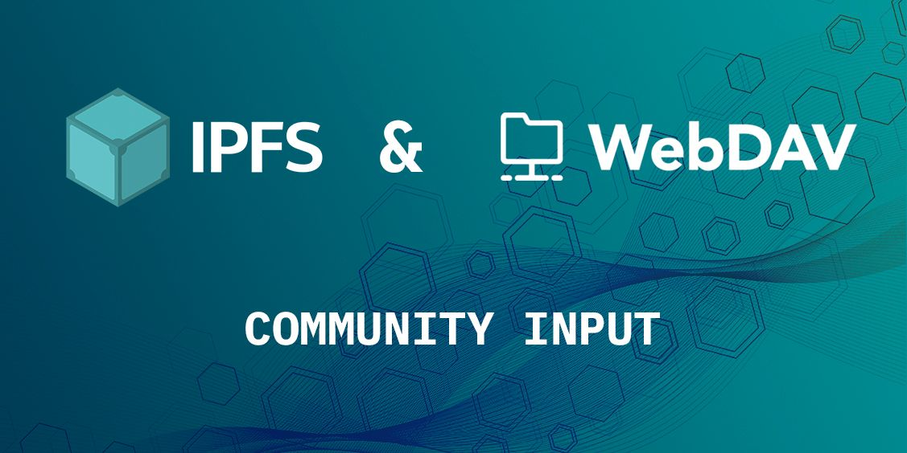

## **What are the Potential Benefits of IPFS over WebDAV?**

WebDAV extends the HTTP protocol and enables web servers to also act as file servers. WebDAV extends the HTTP methods to their needs, and could potentially make IPFS easier to use. It even opens up new use cases, such as a writable gateway, IPFS integrations in apps currently supporting WebDAV, plus Android and iOS support.  
  
Learn more about [**IPFS over WebDAV**](https://blog.ipfs.tech/2022-10-13-ipfs-over-webdav/) and how you can help improve it!

## **Brand New on IPFS ✨**

1. Dolpin is [**now available**](https://www.producthunt.com/posts/dolpin) on Product Hunt. Built with IPFS and Filecoin, Dolpin allows users to encrypt files, add beneficiaries, and govern who can access their IPFS storage at affordable prices.
2. Web3.Storage announced the [**w3up beta**](https://blog.web3.storage/posts/w3up-beta-launch), a preview of their web scale IPFS cloud. The team is releasing a new upload API that is currently in early access.
3. The [**first ever libp2p Day**](https://discuss.libp2p.io/t/libp2p-day-presentations-and-speaking-opportunities/1621) is now a part of IPFS Camp 2022! Join for talks aimed at turning devs into libp2p builders, builders into contributors, and contributors into spec authors.
4. Check out [**this feature**](https://spectrum.ieee.org/peer-to-peer-network) on IPFS to learn about how peer-to-peer file sharing would make the Internet far more efficient.

## **Around the ecosystem 🌎**

The Data DAO Hackathon ended with 71 projects building in categories including Best Use of Filecoin and IPFS, Multi-chain Storage, and Computing over Data. Find out who won on the [**Filswan blog**](https://filswan.medium.com/data-dao-hackathon-prize-winners-33df617ea6d9).

[**Sign up**](https://airtable.com/shrsicDt1IpeIKVIg) for LabWeek22 updates. From October 24th to November 4th, the Protocol Labs Network will be in Lisbon for the first-ever decentralized conference discussing public goods funding, cryptoeconomics, and DeSci.

Get ready for next week! Join communities across the ecosystem, including IPFS and Filecoin, for DevCon 2022 in Bogotá on October 11th - 14th. Check out the full agenda, keynote speakers, and more on the [**official site**](https://devcon.org/en/).

The [**Filecoin Green**](https://green.filecoin.io/) community will be at DevCon with a LATAM-focused sustainability summit on October 12th. Get your [**tickets**](https://www.eventbrite.com/e/sustainable-blockchain-summit-latam-tickets-397452199227)!

Funding the Commons is back at [**Schelling Point**](https://schellingpoint.gitcoin.co/) for a pop up, happening Oct 10th in Bogotá. RSVP for the event on the [**Schelling Point website**](https://schellingpoint.gitcoin.co/).

Learn how to deploy a Kubo IPFS node to Fly.io by watching this thorough [**walkthrough**](https://www.youtube.com/watch?v=k1Hcg3B43Q4) video with Daniel Norman.

Check out this [**tutorial**](https://www.youtube.com/watch?v=Ga9gfoZSm0Y) on how to work with the IPFS API in a Go application. You’ll learn how to add a file to IPFS, read it, download it to your computer, add it to IPNS, and read it from IPNS.

## [IPFS Camp](https://2022.ipfs.camp/) is 10 days away! 🏕

Join the IPFS community in Lisbon, Portugal on October 28 - 30th! Hosted at the stunning Convento do Beato, IPFS Camp is a gathering for devs, operators, implementers, users, researchers – and you. Join us for talks, workshops, discussion circles, hacking time, and more. Check out the [**schedule**](https://2022.ipfs.camp/#schedule) and [**grab your ticket**](https://lu.ma/ipfscamp22) now. We hope to see you there and look forward to building the next generation of the web together!

🎟 Use the exclusive discount code "IPFSNEWSVIP" for 25% off your [**ticket**](https://lu.ma/ipfscamp22)!

## **Want to help build the new internet? 💼**

[**Senior Software Engineer, Distributed Systems**](https://boards.greenhouse.io/protocollabs/jobs/4283628004): Protocol Labs is hiring a Senior Distributed Systems Engineers to work on the JavaScript and Go implementations of protocols like IPFS, Filecoin and libp2p. Enthusiasm about the decentralized web and blockchains has brought an influx of people who want to use distributed systems but who don't know how to build the necessary infrastructure. Protocol Labs is building that infrastructure. To continue that work, they’re looking for people who thoroughly understand the principles of distributed systems and who will lean into the challenges of applying those principles in open-source code that will be deployed worldwide. **Protocol Labs**, Remote.

[**Brand Designer**](https://angel.co/company/pinatacloud/jobs/1796010-brand-designer): Pinata Technologies, Inc. is building the tools and infrastructure for a more free and empowering Web3 generation through IPFS. Their vision is to foster a sense of place for every creator on the internet that is uniquely theirs. Pinata is looking for a brand designer to join their team! This role will be responsible for creating designs for our website and digital marketing efforts, as well as creatives for traditional mediums. This person will report to the Marketing team and receive guidance from the Creative Director. This person should feel comfortable presenting new creative concepts and ideas to both the Marketing team as well as across the business team. **Pinata**, Remote.

[**Senior Software Engineer - Design Technologist**](https://www.linkedin.com/jobs/view/senior-software-engineer-design-technologist-at-mozilla-3146852845?refId=EiOw5v08Xa0PL2eWaKMxow%3D%3D&trackingId=khK8KrTR4xZ3ib9JTscmeQ%3D%3D&trk=public_jobs_topcard-title): Mozilla’s Future Products team researches emerging technology stacks and ecosystems to evaluate their fit for new products. We’re a diverse group of designers, strategists, engineers, and innovators. They're looking for a hardworking and capable Creative Technologist to build prototypes that can be used to demonstrate, test, and gather feedback on our concepts and design solutions for a wide array of audiences including internal partners, end-users, developers, and collaborators. **Mozilla**, Austin, TX.

[**Senior Design Engineer**](https://jobs.ashbyhq.com/sound.xyz/407fcf8c-40f2-4c5e-be27-e96745cff082/application?utm_source=5brbomGvp3): Sound is hiring a Senior Design Engineer to help shape the future of a new music economy that values artists and their music while connecting fans more closely to the music they love. As a Design Engineer, you will be a core contributor to the overall strategy and decision-making about product direction. You will explore, design, prototype, and build new experiences and features across all surfaces of our platform. You will help tighten the feedback loop between product, design, and engineering by pushing our design system forward visually and interactively. Most importantly, you have a passion for designing and implementing extraordinary and delightful user experiences. **sound.xyz**, Remote.

[**Quality Assurance, Test and Benchmarking Engineer**](https://join.com/companies/capsule/5840067-quality-assurance-test-and-benchmarking-engineer?pid=24a1b46991e3de1fbcf0): At Capsule Social, they've been building the future of decentralized discourse on top of performant, well-designed decentralization tech, cryptographic tech and blockchain tech. Capsule's Quality Assurance, Test and Benchmarking Engineer will be responsible for writing tests and creating a benchmarking infrastructure so that we can be sure that our technology scales to thousands and even millions of users prior to launch. **Capsule Social**, Remote.