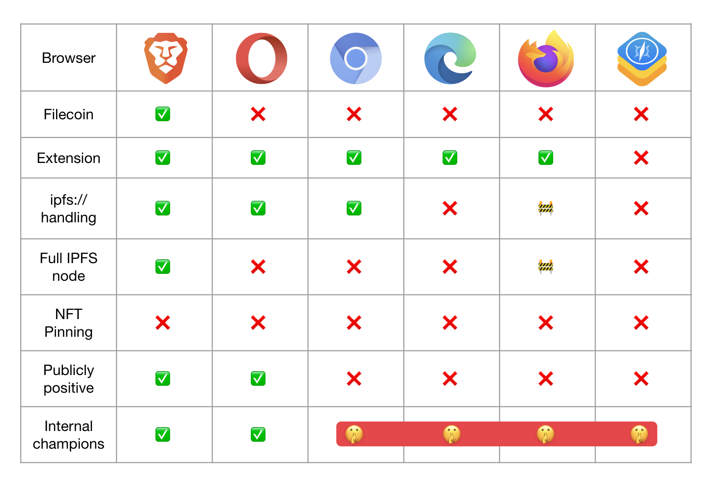

## Protocol Labs and Igalia add IPFS Protocol Support to Chromium

In a major milestone, we’re excited to announce [**support for pre-defined custom protocol handlers in Chromium**](https://ipfs.us4.list-manage.com/track/click?u=25473244c7d18b897f5a1ff6b&id=93fad387d0&e=c8385b3b0b)! You can now build Chromium, the open source browser code used for Chrome, Brave, Edge, Opera, and more, with support for “ipfs://” addresses by changing only a couple of lines of code.   
  
IPFS has gained support in several ways across various browsers. From extensions to different levels of built-in support in Brave and Opera, to experiments with mobile operating systems, the network looks much different than it did in 2019.

Learn more about why this is a key step toward browsers that can meet a far more diverse set of user needs while maintaining an interoperable core.

## **Brand New on IPFS ✨**

1. The InterPlanetary Name System (IPNS) spec has been [overhauled and expanded](https://github.com/ipfs/specs/blob/main/ipns/IPNS.md)!
2. Jonathan Victor kicked off the [Gaming, Metaverse, and Video](https://www.youtube.com/watch?v=1x2kWcl9V6M) track at IPFS Camp and talked about how developers can create long term value through gaming in the future.
3. Guardian is a policy engine that also uses Hedera & IPFS to create provenance chains for ESG assets. [Learn more on the IPFS Blog](https://blog.ipfs.tech/2022-11-10-guardian-ipfs-and-hedera/)!
4. [Learn more](https://blog.ipfs.tech/state-of-ipfs-in-js/) about the history of IPFS development in JS, decisions by some maintainers on what to do going forward, and ways you can help.

## **Around the ecosystem 🌎**

A new blog on TL;DR dives into the [tokenomics behind Filecoin](https://medium.com/tldrfilecoin/filecoin-tokenomics-understanding-an-advancing-economy-ef319632ffa8) and explains how they help drive long-term demand for network resources. Unlike other storage networks, the Filecoin token is primarily concerned with incentivizing reliable services and facilitating the on-chain economy. 

Filecoin Saturn is an [open-source, community-run Content Delivery Network](https://strn.network/) (CDN) built on Filecoin. Because it is trustless, permissionless, and inclusive, anyone can run Saturn software, contribute to the network, and earn Filecoin.

Protocol Labs and Filecoin Foundation announced the launch of the [Decentralized Storage Alliance](https://filecoin.io/blog/posts/introducing-the-decentralized-storage-alliance/), a first-of-its-kind, member-led industry organization to drive awareness and adoption of decentralized technologies, such as Filecoin, IPFS, and libp2p, and help enterprises in Web2 make the transition to Web3.

Protocol Labs is bringing web users across the globe more control and independence by advancing technology for the benefit of humanity. We are now a [member of the Internet Society](https://www.internetsociety.org/about-internet-society/organization-members/stories/protocol-labs/), a global non-profit organization “empowering people to keep the Internet a force for good.”

Technological advances have enabled mass surveillance at a scale unimagined even by "1984," George Orwell's dystopian novel published in 1949, but how do we fight against Orwellian Systems? Juan Benet and Max Tegmark discussed these issues in [Breakthroughs in Computing](https://www.youtube.com/watch?v=_5ZxcxS3o3k).

Filecoin Green launched [CO2.Storage](https://co2.storage/), a Web3 data storage solution that intends to enable transparency for carbon offsets and address traditional storage solutions for all types of digital environmental assets, including renewable energy credits.

If you care about P2P, libp2p and IPFS, then you care about the most important unsolved piece of protocol design in P2P Networks: NAT Hole Punching. [Learn more](https://discuss.libp2p.io/t/call-for-participation-nat-hole-punching-measurement-campaign/1690) about the NAT Hole Punching Measurement Campaign and [sign up to participate](https://docs.google.com/forms/d/1eXLNaJZIUOJtcRS-S0JmXiQuhfmBuAnWm6uueDJgn0w/viewform?edit_requested=true). 

## **Want to help build the new internet? 💼**

[**Content Writer:**](https://ipfs.us4.list-manage.com/track/click?u=25473244c7d18b897f5a1ff6b&id=0bc80c63eb&e=c8385b3b0b) Edge & Node is a core development team behind The Graph, working to build a vibrant decentralized future. The team is dedicated to the proliferation of web3 applications that share value, utilize dynamic incentives, and build for human coordination. The Digital Content and Social Media Writer will be responsible for the conceptualization and production of at least 3-5 long form pieces each month about The Graph, Edge & Node and House of Web3. Topics may vary but will focus on The Graph and Edge & Node updates, announcements, education, events, innovations, and more. The Content Writer will create and publish content on social media platforms multiple times per day. In addition, they'll partner with the Marketing team to create messaging around company OKRs, and more. **Edge and Node**, Remote.  
  
[**Director of Engineering:**](https://ipfs.us4.list-manage.com/track/click?u=25473244c7d18b897f5a1ff6b&id=7029564a70&e=c8385b3b0b) The Transmute team is looking to add a Director of Engineering with specific expertise in enterprise security software development, engineering management and technical product strategy. This is a senior role that reports directly to the CTO. Your primary responsibility will be to build and lead a high-performing team of engineers who can build enterprise-scale B2B products. Writing code regularly is not a requirement, but weighing in on architecture decisions, technical product direction, and software development lifecycle issues is. **Transmute**, Austin, TX.  
  
[**NodeJS developer | FinTech:**](https://ipfs.us4.list-manage.com/track/click?u=25473244c7d18b897f5a1ff6b&id=ab32876ca6&e=c8385b3b0b) Super Mojo is an embedded finance checkout experience for NFT marketplaces. You will build a distributed financial platform which executes transactions in milliseconds and enables a magical checkout experience for Super Mojo users. You will help with designing and heavily contributing to the product architecture and foundation and work with teams across the organization, including product, legal, and business development to think beyond the technical implications of your design decisions. **Super Mojo**, San Francisco, CA.  
  
[**Sr. Software Engineer, Distributed Systems**](https://ipfs.us4.list-manage.com/track/click?u=25473244c7d18b897f5a1ff6b&id=ffe8baaadd&e=c8385b3b0b): Protocol Labs is hiring a Sr. Distributed Systems Engineers to work on the JavaScript and Go implementations of protocols like IPFS, Filecoin and libp2p. Enthusiasm about the decentralized web and blockchains has brought an influx of people who want to use distributed systems but who don't know how to build the necessary infrastructure. Protocol Labs is building that infrastructure. To continue that work, they’re looking for people who thoroughly understand the principles of distributed systems and who will lean into the challenges of applying those principles in open-source code that will be deployed worldwide. **Protocol Labs**, Remote.  
  
[**Brand Designer**](https://ipfs.us4.list-manage.com/track/click?u=25473244c7d18b897f5a1ff6b&id=345459346a&e=c8385b3b0b): Pinata Technologies, Inc. is building the tools and infrastructure for a more free and empowering Web3 generation through IPFS. Their vision is to foster a sense of place for every creator on the internet that is uniquely theirs. Pinata is looking for a brand designer to join their team! This role will be responsible for creating designs for our website and digital marketing efforts, as well as creatives for traditional mediums. This person will report to the Marketing team and receive guidance from the Creative Director. This person should feel comfortable presenting new creative concepts and ideas to both the Marketing team as well as across the business team. **Pinata**, Remote.